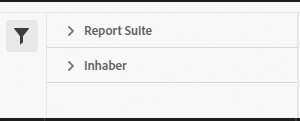

# Klassifizierungssatz-Manager

Mit dem Classification Set Manager können Sie Classification-Sets erstellen, bearbeiten oder löschen.

**[!UICONTROL Komponenten]** > **[!UICONTROL Klassifizierungssätze]** > **[!UICONTROL Sets]**

Klassifizierungssätze bestehen aus **Abonnements** (Report Suite- und Dimensionskombinationen) und **Klassifizierungsnamen** (Dimensionen, die Klassifizierungsdaten enthalten). Abonnements werden unter [Einstellungen](settings.md) konfiguriert, Classification-Namen hingegen unter [Schema](schema.md).

## Filtern von Classification-Sets

Die linke Seite des Classification-Set-Managers bietet Filtereinstellungen, um den gewünschten Classification-Satz zu finden. Durch Klicken auf das Filtersymbol wird die Sichtbarkeit der Filtereinstellungen ein-/ausgeblendet. Sie können Classification-Sets nach **[!UICONTROL Tags]** oder **[!UICONTROL Report Suite]** filtern.

## Spalten des Classification Set Manager

Die folgenden Spalten sind im Classification-Set-Manager verfügbar:

* **[!UICONTROL Klassifizierungssatz]**: Der Name des Klassifizierungssatzes. Durch Klicken auf den Namen eines Classification-Sets [werden dessen Einstellungen bearbeitet](settings.md).
* **[!UICONTROL Abonnements]**: Die Anzahl der Abonnements, für die dieser Classification-Satz gilt.
* **[!UICONTROL Klassifizierungen]**: Die Anzahl der Klassifizierungsdimensionen, die der Klassifizierungssatz enthält.
* **[!UICONTROL Automated]**: Stellt fest, ob der Classification-Satz so konfiguriert ist, dass Daten automatisch von einem Cloud-Speicherort importiert werden. Die Automatisierung kann im [Schema](schema.md) des Klassifizierungssatzes konfiguriert werden.
* **[!UICONTROL Zuletzt geändert]**: Datum und Uhrzeit der letzten Änderung des Classification-Sets.

## Erstellen oder Bearbeiten von Optionen

Die folgenden Schaltflächen sind im Classification Set Manager verfügbar:

* **[!UICONTROL Hinzufügen]**: [Erstellen](create.md) Sie einen Classification-Satz.
* **[!UICONTROL Suche nach Titel]**: Suche nach Classification-Sets nach Namen.
* **[!UICONTROL Mehr laden]**: Der Classification-Set-Manager zeigt zunächst bis zu 1000 Classification-Sets an. Mit dieser Schaltfläche werden 1000 weitere Classification-Sets geladen.
* **Spalten ein-/ausblenden**: Schaltet die Sichtbarkeit für eine Spalte außer [!UICONTROL Klassifizierungssatz] um.

Wählen Sie einen oder mehrere Classification-Sets aus, indem Sie auf das Kontrollkästchen neben dem gewünschten Classification-Satz klicken. Bei der Auswahl eines Classification-Sets werden die folgenden Optionen angezeigt:

* **[!UICONTROL Tag]**: Fügen Sie den ausgewählten Classification-Sets mindestens ein Tag hinzu, um Classification-Sets zu organisieren oder zu gruppieren, damit sie in Zukunft leichter zu finden sind.
* **[!UICONTROL Löschen]**: Löscht den Classification-Satz. Auf diesem Classification-Satz basierende Classification-Dimensionen sind nicht mehr verfügbar. Geplante Projekte, die den gelöschten Classification-Satz verwenden, verwenden weiterhin abhängige Dimensionen, bis Sie das geplante Projekt erneut speichern.
* **[!UICONTROL Konsolidieren]**: Starten Sie eine neue [Konsolidierung](../consolidations/process.md).
* **[!UICONTROL Umbenennen]**: Benennen Sie den ausgewählten Classification-Satz um.
