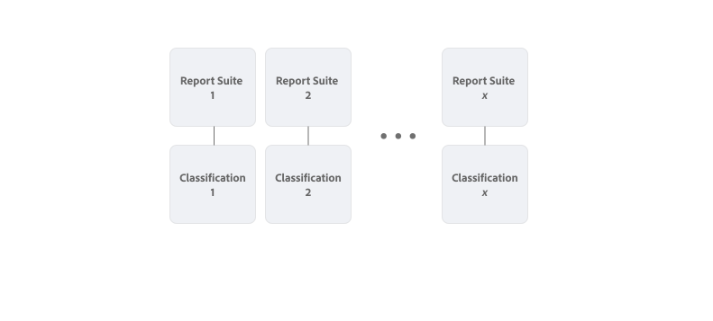

# Klassifizierungssätze – Überblick

Klassifizierungssätze bieten eine einzige Oberfläche zum Verwalten von Klassifizierungen und Regeln. Dieser Workflow kombiniert die Erstellung von Klassifizierungen in den Report Suite-Einstellungen mit dem [Classification Importer](/help/components/classifications/sets/manage/set-manager.md). Das Ergebnis ist eine einzige intuitive Benutzeroberfläche zum Erstellen und Verwalten von Klassifizierungsdaten.


## Klassifizierungssätze versus veraltete Klassifizierungen

Der Hauptunterschied zwischen Klassifizierungssätzen und Legacy-Klassifizierungen ist die Beziehung der Klassifizierungen zu einer Report Suite.

In älteren Klassifizierungen ist jede Klassifizierung direkt mit einer Report Suite verknüpft. Sehr ähnliche Klassifizierungen (z. B. für einen Produktkatalog) werden bei der Verwendung in mehreren Report Suites repliziert.



In Klassifizierungssätzen definieren Sie Abonnements von Report Suites und Schlüssel-Dimensionskombinationen. Beispiel: Für eine Produktkatalog-Klassifizierung, die für mehrere Report Suites gilt, müssen Sie nur einmal als Klassifizierungssatz definieren. Und innerhalb dieses Klassifizierungssatzes konfigurieren Sie mehrere Report Suites und Schlüssel-Dimensions-Kombinationen, um diesen Klassifizierungssatz zu abonnieren.


Um über das Menü **[!UICONTROL Komponenten]** in der Adobe Analytics-Benutzeroberfläche auf **[!UICONTROL Klassifizierungssätze]** zugreifen zu können, müssen Sie Produktadministrator sein oder zu einem Produktprofil gehören, das das Berechtigungselement [!UICONTROL Report Suite-Tools] > [!UICONTROL Klassifizierungen] enthält. Beachten Sie, dass im Menü **[!UICONTROL Admin“ alte Klassifizierungsverwaltungsschnittstellen verfügbar]**.

Klassifizierungssätze bestehen aus drei Funktionsbereichen:

* [**[!UICONTROL Klassifizierungssätze]**](manage/set-manager.md): Erstellen, Bearbeiten und Löschen von Klassifizierungssätzen.
* [**[!UICONTROL Aufträge]**](job-manager.md): Zeigt den Status der Aufträge für Klassifizierungssätze an.
* [**[!UICONTROL Konsolidierungen]**](consolidations/manage.md): Kombinieren Sie mehrere Klassifizierungssätze zu einem einzigen Klassifizierungssatz.


## Workflow

Der Workflow für Klassifizierungssätze umfasst normalerweise die folgenden Schritte:

1. Überlegen Sie, für welche Report Suite- und Dimensionskombinationen Sie einen Klassifizierungssatz erstellen möchten. Ein Beispiel ist die Definition eines Produktklassifizierungssatzes, den Sie für jede Report Suite erstellen, für die Sie Produkte mit weiteren Details klassifizieren möchten. Zum Beispiel Details wie Kategorie und Farbe.
1. [Erstellen eines Klassifizierungssatzes](/help/components/classifications/sets/manage/create.md) mit Abonnements für eine oder mehrere Report Suite- und Dimensionskombinationen, die Produkte identifizieren. Zum Beispiel:

   | Report Suite | Schlüsseldimension |
   |---|---|
   | Report Suite 1 | Produkt-ID |
   | Report Suite 2 | Produkt-SKU |

1. [Fügen Sie die Klassifizierungen &#x200B;](/help/components/classifications/sets/manage/schema.md#add), die Sie dem Klassifizierungssatz-Schema zugeordnet haben. Zum Beispiel:

   | Klassifizierungsname | Identitätsname |
   |---|---|
   | Kategorie | Kategorie |
   | Farbe | color |

1. Erstellen Sie manuell eine Datei, die Klassifizierungsdaten enthält. [Verwenden Sie eine &#x200B;](/help/components/classifications/sets/manage/schema.md#template), um sicherzustellen, dass Sie das [unterstützte Dateiformat](data-files.md#classification-set-file-formats) und die Spalten für die Datei verwenden. Fügen Sie dann die Daten zur Vorlagendatei hinzu.

   Alternativ können Sie Daten direkt aus Ihrem Produktkatalog in den [unterstützten Dateiformaten“ mit &#x200B;](data-files.md#classification-set-file-formats) exportieren, die der Vorlage entsprechen. Beispiel: eine CSV-Datei wie:

   ```
   Key,Category,Color
   Adobe Nike Tech Fleece Full-Zip Hoodie - Men's,Men,Black
   Adobe Nike Tech Fleece Full-Zip Hoodie - Women's,Women,Black
   Men's North Face Adobe Jacket,Men,Black
   Nike Air Hybrid 2 Golf Bag,Equipment,Blue
   STITCH&reg; Ultimate Garment Bag,Equipment,Brown
   Adobe Analytics Training Tee - Navy,Men,Navy
   AirPods Pro 2,Electronics,White
   Adobe Analytics Training Tee - Green,Men,Green
   Women's North Face Adobe Jacket,Women,Blue
   Adobe Analytics Training Tee - Grey,Men,Gray
   Adobe Analytics One Million Views - Grey,Equipment,Grey
   Adobe and MGM Tee - White,Women,White
   Adobe and MGM Tee - Charcoal,Women,Charcoal
   ```

1. [Hochladen](/help/components/classifications/sets/manage/schema.md#upload) Die Datei, die die Klassifizierungsdaten enthält, in das Klassifizierungssatzschema.

1. [Automatisieren](/help/components/classifications/sets/manage/schema.md#automate) Sie den Prozess der Aktualisierungen Ihres Produktkatalogs, die durch die Verwendung eines Cloud-Speicherorts in den Klassifizierungsdaten angezeigt werden sollen.

1. [Laden Sie &#x200B;](/help/components/classifications/sets/manage/schema.md#download) Klassifizierungsdaten herunter, um den Inhalt zu validieren.

1. [Überprüfen Sie den Vorgangsverlauf](/help/components/classifications/sets/job-manager.md) um Ihre Aktionen (Import, Export und mehr) zu Klassifizierungen anzuzeigen.
1. Wenn Sie mehrere ähnliche Klassifizierungssätze infolge einer Migration aus der alten Klassifizierungsfunktion haben, [konsolidieren](consolidations/manage.md) diese Klassifizierungssätze.


## Verbesserungen

Die Backend-Architektur, die mit Klassifizierungssätzen veröffentlicht wurde, enthält mehrere Verbesserungen:

* Verkürzte Verarbeitungszeit (von 72 Stunden zurück auf 24 Stunden).
* Eine neu gestaltete Benutzeroberfläche zum Verwalten von Klassifizierungen.
* Die Option, Klassifizierungsdaten in Adobe Experience Platform über den [Adobe Analytics-Quell-Connector für Klassifizierungsdaten zu &#x200B;](https://experienceleague.adobe.com/en/docs/experience-platform/sources/connectors/adobe-applications/classifications).

Die Backend-Architektur, die mit Klassifizierungssätzen veröffentlicht wurde, enthält auch mehrere Änderungen:

* Bei Verwendung des Browsers oder des automatisierten Imports ist **[!UICONTROL Bei Konflikt überschreiben]** immer aktiviert.
* Bei Verwendung des Browser- oder automatischen Imports wird die Option zum sofortigen Export nach dem Import nicht mehr unterstützt. Exporte müssen separat initiiert werden.
* Der Endpunkt der Analytics 2.0-`GetDimensions`-API gibt jetzt Zeichenfolgenkennungen für Klassifizierungen anstelle numerischer Kennungen zurück. Numerische Kennungen können zwar weiterhin verwendet werden, es wird jedoch empfohlen, nach Möglichkeit die neuen Zeichenfolgenkennungen zu verwenden. Numerische Kennungen können mithilfe der `?expansion=hidden` Abfragezeichenfolgen-Parameter abgerufen werden.

>[!IMPORTANT]
>
>Die Leistung von Klassifizierungssätzen hängt hauptsächlich von der Anzahl der eindeutigen Schlüsselwerte ab, die Daten enthalten. Seien Sie vorsichtig, wenn Sie Variablen haben, die eine große Anzahl eindeutiger Werte enthalten. Dies gilt insbesondere, wenn Sie solche Variablen aus mehreren Report Suites und Dimensionen zu einem einzigen Klassifizierungssatz kombinieren.

## Einschränkungen

* Klassifizierungssätze unterstützen noch keine Regeln. Die Regelfunktionalität wird zur Oberfläche für Klassifizierungssätze hinzugefügt, bevor die [Legacy-Regel-Builder](/help/components/classifications/crb/classification-rule-builder.md)-Funktion nicht mehr verfügbar ist.
* Es erfolgt keine Migration von alten Klassifizierungsregeln und -konfigurationen zu Klassifizierungssätzen. Ein Migrationsdienstprogramm wird zur Schnittstelle für Klassifizierungssätze hinzugefügt, bevor die alte Klassifizierungsfunktion nicht mehr verfügbar ist.
