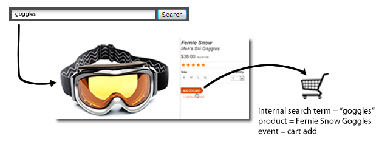
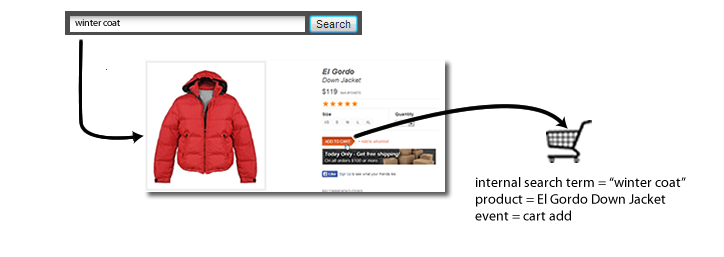

# eVar (Merchandising)

*Auf dieser Hilfeseite wird beschrieben, wie Merchandising-eVars als [Dimension“ &#x200B;](overview.md). Informationen zum Implementieren von Merchandising-eVars finden Sie unter [eVar (Merchandising-Variable)](/help/implement/vars/page-vars/evar-merchandising.md) im Benutzerhandbuch zu Implementierungen.*

Eine ausführliche Erläuterung der Funktionsweise von Merchandising-eVars finden Sie unter [Merchandising-eVars und Methoden zur Produktsuche](/help/admin/tools/manage-rs/edit-settings/conversion-var-admin/merchandising-evars.md).

Bei der Messung des Erfolgs externer Kampagnen oder Suchbegriffe möchten Sie normalerweise, dass alle Erfolgsereignisse, die auftreten, einem einzelnen Wert gutgeschrieben werden. Wenn beispielsweise ein Kunde in einer E-Mail-Kampagne auf einen Link klickt, um Ihre Website zu besuchen, sollten alle daraus resultierenden Käufe dieser Kampagne gutgeschrieben werden.

Was ist mit Ereignissen, die auf die interne Suche oder das Durchsuchen von Kategorien zurückzuführen sind, wenn ein Kunde nach mehreren Artikeln sucht? Zum Beispiel sucht ein Kunde auf Ihrer Website nach einer Brille (`"goggles"`) und fügt diese seinem Warenkorb hinzu:



Vor dem Checkout sucht der Kunde noch nach einer Winterjacke (`"winter coat"`) und fügt dem Warenkorb noch eine Daunenjacke hinzu:



Wenn der Besucher diesen Kauf abschließt, wird Ihnen eine interne Suche nach einer Winterjacke (`"winter coat"`) nach dem Kauf einer Brille gutgeschrieben (unter der Annahme, dass die eVar die Standardzuordnung „Zuletzt verwendet“ verwendet). Das ist gut für den Suchbegriff „Winterjacke“ (`"winter coat"`), aber schlecht für das Treffen von Marketing-Entscheidungen:

| Interner Suchbegriff | Umsatz |
|---|---|
| Wintermantel | $157 |

## So können Merchandising-Variablen das Problem lösen

Merchandising-eVars ermöglichen es Ihnen, den aktuellen Wert einer „eVar“ zum Zeitpunkt eines Erfolgsereignisses einem Produkt zuzuweisen. Der Wert bleibt daraufhin mit dem Produkt verknüpft, selbst wenn später einer oder mehrere weitere Werte für die jeweilige eVar gesetzt werden.

Wenn Merchandising für die „eVar“ aktiviert ist, würde das für das Beispiel oben bedeuten, dass der Suchbegriff „Brille“ (`"goggles"`) mit der Skibrille und der Suchbegriff „Winterjacke“ (`"winter coat"`) mit der Daunenjacke verknüpft wird. Merchandising-eVars ordnen Umsätze auf Produktebene zu, sodass jedem Begriff der Umsatz gutgeschrieben wird, der mit dem zugehörigen Produkt erzielt werden konnte:

| Interner Suchbegriff | Umsatz |
|---|---|
| Wintermantel | $119 |
| Brille | $38 |

Implementierungsanweisungen finden Sie unter [Merchandising-eVars](/help/implement/vars/page-vars/evar-merchandising.md).

## „Instanzen“ für Merchandising-Variablen

Die Metrik [Instanzen](../metrics/instances.md) wird für die Verwendung für Merchandising-Variablen nicht empfohlen.

* Bei Merchandising-Variablen mit Produktsyntax werden Instanzen überhaupt nicht inkrementiert.
* Bei Merchandising-Variablen mit Konversionsvariablensyntax werden Instanzen jedes Mal gezählt, wenn die eVar eingestellt wird. Er wird jedoch dem Dimensionselement `"None"` zugeschrieben, es sei denn, die folgenden Punkte treffen alle auf denselben Treffer zu:
   * Die Merchandising-eVar wird mit einem Wert eingestellt.
   * Die `products`-Variable wird mit einem Wert definiert.
   * Ein Binding-Ereignis wird gesetzt.

```js
// This merchandising eVar uses conversion variable syntax, and counts an instance.
// However, if the binding event and products variable are not both set, the instance attributes to "None".
s.eVar1 = "Tower defense";

// This merchandising eVar uses product syntax, and does not count an instance.
s.products = "Games;Wizard tower;;;;eVar2=Tower defense";
```

Da die meisten Anwendungsfälle für die Konversionsvariablensyntax die eVar und die Produktvariable bei verschiedenen Treffern erfordern, ist die Verwendung der Metrik „Instanzen“ nicht realistisch.
