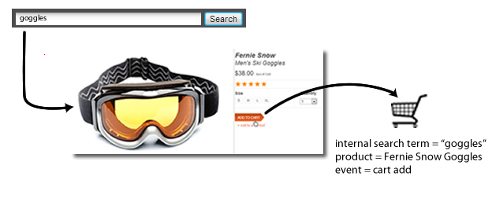
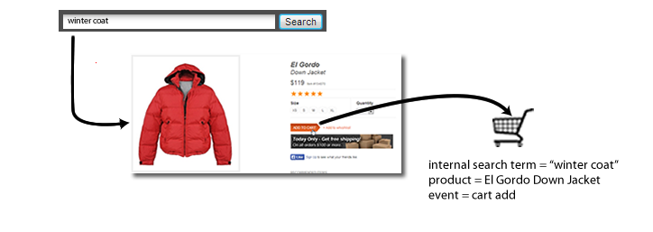

# eVar (Merchandising)

>[!BEGINSHADEBOX]

*Auf dieser Hilfeseite wird beschrieben, wie Merchandising-eVars als [Dimension“ &#x200B;](overview.md). Informationen zum Implementieren von Merchandising-eVars finden Sie unter [eVar (Merchandising-Variable)](/help/implement/vars/page-vars/evar-merchandising.md) im Benutzerhandbuch zu Implementierungen.*

>[!ENDSHADEBOX]

Eine Merchandising-eVar funktioniert wie eine standardmäßige eVar, mit der Ausnahme, dass jedes Produkt über eine eigene Kopie davon verfügt. Persistenz, Zuordnung und Gültigkeit funktionieren alle gleich, aber getrennt für jedes Produkt. Eine standardmäßige eVar enthält pro Besucher einen persistenten Wert, der für jedes Erfolgsereignis angerechnet wird. Eine Merchandising-eVar enthält einen beständigen Wert pro Produkt, und dieser Wert wird für die Erfolgsereignisse dieses Produkts angerechnet:

* Produkt A → `eVar1` = `value A`
* Produkt B → `eVar1` = `value B`

Der Wert jedes Produkts kann nur bei Treffern festgelegt oder geändert werden, die dieses Produkt enthalten. Nach dem Festlegen bleibt der Wert so lange bestehen, bis er abläuft, und er wird nur für die Erfolgsereignisse dieses Produkts angerechnet. Das Ändern des Werts von Produkt A hat keine Auswirkungen auf Produkt B.

Merchandising-eVars funktionieren nur mit der [`products`](/help/implement/vars/page-vars/products.md). Ein Merchandising-eVar-Wert, der nicht an ein Produkt gebunden ist, erhält keine Gutschrift. Erfolgsereignisse bei Treffern ohne Produkte werden `"None"` für jede Merchandising-eVar zugeordnet.

>[!TIP]
>
>Um persistente Werte an eine andere Dimension als Produkte zu binden, sollten Sie [[!UICONTROL Binding-Dimensionen]](https://experienceleague.adobe.com/de/docs/analytics-platform/using/cja-dataviews/component-settings/persistence#binding-dimension) in Customer Journey Analytics verwenden.

## Warum Merchandising-eVars verwenden

Es ist wichtig, für jedes Produkt einen separaten Wert zu haben, wenn ein einzelner Wert nicht für alles, was ein Besucher kauft, angerechnet werden sollte. Eine standardmäßige eVar eignet sich gut für externe Kampagnen oder externe Suchbegriffe, bei denen ein Wert für alle Erfolgsereignisse gutgeschrieben werden sollte. Wenn beispielsweise ein Kunde in einer E-Mail-Kampagne auf einen Link klickt, um Ihre Website zu besuchen, sollten alle daraus resultierenden Käufe dieser Kampagne gutgeschrieben werden.

Interne Suche und Kategoriesuche sind unterschiedlich, da ein Besucher sie oft verwendet, um mehrere Produkte zu finden, jedes auf eine andere Weise. Zum Beispiel sucht ein Kunde auf Ihrer Website nach einer Brille (`"goggles"`) und fügt diese seinem Warenkorb hinzu:



Vor dem Checkout sucht der Kunde nach `"winter coat"` und fügt dann eine Daunenjacke zu seinem Warenkorb hinzu:



Wenn der Besucher diesen Kauf abschließt, wird dem internen Suchbegriff `"winter coat"` die gesamte Bestellung einschließlich der Brille gutgeschrieben, da es sich um den neuesten Wert von eVar handelt (die Standardzuordnung von [!UICONTROL Zuletzt verwendet (Letzte)]. Der Suchbegriff `"goggles"` erhält keine Gutschrift, obwohl er zu einem Teil des Kaufs geführt hat:

| Interner Suchbegriff | Umsatz |
| --- | --- |
| Wintermantel | $157 |

## Wie Merchandising-eVars dieses Problem lösen

Wenn im vorherigen Beispiel Merchandising für den eVar aktiviert ist, ist der Suchbegriff `"goggles"` an die Schneebrille gebunden und der Suchbegriff `"winter coat"` an die Daunenjacke. Merchandising-eVars ordnen den Umsatz auf Produktebene zu, sodass jeder Begriff die Umsatzgutschrift für das Produkt erhält, an das der Begriff gebunden ist:

| Interner Suchbegriff | Umsatz |
| --- | --- |
| Wintermantel | $119 |
| Brille | $38 |

## Funktionsweise von Bindung und Zuordnung

Merchandising-eVars basieren auf drei Konzepten:

* **Bindung**: Eine Verknüpfung zwischen einem Produkt und einem eVar-Wert. Jedes Produkt behält für jede Merchandising-eVar seine eigene Bindung bei. Wie bei einem standardmäßigen eVar-Wert bleibt eine Bindung bei späteren Treffern bis zu ihrem Ablauf erhalten. Beispielsweise erhält ein an ein Produkt auf einer Produktseite gebundener Wert weiterhin eine Gutschrift, wenn dieses Produkt auf einer späteren Seite gekauft wird, ohne dass der Wert erneut festgelegt wird. Wie ein Wert das Produkt erreicht, hängt von der unten beschriebenen Syntax von eVar ab.
* **Zuordnung**: Die Einstellung [!UICONTROL Zuordnung] bestimmt, was passiert, wenn ein neuer Wert versucht, sich an ein Produkt zu binden, das **bereits gebunden**. Die Zuordnung wird für jedes Produkt separat ausgewertet, sodass Merchandising-eVar-Werte, die an verschiedene Produkte gebunden sind, nie miteinander konkurrieren.
  * **[!UICONTROL Ausgangswert (Erste)]**: Die vorhandene Bindung wird beibehalten. Der neue Wert wird für dieses Produkt ignoriert, bis die Bindung abläuft.
  * **[!UICONTROL Zuletzt verwendet (Letzte)]**: Das Produkt wird erneut an den neuen Wert gebunden.
* **Expiration**: Die Einstellung [!UICONTROL Expire After] bestimmt, wann Bindungen beendet werden. Die Bindung für jedes Produkt hat eine eigene Gültigkeit, die ab dem Zeitpunkt gezählt wird, zu dem das Produkt gebunden wurde. Wenn beispielsweise mit einer [!UICONTROL Woche]-Gültigkeit Produkt A am Montag gebunden ist und Produkt B am Mittwoch gebunden ist, läuft die Bindung von Produkt A am folgenden Montag ab und die Bindung von Produkt B am folgenden Mittwoch. Wenn eine Bindung abläuft, hat das Produkt keinen Wert mehr für diese eVar, genau wie eine standardmäßige eVar nach ihrem Ablauf keinen Wert mehr hat. Erfolgsereignisse für dieses Produkt werden `"None"` zugeordnet, bis das Produkt erneut gebunden wird.

Jede Merchandising-eVar verwendet eine von zwei Syntaxen, die in der Einstellung [!UICONTROL Merchandising] in [Report Suite-Einstellungen](/help/admin/tools/manage-rs/edit-settings/conversion-var-admin/conversion-var-admin.md) festgelegt sind. Die Syntax bestimmt, wie ein Wert ein Produkt erreicht:

* **[Produktsyntax](#product-syntax)**: Der Wert wird direkt für jedes Produkt in der `products`-Variablen festgelegt und bei diesem Treffer an dieses Produkt gebunden.
* **[Konversionsvariablensyntax](#conversion-variable-syntax)**: Der Wert wird in der eVar selbst festgelegt und bleibt wie ein standardmäßiger eVar-Wert bestehen. Sie wird an die Produkte im selben oder einem späteren Treffer gebunden, der ein Binding-Ereignis enthält.

Beide Syntaxen verwenden dasselbe Bindungs-, Zuordnungs- und Ablaufverhalten wie oben beschrieben. Sie unterscheiden sich wie folgt:

| | Produktsyntax | Syntax der Konversionsvariablen |
| --- | --- | --- |
| Wo der Wert festgelegt ist | Für jedes Produkt in der [`products`](/help/implement/vars/page-vars/products.md) | Im [`eVar`](/help/implement/vars/page-vars/evar-merchandising.md) selbst, genau wie bei einem standardmäßigen eVar |
| Wenn das Binden erfolgt | Bei jedem Treffer, bei dem der Wert für das Produkt festgelegt ist | Bei Treffern, die sowohl Produkte als auch ein konfiguriertes Binding-Ereignis enthalten |
| Werte pro Treffer | Jedes Produkt kann einen anderen Wert haben | Jedes Produkt im Bindungstreffer erhält denselben Wert |
| Implementierungsaufwand | Höher | lower |

## Produktsyntax

Bei Produktsyntax wird der eVar-Wert für jedes Produkt in der `products`-Variablen festgelegt. In der `products` Zeichenfolge ist der Wert nach dem letzten Semikolon eines Produkts dessen Merchandising-eVar. Siehe [Implementierung mithilfe der Produktsyntax](/help/implement/vars/page-vars/evar-merchandising.md#implement-using-product-syntax) für die vollständige Syntax.

Der Wert wird bei diesem Treffer direkt an das Produkt gebunden. Binding-Ereignisse werden nicht verwendet. Bei späteren Treffern, die das Produkt enthalten, z. B. beim Hinzufügen zum Warenkorb oder beim Kauf, muss der Wert nicht wiederholt werden. Da jedes Produkt seinen eigenen Wert hat, ist die Produktsyntax die einzige Option, wenn Produkte im **selben Treffer** **unterschiedliche** Werte benötigen.

+++Beispiel: Dasselbe Produkt erhält zwei Werte

| Treffer | `products` | `events` |
| --- | --- | --- |
| 1 | `;12345;;;;eVar1=internal keyword search` | |
| 2 | `;12345;;;;eVar1=internal campaign` | |
| 3 | `;12345;1;50` | `purchase` |

* **[!UICONTROL Ausgangswert (Erste)]**: Treffer 2 wird für `12345` ignoriert. Der Kauf wird `internal keyword search` gutgeschrieben.
* **[!UICONTROL Zuletzt verwendet (Letzte)]**: Durch Treffer 2 werden `12345` neu gebunden. Der Kauf wird `internal campaign` gutgeschrieben.

+++

+++Beispiel: Zwei Produkte erhalten unterschiedliche Werte

| Treffer | `products` | `events` |
| --- | --- | --- |
| 1 | `;productA;;;;eVar1=value A` | |
| 2 | `;productB;;;;eVar1=value B` | |
| 3 | `;productA;1;50,;productB;1;30` | `purchase` |

Jedes Produkt behält seine eigene Bindung bei, sodass die Zuordnungseinstellung in diesem Beispiel keine Auswirkungen hat. `value A` erhält die Gutschrift für den Umsatz von Produkt A und `value B` die Gutschrift für den Umsatz von Produkt B. Beide Werte erhalten eine Bestellung, da die Bestellung ein Produkt enthält, das an jeden Wert gebunden ist.

+++

+++Beispiel: Produkte mit derselben ID und unterschiedlichen Werten

Ein Besucher kauft ein mittelblaues T-Shirt und ein großes rotes T-Shirt, beide mit der übergeordneten Produkt-ID `tshirt123`, und erfasst `eVar10` untergeordnete SKUs:

```js
s.events = "purchase";
s.products = ";tshirt123;1;20;;eVar10=tshirt123-m-blue,;tshirt123;1;20;;eVar10=tshirt123-l-red";
```

Jede untergeordnete SKU erhält eine Gutschrift für ihre eigene Instanz von `tshirt123`.

+++

Der Nachteil besteht darin, dass die Produktsyntax immer dann die vollständige Wertzeichenfolge für jedes Produkt erfordert, wenn eine Bindung stattfinden soll. Bei Methoden zur Produktsuche, die normalerweise mehrere eVars gleichzeitig verwenden, sieht die Zeichenfolge wie folgt aus:

```js
s.products = ";sandal123;;;;eVar2=sandals|eVar1=internal keyword search|eVar3=non-internal campaign|eVar4=non-browse|eVar5=non-cross-sell";
```

Eine Suchmethode sollte erst angerechnet werden, nachdem der Besucher mit einem Produkt interagiert hat. Daher wird diese Zeichenfolge normalerweise auf der Produktdetailseite oder bei einer Hinzufügung zum Warenkorb festgelegt, nicht auf der Suchergebnisseite. Dazu müssen Entwickler:

* Übertragen Sie die Details der Suchmethode von der Suchmethodenseite zur Produktdetailseite oder halten Sie sie zur Verfügung, wenn ein Hinzufügen zum Warenkorb von einer Ergebnisseite auslöst.
* Assemblieren Sie die vollständige `products` ohne Syntaxfehler.

Die Konversionsvariablensyntax vermeidet beide Anforderungen.

## Syntax der Konversionsvariablen

Bei Konversionsvariablensyntax wird der Wert in der eVar selbst festgelegt:

```js
s.eVar1 = "internal keyword search";
```

Die eVar fungiert als *Staging-Bereich*. Ein in der eVar festgelegter Wert wird dort gespeichert, bis ein Binding-Ereignis ihn an die Produkte in einem Treffer bindet. Die Bindung erfolgt in zwei Schritten:

1. **Staging**: Wenn die eVar festgelegt ist, bleibt ihr Wert bei nachfolgenden Treffern bis zu ihrem Ablauf erhalten. Dieser persistente Wert ist die `post_evar` Spalte in [Daten-Feeds](/help/export/analytics-data-feed/data-feed-overview.md). Bei Merchandising-eVars, die die Konversionsvariablensyntax verwenden, spiegelt der Staging-Wert **immer den zuletzt gesendeten Wert) wider** unabhängig von der Einstellung [!UICONTROL Zuordnung]. Jeder neue Wert ersetzt den zuvor bereitgestellten Wert.
1. **Bindung**: Wenn ein Treffer sowohl Produkte als auch ein konfiguriertes [!UICONTROL Merchandising-Binding-Ereignis] enthält, wird der Staging-Wert an jedes Produkt in diesem Treffer gebunden. Wenn ein Produkt bereits gebunden ist, bestimmt [!UICONTROL Zuordnung] ob der neue Wert die vorhandene Bindung ersetzt. Produkte, die bereits gebunden sind, behalten ihren Wert bei [!UICONTROL Ausgangswert (Erste)] oder binden erneut mit [!UICONTROL Zuletzt verwendet (Letzte)].

Wenn die eVar, die `products` Variable und ein Binding-Ereignis alle auf denselben Treffer festgelegt sind, finden Staging und Bindung gleichzeitig statt. Der neue Wert wird sofort an die Produkte in diesem Treffer gebunden.

Wenn Sie die eVar neben einem Produkt ohne Binding-Ereignis festlegen, wird der Wert nicht an dieses Produkt gebunden. Ein Staging-Wert erhält keine Gutschrift, bis er an ein Produkt gebunden ist.

### Funktionsweise von Binding-Ereignissen

Ein Binding-Ereignis ist der Trigger, der Adobe anweist, den Staging-Wert an die Produkte im Treffer zu binden.

* Binding-Ereignisse können standardmäßige oder benutzerdefinierte Erfolgsereignisse, der Trackingcode ([!UICONTROL Campaign-Ereignis]) oder eVars sein. Props haben keine Auswirkungen auf die Bindung.
* Sie können mehrere Binding-Ereignisse konfigurieren, z[!UICONTROL &#x200B; B. &quot;]&quot;, [!UICONTROL Warenkorbereignis hinzufügen] und [!UICONTROL Kaufereignis]. Wenn eines dieser Ereignisse einen Treffer mit Produkten aufweist, wird der Staging-Wert an jedes Produkt in diesem Treffer gebunden.
* Standardmäßig ([!UICONTROL Alle]) erfolgt die Bindung immer dann, wenn sich ein anderes Ereignis oder eine andere eVar im selben Treffer wie ein Produkt befindet. [!UICONTROL Alle] wird verwendet, wenn kein Binding-Ereignis explizit ausgewählt ist. Wenn Sie [!UICONTROL Alle] die eVar auf einen Treffer festlegen, der Produkte enthält, binden die Trigger immer an diesen Treffer. Ein Wert, der für einen früheren Treffer bereitgestellt wurde, bindet an den nächsten Treffer, der Produkte und alle anderen Ereignisse oder eVar enthält.

+++Beispiel: Bindung mit einem Binding-Ereignis

Beachten Sie die folgenden Treffer:

```js
// Hit 1
s.eVar1 = "internal keyword search";
s.eVar2 = "sandals";

// Hit 2
s.products = ";sandal123";
s.events = "prodView";
```

Wenn `prodView` ein Binding-Ereignis für beide eVars ist, bindet Treffer 2 `internal keyword search` (`eVar1`) und `sandals` (`eVar2`) an `sandal123`. Wenn ein eVar `prodView` nicht als Binding-Ereignis auflistet, erfolgt für diesen eVar keine Bindung.

+++

+++Beispiel: Zuordnung wird pro Produkt ausgewertet

| Treffer | `eVar1` | `products` | `events` |
| --- | --- | --- | --- |
| 1 | `value A` | | |
| 2 | | `;productA,;productB` | Binding-Ereignis |
| 3 | `value B` | | |
| 4 | | `;productA` | Binding-Ereignis |
| 5 | | `;productA;1;50,;productB;1;30` | `purchase` |

Nach Treffer 3 wird der Staging-Wert (`post_evar1`) mit einer der Zuordnungseinstellungen `value B`.

* **[!UICONTROL Ausgangswert (Erste)]**: Treffer 4 wird für Produkt A ignoriert, da Produkt A bereits gebunden ist. Beide Produkte bleiben an `value A` gebunden, das den gesamten Kaufkredit erhält.
* **[!UICONTROL Zuletzt verwendet (Letzte)]**: Treffer 4 bindet Produkt A erneut an `value B`. Produkt B befindet sich nicht in Treffer 4, sodass es an `value A` gebunden bleibt. Die Einkaufsgutschrift für Produkt A geht an `value B` und die Einkaufsgutschrift für Produkt B an `value A`.

Wenn nur ein einziger Bindungsversuch unternommen wird, z. B. nur Treffer 1, 2 und 5, führen beide Einstellungen zum gleichen Ergebnis. Die Zuordnung ist nur von Bedeutung, wenn ein bereits gebundenes Produkt einen weiteren Bindungsversuch erhält.

+++

## Best Practice: Methoden zur Produktsuche

Die meisten Einzelhandels-Sites profitieren vom Tracking der folgenden Produktsuchmethoden, jeweils als Merchandising-eVar:

* Interne Suchbegriffe (z. B. `eVar2`)
* Interne Kampagnen-Trackingcodes (z. B. `eVar3`)
* Kategorien von Merchandising oder zum Durchsuchen (z. B. `eVar4`)
* Crosssell-Links (z. B. `eVar5`)
* Eine allgemeine Produktsuchmethode, eVar, die alle Methoden vergleicht, einschließlich Methoden wie externe Links zu Produktseiten (z. B. `eVar1`)

Wenn ein Besucher eine Methode verwendet, setzen Sie die eVars der anderen Suchmethode auf einen Wert, der „nicht“ lautet. Andernfalls könnte der frühere Wert einer nicht verwendeten Methode eine Gutschrift für ein Produkt erhalten, das über eine andere Methode gefunden wurde. Zum Beispiel auf der Ergebnisseite für eine interne Suche nach „Sandalen“:

```js
s.eVar1 = "internal keyword search";
s.eVar2 = "sandals";
s.eVar3 = "non-internal campaign";
s.eVar4 = "non-browse";
s.eVar5 = "non-cross-sell";
```

Mit der Konversionsvariablensyntax können Entwickler nur einfache Werte festlegen, wie z. B. einen Suchbegriff in einer Prop, und die Logik in Ihrer Implementierung kann die Merchandising-eVars ausfüllen. Es muss nichts zwischen Seiten übergeben oder in die `products`-Zeichenfolge integriert werden. Die Variable `products` ist weiterhin für die Treffer erforderlich, bei denen die Bindung erfolgt.

Adobe empfiehlt die folgenden Einstellungen für eVars für Produktsuchmethoden:

| Einstellung | Wert |
| --- | --- |
| [!UICONTROL Zuordnung] | [!UICONTROL Ausgangswert (Erste)] |
| [!UICONTROL Läuft ab nach] | Wie lange Produkte im Warenkorb bleiben, bevor sie automatisch entfernt werden, z. B. 14 oder 30 Tage mit [!UICONTROL Custom]. Wenn der Warenkorb keine Beschränkung aufweist, verwenden Sie [!UICONTROL Kauf]. |
| [!UICONTROL Typ] | [!UICONTROL Textzeichenfolge] |
| [!UICONTROL Merchandising aktivieren] | [!UICONTROL Aktiviert] |
| [!UICONTROL Merchandising] | [!UICONTROL Konversionsvariablensyntax] |
| [!UICONTROL Merchandising-Binding-Ereignis] | [!UICONTROL Produktansichtsereignis], [!UICONTROL Warenkorbereignis hinzufügen] und [!UICONTROL Kaufereignis] |

Eine Beschreibung [&#x200B; einzelnen Einstellungen finden Sie &#x200B;](/help/admin/tools/manage-rs/edit-settings/conversion-var-admin/conversion-var-admin.md) „Konversionsvariablen“ im Admin-Handbuch.

+++Warum der Ausgangswert (Erste) anstelle des letzten Werts (Letzte)

Besucher finden oft ein Produkt erneut, das sie bereits angesehen oder zum Warenkorb hinzugefügt haben. Beispiel:

1. Ein Besucher sucht auf der Ergebnisseite nach „Sandalen“ und fügt `sandal123` zum Warenkorb hinzu. Das Produkt bindet an `internal keyword search`.
1. Drei Tage später navigiert der Besucher zu **Damen > Schuhe > Sandalen** (`eVar1` = `browse`), sieht `sandal123` erneut und kauft sie dann.

Mit [!UICONTROL Zuletzt verwendet (Letzte] wird die Produktansicht in Schritt 2 `sandal123` erneut an `browse` gebunden, das dann die Gutschrift für den Kauf erhält. Die Methode, die ursprünglich das Produkt gefunden hat, erhält keine.

Bei [!UICONTROL Ausgangswert (Erste)] wird der Bindungsversuch in Schritt 2 ignoriert, und `internal keyword search` behält die Gutschrift bei.

Wenn der Besucher das Produkt nie kauft, entfernt die Gültigkeit die Bindung, sodass die nächste Suchmethode, die der Besucher verwendet, an das Produkt gebunden werden kann. Aus diesem Grund sollte [!UICONTROL Ablauf nach] der Dauer entsprechen, wie lange ein Produkt im Warenkorb verbleibt.

+++

## Instanzen für Merchandising-eVars

Die Standardmetrik [Instanzen](../metrics/instances.md) wird nicht für die Verwendung in Merchandising-Variablen empfohlen.

* Bei Merchandising-Variablen mit Produktsyntax werden Instanzen überhaupt nicht inkrementiert.
* Bei Merchandising-Variablen mit Konversionsvariablensyntax werden Instanzen jedes Mal gezählt, wenn die eVar eingestellt wird. Die Instanz schreibt jedoch dem Dimensionselement `"None"` zu, es sei denn, Folgendes geschieht im selben Treffer:
  * Die Merchandising-eVar wird mit einem Wert eingestellt.
  * Die `products`-Variable wird mit einem Wert definiert.
  * Ein Binding-Ereignis wird gesetzt.

Da die meisten Anwendungsfälle für die Konversionsvariablensyntax die eVar- und Produktvariable für verschiedene Treffer erfordern, ist die Standardinstanzmetrik nicht realistisch zu verwenden.

Um Instanzen für jeden Wert zu zählen, der mit Konversionsvariablensyntax gesendet wird, wenden Sie das **Last Touch**&#x200B;[&#x200B; Attributionsmodell](/help/analyze/analysis-workspace/attribution/overview.md) auf die Instanzmetrik an. Attributionsmodelle verwenden die bei jedem Treffer gesendeten Werte, nicht Staging-Werte oder Produktbindungen. Das Lookback-Fenster spielt keine Rolle, da Last Touch jeden Wert auf den Treffer gutschreibt, an den er gesendet wurde, unabhängig von der Zuordnungseinstellung der eVar.


