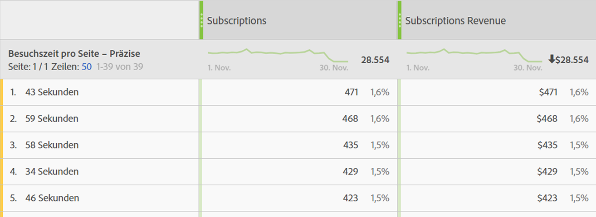

# Besuchszeit pro Seite

Die Besuchszeit pro Seite [Dimension](overview.md) erfasst die Zeit, die ein Besucher auf der Seite verbracht hat. Zur Berechnung werden die folgenden Schritte verwendet:

1. Sehen Sie sich für einen bestimmten Treffer den Zeitstempel an.
2. Vergleichen Sie diesen Treffer mit dem Zeitstempel des nächsten Treffers im Besuch. Sowohl Seitenansichts- als auch Linktracking-Treffer werden gezählt.
3. Die Zeit, die zwischen diesen beiden Treffern verstrichen ist, zählt zur Besuchszeit.

Diese Dimension ist nützlich, wenn Sie verstehen möchten, wie lange Besucher mit einer bestimmten Metrik auf Ihrer Site interagieren.

>[!TIP]
>
>Die Besuchszeit wird beim letzten Treffer des Besuchs nicht gemessen, da keine nachfolgende Bildanforderung zur Messung der verstrichenen Zeit vorliegt. Dieses Konzept gilt auch für Besuche, die aus einem einzelnen Treffer (einem Absprung) bestehen.

Diese Dimension basiert auf Treffern, d. h. der Wert ist bei jedem Treffer unterschiedlich. Vergleichen Sie diese Dimension mit der [Zeit pro Besuch](time-spent-per-visit.md), die einer besuchsbasierten Dimension entspricht. Eine höhere Besuchszeit bedeutet, dass ein Besucher länger auf einer Seite bleibt (Treffer).

## Füllen dieser Dimension mit Daten

Diese Dimension ist bei allen Implementierungen vorkonfiguriert. Wenn eine Report Suite Daten enthält, funktioniert diese Dimension.

## Dimensionselemente

Für die Besuchszeit pro Seite gibt es mehrere Dimensionen:

* **Besuchszeit pro Seite – zusammengefasst**: Die Zeitdauer wird zusammengefasst. Dimensionselemente reichen von `"Less than 15 seconds"` bis `"More than 30 minutes"`. Die Zeit zwischen Treffern dauert in der Regel nicht länger als 30 Minuten. Die Zeit zwischen Treffern kann jedoch 30 Minuten überschreiten, wenn Treffer mit Zeitstempel oder Datenquellen verwendet werden.
* **Besuchszeit pro Seite – präzise**: Jede Anzahl von Sekunden ist ein eindeutiges Dimensionselement.

Allgemeine Informationen zur Besuchszeit finden Sie unter [Besuchszeit – Übersicht](../metrics/time-spent.md).
