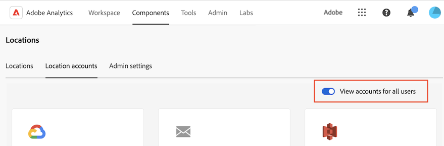

# Konfigurieren von Cloud-Import- und -Exportkonten

<!-- This page is almost duplicated with the "Configure cloud export locations" article in CJA. Differences are that Snowflake isn't supported here and there is a Suffix field for each account type. -->

>[!NOTE]
>
>Beachten Sie beim Erstellen und Bearbeiten von Konten Folgendes: <ul><li>Systemadministratoren können Benutzer daran hindern, Konten zu erstellen, wie unter [Konfigurieren, ob Benutzer Konten erstellen können](/help/components/locations/locations-manager.md#configure-whether-users-can-create-accounts). Wenn Sie keine Konten wie in diesem Abschnitt beschrieben erstellen können, wenden Sie sich an Ihren Systemadministrator.</li><li>Ein Konto kann nur von dem Benutzer, der es erstellt hat, oder von einem Systemadministrator bearbeitet werden.</li></ul>

Sie können ein Cloud-Konto konfigurieren, das für einen oder alle der folgenden Zwecke verwendet wird:

* Exportieren von Dateien mithilfe von [Daten-Feeds](/help/export/analytics-data-feed/create-feed.md)
* Exportieren von Berichten mithilfe von [Data Warehouse](/help/export/data-warehouse/create-request/dw-request-report-destinations.md)
* Importieren von Schemata mit [Klassifizierungssätze](/help/components/classifications/sets/overview.md)

Sie müssen Adobe Analytics mit den erforderlichen Informationen konfigurieren, um auf Ihr Cloud-Konto zugreifen zu können. Dieser Prozess besteht aus dem Hinzufügen und Konfigurieren des Kontos (z. B. Amazon S3 Role ARN, Google Cloud Platform usw.), wie in diesem Artikel beschrieben, und anschließendem Hinzufügen und Konfigurieren des Speicherorts innerhalb dieses Kontos (z. B. eines Ordners innerhalb des Kontos), wie in [Konfigurieren von Cloud-Import- und -Exportspeicherorten](/help/components/locations/configure-import-locations.md).

Informationen zum Anzeigen und Löschen vorhandener Konten finden Sie unter [Locations Manager](/help/components/locations/locations-manager.md).

So konfigurieren Sie ein Cloud-Import- oder -Exportkonto:

1. Wählen Sie in Adobe Analytics [!UICONTROL **Komponenten**] > [!UICONTROL **Standorte**].
1. Im [!UICONTROL Standorte] Seite, wählen Sie die [!UICONTROL **Standortkonten**] Registerkarte.
1. (Bedingt) Wenn Sie Systemadministrator sind, können Sie die [!UICONTROL **Anzeigen von Konten für alle Benutzer**] -Option, um die von allen Benutzern in Ihrer Organisation erstellten Konten anzuzeigen.
   
1. Um ein neues Konto zu erstellen, wählen Sie [!UICONTROL **Konto hinzufügen**].

   Die [!UICONTROL **Details zum Standortkonto**] angezeigt.

   Oder

   Um ein vorhandenes Konto zu bearbeiten, suchen Sie das Konto, das Sie bearbeiten möchten, und wählen Sie dann die [!UICONTROL **Details bearbeiten**] Schaltfläche.

   Die [!UICONTROL **Konto hinzufügen**] angezeigt.

1. Geben Sie die folgenden Informationen an: |Feld | Funktion | |—|—| | [!UICONTROL **Name des Standortkontos**] | Der Name des Standortkontos. Dieser Name wird beim Erstellen eines Standorts angezeigt | | [!UICONTROL **Beschreibung des Standortkontos**] | Geben Sie eine kurze Beschreibung des Kontos ein, um es von anderen Konten desselben Kontotyps zu unterscheiden. | | [!UICONTROL **Konto für alle Benutzer in Ihrer Organisation verfügbar machen**] | **Hinweis:** Diese Funktion befindet sich in der eingeschränkten Testphase der Veröffentlichung und ist möglicherweise noch nicht in Ihrer Umgebung verfügbar. Diese Anmerkung wird entfernt, wenn die Funktion allgemein verfügbar ist. Informationen zum Analytics-Veröffentlichungsprozess finden Sie unter [Adobe Analytics-Funktionsversionen](/help/release-notes/releases.md). 
Aktivieren Sie diese Option, damit andere Benutzer in Ihrer Organisation das Konto verwenden können.
 
Beachten Sie beim Freigeben von Konten Folgendes:
<ul><li>Die Freigabe von Konten, die Sie freigeben, kann nicht aufgehoben werden.</li><li>Freigegebene Konten können nur vom Eigentümer des Kontos bearbeitet werden.</li><li>Jeder kann einen Speicherort für das freigegebene Konto erstellen.</li></ul> | | [!UICONTROL **Kontotyp**] | Wählen Sie Ihren Cloud-Kontotyp aus. Es wird empfohlen, für jeden Kontotyp ein einziges Konto mit mehreren Speicherorten nach Bedarf innerhalb dieses Kontos zu führen.
Systemadministratoren können die Kontotypen einschränken, die Benutzer erstellen können, wie unter [Konfigurieren, ob Benutzer Konten erstellen können](/help/components/locations/locations-manager.md#configure-whether-users-can-create-accounts). Wenn Sie keine Konten wie in diesem Abschnitt beschrieben erstellen können, wenden Sie sich an Ihren Systemadministrator.
 |
1. Im [!UICONTROL **Kontoeigenschaften**] -Abschnitt Informationen zum ausgewählten Kontotyp angeben.

   Erweitern Sie für Konfigurationsanweisungen den folgenden Abschnitt, der dem [!UICONTROL **Kontotyp**] die Sie ausgewählt haben. (Es sind auch zusätzliche veraltete Kontotypen verfügbar, jedoch nicht empfohlen.)

   **Kontotypen**

   + + + Amazon S3 Role ARN

   Geben Sie die folgenden Informationen an, um ein Amazon S3-Rollen-ARN-Konto zu konfigurieren:

   | Feld | Funktion |
   |---------|----------|
   | [!UICONTROL **Rollen-ARN**] | Sie müssen einen Rollen-ARN (Amazon Resource Name) bereitstellen, den Adobe verwenden kann, um Zugriff auf das Amazon S3-Konto zu erhalten. Erstellen Sie hierfür eine IAM-Berechtigungsrichtlinie für das Quellkonto, hängen Sie die Richtlinie an eine Benutzerin oder einen Benutzer an und erstellen Sie dann eine Rolle für das Zielkonto. Spezifische Informationen finden Sie in [dieser AWS-Dokumentation](https://aws.amazon.com/premiumsupport/knowledge-center/cross-account-access-iam/). |

   {style="table-layout:auto"}

+++

   +++Google Cloud Platform

   Geben Sie die folgenden Informationen an, um ein Google Cloud Platform-Konto zu konfigurieren:

   | Feld | Funktion |
   |---------|----------|
   | [!UICONTROL **Projekt-ID**] | Ihre Google Cloud-Projekt-ID. Siehe [Dokumentation zu Google Cloud zum Abrufen einer Projekt-ID](https://cloud.google.com/resource-manager/docs/creating-managing-projects#identifying_projects). |

   {style="table-layout:auto"}

+++

   +++Azure SAS

   Geben Sie die folgenden Informationen an, um ein Azure SAS-Konto zu konfigurieren:

   | Feld | Funktion |
   |---------|----------|
   | [!UICONTROL **Anwendungs-ID**] | Kopieren Sie diese ID aus der von Ihnen erstellten Azure-Anwendung. In Microsoft Azure befinden sich diese Informationen auf der Registerkarte **Übersicht** in Ihrer Anwendung. Weitere Informationen finden Sie in der [Microsoft Azure-Dokumentation zur Registrierung einer Anwendung bei der Microsoft Identity Platform](https://learn.microsoft.com/de-de/azure/active-directory/develop/quickstart-register-app). |
   | [!UICONTROL **Mandanten-ID**] | Kopieren Sie diese ID aus der von Ihnen erstellten Azure-Anwendung. In Microsoft Azure befinden sich diese Informationen auf der Registerkarte **Übersicht** in Ihrer Anwendung. Weitere Informationen finden Sie in der [Microsoft Azure-Dokumentation zur Registrierung einer Anwendung bei der Microsoft Identity Platform](https://learn.microsoft.com/de-de/azure/active-directory/develop/quickstart-register-app). |
   | [!UICONTROL **Key Vault-URI**] | 
Der Pfad zum SAS-Token im Azure Key Vault.  Um Azure SAS zu konfigurieren, müssen Sie ein SAS-Token mithilfe des Azure Key Vault als geheim speichern. Weitere Informationen finden Sie in der [Microsoft Azure-Dokumentation zum Einrichten und Abrufen eines Geheimnisses aus Azure Key Vault](https://learn.microsoft.com/de-de/azure/key-vault/secrets/quick-create-portal?source=recommendations).

Nachdem der Schlüssel-Vault-URI erstellt wurde, fügen Sie im Key Vault eine Zugriffsrichtlinie hinzu, um der von Ihnen erstellten Azure-Anwendung Berechtigungen zu erteilen. Weitere Informationen finden Sie unter [Microsoft Azure-Dokumentation für die Zuweisung einer Key Vault-Zugriffsrichtlinie](https://learn.microsoft.com/de-de/azure/key-vault/general/assign-access-policy?tabs=azure-portal).
 |
   | [!UICONTROL **Key Vault-Geheimnisname**] | Der geheime Name, den Sie beim Hinzufügen des Geheimnisses zum Azure Key Vault erstellt haben. In Microsoft Azure befinden sich diese Informationen im von Ihnen erstellten Key Vault im **Key Vault** Einstellungsseite. Weitere Informationen finden Sie in der [Microsoft Azure-Dokumentation zum Einrichten und Abrufen eines Geheimnisses aus Azure Key Vault](https://learn.microsoft.com/de-de/azure/key-vault/secrets/quick-create-portal?source=recommendations). |
   | [!UICONTROL **Geheimnis des Speicherkontos**] | Kopieren Sie das Geheimnis aus der von Ihnen erstellten Azure-Anwendung. In Microsoft Azure befinden sich diese Informationen auf der Registerkarte **Zertifikate und Geheimnisse** in Ihrer Anwendung. Weitere Informationen finden Sie in der [Microsoft Azure-Dokumentation zur Registrierung einer Anwendung bei der Microsoft Identity Platform](https://learn.microsoft.com/de-de/azure/active-directory/develop/quickstart-register-app). |

   {style="table-layout:auto"}

+++

   +++Azure RBAC

   Geben Sie die folgenden Informationen an, um ein Azure RBAC-Konto zu konfigurieren:

   | Feld | Funktion |
   |---------|----------|
   | [!UICONTROL **Anwendungs-ID**] | Kopieren Sie diese ID aus der von Ihnen erstellten Azure-Anwendung. In Microsoft Azure befinden sich diese Informationen auf der Registerkarte **Übersicht** in Ihrer Anwendung. Weitere Informationen finden Sie in der [Microsoft Azure-Dokumentation zur Registrierung einer Anwendung bei der Microsoft Identity Platform](https://learn.microsoft.com/de-de/azure/active-directory/develop/quickstart-register-app). |
   | [!UICONTROL **Mandanten-ID**] | Kopieren Sie diese ID aus der von Ihnen erstellten Azure-Anwendung. In Microsoft Azure befinden sich diese Informationen auf der Registerkarte **Übersicht** in Ihrer Anwendung. Weitere Informationen finden Sie in der [Microsoft Azure-Dokumentation zur Registrierung einer Anwendung bei der Microsoft Identity Platform](https://learn.microsoft.com/de-de/azure/active-directory/develop/quickstart-register-app). |
   | [!UICONTROL **Geheimnis des Speicherkontos**] | Kopieren Sie das Geheimnis aus der von Ihnen erstellten Azure-Anwendung. In Microsoft Azure befinden sich diese Informationen auf der Registerkarte **Zertifikate und Geheimnisse** in Ihrer Anwendung. Weitere Informationen finden Sie in der [Microsoft Azure-Dokumentation zur Registrierung einer Anwendung bei der Microsoft Identity Platform](https://learn.microsoft.com/de-de/azure/active-directory/develop/quickstart-register-app). |

   {style="table-layout:auto"}

+++

   +++E-Mail

   >[!NOTE]
   >
   >E-Mail-Konten können nur mit [Daten-Feeds](/help/export/analytics-data-feed/create-feed.md). (E-Mail-Konten werden in [Data Warehouse](/help/export/data-warehouse/create-request/dw-request-report-destinations.md) oder [Klassifizierungssätze](/help/components/classifications/sets/overview.md)).

   Geben Sie die folgenden Informationen an, um ein Azure RBAC-Konto zu konfigurieren:

   | Feld | Funktion |
   |---------|----------|
   | [!UICONTROL **Empfangende**] | Es können E-Mail-Benachrichtigungen an bestimmte Benutzende gesendet werden, wenn der Bericht gesendet wird. Geben Sie eine einzelne E-Mail-Adresse oder eine durch Kommata getrennte Liste von E-Mail-Adressen an. |

   {style="table-layout:auto"}

+++

   **Alte Kontotypen**

   Diese veralteten Kontotypen sind nur verfügbar, wenn Daten mit [Daten-Feeds](/help/export/analytics-data-feed/create-feed.md) und [Data Warehouse](/help/export/data-warehouse/create-request/t-dw-create-request.md). Diese Optionen stehen beim Datenimport mit [Klassifizierungssätze](/help/components/classifications/sets/manage/schema.md).

   +++FTP

   Daten-Feed-Daten können an einen Adobe- oder kundengehosteten FTP-Speicherort bereitgestellt werden. Erfordert einen FTP-Host, einen Benutzernamen und ein Kennwort. Verwenden Sie das Pfadfeld, um Feed-Dateien in einem Ordner zu platzieren. Ordner müssen bereits vorhanden sein; Feeds geben einen Fehler aus, wenn der angegebene Pfad nicht vorhanden ist.

   | Feld | Funktion |
   |---------|----------|
   | [!UICONTROL **Host**] | Geben Sie die gewünschte FTP-Ziel-URL ein. Zum Beispiel `ftp://ftp.omniture.com`. |
   | [!UICONTROL **Path**] | Kann leer gelassen werden. |
   | [!UICONTROL **Benutzername**] | Geben Sie den Benutzernamen ein, um sich bei der FTP-Site anzumelden. |
   | [!UICONTROL **Kennwort und Kennwort bestätigen**] | Geben Sie das Kennwort ein, um sich bei der FTP-Site anzumelden. |

   {style="table-layout:auto"}

+++

   +++SFTP

   SFTP-Unterstützung für Daten-Feeds ist verfügbar. Erfordert einen SFTP-Host und Benutzernamen. Außerdem muss die Ziel-Site einen gültigen öffentlichen RSA- oder DSA-Schlüssel enthalten. Sie können den entsprechenden öffentlichen Schlüssel beim Erstellen des Feeds herunterladen.

+++

   ++ + S3

   Sie können Warehouse-Daten direkt an Amazon S3-Buckets senden. Dieser Zieltyp erfordert einen Behälternamen, eine Zugriffsschlüssel-ID und einen geheimen Schlüssel. Weitere Informationen finden Sie unter [Benennungsanforderungen für Amazon S3-Behälter](https://docs.aws.amazon.com/de_de/awscloudtrail/latest/userguide/cloudtrail-s3-bucket-naming-requirements.html) in der Amazon S3-Dokumentation.

   Die Benutzerin oder der Benutzer, die bzw. den Sie zum Hochladen von Data Warehouse-Daten angeben, muss über die folgenden [Berechtigungen](https://docs.aws.amazon.com/de_de/AmazonS3/latest/API/API_Operations_Amazon_Simple_Storage_Service.html) verfügen:

   * s3:GetObject
   * s3:PutObject
   * s3:PutObjectAcl

   Die folgenden 16 standardmäßigen AWS-Regionen werden unterstützt (gegebenenfalls unter Verwendung des entsprechenden Signaturalgorithmus):

   * us-east-2
   * us-east-1
   * us-west-1
   * us-west-2
   * ap-south-1
   * ap-northeast-2
   * ap-southeast-1
   * ap-southeast-2
   * ap-northeast-1
   * ca-central-1
   * eu-central-1
   * eu-west-1
   * eu-west-2
   * eu-west-3
   * eu-north-1
   * sa-east-1

   >[!NOTE]
   >
   >Die Region „cn-north-1“ wird nicht unterstützt.

+++

   +++Azure Blob

   Data Warehouse unterstützt Azure Blob-Ziele. Erfordert einen Container, ein Konto und einen Schlüssel. Amazon verschlüsselt die Daten automatisch während der Ruhezeit. Wenn Sie die Daten herunterladen, werden sie automatisch entschlüsselt. Weitere Informationen finden Sie unter [Erstellen eines Speicherkontos](https://docs.microsoft.com/de-de/azure/storage/common/storage-quickstart-create-account?tabs=azure-portal#view-and-copy-storage-access-keys) in der Dokumentation zu Microsoft Azure.

   >[!NOTE]
   >
   >Sie müssen Ihren eigenen Prozess implementieren, um Speicherplatz auf dem Data Warehouse-Ziel zu verwalten. Adobe löscht keine Daten vom Server.

+++

1. Wählen Sie [!UICONTROL **Speichern**] aus.

1. Fahren Sie mit [Konfigurieren von Cloud-Import- und -Exportspeicherorten](/help/components/locations/configure-import-locations.md).
