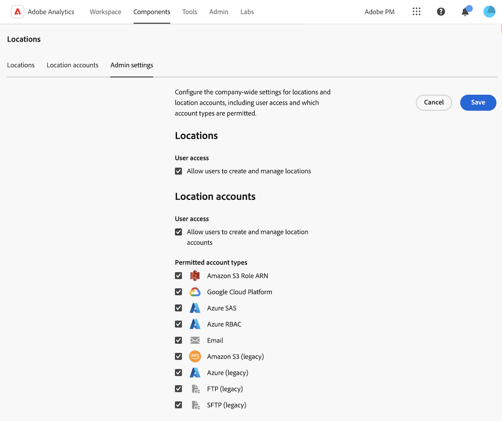

# Standorte-Manager

Mit dem Standort-Manager können Sie Konten und Standorte anzeigen, erstellen, bearbeiten oder löschen. Diese können für einen der folgenden Zwecke verwendet werden:

* Exportieren von Dateien mit [Daten-Feeds](/help/export/analytics-data-feed/create-feed.md)
* Exportieren von Berichten mit [Data Warehouse](/help/export/data-warehouse/create-request/dw-request-report-destinations.md)
* Dateien werden bei Verwendung von [Report Builder exportiert](/help/analyze/report-builder/report-builder-export.md)
* Importieren von Schemas mithilfe [Klassifizierungssätze](/help/components/classifications/sets/overview.md)

## Anzeigen, Filtern und Suchen von Speicherorten

Mit dem Standort-Manager können Sie alle von Ihnen erstellten Standorte oder alle für die Organisation freigegebenen Standorte anzeigen. Systemadministratoren können Speicherorte anzeigen, die von allen Benutzern erstellt wurden, unabhängig davon, ob sie freigegeben wurden oder nicht.

1. Um auf den Standort-Manager in Adobe Analytics zuzugreifen, wählen Sie **[!UICONTROL Komponenten]** > **[!UICONTROL Standorte]** aus.

1. (Bedingt) Wenn Sie Systemadministrator sind, können Sie die Option [!UICONTROL **Standorte für alle Benutzer anzeigen**] aktivieren, um Standorte anzuzeigen, die von allen Benutzern in Ihrer Organisation erstellt wurden. <!-- Maybe add a screenshot? This is new functionality -->

1. Filtern oder suchen Sie die Liste der Standorte:

   * **Filter** Wählen Sie das Filtersymbol aus, um die Liste der Speicherorte zu filtern.

     Sie können Standorte nach **[!UICONTROL Standorttyp]**, **[!UICONTROL Konto]** oder **[!UICONTROL Erstellt von]** filtern.

     

   * **Suche** Geben Sie im Suchfeld den Namen des Speicherorts ein, den Sie anzeigen möchten. Die Ergebnisse werden bei der Eingabe gefiltert. Die folgenden Spalten werden durchsucht: **Speicherort-Name**, **Speicherort-Typ**, **Konto** und **Erstellt von**.

1. (Optional) Wenn Sie mehr als 1.000 Standorte haben, wird nur die erste 1.000 angezeigt. Wählen Sie [!UICONTROL **Mehr laden**], um 1.000 weitere Speicherorte zu laden.

## Konfigurieren von Spalten im Standort-Manager

Die folgenden Spalten sind im Standort-Manager verfügbar. Um die in der Tabelle angezeigten Spalten anzupassen, wählen Sie das Symbol **Tabelle anpassen** (Symbol .

* **[!UICONTROL Speicherort-Name]**: Der Speicherort-Name. Wählen Sie das Dreipunkt-Menü neben einem Ortsnamen aus, um entweder [den Ort bearbeiten](/help/components/locations/configure-import-locations.md) oder ihn zu löschen.
* **[!UICONTROL Speicherort-]**: Der mit dem Speicherort verknüpfte Kontotyp.
* **[!UICONTROL Konto]**: Das spezifische Konto, das mit dem Speicherort verknüpft ist.
* **Programm**: Der Typ der Anwendung, mit der der Speicherort verwendet werden kann (z. B. Daten-Feeds, Data Warehouse oder Klassifizierungssätze).
* **[!UICONTROL Zuletzt verwendet]**: Das Datum, an dem der Speicherort zuletzt verwendet wurde.
* **[!UICONTROL Erstellt von]**: Der Benutzer, der den Speicherort erstellt hat.
* **[!UICONTROL Erstellungsdatum]**: Das Datum, an dem der Speicherort erstellt wurde.

## Erstellen und Verwalten von Standorten

Sie können Standorte erstellen, bearbeiten und löschen.

### Speicherort erstellen

Informationen zum Erstellen eines Speicherorts finden Sie unter [Konfigurieren von Cloud-Import- und -Exportspeicherorten](/help/components/locations/configure-import-locations.md).

<!-- Do I need to add some steps here about how to create a location and then assign that location to be used with DF, DW, or Classifications sets? Need to hear back from Ron and team whether we are including this functionality -->

### Bearbeiten eines Speicherorts

Ein Speicherort kann nur von dem Benutzer, der ihn erstellt hat, oder von einem Systemadministrator bearbeitet werden.

Informationen zum Bearbeiten eines Speicherorts finden Sie unter [Konfigurieren von Cloud-Import- und -Exportspeicherorten](/help/components/locations/configure-import-locations.md).

### Löschen eines Speicherorts

>[!IMPORTANT]
>
>Wenn ein Speicherort gelöscht wird, schlagen alle Daten-Feed-Dateien, Data Warehouse-Berichte oder Klassifizierungssatz-Schemas, die mit dem gelöschten Speicherort verknüpft sind, fehl, wenn sie das nächste Mal verwendet werden.
>
>Wenn Sie einen Speicherort löschen, sollten Sie [Ihre Daten-Feeds](/help/export/analytics-data-feed/create-feed.md) [Data Warehouse-Berichte](/help/export/data-warehouse/create-request/dw-request-report-destinations.md) und [Klassifizierungssätze-Schemas](/help/components/classifications/sets/manage/schema.md) verwenden, um einen funktionierenden Speicherort zu verwenden.

Ein Speicherort kann nur von dem Benutzer, der ihn erstellt hat, oder von einem Systemadministrator gelöscht werden.

So löschen Sie einen Speicherort im Standort-Manager in Adobe Analytics:

1. Wählen Sie **[!UICONTROL Komponenten]** > **[!UICONTROL Speicherorte]** und wählen Sie dann die Registerkarte [!UICONTROL **Speicherorte**] aus.

1. Wählen Sie das Dreipunkt-Menü in der Spalte [!UICONTROL **Ortsname**] für den Speicherort aus, den Sie löschen möchten.

1. Wählen Sie [!UICONTROL **Löschen**] aus.

## Erstellen und Verwalten von Konten

Sie können Konten erstellen, bearbeiten und löschen.

### Konto erstellen

Informationen zum Erstellen eines Kontos finden Sie unter [Konfigurieren von Cloud-Import- und -Exportkonten](/help/components/locations/configure-import-accounts.md).

### Konto bearbeiten

Ein Konto kann nur von dem Benutzer, der es erstellt hat, oder von einem Systemadministrator bearbeitet werden.

Informationen zum Bearbeiten eines Kontos finden Sie unter [Konfigurieren von Cloud-Import- und -Exportkonten](/help/components/locations/configure-import-accounts.md).

### Kontoschlüssel anzeigen

Nachdem Sie ein Konto erstellt haben, können Sie alle zugehörigen Kontoschlüssel für dieses Konto anzeigen. Möglicherweise müssen Sie diese Informationen anzeigen, wenn Sie die Konfiguration des Kontos mit Ihrem Cloud-Anbieter bei der [ursprünglichen Konfiguration des Kontos) nicht &#x200B;](/help/components/locations/configure-import-accounts.md) haben.

So zeigen Sie die mit einem Exportkonto verknüpften Schlüssel an:

1. Wählen Sie in Adobe Analytics **[!UICONTROL Komponenten]** > **[!UICONTROL Standorte]** und dann die Registerkarte [!UICONTROL **Standortkonten**] aus.

1. (Bedingt) Wenn Sie Systemadministrator sind, können Sie die Option [!UICONTROL **Standorte für alle Benutzer anzeigen**] aktivieren, um Standorte anzuzeigen, die von allen Benutzern in Ihrer Organisation erstellt wurden. <!-- Maybe add a screenshot? This is new functionality -->

1. Klicken Sie auf das Dreipunkt-Symbol des Kontos, das Sie bearbeiten möchten, und klicken Sie dann auf [!UICONTROL **Kontoschlüssel**].

### Löschen eines Kontos

>[!IMPORTANT]
>
>Konten können nur gelöscht werden, wenn sie nicht von Standorten verwendet werden. Bevor Sie ein Konto löschen, müssen Sie zunächst alle Speicherorte im Konto löschen, wie in [Löschen eines Speicherorts](#delete-a-location) beschrieben.

Ein Konto kann nur von dem Benutzer, der es erstellt hat, oder von einem Systemadministrator gelöscht werden.

So löschen Sie ein Konto:

1. Wählen Sie in Adobe Analytics **[!UICONTROL Komponenten]** > **[!UICONTROL Standorte]** und dann die Registerkarte [!UICONTROL **Standortkonten**] aus.

1. (Bedingt) Wenn Sie Systemadministrator sind, können Sie die Option [!UICONTROL **Konten für alle Benutzer anzeigen**] aktivieren, um Speicherorte anzuzeigen, die von allen Benutzern in Ihrer Organisation erstellt wurden.

1. Wählen Sie auf dem Konto, das Sie bearbeiten möchten, das Drei-Punkte-Symbol und dann [!UICONTROL **Konto löschen**]

## Konfigurieren von unternehmensweiten Einstellungen (nur Administratoren)

Systemadministratoren können Benutzer daran hindern, Konten und Standorte zu erstellen, oder sie können die Arten von Konten einschränken, die Benutzer erstellen und verwenden können.

### Konfigurieren, ob Benutzer Konten erstellen und bearbeiten können

Standardmäßig können alle Benutzerinnen und Benutzer im Unternehmen in Ihrer Adobe Analytics-Umgebung Konten erstellen und Konten bearbeiten, wie in [Konfigurieren von Cloud-Import- und -Exportkonten](/help/components/locations/configure-import-accounts.md) beschrieben.

Sie können das Erstellen von Konten durch Benutzer einschränken. Wenn Sie dies tun, können Benutzer weiterhin alle Konten verwenden, die sie bereits erstellt haben, sie können sie jedoch nicht mehr bearbeiten. Von Benutzern erstellte Konten können gelöscht werden, wie unter [Löschen eines Kontos](#delete-an-account) beschrieben.

So verhindern Sie, dass alle Benutzer Konten erstellen und bearbeiten:

1. Wählen Sie in Adobe Analytics **[!UICONTROL Komponenten]** > **[!UICONTROL Standorte]** und klicken Sie dann auf die Registerkarte [!UICONTROL **Admin-Einstellungen**].

1. Deaktivieren Sie im Abschnitt [!UICONTROL **Standortkonten**] die Option [!UICONTROL **Benutzern das Erstellen und Verwalten von Standortkonten ermöglichen**].

1. Wählen Sie [!UICONTROL **Speichern**] aus.

1. (Optional) Löschen Sie alle Konten, die von Benutzern erstellt wurden und die diese nicht mehr verwenden sollen, wie in [Konto löschen](#delete-an-account) beschrieben.

### Konfigurieren, ob Benutzer Standorte erstellen und bearbeiten können

Standardmäßig können alle Benutzenden im Unternehmen in Ihrer Adobe Analytics-Umgebung erstellte Speicherorte erstellen und bearbeiten, wie unter [Konfigurieren von Cloud-Import- und -Exportspeicherorten](/help/components/locations/configure-import-locations.md) beschrieben.

Sie können Benutzer daran hindern, Standorte zu erstellen. Wenn Sie dies tun, können Benutzerinnen und Benutzer weiterhin alle Speicherorte verwenden, die sie bereits erstellt haben, sie können sie jedoch nicht mehr bearbeiten. Sie können von Benutzern erstellte Speicherorte löschen, wie unter [Löschen von Speicherorten](#delete-a-location) beschrieben.

So verhindern Sie, dass alle Benutzer Standorte erstellen und bearbeiten:

1. Wählen Sie in Adobe Analytics **[!UICONTROL Komponenten]** > **[!UICONTROL Standorte]** und klicken Sie dann auf die Registerkarte [!UICONTROL **Admin-Einstellungen**].

1. Deaktivieren Sie im [!UICONTROL **Standorte**] die Option [!UICONTROL **Benutzern das Erstellen und Verwalten von Standorten ermöglichen**].

1. Wählen Sie [!UICONTROL **Speichern**] aus.

1. (Optional) Löschen Sie alle von Benutzern erstellten Standorte, die diese nicht mehr verwenden sollen, wie in [Löschen eines Standorts](#delete-a-location) beschrieben.

### Einschränken der Kontotypen, die Benutzer erstellen und verwenden können

Sie können die Kontotypen, die Benutzerinnen und Benutzer sehen, in den folgenden Fällen einschränken:

* Beim [Erstellen neuer Konten](/help/components/locations/configure-import-accounts.md)

* Bei der Auswahl der Konten, die beim Exportieren von Dateien mit [Daten-Feeds](/help/export/analytics-data-feed/create-feed.md) beim Exportieren von Berichten mit [Data Warehouse](/help/export/data-warehouse/create-request/dw-request-report-destinations.md) oder beim Importieren von Schemata mit [Klassifizierungssätzen](/help/components/classifications/sets/overview.md) verwendet werden.

Wenn Sie Kontotypen wie in diesem Abschnitt beschrieben einschränken, sind alle Konten des Typs, den Sie einschränken, für Benutzerinnen und Benutzer nicht mehr sichtbar. Das bedeutet, dass keine neuen Konten dieses Typs erstellt werden können und dass keine bestehenden Konten dieses Typs beim Erstellen von Daten-Feeds, Data Warehouse oder Klassifizierungssätzen verwendet werden können.

Vorhandene Konten, die für geplante Exporte konfiguriert sind, müssen jedoch gelöscht werden, wenn Sie ihre Verwendung einschränken möchten.

#### Sicherstellen, dass keine Konten für geplante Exporte verwendet werden

Wenn Sie Kontotypen einschränken, werden vorhandene Konten ausgeblendet, nicht gelöscht.

Wenn Zeitpläne bereits so konfiguriert sind, dass Daten an ein Konto gesendet werden, das von dem Typ ist, den Sie einschränken, werden die Zeitpläne auch nach dem Einschränken des Kontotyps weiter ausgeführt und die Daten werden weiterhin an das Konto gesendet.  Wenn beispielsweise ein Daten-Feed so geplant ist, dass Daten an einen Kontotyp gesendet werden, den Sie einschränken, wird der Zeitplan weiterhin ausgeführt.

Wenn Sie sicherstellen müssen, dass Konten eines bestimmten Typs nicht in geplanten Exporten verwendet werden, können Sie die Konten löschen, bevor Sie [die Kontotypen beschränken](#limit-the-account-types-that-are-available-to-users).

Löschen von Konten:

1. Suchen Sie die Konten des Kontotyps, den Sie beschränken möchten und der für geplante Exporte verwendet wird.

1. Löschen Sie die Konten, wie unter [Löschen eines Kontos](#delete-an-account) beschrieben.

1. Fahren Sie mit dem folgenden Abschnitt fort[&#x200B; „Beschränken Sie die Kontotypen, die Benutzern zur Verfügung stehen](#limit-the-account-types-that-are-available-to-users).

#### Beschränken Sie die Kontotypen, die Benutzern zur Verfügung stehen

So beschränken Sie die Kontotypen, die Benutzern beim Erstellen und Verwenden von Konten zur Verfügung stehen:

1. Wählen Sie in Adobe Analytics **[!UICONTROL Komponenten]** > **[!UICONTROL Standorte]** und klicken Sie dann auf die Registerkarte [!UICONTROL **Admin-Einstellungen**].

1. Suchen Sie den Abschnitt [!UICONTROL **Zulässige**]).

   Die folgenden Kontotypen stehen Benutzern standardmäßig zur Verfügung. Heben Sie die Auswahl eines dieser Kontotypen auf, deren Verwendung für Benutzer eingeschränkt werden soll.

   Es muss mindestens ein Kontotyp ausgewählt sein.

   * [!UICONTROL **Amazon S3 Role ARN**]

   * [!UICONTROL **Google Cloud Platform**]

   * [!UICONTROL **Azure SAS**]

   * [!UICONTROL **Azure RBAC**]

   * [!UICONTROL **E-Mail**]

   * Ältere Kontotypen, einschließlich [!UICONTROL **Amazon S3**], [!UICONTROL **Azure**], [!UICONTROL **FTP**] und [!UICONTROL **SFTP**]

1. Wählen Sie [!UICONTROL **Speichern**] aus.

