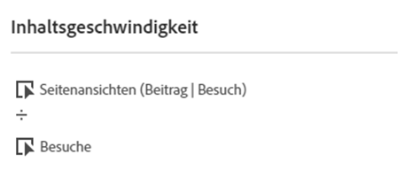
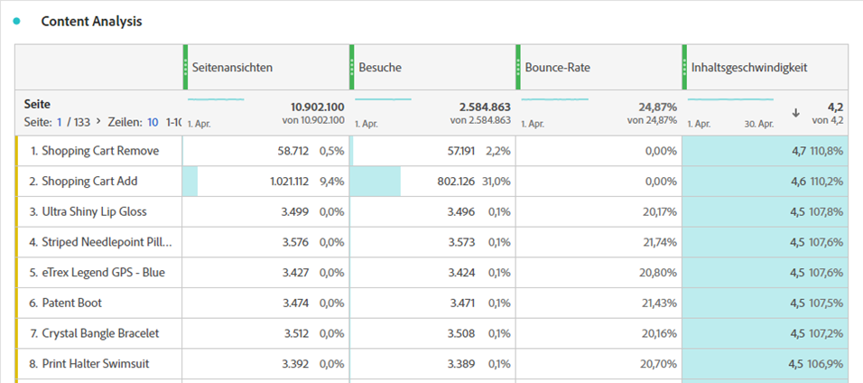

# Content-Geschwindigkeit

Mit der berechneten Metrik „Inhaltsgeschwindigkeit“ können Sie messen, wie eine Dimension (normalerweise [[!UICONTROL Seite]](/help/components/dimensions/page.md)) dazu beiträgt, dass Benutzer Zeit auf Ihrer Website oder in Ihrem Programm verbringen.

Diese Metrik verwendet [Partizipationsattribution](/help/analyze/analysis-workspace/attribution/models.md) für die Metrik [Seitenansichten](page-views.md) als Teil ihrer Berechnung. Bei der Teilnahme an Besuchen wird jedes Mal, wenn eine Seite aufgerufen wird, allen Seiten, die zuvor während desselben Besuchs getroffen wurden, auch die Seitenansicht angerechnet. Diese Formel bedeutet in der Regel, dass eine Seite umso mehr Anerkennung erhält, je früher sie während eines Besuchs aufgerufen wurde. (Siehe [Seitenansichten (Teilnahme) | Besuch) oder „Besuchsbeteiligung“](#page-views-participation--visit-or-visit-participation) um weitere Informationen zu erhalten.)

## Berechnung

„Inhaltsgeschwindigkeit“ ist eine standardmäßig berechnete [Metrik](overview.md) und verwendet die Formel `Page views (Visit participation)` dividiert durch `Visits`.

## Häufige Verwendungszwecke

[!UICONTROL Content-Geschwindigkeit] wird häufig bei der Analyse von Inhalten neben anderen Schlüsselmetriken wie [!UICONTROL Seitenansichten], [!UICONTROL Besuche] und [!UICONTROL Absprungrate] verwendet.

## Beispiel

Im folgenden Beispiel werden die 2 Teile der Inhaltsgeschwindigkeit aufgeschlüsselt: „Seitenansichten (Teilnahme) | visit)“ und „Visits“.

### Seitenansichten (Teilnahme) | Besuch) oder „Teilnahme an Besuch“

Im Folgenden finden Sie ein Beispiel dafür, wie sich die Besuchsbeteiligung auf die Attribution auswirkt:

Auf einer Website besucht ein Benutzer die folgenden Seiten in dieser Reihenfolge:

* Seite A
* Seite B
* Seite C
* Seite D

Im obigen Beispiel würde Seite A eine Gutschrift für 4 Treffer erhalten, Seite B für 3 Treffer, Seite C für 2 Treffer und Seite D für 1 Treffer.

Das folgende Beispiel veranschaulicht dasselbe Prinzip, jedoch mit einigen Seiten, die mehrmals besucht werden.

* Seite A
* Seite B
* Seite C
* Seite B
* Seite D
* Seite A

Im obigen Beispiel würde Seite A eine Gutschrift für 7 Treffer erhalten, Seite B für 8 Treffer, Seite C für 4 Treffer und Seite D für 2 Treffer.

### Besuche

Nachdem die Besuchsbeteiligung berechnet wurde, wird das Ergebnis durch die Anzahl der Besuche dividiert.
