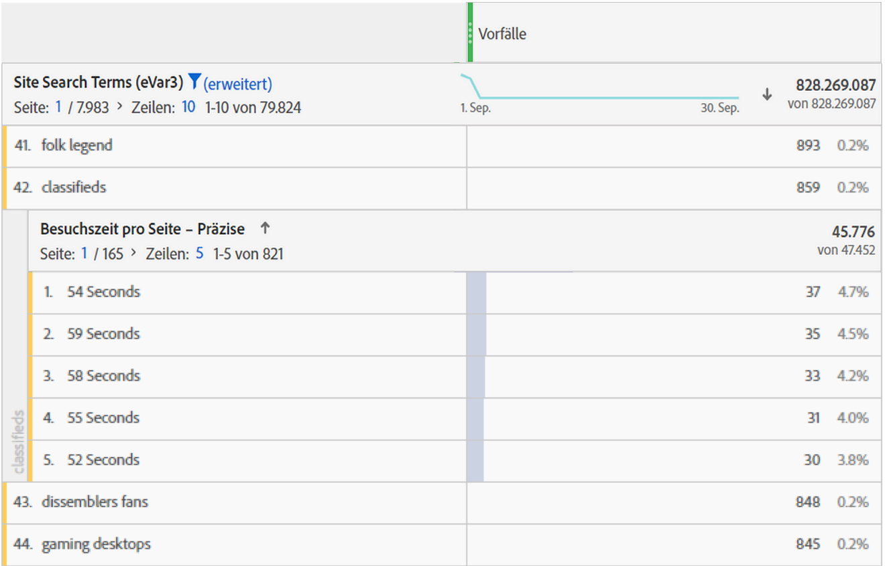
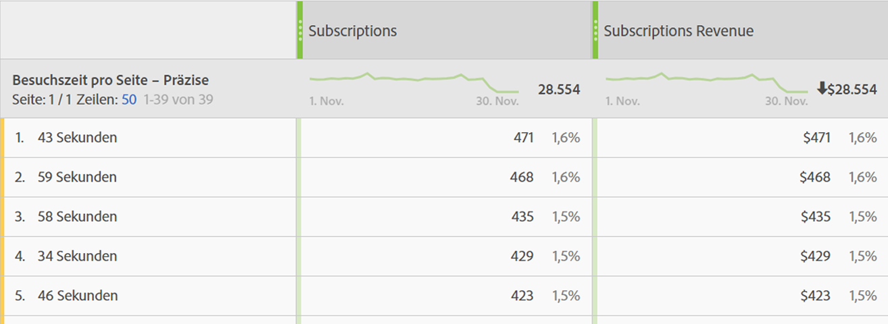

# Besuchszeit – Übersicht

Für [!UICONTROL  Adobe Analytics-Produkte ] verschiedene [ (](overview.md)) und Dimensionen zur Verfügung. Auf dieser Seite können Sie die gewünschte Dimension oder Metrik, nach der Sie suchen, leichter identifizieren.

## Besuchszeit-Metriken

| Metrik | Definition | Verfügbar in |
|---|---|---|
| [[!UICONTROL Gesamtbesuchszeit in Sekunden]](total-seconds-spent.md) | Zeigt den Zeitraum an, über den Besucher insgesamt mit einem bestimmten Dimensionselement agieren. Enthält die Instanz eines Wertes sowie die Persistenz über alle folgenden Treffer hinweg. Bei Props wird die Besuchszeit auch über die nachfolgenden Verknüpfungsereignisse hinweg berechnet. | Analysis Workspace, Report Builder (als „Gesamtbesuchszeit“ bezeichnet), Data Warehouse |
| [[!UICONTROL Besuchszeit pro Besuch] (Sekunden)](time-spent-per-visit.md) | Ungefähr *Gesamtbesuchszeit in Sekunden / (Besuchs-Bounces)*  Stellt die durchschnittliche Zeit dar, die Besucherinnen und Besucher während jedes Besuchs mit einem bestimmten Dimensionselement interagieren. **Hinweis**: Diese Metrik kann nicht unabhängig berechnet werden, da der Nenner dieser Funktion eine interne Metrik ist. | Analysis Workspace |
| [[!UICONTROL Besuchszeit pro Besucher] (Sekunden)](time-spent-per-visitor.md) | Ungefähr *Gesamtbesuchszeit pro Unique Visitor*  Gibt die durchschnittliche Zeit an, die Besucherinnen und Besucher über die gesamte Lebensdauer ihres Besuchers mit einem bestimmten Dimensionselement interagieren (Länge ihres Cookies). **Hinweis**: Diese Metrik kann nicht unabhängig berechnet werden, da der Nenner dieser Funktion eine interne Metrik ist. | Analysis Workspace |
| [!UICONTROL Verbrachte Zeit/Benutzer (Status)] | Ungefähr *Gesamtbesuchszeit für Mobile Apps/Unique Mobile App Visitors*  Gibt die durchschnittliche Zeit an, die Besuchende von Mobile Apps mit einem bestimmten Dimensionselement über die Lebensdauer des Besuchers interagieren (Länge des Cookies). **Hinweis**: Diese Metrik kann nicht unabhängig berechnet werden, da der Nenner dieser Funktion eine interne Metrik ist. | Analysis Workspace |
| [[!UICONTROL Durchschnittliche Besuchszeit pro Site] (Sekunden)](average-time-on-site.md) | Stellt die gesamte Zeit dar, die Besucher pro Dimensionselement-Sequenz mit einem bestimmten Dimensionselement interagieren. Es ist nicht nur auf „Site“-Durchschnittswerte beschränkt, wie der Name schon sagt. Weitere Informationen über Sequenzen finden Sie im Bereich „Berechnung der Besuchszeit“. **Hinweis**: Diese Metrik unterscheidet sich auf der Dimensionselement-Ebene mit hoher Wahrscheinlichkeit von „Zeit pro Besuch“, da bei der Berechnung ein anderer Nenner verwendet wird. | Analysis Workspace, Report Builder (in Minuten angezeigt) |
| [[!UICONTROL Durchschnittliche Besuchszeit pro Site]](average-time-on-site.md) | Dies ist dieselbe Metrik wie *Durchschnittliche auf der Site verbrachte Zeit (Sekunden)* mit unterschiedlicher Zeitformatierung (`hh:mm:ss`) | Analysis Workspace |
| [!UICONTROL Durchschnittliche Besuchszeit pro Site] | Veraltete Metrik.  empfiehlt Adobe stattdessen die Verwendung von [[!UICONTROL Durchschnittliche Besuchszeit pro Site]](average-time-on-site.md), wenn die durchschnittliche Besuchszeit für ein Dimensionselement erforderlich ist. | Report Builder (wenn sich eine Dimension in der Anforderung befindet) |

## Besuchszeit-Dimensionen

| Dimension | Definition | Verfügbar in |
| --- | --- | --- |
| [[!UICONTROL Zeit pro Besuch – präzise]](../dimensions/time-spent-per-visit.md) | Die gesamte bei einem Besuch verbrachte Zeit, die auf die nächste Sekunde gekürzt und auf alle Treffer angewendet wird, die Teil des Besuchs waren. Es handelt sich um eine Dimension auf Besuchsebene. | Analysis Workspace |
| [[!UICONTROL Zeit pro Besuch – zusammengefasst]](../dimensions/time-spent-per-visit.md) | Die präzise Dimension, die in 9 verschiedene Bereiche zusammengefasst wird. Es handelt sich um eine Dimension auf Besuchsebene. Die Bereiche sind:<ul><li>Weniger als 1 Minute</li><li>1–5 Minuten</li><li>5–10 Minuten</li><li>10–30 Minuten</li><li>30–60 Minuten</li><li>1–2 Stunden</li><li>2–5 Stunden</li><li>5–10 Stunden</li><li>10–15 Stunden</li></ul>**Anmerkung**: Längere Zeiträume können nicht erfasst werden, da ein Besuch nach einer Aktivitätsdauer von 12 Stunden abläuft. | Analysis Workspace, Report Builder |
| [[!UICONTROL Besuchszeit pro Seite – präzise]](../dimensions/time-spent-on-page.md) | Die gesamte bei einem Treffer verbrachte Zeit, gekürzt auf die letzte ganze Sekunde. Hierbei handelt es sich um eine Dimension auf Trefferebene, die sowohl Seitenansichten als auch Verknüpfungs-Ereignisse enthält. Trotz seines Namens ist er nicht auf die Dimension „Seite“ beschränkt. | Analysis Workspace |
| [[!UICONTROL Besuchszeit pro Seite – zusammengefasst]](../dimensions/time-spent-on-page.md) | Die präzise Dimension, die in 10 verschiedene Bereiche zusammengefasst wird; die zusammengefasste Dimension zählt jedoch nur Seitenansichten (und schließt Verknüpfungs-Ereignisse aus). Es handelt sich um eine Dimension auf Trefferebene. Die Bereiche sind:<ul><li>weniger als 15 Sekunden</li><li>15–29 Sekunden</li><li>30–59 Sekunden</li><li>1–3 Minuten</li><li>3–5 Minuten</li><li>5–10 Minuten</li><li>10–15 Minuten</li><li>15–20 Minuten</li><li>20–30 Minuten</li><li>Mehr als 30 Minuten</li></ul> | Analysis Workspace |

## Berechnung der Besuchszeit

Adobe Analytics verwendet explizite Werte (einschließlich Link-Ereignisse und Videoansichten) zur Berechnung der Besuchszeit.

>[!NOTE]
>
>Ohne Verknüpfungsereignisse wie [!UICONTROL Videoaufrufe] oder [!UICONTROL Exitlinks] kann die Besuchszeit für den letzten Treffer eines Besuchs nicht ermittelt werden. Aus ähnlichen Gründen wird [!UICONTROL Absprung-Besuchen] (d. h. Besuchen mit einem einzelnen Treffer) keine Besuchszeit zugewiesen.

Der **Zähler** ist in allen Besuchszeit-Berechnungen die Gesamtbesuchszeit in Sekunden.

Der **Nenner** ist in Adobe Analytics nicht als separate Metrik verfügbar. Bei Besuchszeit-Metriken auf Trefferebene besteht der Nenner in Sequenzen. Eine Sequenz ist ein Satz aufeinanderfolgender Treffer, in dem eine beliebige Variable denselben Wert enthält (egal, ob festgelegt, nach vorne verteilt oder permanent gespeichert). „Nach vorne verteilt“ bezieht sich auf die Persistenz von Eigenschaften zwischen Seitenansichten (d. h. über aufeinanderfolgende Verknüpfungs-Ereignisse hinweg). Dies dient der Berechnung der Besuchszeit.

* Zum Beispiel ist der Nenner im Falle des [!UICONTROL Seitennamens] oder einer anderen Dimension auf der Trefferebene vor allem [!UICONTROL Instanzen] oder [!UICONTROL Seitenansichten], für die ein Neuladen und nicht festgelegte Werte (z. B. Verknüpfungs-Ereignisse) jedoch als einzelne Interaktion (eine Sequenz) gezählt werden.

* Treffer mit Absprung und Ausstieg werden auch aus dem Nenner entfernt, da die Besuchszeit nicht ermittelt werden kann.

## Häufig gestellte Fragen (FAQ)

+++Können alle Metriken des Typs „Aufgewendete Zeit“ auf eine beliebige Dimension angewendet werden?

Die Metriken „Aufgewendete Zeit“, die auf jede Dimension angewendet werden können, sind:

* [[!UICONTROL Gesamtbesuchszeit in Sekunden]](total-seconds-spent.md)

* [[!UICONTROL Zeit pro Besuch] (Sekunden)](time-spent-per-visit.md)

* [[!UICONTROL Besuchszeit pro Besucher] (Sekunden)](time-spent-per-visitor.md)

* [[!UICONTROL Durchschnittliche Besuchszeit pro Site] (Sekunden)](average-time-on-site.md)

+++

+++Welche Besuchszeitdimension wird am besten bei Aufschlüsselungen mit anderen Dimensionen verwendet?

Die Dimension [[!UICONTROL Besuchszeit pro Seite - ]](../dimensions/time-spent-on-page.md)) ist eine Dimension auf Trefferebene. Wenn Sie diese Dimension anhand einer anderen Dimension aufschlüsseln, können Sie die Sekunden ermitteln, über die sich ein Treffer erstreckt hat, von dem auch die Aufschlüsselungsdimension betroffen war.
Im folgenden Beispiel ist der Suchbegriff „classifieds“ mit Trefferzeiten von 54 Sekunden, 59 Sekunden usw. verknüpft, was möglicherweise darauf hinweist, dass Besuchende Zeit damit verbringen, für diesen Begriff zurückgegebene Inhalte zu lesen.

+++

+++Welche Metrik eignet sich für die Dimension [!UICONTROL Besuchszeit pro Seite - granular]?

Jede beliebige Metrik. Die Dimension zeigt die Besuchszeit für den Treffer an, bei dem es zu dem Ereignis kam. Eine längere Besuchszeit bedeutet, dass ein Besucher mehr Zeit auf einer Seite (Treffer) verbracht hat, auf der es zu dem Ereignis kam.

+++

+++Wie unterscheidet sich [!UICONTROL Durchschnittliche Besuchszeit pro Site] von [!UICONTROL Besuchszeit pro Besuch]?

Der Unterschied ist der in der Metrik verwendete Nenner:

* [[!UICONTROL Durchschnittliche Besuchszeit pro Site]](average-time-on-site.md) verwendet die Sequenzen, die ein Dimensionselement enthalten.

* [[!UICONTROL Besuchsdauer pro Besuch]](time-spent-per-visit.md) verwendet die Besuchsanzahl.

Daher können diese Metriken auf Besuchsebene ähnliche Ergebnisse erzielen, auf Trefferebene sind sie jedoch anders.

+++

+++Warum stimmen die Aufschlüsselungssummen mit [!UICONTROL Durchschnittliche Besuchszeit pro Site] nicht mit dem übergeordneten Zeileneintrag überein?

Da [!UICONTROL Durchschnittliche Besuchszeit pro Site] von ununterbrochenen Sequenzen einer Dimension abhängt und der innere Bericht bei der Berechnung dieser Ausführungen nicht vom äußeren Bericht abhängt.

Betrachten Sie beispielsweise den folgenden Besuch.

| Treffer # | 1 | 2 | 3 |
|---|---|---|---|
| **Besuchszeit in Sekunden** | 30 | 100 | 10 |
| **Seitenname** | Startseite | Produkt | Startseite |
| **Datum** | 1. Januar | 1. Januar | 1. Januar |

Bei der Berechnung der Besuchszeit für die Startseite würde die Rechnung (30+10)/2=20 lauten, aber eine Aufschlüsselung nach Tag würde (30+10)/1=40 ergeben, da am 1. Januar ein einziger ununterbrochenen Durchlauf erfolgte.

Daher können diese Metriken auf Besuchsebene ähnliche Ergebnisse erzielen, auf Trefferebene sind sie jedoch anders.

+++

## Beispiele für die Berechnung der [!UICONTROL Besuchszeit]

Angenommen, der folgende Satz von Server-Aufrufen gilt für einen einzigen Besucher mit einem einzigen Besuch:

| Besuch – Trefferanzahl | 1 | 2 | 3 | 4 | 5 | 6 | 7 |
|---|---|---|---|---|---|---|---|
| **Besuch – vergangene Zeit (in Sek.)** | 0 | 30 | 80 | 180 | 190 | 230 | 290 |
| **Besuchszeit in Sekunden** | 30 | 50 | 100 | 10 | 40 | 60 | – |
| **Treffertyp** | Seite | Link | Seite | Seite | Seite | Seite | Seite |
| **Seitenname** | Startseite | – | Produkt | Startseite | Startseite (neu laden) | Korb | Bestellungsbestätigung |
|  |  |  |  |  |  |  |  |
| **prop1** | A (festgelegt) | A (nach vorne verteilt) | nicht festgelegt | B (festgelegt) | B (festgelegt) | A (Set) | C (festgelegt) |
| **prop1 – Besuchszeit in Sekunden** | 30 | 50 | – | 10 | 40 | 60 | – |
|  |  |  |  |  |  |  |  |
| **eVar1** | Rot (festgelegt) | Rot (beibehalten) | (abgelaufen) | Blau (festgelegt) | Blau (festgelegt) | Blau (beibehalten) | Rot (festgelegt) |
| **eVar1 – Besuchszeit in Sekunden** | 30 | 50 | – | 10 | 40 | 60 | – |

Basierend auf der obigen Tabelle werden Besuchszeitmetriken wie folgt berechnet:

| prop1 | Gesamtbesuchszeit in Sekunden | Zeit pro Besuch | Besuchszeit pro Besucher | Sequenzanzahl | Durchschnittliche Besuchszeit pro Site |
|---|---|---|---|---|---|
| A | 30 + 50 + 60 = 140 | 140 / 1 = 140 | 140 / 1 = 140 | 2 | 140 / 2 = 70 |
| B | 10 + 40 = 50 | 50 / 1 = 50 | 50 / 1 = 50 | 1 | 50 / 1 = 50 |
| C | 0 | 0 | 0 | 0 | 0 |
| Nicht zugewiesene Zeit | 100 | – | – | – | – |

| eVar1 | Gesamtbesuchszeit in Sekunden | Zeit pro Besuch | Besuchszeit pro Besucher | Sequenzanzahl | Durchschnittliche Besuchszeit pro Site |
|---|---|---|---|---|---|
| Rot | 30 + 50 = 80 | 80 / 1 = 80 | 80 / 1 = 80 | 1 | 80 / 1 = 80 |
| Blau | 10 + 40 + 60 = 110 | 110 / 1 = 110 | 110 / 1 = 110 | 1 | 110 / 1 = 110 |
| Nicht zugewiesene Zeit | 100 | – | – | – | – |

Zeit pro Besuch (präzise): 290
Besuchszeit pro Seite (präzise): 10, 30, 40, 50, 60, 100

Einige zusätzliche Hinweise, um das Beispiel deutlicher zu machen:

* Alle Besuchszeitberechnungen basieren auf „Besuch – vergangene Zeit“. Dieser Wert beginnt beim ersten Treffer des Besuchs bei null.

* „Verbrachte Sekunden“ ist die Differenz zwischen dem Zeitstempel des aktuellen Treffers und dem Zeitstempel des nächsten Treffers. Aus diesem Grund gibt es für den letzten Treffer des Besuchs (sowie die Absprünge) keine Besuchszeit.

* Eine „Sequenz“ ist ein aufeinander folgender Satz von Treffern, bei denen eine bestimmte Variable denselben Wert enthält (sei es durch Festlegung, Ausdehnung nach vorne oder durch Beibehaltung). Beispiel: prop1 „A“ hat zwei Sequenzen: Treffer 1 und 2 und Treffer 6. Werte des letzten Treffers eines Besuchs beginnen keine neue Sequenz, da es für den letzten Treffer keine Besuchszeit gibt. „Durchschnittliche Besuchszeit pro Site“ verwendet Sequenzen im Nenner.

   * Nur für die Zwecke der aufgewendeten Zeit werden Props von Seitenaufrufen zu nachfolgenden Linktreffern „vorwärts gestreut“, wie oben für prop1 auf Treffer 2 gezeigt. Dadurch kann der Wert, der für prop1 bei Treffer 1 („A„) festgelegt wurde, die bei Treffer 2 verbrachte Zeit kumulieren.

   * eVars sammeln die Besuchszeit für jeden Treffer, bei dem der eVar festgelegt oder permanent gespeichert ist. Die eVar-Persistenz wird durch die eVar-Einstellungen unter „Analytics > „Admin“ definiert.
