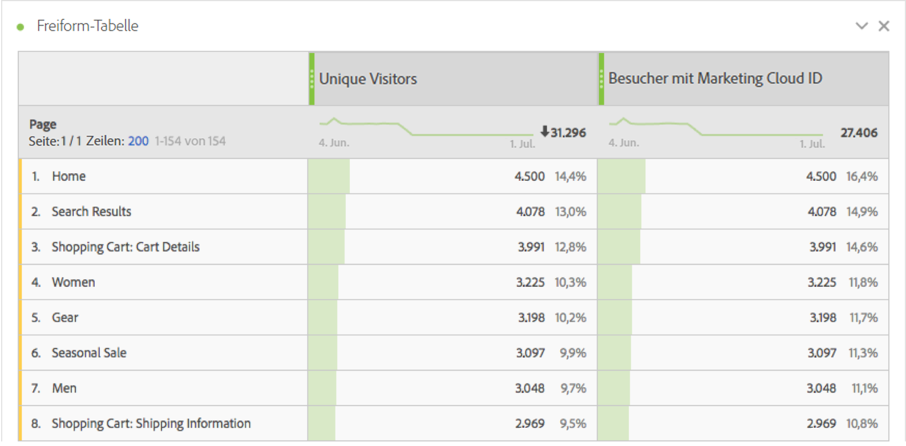
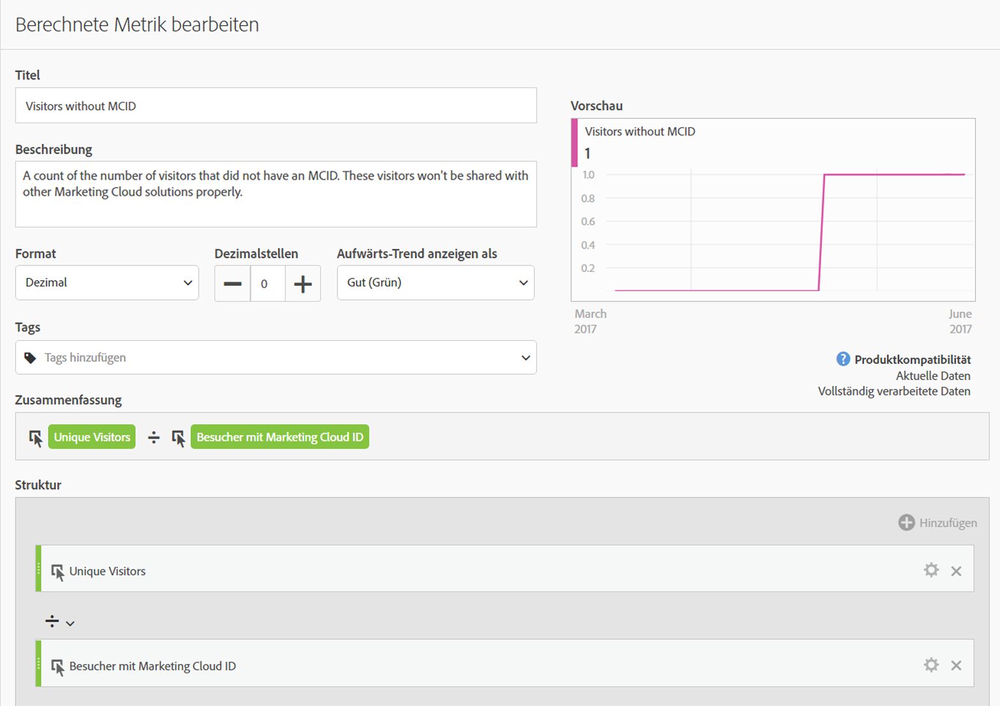
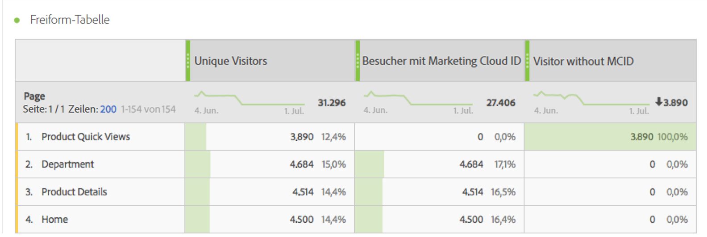

# Besucher mit Experience Cloud ID

Die [Metrik[!UICONTROL Besucher mit Experience Cloud-ID] gibt ](overview.md) Anzahl der Unique Visitors an, die von Adobe mit einer ECID identifiziert wurden (mithilfe des [Besucher-ID-](https://experienceleague.adobe.com/de/docs/id-service/using/home) oder [Experience Platform Identity Service](https://experienceleague.adobe.com/de/docs/experience-platform/identity/home)). Sie können diese Metrik mit der Metrik [Unique Visitors](unique-visitors.md) vergleichen, um sicherzustellen, dass die Mehrheit der Besucher Ihrer Site eine ECID verwendet. Wenn ein großer Teil der Besucher diese Kennung nicht verwendet, kann dies auf ein Problem innerhalb Ihrer Implementierung hinweisen.

>[!NOTE]
>
>Diese Metrik ist besonders wichtig für das Debugging, wenn Sie mehrere CX Enterprise-Services verwenden, z. B. Adobe Target oder Adobe Audience Manager. Segmente, die für alle CX Enterprise-Produkte freigegeben sind, enthalten keine Besucher ohne ECID.

## Berechnung dieser Metrik

Diese Metrik basiert auf der Metrik [Unique Visitors](unique-visitors.md), mit der Ausnahme, dass sie nur die mit der `mid`-Abfragezeichenfolge identifizierten Personen enthält (basierend auf dem [`s_ecid`](https://experienceleague.adobe.com/en/docs/core-services/interface/data-collection/cookies/analytics)-Cookie).

## Debuggen des ECID-Setups

Die Metrik [!UICONTROL Besucher mit Experience Cloud-ID]&quot; kann bei der Fehlerbehebung bei CX Enterprise-Integrationen oder bei der Identifizierung von Bereichen Ihrer Site nützlich sein, die nicht über den Besucher-ID-Service oder Experience Platform Identity Service verfügen.

Ziehen Sie &quot;[!UICONTROL Besucher mit Experience Cloud ID]&quot; nebeneinander mit „Unique Visitors“, um sie zu vergleichen:

Beachten Sie in diesem Beispiel, dass jede Seite dieselbe Anzahl von &quot;[!UICONTROL Unique Visitors“ ] &quot;[!UICONTROL Visitors with Experience Cloud ID]&quot; aufweist. Die Gesamtzahl der &quot;[!UICONTROL Unique Visitors]&quot; ist jedoch größer als die Gesamtzahl der &quot;[!UICONTROL Visitors mit Experience Cloud ID]&quot;. Sie können eine [berechnete Metrik](../calculated-metrics/cm-overview.md) erstellen, um mithilfe der folgenden Definition herauszufinden, welche Seiten keine ECID verwenden:

Durch Hinzufügen der berechneten Metrik zum Bericht können Sie den Seitenbericht so sortieren, dass die Seiten mit der höchsten Besucherzahl ohne ECID angezeigt werden:

Beachten Sie, dass das Dimensionselement „Produktschnellansichten“ mit einer ECID nicht ordnungsgemäß implementiert ist. Sie können mit entsprechenden Teams in Ihrem Unternehmen zusammenarbeiten, um diese Seiten so schnell wie möglich zu aktualisieren. Sie können einen ähnlichen Bericht mit einer beliebigen Dimension wie [Browser-Typ](../dimensions/browser-type.md), [Website-Bereich](../dimensions/site-section.md) oder einer beliebigen [eVar](../dimensions/evar.md) erstellen.
