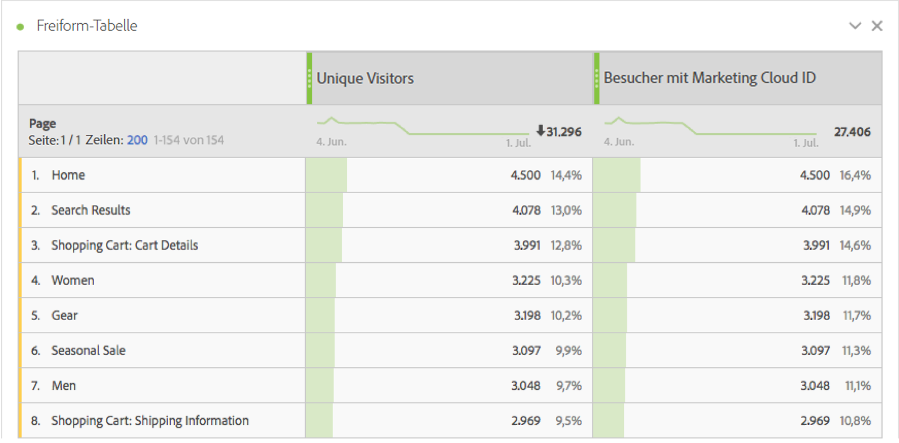
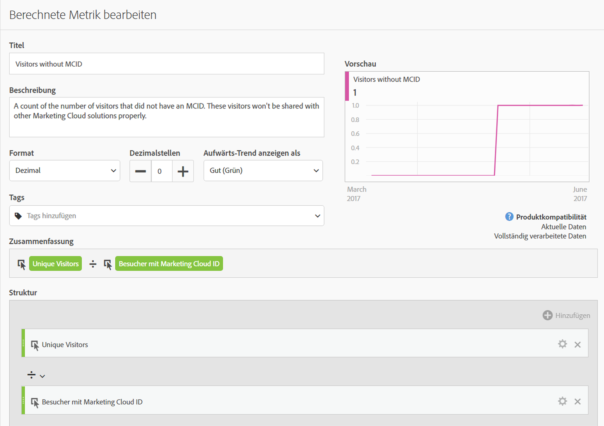

# Besucher mit Experience Cloud ID

Die Metrik &quot;Besucher mit Experience Cloud-ID&quot;zeigt die Anzahl der eindeutigen Besucher an, die von Adobe mithilfe des [Experience Cloud-ID-Diensts](https://docs.adobe.com/content/help/de-DE/id-service/using/home.html)identifiziert wurden. Diese Dimension ist hilfreich, um mit der Metrik &quot; [Individuelle Besucher](unique-visitors.md) &quot;zu vergleichen, um sicherzustellen, dass die Mehrzahl der Besucher Ihrer Site den ID-Dienst verwendet. Wenn ein Großteil der Besucher die ID-Dienst-Cookies nicht verwendet, kann dies auf ein Problem in Ihrer Implementierung hindeuten.

>[!NOTE]
>
>Diese Metrik ist besonders wichtig für das Debugging, wenn Sie mehrere Experience Cloud-Dienste wie Adobe Target oder Adobe Audience Manager verwenden. Segmente, die für Experience Cloud-Produkte freigegeben wurden, enthalten keine Besucher ohne Experience Cloud-ID.

## Berechnung dieser Metrik

Diese Metrik basiert auf der Metrik &quot; [Individuelle Besucher](unique-visitors.md) &quot;, mit der Ausnahme, dass sie nur die mit der `mid` Abfrage-Zeichenfolge identifizierten Personen enthält (basierend auf dem [`s_ecid`](https://docs.adobe.com/content/help/de-DE/core-services/interface/ec-cookies/cookies-analytics.html) Cookie).

## Debugging der Experience Cloud-ID-Einrichtung

Die Metrik &quot;Besucher mit Experience Cloud-ID&quot;kann bei der Fehlerbehebung von Experience Cloud-Integrationen oder bei der Identifizierung von Bereichen Ihrer Site hilfreich sein, in denen der ID-Dienst nicht bereitgestellt ist.

Ziehen Sie die &quot;Besucher mit Experience Cloud-ID&quot;nebeneinander mit &quot;Individuelle Besucher&quot;, um sie zu vergleichen:

Beachten Sie in diesem Beispiel, dass jede Seite dieselbe Anzahl von &quot;Individuellen Besuchern&quot;hat wie &quot;Besucher mit Experience Cloud-ID&quot;. Die Gesamtanzahl an Unique Visitors ist dabei größer als die Gesamtanzahl an Besuchern mit Experience Cloud ID. Sie können eine [berechnete Metrik](../c-calcmetrics/cm-overview.md) erstellen, um herauszufinden, welche Seiten den ID-Dienst nicht einrichten. Sie können die folgende Definition verwenden:

Wenn Sie die berechnete Metrik zum Bericht hinzufügen, können Sie den Seiten-Bericht so sortieren, dass die Seiten mit der größten Anzahl an Besuchern ohne MCID oben angezeigt werden:

Beachten Sie, dass das Dimensionselement &quot;Produktschnelle Ansichten&quot;nicht ordnungsgemäß mit dem Identitätsdienst implementiert ist. Sie können mit entsprechenden Teams in Ihrem Unternehmen zusammenarbeiten, um diese Seiten so schnell wie möglich zu aktualisieren. Sie können einen ähnlichen Bericht mit einer beliebigen Dimension wie [Browsertyp](../dimensions/browser-type.md), [Site-Abschnitt](../dimensions/site-section.md)oder einer beliebigen [eVar](../dimensions/evar.md)erstellen.
