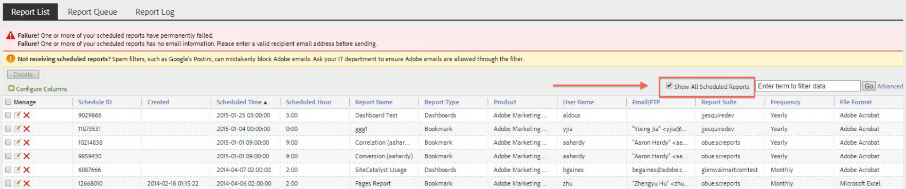
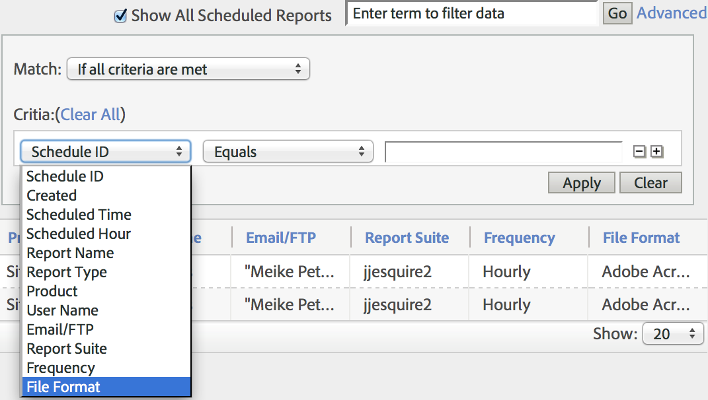
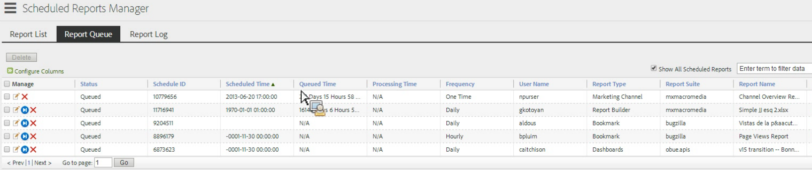
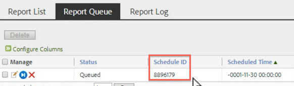

# Warteschlange für terminierte Berichte

Damit können Administratoren terminierte Berichte für die ganze Organisation anzeigen und verwalten.

**[!UICONTROL Analytics]** > **[!UICONTROL Komponenten]** > **[!UICONTROL Alle Komponenten]** > **[!UICONTROL Geplante Berichte]**

Zu den Admin-spezifischen Fähigkeiten des Managers für terminierte Berichte gehören:

* Die Option [Alle terminierten Berichte anzeigen](/help/components/scheduled-reports-admin.md#section_3F167CAAEEC24140B476CF95B7402690) in Ihrer Organisation.
* [Erweiterte Filterfunktionen](/help/components/scheduled-reports-admin.md#section_206A52A85DE84947AAB3AD082FBF6275) in Ihrer gesamten Organisation.
* Die neue Registerkarte [Berichtswarteschlange](/help/components/scheduled-reports-admin.md#section_03C866115D354BB182E90BF4D52F1E0B) mit allen Berichten, die auf Reporting-Servern zur Ausführung in die Warteschlange gestellt werden.
* Anzeigen der [Zeitplan-ID](/help/components/scheduled-reports-admin.md#section_568B70F4228C4229977CB85D2DCD53A1) in der Benutzeroberfläche der Berichtwarteschlange.

## Alle terminierten Berichte anzeigen {#section_3F167CAAEEC24140B476CF95B7402690}

Auf der Registerkarte **[!UICONTROL Berichtsliste]** können Sie neben den von Ihnen terminierten Berichten mit der Option **[!UICONTROL Alle terminierten Berichte anzeigen]** alle terminierten Berichte in Ihrer Organisation anzeigen.

>[!NOTE]
>
>Die Spalte **[!UICONTROL Berichtsname]** zeigt den Namen des terminierten Berichts an, und die Spalte **[!UICONTROL Dateiname]** zeigt benutzerdefinierte Dateinamen an, die Sie unter „Erweiterte Bereitstellungsoptionen“ festgelegt haben. Wenn Sie also mehrere Berichte desselben Berichtstyps planen und für jeden Bericht benutzerdefinierte Namen angeben, zeigt der Manager für terminierte Berichte mehrere Einträge mit demselben Berichtsnamen, aber mit unterschiedlichen Dateinamen an. Dies liegt daran, dass der geplante Back-End-Bericht identisch ist, sodass die Spalte Berichtsname für alle außer den benutzerdefinierten Dateinamen (als festgelegt) dieselben Berichtsnamen enthält.

## Erweiterte Filterfunktionen {#section_206A52A85DE84947AAB3AD082FBF6275}

Beispiel: Wenn Sie nach allen Berichten filtern möchten, die für die stündliche Ausführung geplant sind, geben Sie **[!UICONTROL Häufigkeit = Stündlich]** in den Filter **[!UICONTROL Erweitert]** ein und klicken Sie auf **[!UICONTROL Übernehmen]**:

## Berichtwarteschlange {#section_03C866115D354BB182E90BF4D52F1E0B}

Mit dieser Warteschlange können Sie alle terminierten Berichte verwalten und möglicherweise löschen, die die Warteschlange „verstopfen“. (In der Regel tritt bei Berichten eine Zeitüberschreitung nach 4 Stunden auf.)

Die Berichtswarteschlange bietet außerdem die Möglichkeit, „einen terminierten Bericht einmal zu überspringen“. Klicken Sie einfach auf das blaue Symbol in der Spalte **[!UICONTROL Verwalten]**.

## Zeitplan-ID {#section_568B70F4228C4229977CB85D2DCD53A1}

Die **[!UICONTROL Zeitplan-ID]** wird in der Benutzeroberfläche der Berichtwarteschlange angezeigt, falls Sie die Kundenunterstützung von Adobe kontaktieren müssen, um ein Problem mit terminierten Berichten zu lösen.

