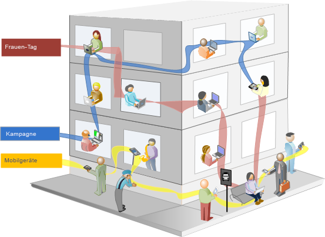
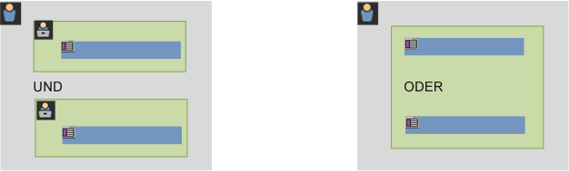
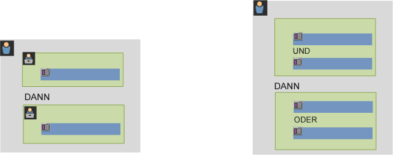

# Informationen zu Segmenten

Mit Segmenten können Sie Besucherteilmengen anhand von Merkmalen oder Website-Interaktionen identifizieren. Segmente sind als Zielgruppenerkenntnisse konzipiert, die Sie für Ihre spezifischen Anforderungen aufbauen und dann prüfen, bearbeiten und mit anderen Team-Mitgliedern teilen oder in anderen Adobe-Produkten und Analytics-Funktionen verwenden können.

Segmente basieren auf einer [!UICONTROL Besucher-], [!UICONTROL Besuchs-] und [!UICONTROL Treffer]-Ebenenhierachie, wobei ein verschachteltes Container-Modell verwendet wird. Mit verschachtelten Containern können Sie Besucherattribute definieren sowie Aktionen, die auf Regeln zwischen den Containern und innerhalb der Container basieren. Analytics-Segmente können in der Adobe CX Enterprise erstellt, genehmigt, freigegeben, gespeichert und für mehrere Produkte und Funktionen ausgeführt werden. Segmente können aus einem Bericht generiert, in einem Dashboard-Bericht erstellt oder für den schnellen Zugriff mit einem Lesezeichen versehen werden.

Sie können Segmente im Segment Builder erstellen und speichern oder aus einem Fallout-Bericht (in [!UICONTROL Analysis Workspace]) generieren. Sie können auch vorgefertigte Segmente verwenden und erweitern, die auf bestimmten Regeln zwischen verschachtelten Containern basieren. Diese ermöglichen das Filtern von Ergebnissen und können auf Berichte angewendet werden. Darüber hinaus können Segmente zusammen als [gestapelte Segmente](/help/components/segmentation/segmentation-workflow/seg-workflow.md) verwendet werden.

Segmente identifizieren

- wer Ihre Besuchenden sind (Land, Geschlecht, Café),
- welche Geräte und Dienste sie verwenden (Browser, Suchmaschine, Mobilgerät),
- von wo aus sie kamen (Suchmaschine, vorherige Exitpage, natürliche Suche),
- und vieles mehr.

<!---->

Segmente können auf folgenden Werten basieren:

- Auf Attributen basierende Besuchende: Browser-Typ, Gerät, Anzahl der Besuche, Land, Geschlecht.
- Auf Interaktionen basierende Besuchende: Kampagnen, Keyword-Suche, Suchmaschine.
- Auf Ausstiegen und Eintritten basierende Besuchende: Besuchendevon Facebook, einer bestimmten Landingpage, Referrer-Domain.
- Auf benutzerdefinierten Variablen basierende Benutzer: Formularfeld, definierte Kategorien, Kunden-ID.

Beim Erstellen von Zielgruppensegmenten im Segment Builder definieren Sie Bedingungen unter Verwendung der Operatoren [!UICONTROL UND] und [!UICONTROL ODER] zwischen Containern.

<table style="table-layout:fixed; border: none;">

<tr>

<td style="background-color: #E5E4E2;" colspan="3" width="200" height="100"> Besucher</td>
</tr>

<tr>
<td style="background-color: #E5E4E2;" width="200"></td>
<td style="background-color: #D3D3D3;" colspan="2" width="200" height="100"> Besuche</td>
</tr>

<tr>
<td style="background-color: #E5E4E2;" width="200" height="100"></td>
<td style="background-color: #D3D3D3;" width="200" height="100"></td>
<td style="background-color: #C0C0C0;" width="200" height="100" colspan="1"> Treffer</td>
</tr>

<tr>
<td style="background-color: #E5E4E2;"></td><td colspan="2">UND</td></td>
</tr>

<tr>
<td style="background-color: #E5E4E2;" width="200"></td>
<td style="background-color: #D3D3D3;" colspan="2" width="200" height="100"> Besuche</td>
</tr>

<tr>
<td style="background-color: #E5E4E2;" width="200" height="100"></td>
<td style="background-color: #D3D3D3;" width="200" height="100"></td>
<td style="background-color: #C0C0C0;" width="200" height="100" colspan="1"> Treffer</td>
</tr>
</table>

<table style="table-layout:fixed; border: none;">

<tr>

<td style="background-color: #E5E4E2;" colspan="3" width="200" height="100"> Besucher</td>
</tr>

<tr>
<td style="background-color: #E5E4E2;" width="200"></td>
<td style="background-color: #D3D3D3;" colspan="2" width="200" height="100"> Besuche</td>
</tr>

<tr>
<td style="background-color: #E5E4E2;" width="200" height="100"></td>
<td style="background-color: #D3D3D3;" width="200" height="100"></td>
<td style="background-color: #C0C0C0;" width="200" height="100" colspan="1"> Treffer</td>
</tr>

<tr>
<td style="background-color: #E5E4E2;"></td><td colspan="2">ODER</td></td>
</tr>

<tr>
<td style="background-color: #E5E4E2;" width="200"></td>
<td style="background-color: #D3D3D3;" colspan="2" width="200" height="100"> Besuche</td>
</tr>

<tr>
<td style="background-color: #E5E4E2;" width="200" height="100"></td>
<td style="background-color: #D3D3D3;" width="200" height="100"></td>
<td style="background-color: #C0C0C0;" width="200" height="100" colspan="1"> Treffer</td>
</tr>
</table>

<!---->

Dieser Segmenttyp filtert Datensätze auf der Grundlage von Merkmalen, die mit den Operatoren [!UICONTROL UND] bzw. [!UICONTROL ODER] verbunden werden.

- Sie können [mehrere Segmente auf einen Bericht oder ein Projekt anwenden](/help/components/segmentation/segmentation-workflow/t-seg-apply.md).
- Alle Segmente gelten nun für alle Report Suites.
- Der [Segment Builder](/help/components/segmentation/segmentation-workflow/seg-build.md) vereinfacht das Erstellen von Segmenten.
- Der neue [Segment-Manager](/help/components/segmentation/segmentation-workflow/seg-manage.md) ermöglicht die Einrichtung von [Workflows](/help/components/segmentation/segmentation-workflow/seg-workflow.md) und bietet Funktionen zum Freigeben, Taggen, Prüfen und Genehmigen.
- Sie können Segmente zum Organisieren und Suchen [taggen](/help/components/segmentation/segmentation-workflow/seg-tag.md), anstatt Ordner zu verwenden.
- Sie können [sequenzielle Segmente](/help/components/segmentation/segmentation-workflow/seg-sequential-build.md) erstellen.
- Der Container [!UICONTROL Seitenansicht] wurde in den Container [!UICONTROL Treffer] umbenannt, da er alle Datentypen und nicht nur Seitenaufrufe segmentiert. Linktracking-Aufrufe und Tracking-Aktionsaufrufe aus den Mobile-SDKs werden beispielsweise durch den Treffer-Container vollständig ein- oder ausgeschlossen.

## Segmentierung in Analysis Workspace

Analysis Workspace umfasst die folgenden zusätzlichen Funktionen:

- Sie können [Segmente vergleichen](../../analyze/analysis-workspace/c-panels/c-segment-comparison/segment-comparison.md).
- Verwenden Sie Segmente als Dimensionen in Visualisierungen vom Typ „Freiformtabelle“.
- Verwenden Sie Segmente in der [Fallout-Analyse](../../analyze/analysis-workspace/visualizations/fallout/compare-segments-fallout.md).

## Data Warehouse-Kompatibilität

Nicht alle Segmentfunktionen sind mit Data Warehouse kompatibel. Bestimmte Segmentstrukturen und -dimensionen werden nicht unterstützt und Segmente, die sie verwenden, werden beim Erstellen einer Data Warehouse-Anfrage nicht angezeigt. Eine vollständige Liste der unterstützten und nicht unterstützten Funktionen finden Sie unter [Segmentkompatibilität mit Data Warehouse](/help/export/data-warehouse/segment-compatibility.md).

## Von Adobe bereitgestellte Segmente

Die Komponentenleiste links zeigt Segmente an, die von Ihnen und Ihrem Unternehmen erstellt wurden, sowie von Adobe bereitgestellte vorkonfigurierte Segmente. Wenn Sie auf **[!UICONTROL Alle anzeigen]** klicken, werden diese Segmente in der Regel unten in der Liste angezeigt und durch das Symbol  gekennzeichnet.

## Sequenzielle Segmente {#sequential}

Mit sequenziellen Segmenten können Sie Besuchende basierend auf ihrer Navigation und ihren Seitenansichten innerhalb Ihrer Site identifizieren und so ein Segment mit definierten Aktionen und Interaktionen erstellen. Mit sequenziellen Segmenten können Sie erkennen, was ein Besucher mag und was er meidet. Beim Erstellen sequenzieller Segmente wird der Operator [!UICONTROL THEN] eingesetzt, um die Navigation des Besuchers zu definieren und zu ordnen.

| Erster Besuch | Zweiter Besuch | Dritter Besuch |
|---|---|---|
| Beim ersten Besuch besuchte die Besucherin oder der Besucher die Haupt-Landingpage A, ignorierte die Kampagnenseite B und sah sich dann die Produktseite C an. | Beim zweiten Besuch besuchte die Besucherin oder der Besucher erneut die Haupt-Landingpage A, ignorierte die Kampagnenseite B, besuchte erneut die Produktseite C und dann eine neue Seite D. | Beim dritten Besuch betrat die Besucherin bzw. der Besucher die Site und folgte demselben Pfad wie beim ersten und zweiten Besuch. Anschließend ignorierte sie bzw. er die Seite F, um direkt zu einer gezielten Produktseite G zu wechseln. |

Sequenzielle Segmente können auf folgenden Trefferwerten basieren:

- Auf Sequenz der Seitentreffer basierende Besuchende: Seitenansichten bei einem einzelnen Besuch, Seitenansichten über unterschiedliche Besuche hinweg, Besuche, bei denen Seitenansichten ignoriert wurden.
- Auf der Zeit zwischen und nach Seitenansichten basierende Besuchende: nach einem Zeit-Limit, zwischen Treffern, nach einem Ereignis.

<table style="table-layout:fixed; border: none;">

<tr>

<td style="background-color: #E5E4E2;" colspan="3" width="200" height="100"> Besucher</td>
</tr>

<tr>
<td style="background-color: #E5E4E2;" width="200"></td>
<td style="background-color: #D3D3D3;" colspan="2" width="200" height="100"> Besuche</td>
</tr>

<tr>
<td style="background-color: #E5E4E2;" width="200" height="100"></td>
<td style="background-color: #D3D3D3;" width="200" height="100"></td>
<td style="background-color: #C0C0C0;" width="200" height="100" colspan="1"> Treffer</td>
</tr>

<tr>
<td style="background-color: #E5E4E2;"></td><td colspan="2">DANN</td></td>
</tr>

<tr>
<td style="background-color: #E5E4E2;" width="200"></td>
<td style="background-color: #D3D3D3;" colspan="2" width="200" height="100"> Besuche</td>
</tr>

<tr>
<td style="background-color: #E5E4E2;" width="200" height="100"></td>
<td style="background-color: #D3D3D3;" width="200" height="100"></td>
<td style="background-color: #C0C0C0;" width="200" height="100" colspan="1"> Treffer</td>
</tr>
</table>

<table style="table-layout:fixed; border: none;">

<tr>

<td style="background-color: #E5E4E2;" colspan="3" width="200" height="100"> Besucher</td>
</tr>

<tr>
<td style="background-color: #E5E4E2;" width="200"></td>
<td style="background-color: #D3D3D3;" colspan="2" width="200" height="100"> Besuche</td>
</tr>

<tr>
<td style="background-color: #E5E4E2;" width="200" height="100"></td>
<td style="background-color: #D3D3D3;" width="200" height="100"></td>
<td style="background-color: #C0C0C0;" width="200" height="100" colspan="1"> Treffer</td>
</tr>

<tr>
<td style="background-color: #E5E4E2;"></td><td style="background-color: #D3D3D3;"></td><td>UND</td></td>
</tr>

<tr>
<td style="background-color: #E5E4E2;" width="200" height="100"></td>
<td style="background-color: #D3D3D3;" width="200" height="100"></td>
<td style="background-color: #C0C0C0;" width="200" height="100" colspan="1"> Treffer</td>
</tr>

<tr>
<td style="background-color: #E5E4E2;"></td><td colspan="2">DANN</td></td>
</tr>

<tr>
<td style="background-color: #E5E4E2;" width="200"></td>
<td style="background-color: #D3D3D3;" colspan="2" width="200" height="100"> Besuche</td>
</tr>

<tr>
<td style="background-color: #E5E4E2;" width="200" height="100"></td>
<td style="background-color: #D3D3D3;" width="200" height="100"></td>
<td style="background-color: #C0C0C0;" width="200" height="100" colspan="1"> Treffer</td>

<tr>
<td style="background-color: #E5E4E2;"></td><td style="background-color: #D3D3D3;"></td><td>ODER</td></td>
</tr>

<tr>
<td style="background-color: #E5E4E2;" width="200" height="100"></td>
<td style="background-color: #D3D3D3;" width="200" height="100"></td>
<td style="background-color: #C0C0C0;" width="200" height="100" colspan="1"> Treffer</td>
</tr>
</tr>
</table>

<!---->

Ein sequenzielles Segment filtert Datensätze basierend auf Benutzeraktionen. Dazu wird der Operator [!UICONTROL DANN] verwendet.

## Video zur Segmentierung {#segment-video}

In diesem Video erhalten Sie einen kurzen Überblick darüber, was Segment-Container sind und wie Sie sie einsetzen können.

>[!BEGINSHADEBOX]

Unter  [Segment-Container](https://experienceleague.adobe.com/en/docs/analytics-learn/tutorials/components/segmentation/segment-containers){target="_blank"} finden Sie ein Demovideo.

>[!ENDSHADEBOX]

## Zugriffsberechtigung {#permissions}

+++ **Welche Rechte und Privilegien benötige ich, um Segmente zu verwenden, zu erstellen und zu verwalten?**

Standardmäßig können alle Benutzer persönliche Segmente erstellen und bearbeiten. Admins können jedoch entscheiden, wer über [Berechtigungen zum Erstellen von Segmenten](/help/admin/admin-console/home.md) verfügen soll und diese bestimmten Gruppen zuweisen. Diese Segmente können direkt für andere Analytics-Benutzer freigegeben werden.

Admins können jedes Segment bearbeiten und Segmente für Gruppen und alle Mitglieder der Organisation freigeben. [Segmentberechtigungen nach Rolle](/help/components/segmentation/seg-reference/seg-rights.md)

+++

+++ **Kann ich alle in meinem Unternehmen vorhandenen Segmente sehen?**

Ja, Administratoren können alle Segmente in der Benutzeroberfläche von Analysis Workspace sehen.

Report Builder zeigt Segmente an, die sich in Ihrem Besitz befinden, sowie Segmente, die für Sie freigegeben wurden.

+++

+++ **Kann ich im Segment-Manager alle Analytics-Segmente verwalten?**

Ja, alle Segmente können im Segment-Manager verwaltet werden. Der Segment-Manager zeigt Segmente an, die für die Inhaberin bzw. den Inhaber (die Person, die das Segment erstellt hat), freigegebene Benutzende und Admins sichtbar sind. Die Segmentauswahl zeigt Segmente an, die der Benutzerin bzw. dem Benutzer gehören, sowie solche, die für sie bzw. ihn freigegeben wurden.

Admins können alle Segmente in der Benutzeroberfläche von Analysis Workspace sehen.

Report Builder zeigt nur von Ihnen erstellte Segmente oder Segmente, die für Sie freigegeben wurden, an.

+++

+++ **Warum kann ich ein Segment nicht löschen?**

Wenn das Segment [in CX Enterprise veröffentlicht](/help/components/segmentation/segmentation-workflow/seg-workflow.md) wurde, können Sie das Segment nicht löschen oder bearbeiten. Sie können das Segment jedoch kopieren und die kopierte Version bearbeiten.

+++
