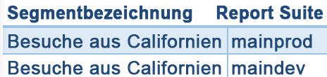
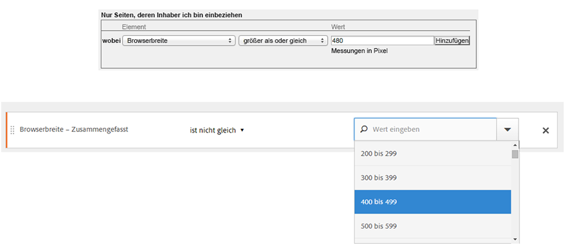

# Legacy-Segmente

In diesem Artikel werden häufig gestellte Fragen zu Best Practices für die Verwaltung veralteter Segmente beantwortet. Legacy-Segmente sind Segmente, die vor 2014 erstellt wurden.

## Verwalten veralteter Segmente {#legacy}

+++ **Was ist mit meinen vorhandenen Segmenten passiert?**

Die vorhandenen Segmente funktionieren weiterhin wie zuvor. Alle Berichte, auf die diese Segmente angewendet werden, funktionieren weiterhin ordnungsgemäß.

Die meisten vorherigen vordefinierten Segmente und Suite-Segmente werden als Segmentvorlagen in Segment Builder migriert. Segmentvorlagen werden verwendet, um schnell benutzerdefinierte Segmente mit gemeinsamen Zielgruppen zu erstellen. Segmentvorlagen können nicht direkt auf einen Bericht angewendet werden, sie können aber problemlos in einem benutzerdefinierten Segment gespeichert werden.

Segmentvorlagen sind im Segment Builder mit einem speziellen Symbol  gekennzeichnet.

+++

+++ **Was ist mit terminierten Berichten passiert, auf die Segmente angewendet sind?**

Terminierte Berichte werden weiterhin fehlerfrei mit den von Ihnen definierten Segmenten ausgeführt.

Wenn Sie ein Segment löschen, funktionieren terminierte Berichte und Dashboards, auf die dieses Segment angewendet wird, weiter normal, d. h., das Segment bzw. das Dashboard verwendet weiterhin das gelöschte Segment.

Terminierte Berichte werden nicht aktualisiert, wenn Sie ein Segment mit demselben Namen aktualisieren. Ein Beispiel: Angenommen, Sie haben 2 Segmente mit demselben Namen in unterschiedlichen Report Suites:

Sie verfügen über eine Visualisierung, die auf das Segment für die Report Suite **[!UICONTROL mainprod]** verweist. Dann löschen Sie das Segment, weil es sich um ein Duplikat handelt. Die Visualisierung wird fortgesetzt und verweist auf die Definition des gelöschten Segments. Wenn Sie die Segmentdefinition für das Hauptsegment ändern, um Catalina Island und Tijuana, Mexiko, einzuschließen, ändert sich das auf die Visualisierung angewendete Segment nicht und verwendet die alte Definition. Um die neue Definition zu verwenden, aktualisieren Sie die Visualisierung, um auf die neue Definition zu verweisen. Wenn Sie sich nicht sicher sind, ob eine Visualisierung, ein Projekt oder ein terminierter Bericht ein gelöschtes Segment verwendet, ändern Sie den Namen des verbleibenden Segments, um anzuzeigen, ob die Visualisierung das verbleibende Segment verwendet.

+++

+++ **Was ist mit Data Warehouse-Segmenten passiert?**

Alle vorhandenen Data Warehouse-Segmente funktionieren weiterhin in Data Warehouse. Die meisten Data Warehouse-Segmente funktionieren auch in anderen Komponenten wie Analysis Workspace.

Sie können neue Data Warehouse-Segmente im Segment Builder/Segment-Manager erstellen oder bearbeiten. Der Produktkompatibilitätsmechanismus in Segment Builder bestimmt automatisch, ob ein Segment mit Data Warehouse kompatibel ist.

+++

+++ **Was ist mit vorkonfigurierten Segmenten passiert?**

* **Einzelseitenbesuche**
* **Besuche von Mobilgeräten**
* **Besuche über eine kostenlose Suche**
* **Besuche über eine gebührenpflichtige Suche**
* **Besuche mit Besucher-ID-Cookie**

Diese Segmente werden als Segmentvorlagen in den Segment Builder migriert. Vorhandene Berichte, auf die diese Segmente angewendet wurden, funktionieren weiterhin fehlerfrei.

+++

+++ **Was ist mit Experience Cloud (Suite)-Segmenten passiert?**

* Nichtkäufer
* Käufern
* Erstbesuche
* Besuche von sozialen Netzwerken aus
* Besuche, die länger als 10 Minuten dauern*
* Besuche mit mehr als 5 vorherigen Besuchen*
* Besuche von Facebook*

Die meisten dieser Segmente (bis auf die mit einem Sternchen „*“ markierten) werden als Segmentvorlagen in Segment Builder migriert. Darüber hinaus wurden einige neue Segmente hinzugefügt.

Vorhandene Berichte, auf die diese Segmente angewendet wurden, funktionieren weiterhin fehlerfrei.

+++

+++ **Was ist mit Admin-Segmenten (auch bekannt als „globale“ Segmente) passiert?**

**Admin**-Segmente werden in die neue Segmentoberfläche migriert und als Segmente angezeigt, die für alle freigegeben sind.

Der Eigentümer dieser Segmente wird auf den Administrator mit dem ältesten Konto von Admin-Benutzern festgelegt. Alle Administratoren können diese Segmente jedoch löschen, bearbeiten und freigeben.

Die Segmentverwaltungsoberfläche der Admin Console, über die Administratoren diese globalen Segmente erstellen und verwalten konnten, gibt es nicht mehr. Administratoren sollten jetzt den neuen Segmentaufbau verwenden, um Segmente zu erstellen und für geeignete Gruppen, für alle oder für einzelne Personen freizugeben.

Vorhandene Segmente, die eine geänderte Logik wie in diesem Dokument beschrieben verwenden, funktionieren weiterhin ordnungsgemäß, obwohl die Segmente aktualisiert werden müssen, bevor sie erneut gespeichert werden können. Wenn Sie beispielsweise über ein vorhandenes Segment verfügen, in dem **[!UICONTROL US]** **[!UICONTROL enthält]** `New York`, funktioniert dieses Segment weiterhin ordnungsgemäß. Wenn Sie das nächste Mal das Segment bearbeiten, müssen Sie das Segment aktualisieren, um den Aufzählungstyp mit einer **[!UICONTROL gleich]**-Bedingung zu verwenden.

+++

+++ **Was mache ich mit doppelten Segmenten, die denselben Namen und unterschiedliche Definitionen haben?**
Nachdem Segmente jetzt von unterschiedlichen Report-Suites genutzt werden können, kann es vorkommen, dass Sie mehrere Segmente mit demselben Namen haben. Gehen Sie dazu folgendermaßen vor:

* Benennen Sie Segmente um, die denselben Namen, aber unterschiedliche Definitionen haben, oder
* Löschen Sie Segmente, die Sie nicht mehr benötigen.

+++

+++ **Was empfiehlt Adobe im Hinblick auf die Bereinigung von Segmenten?**

* Markieren Sie alle alten Segmente mit einem Tag.
* Überprüfen Sie all Ihre Segmente.
* Fügen Sie Ihre Segmente gegebenenfalls zu einer Segmentbibliothek hinzu.
* Genehmigen Sie vorschriftsmäßige Segmente.
* Markieren Sie Segmente gemäß den [Best Practices](/help/components/segmentation/segmentation-workflow/seg-workflow.md).

+++

### Tipps zur Migration

Die folgenden Tipps helfen Ihnen bei der Migration allgemeiner Dimensionen:

* Geo-Stadt/Region/Land – Suche nach und Auswahl bestimmter Städte, Regionen oder Länder, anstelle einer teilweisen Übereinstimmung.
* Browser - Verwenden Sie die Dimension Browser-Typen , um alle Browser in einen Typ zu bekommen, z. B. Google Chrome
* Betriebssysteme : Verwenden Sie die Dimensionen „Betriebssystemtypen“, um alle Betriebssysteme in einen Typ zu bekommen, z. B. Microsoft Windows.
* Siehe „Neue und umbenannte Dimensionen“ (siehe unten).

## Neue und umbenannte Dimensionen {#renamed}

Die folgende Tabelle enthält eine Liste der Dimensionen, die in Segment Builder umbenannt wurden.

| Neuer Dimensionsname | Vorheriger Name | Hinweise |
|--- |--- |--- |
| Betriebssystemtypen | Neu | Hinzugefügt im Frühling 2015. |
| Browser-Breite – zusammengefasst | Browser-Breite | Diese Dimension ist mit allen Benutzeroberflächen kompatibel und wird in eine Liste aufgezählter Bereiche, anstelle bestimmter Ganzzahlwerte unterteilt. Wenn Sie bestimmte Werte segmentieren müssen, verwenden Sie die granulare Version dieser Dimension in einem Data Warehouse-Segment. |
| Browser-Höhe – zusammengefasst | Browser-Höhe | Diese Dimension ist mit allen Benutzeroberflächen kompatibel und wird in eine Liste aufgezählter Bereiche, anstelle bestimmter Ganzzahlwerte unterteilt. Wenn Sie bestimmte Werte segmentieren müssen, verwenden Sie die granulare Version dieser Dimension in einem Data Warehouse-Segment. |
| Browserbreite – Granular | Browser-Breite | Diese Dimension wurde umbenannt und ist jetzt nur noch mit Data Warehouse kompatibel. Wenn Sie Segmente definieren wollen, die mit allen Benutzeroberflächen kompatibel sind, benutzen Sie den Aufzählungstyp „Browserbreite – Zusammengefasst“. |
| Browserhöhe – Granular | Browser-Höhe | Diese Dimension wurde umbenannt und ist jetzt nur noch mit Data Warehouse kompatibel. Wenn Sie Segmente definieren wollen, die mit allen Benutzeroberflächen kompatibel sind, benutzen Sie den Aufzählungstyp „Browserhöhe – Zusammengefasst“. |
| Cookie-Unterstützung | Cookies | – |
| Farbtiefe | Bildschirmfarbtiefe | – |
| – | „App - *“ | Die „App -“-Präfixe wurden aus einigen Dimensionstypen entfernt. Da mobile App-Daten in der Regel in einer Report Suite erfasst werden, die keine Webdaten enthält, waren diese Präfixe nicht erforderlich. |
| Ursprüngliche Entrypage | Ursprüngliche Einstiegsseite | – |
| Java aktiviert | Java | – |
| Maximale mobile Browser-URL-Länge | Länge der mobilen Browser-URL | – |
| Mobilgerät – Mail-Design | Mobile Design-Mail-Unterstützung | – |
| Mobilgerät | Mobilgerätname | – |
| Maximale mobile Lesezeichenlänge | Mobil Max. Lesezeichen URL-Länge | – |
| Maximale mobile E-Mail-Länge | Mobil Max. Mail URL-Länge | – |
| Mobiles Betriebssystem (Veraltet) | Mobilbetriebssystem | Benutzen Sie die Betriebssystem-Dimension und wenden Sie stattdessen Besuche von Mobilgerätesegmenten an. |
| Mobiles PTT | Mobile PTT | – |
| Umfrageansichten | Umfrageansichten insgesamt | – |
| Umfrageantworten | Umfrageantworten insgesamt | – |
| Besuchstiefe | Path Length | – |
| Postleitzahl | Postleitzahl | – |

{style="table-layout:auto"}

## Änderungen an zeichenfolgenbasierten Dimensionen mit bekannten Werten {#string-based-dims}

Zeichenfolgenbasierte Dimensionen mit einem bekannten Wertesatz wurden in Aufzählungstypen geändert. Beim Erstellen eines Segments mit diesen Dimensionen wird die Liste mit allen bekannten Werten vorab ausgefüllt und der einzige unterstützte Operator ist **[!UICONTROL Gleich]**. Mit dieser Wertepopulation können Sie die gesuchten Werte schnell segmentieren, ohne unbeabsichtigte Werte bei weniger restriktiven Übereinstimmungen auszuwählen.

Folgende Dimensionen wurden in Aufzählungslisten geändert:

| Name der Dimension | Name der Dimension | Name der Dimension |
| --- | --- | --- |
| Mobilgerätehersteller | Mobile E-Mail-Länge | Farbtiefe |
| Mobilgerät – Bildschirmgröße | Mobilgerätenummer | Bildschirmauflösung |
| Mobilgerät – Bildschirmhöhe | Gebührenpflichtige Suche | Plugin |
| Mobilgerät – Cookie-Unterstützung | Mobilgerät – Mail-Design | Betriebssystem |
| Mobilgerät – Bildunterstützung | Mobile Informationsdienste | Referrer-Typ |
| Mobilgerät – Farbtiefe | Mobilgerätetyp | Suchmaschine |
| Mobilgerät – Audio-Unterstützung | Browser-Typ | state |
| Mobilgerät – Video-Unterstützung | browser | Geo-Land |
| Mobil-DRM | Verbindungstyp | Geo-Region |
| Mobile Netzprotokolle | Mobilnetzbetreiber | Geo-Stadt |
| Mobilbetriebssystem | Cookie | Geo-DMA |
| Mobile Java-VM | Kundenloyalität | Persistentes Cookie |
| Mobile Lesezeichenlänge | Java aktiviert | Paid Search |
| Mobil URL-Länge | Sprache |  |

## Änderungen an auf Ganzzahlen basierenden Dimensionen mit bekannten Werten {#integer-based-dims}

Ganzzahlige Dimensionen (z. B. die Browser-Breite) mit einem bekannten Satz von Werten werden in Aufzählungsbereiche aufgeteilt, sodass Sie schnell Segmente für einen bestimmten Bereich definieren können. Diese Aufzählungslisten erhalten nach dem Namen der Dimension den Zusatz „– Zusammengefasst“. Der folgende Bildschirm zeigt, wie diese Dimensionen mit der früheren und der neuen Segment Builder-Oberfläche segmentiert werden:

Die Operatoren „kleiner als“, „größer als“ und vergleichbare Operatoren sind jetzt nur noch mit Data Warehouse-Segmenten kompatibel. Segmente, die mit allen Reporting-Schnittstellen kompatibel sein sollen, sollten die „Bucketed“-Version der Metrik mit dem Operator **[!UICONTROL Gleich]** verwenden.
