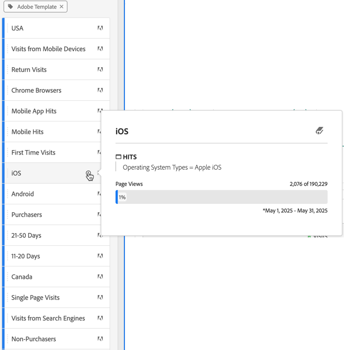

# Erstellen von Segmenten {#build-segments}

>[!CONTEXTUALHELP]
>id="components_segments_productcompatibility"
>title="Produktkompatibilität"
>abstract="Eine geringe Anzahl der verfügbaren Segmentkriterien ist nicht mit allen Adobe Analytics-Tools kompatibel. Tools, die mit dem Segment kompatibel sind, werden in dieser Liste aufgeführt. Bearbeiten Sie die Kriterien, um ein Segment mit allen Adobe Analytics-Tools kompatibel zu machen."

>[!CONTEXTUALHELP]
>id="components_filters_createaudience"
>title="Erstellen einer Zielgruppe"
>abstract="Zielgruppen können mithilfe eines Segments erstellt und zur Aktivierung für Adobe Experience Platform freigegeben werden."

>[!CONTEXTUALHELP]
>id="components_filters_datapreview"
>title="Datenvorschau"
>abstract="Vergleicht die Daten dieses Segments mit den Daten der Report Suite. Der Prozentsatz der Vorschau basiert auf der Gesamtzahl in der Verbindung aus den **letzten 90 Tagen**.  Wenn die Vorschau nicht geladen wird, wird Ihre Verbindung möglicherweise noch aufgestockt."

Das Dialogfeld **[!UICONTROL Segment Builder]** wird zum Erstellen neuer oder zum Bearbeiten vorhandener Segmente verwendet. Das Dialogfeld heißt **[!UICONTROL Neues Segment]** oder **[!UICONTROL Segment bearbeiten]** bei Segmenten, die Sie über den [[!UICONTROL Segment-Manager] erstellen oder verwalten](/help/components/segmentation/segmentation-workflow/seg-manage.md).

>[!BEGINTABS]

>[!TAB Segment Builder]

>[!TAB Erstellen oder Bearbeiten von Segmenten]

>[!ENDTABS]

1. Geben Sie die folgenden Details an ( bedeutet erforderlich):

   | Element | Beschreibung |
   | --- | --- |
   | **[!UICONTROL Report Suite]** | Sie können die Report Suite für das Segment auswählen. |
   | **[!UICONTROL Projektspezifische Segmente]** | Ein Infofeld, in dem erklärt wird, dass das Segment nur in dem Projekt sichtbar ist, in dem es erstellt wurde, und dass das Segment nicht Ihrer Komponentenliste hinzugefügt wird. Aktivieren Sie **[!UICONTROL Dieses Segment für alle Projekte verfügbar machen und der Komponentenliste hinzufügen]**, um diese Einstellung zu ändern. Dieses Infofeld wird nur angezeigt, wenn Sie ein [Schnellsegment](seg-quick.md) erstellen und dieses mithilfe von **[!UICONTROL Builder öffnen]** in der Oberfläche [!UICONTROL Schnellsegment] in ein reguläres Segment umwandeln. |
   | **[!UICONTROL Titel]**  | Benennen Sie das Segment, beispielsweise mit `Last month mobile visitors`. |
   | **[!UICONTROL Beschreibung]** | Geben Sie eine Beschreibung für das Segment ein, beispielsweise `Segment to define the mobile customers for the last month`. |
   | **[!UICONTROL Tags]** | Organisieren Sie das Segment, indem Sie ein oder mehrere Tags erstellen oder anwenden. Beginnen Sie mit der Eingabe, um nach vorhandenen Tags zu suchen, die Sie auswählen können. Oder drücken Sie die **[!UICONTROL Eingabetaste]**, um ein neues Tag hinzuzufügen. Wählen Sie  aus, um ein Tag zu entfernen. |
   | **[!UICONTROL Definition]**  | Definieren Sie Ihr Segment mit dem [Definition Builder](#definition-builder). |

   {style="table-layout:auto"}

1. Um zu überprüfen, ob Ihre Segmentdefinition korrekt ist, verwenden Sie die ständig aktualisierte Vorschau der Ergebnisse des Segments oben rechts.
1. Um Ihr Segment in Experience Cloud zu veröffentlichen, wählen Sie **[!UICONTROL Dieses Segment in Experience Cloud veröffentlichen (für *Report Suite*)]** aus. Weitere Informationen finden Sie unter [Veröffentlichen von Segmenten in Experience Cloud](/help/components/segmentation/segmentation-workflow/seg-publish.md).
1. Wählen Sie Folgendes aus:
   * **[!UICONTROL Speichern]**: Speichert das Segment.
   * **[!UICONTROL Speichern unter]**: Speichert eine Kopie des Segments.
   * **[!UICONTROL Löschen]**: Löscht das Segment.
   * **[!UICONTROL Abbrechen]**: Verwirft alle Änderungen, die Sie am Segment vorgenommen haben, oder bricht die Erstellung eines neuen Segments ab.

## Definition Builder

Mit dem Definition Builder erstellen Sie Ihre Segmentdefinition. Dabei verwenden Sie Komponenten, Container, Operatoren und Logik.

Sie können den Typ und den Umfang Ihrer Definition konfigurieren:

1. Um den Typ Ihrer Definition anzugeben, geben Sie an, ob Sie eine Ein- oder Ausschlussdefinition erstellen möchten. Wählen Sie  **[!UICONTROL Optionen]** und aus dem Dropdown-Menü **[!UICONTROL Einbeziehen]** oder **[!UICONTROL Ausschließen]** aus.
1. Um den Umfang Ihrer Definition anzugeben, wählen Sie über das Dropdown-Menü **[!UICONTROL Einbeziehen]** oder **[!UICONTROL Ausschließen]** aus, ob der Umfang der Definition **[!UICONTROL Hits]**, **[!UICONTROL Besuche]** oder **[!UICONTROL Besucher]** sein soll.

Sie können diese Einstellungen später jederzeit ändern.

### Komponenten

Ein wichtiger Teil beim Erstellen Ihrer Segmentdefinition ist die Verwendung von Dimensionen, Metriken, vorhandenen Segmenten und Datumsbereichen. Alle diese Komponenten sind über das Panel „Komponenten“ im Segment Builder verfügbar.

{width=100%}

So fügen Sie eine Komponente hinzu:

1. Ziehen Sie eine Komponente aus dem Panel „Komponenten“ auf **[!UICONTROL Platzieren Sie Metriken, Segmente und/oder Dimensionen mittels Drag-and-Drop hier]**. Sie können die  in der Komponentenleiste verwenden, um nach bestimmten Komponenten zu suchen.
1. Geben Sie Details für die Komponente an. Wählen Sie beispielsweise einen Wert über **[!UICONTROL Wert auswählen]** aus. Oder geben Sie einen Wert ein. Wie Sie einen oder mehrere Werte und welche Werte Sie angeben können, hängt von der Komponente und dem Operator ab.
1. Ändern Sie optional den Standardoperator. Beispiel: von **[!UICONTROL ist gleich]** zu **[!UICONTROL ist gleich eines von]**. Unter [Operatoren](../seg-reference/seg-operators.md) finden Sie einen detaillierten Überblick über die verfügbaren Operatoren.

So bearbeiten Sie eine Komponente:

* Wählen Sie im Dropdown-Menü „Operator“ einen neuen Operator für die Komponente aus.
* Wählen Sie ggf. einen anderen Wert für den Operator aus oder geben Sie ihn an.
* Wenn der Komponententyp eine Dimension ist, können Sie das Attributionsmodell definieren. Weitere Informationen finden Sie unter [Attributionsmodell](#attribution).

So löschen Sie eine Komponente:

* Wählen Sie  in einer Komponente aus.

### Container

Sie können mehrere Komponenten in einem oder mehreren Containern gruppieren und Logik innerhalb und zwischen Containern definieren. Mit Containern können Sie komplexe Definitionen für Ihr Segment erstellen.

{Width=100%}

* Wählen Sie zum Hinzufügen eines Containers über  **[!UICONTROL Optionen]** die Option **[!UICONTROL Behälter hinzufügen]** aus.
* Um eine vorhandene Komponente zum Container hinzuzufügen, ziehen Sie die Komponente per Drag-and-Drop in den Container.
* Um dem Container eine weitere Komponente hinzuzufügen, ziehen Sie eine Komponente per Drag-and-Drop aus dem Panel „Komponente“ in den Container. Verwenden Sie die blaue Linie zum Einfügen als Orientierung.
* Um eine weitere Komponente außerhalb des Containers hinzuzufügen, ziehen Sie eine Komponente per Drag-and-Drop aus dem Panel „Komponente“ außerhalb des Containers, aber innerhalb des Containers für die Hauptdefinition. Verwenden Sie die blaue Linie zum Einfügen als Orientierung.
* Um die Logik zwischen Komponenten in einem Container, zwischen Containern oder zwischen einem Container und einer Komponente zu ändern, wählen Sie die entsprechende Option **[!UICONTROL Und]**, **[!UICONTROL Oder]**, **[!UICONTROL Dann]**. Wenn Sie **[!UICONTROL Dann]** auswählen, wandeln Sie das Segment in ein sequenzielles Segment um. Weitere Informationen finden Sie unter [Erstellen eines sequenziellen Segments](seg-sequential-build.md).
* Wählen Sie zum Wechseln der Container-Ebene  **[!UICONTROL Hits]**,  **[!UICONTROL Besuche]** oder  **[!UICONTROL Besucher]**.

Sie können  in einem Container für die folgenden Aktionen verwenden:

| Container-Aktion | Beschreibung |
|---|---|
| **[!UICONTROL Behälter hinzufügen]** | Fügen Sie dem Container einen verschachtelten Container hinzu. |
| **[!UICONTROL Ausschließen]** | Schließen Sie das Ergebnis aus dem Container in der Segmentdefinition aus. Ein dünner roter Balken auf der linken Seite kennzeichnet einen Container „Ausschließen.“ |
| **[!UICONTROL Einschließlich]** | Beziehen Sie das Ergebnis aus dem Container in die Segmentdefinition ein. Die Standardeinstellung lautet „Einbeziehen“. Ein dünner grauer Balken auf der linken Seite kennzeichnet einen Container „Einbeziehen“. |
| **[!UICONTROL Container benennen]** | Benennen Sie den Container ausgehend von seiner Standardbeschreibung um. Geben Sie einen Namen in das Textfeld ein. Wenn Sie keine Eingabe vornehmen, wird die Standardbeschreibung verwendet. |
| **[!UICONTROL Container löschen]** | Löschen Sie den Container aus der Definition. |

## Datumsbereiche

Sie können Segmente erstellen, die rollierende Datumsbereiche enthalten. So können Sie Fragen zu laufenden Kampagnen oder Ereignissen beantworten. Sie können beispielsweise ein Segment erstellen, das *alle Personen, die in den vergangenen 60 Tagen Online-Käufe getätigt haben*, einschließt.

>[!BEGINSHADEBOX]

Unter  [Rollierende Datumsbereiche in Segmenten](https://video.tv.adobe.com/v/25403/?quality=12&learn=on){target="_blank"} finden Sie ein Demovideo.

>[!ENDSHADEBOX]

## Stapeln von Segmenten {#stack}

Sie können ein Segment mithilfe von Segmenten erstellen. Wenn Sie Segmente in einem Segment verwenden, können Sie Ihr Segment optimieren und die Komplexität reduzieren.

Angenommen, Sie möchten nach der Kombination aus Interaktionskanal (5) und US-Bundesstaaten (50) segmentieren. Sie können entweder 250 Segmente erstellen, d. h. jeweils eine eindeutige Kombination aus Gerätetyp (Mobiltelefon oder Tablet) und US-Bundesstaat. Um die Tablet-Benutzenden aus Kalifornien abzurufen, würden Sie dann eines der 250 Segmente verwenden:

Oder Sie können 55 Segmente definieren, d. h. 50 Segmente für die US-Bundesstaaten und 5 für die möglichen Interaktionskanäle. Stapeln Sie dann die Segmente, um die gleichen Ergebnisse zu erhalten. Um die App-Benutzenden aus Kalifornien abzurufen, würden Sie zwei Segmente stapeln:

## Attribution {#attribution}

>[!CONTEXTUALHELP]
>id="components_filters_attribution_repeating"
>title="Wiederholend"
>abstract="Umfasst Instanzen und persistierte Werte für die Dimension."

>[!CONTEXTUALHELP]
>id="components_filters_attribution_instance"
>title="Instanz"
>abstract="Umfasst Instanzen für die Dimension."

>[!CONTEXTUALHELP]
>id="components_filters_attribution_nonrepeatinginstance"
>title="Sich nicht wiederholende Instanz"
>abstract="Umfasst einzigartige (sich nicht wiederholende) Instanzen für die Dimension."

Wenn Sie eine Dimension im Segment Builder verwenden, können Sie das Attributionsmodell für diese Dimension angeben. Das von Ihnen ausgewählte Attributionsmodell bestimmt, ob die Daten für die Bedingung qualifiziert sind, die Sie für die Dimensionskomponente angegeben haben.

Wählen Sie in der Dimensionskomponente das Symbol  und dann eines der Attributionsmodelle aus dem Popup aus:

| Modelle | Beschreibung |
|---|---|
| **[!UICONTROL Sich wiederholendes Modell (Standard)]** | Schließen Sie die Instanz und persistierten Werte für die Dimension ein, um die Qualifizierung zu bestimmen. |
| **[!UICONTROL Instanz]** | Schließen Sie nur Instanzwerte für die Dimension ein, um die Qualifizierung zu bestimmen. |
| **[!UICONTROL Sich nicht wiederholende Instanz]** | Schließen Sie eindeutige (sich nicht wiederholende) Instanzwerte für die Dimension ein, um die Qualifizierung zu bestimmen. |

### Beispiel

Als Teil einer Segmentdefinition haben Sie die folgende Bedingung angegeben: Seitenname ist gleich Frauen. Dies ist ähnlich wie im obigen Beispiel. Sie wiederholen diese Segmentdefinition mit den beiden anderen Attributionsmodellen. Sie haben also drei Segmente mit jeweils einem eigenen Attributionsmodell:

* „Frauen“-Seite – Attribution – Wiederholung (Standard)
* „Frauen“-Seite – Attribution – Instanz
* „Frauen“-Seite – Attribution – Sich nicht wiederholende Instanz

In der folgenden Tabelle wird für jedes Attributionsmodell angegeben, welche eingehenden Ereignisse für diese Bedingung qualifiziert  sind.

| „Frauen“-Seite – Attribution –  *Attributionsmodell* | Ereignis 1: Seitenname ist gleich Frauen | Ereignis 2: Seitenname ist gleich Männer | Ereignis 3: Seitenname ist gleich Frauen | Ereignis 4: Seitenname ist gleich Frauen (persistiert) | Ereignis 5: Seitenname ist gleich Checkout | Ereignis 6: Seitenname ist gleich Frauen | Ereignis 7: Seitenname ist gleich Startseite |
|---|:---:|:---:|:---:|:---:|:---:|:---:|:--:|
| Wiederholung (Standard) |  |  |  |  |  |  |  |
| Instanz |  |  |  |  |  |  |  |
| Sich nicht wiederholende Instanz |  |  |  |  |  |  |  |

Ein Beispielbericht zu Ereignissen, die die drei Segmente verwenden, sieht wie folgt aus:

<!--

The [!UICONTROL Segment builder] lets you build simple or complex segments that identify visitor attributes and actions across visits and page hits. It provides a canvas to drag and drop metric dimensions, events, or other segments in order to segment visitors based on hierarchy logic, rules, and operators.

There are several ways to access the Segment builder:

* **Analytics top navigation**: Click **[!UICONTROL Analytics]** > **[!UICONTROL Components]** > **[!UICONTROL Segments]**.
* **[!UICONTROL Analysis Workspace]**: Click **[!UICONTROL Analytics]** > **[!UICONTROL Workspace]**, open a project and click **[!UICONTROL + New]** > **[!UICONTROL Create Segment]**.
* **[!UICONTROL Report Builder]**: [Add or edit segments in Report Builder](/help/analyze/report-builder/work-with-segments.md).

## Builder criteria {#section_F61C4268A5974C788629399ADE1E6E7C}

You can add rule definitions and containers to define your segments.

1. **[!UICONTROL Title]**: Name the segment.
1. **[!UICONTROL Description]**: Provide a description for the segment. 
1. **[!UICONTROL Tags]**: [Tag the segment](/help/components/segmentation/segmentation-workflow/seg-workflow.md) you are creating by picking from a list of existing tags or creating a new tag.
1. **[!UICONTROL Definitions]**: This is where you [build and configure segments](/help/components/segmentation/segmentation-workflow/seg-workflow.md), add rules, and nest and sequence containers. 
1. **[!UICONTROL Show]**: (Top Container selector.) Lets you select the top-level [container](/help/components/segmentation/seg-overview.md) ( [!UICONTROL Visitor], [!UICONTROL Visit], [!UICONTROL Hit]). The default top-level container is the Hit container.
1. **[!UICONTROL Options]**: (gear) icon

   * **[!UICONTROL + Add container]**: Lets you add a new container (below the top-level container) to the segment definition.
   * **[!UICONTROL Exclude]**: Lets you define the segment by excluding one or more dimensions, segments, or metrics.

1. **[!UICONTROL Dimensions]**: Components are dragged and dropped from the Dimensions list (orange sidebar).
1. **[!UICONTROL Operator]**: You can compare and constrain values using selected operators.
1. **[!UICONTROL Value]**: The value you entered or selected for the dimension or segment or metric.
1. **[!UICONTROL Attribution Models]**: Available for dimensions only, these models determine what values in a dimension to segment for. Dimension models are particularly useful in sequential segmentation.

   * **[!UICONTROL Repeating]** (default): Includes instances and persisted values for the dimension.
   * **[!UICONTROL Instance]**: Includes instances for the dimension.
   * **[!UICONTROL Non-repeating instance]**: Includes unique instances (non-repeating) for the dimension. This is the model applied in Flow when repeat instances are excluded.

   

   **Example: Hit segment where eVar1 = A** 

   |  Example  | A  | A  |  A (persisted) | B  | A  | C  |
   |---|---|---|---|---|---|---|
   |  Repeating  | X  | X  | X  | -  | X  | -  |
   |  Instance  | X  | X  | - | - | X | - |
   |  Non-repeating instance  | X | - | - | -  | X  | -  |

1. **[!UICONTROL And/Or/Then]**: Assigns the [!UICONTROL AND/OR/THEN] operators between containers or rules. The THEN operator lets you [define sequential segments](/help/components/segmentation/segmentation-workflow/seg-sequential-build.md).
1. **[!UICONTROL Metric]**: (Green sidebar) Metric that was dragged and dropped from the Metrics list.
1. **[!UICONTROL Comparison]** operator: You can compare and constrain values using selected operators.
1. **[!UICONTROL Value]**: The value you entered or selected for the dimension or segment or metric.
1. **[!UICONTROL X]**: (Delete) Lets you delete this part of the segment definition.
1. **[!UICONTROL Experience Cloud publishing]**: Publishing an Adobe Analytics segment to the Experience Cloud lets you use the segment for marketing activity in [!DNL Audience Manager] and in other activation channels. [Learn more...](/help/components/segmentation/segmentation-workflow/seg-publish.md)
1. **[!UICONTROL Audience library]**: Adobe's audience services manage the translation of visitor data into audience segmentation. As such, creating and managing audiences is similar to creating and using segments, with the added ability to share the audience segment to the Experience Cloud. [Learn more...](https://experienceleague.adobe.com/docs/core-services/interface/audiences/audience-library.html?lang=de)
1. **[!UICONTROL Search]**: Searches the list of dimensions, segments, or metrics.
1. **[!UICONTROL Dimensions]**: (List) Click the header to expand.
1. **[!UICONTROL Metrics]**: Click the header to expand.
1. **[!UICONTROL Segments]**: Click the header to expand.
1. **[!UICONTROL Report suite selector]**: Lets you select the report suite that this segment will be saved under. You can still utilize the segment in all report suites.
1. **[!UICONTROL Segment Preview]**: Lets you preview the key metrics to see whether you have a valid segment and how broad the segment is. Represents the breakdown of the data set you can expect to see if you apply this segment. Shows 3 concentric circles and a list to show the number and percentage of matches for [!UICONTROL Hits], [!UICONTROL Visits], and [!UICONTROL Visitors] for a segment run against a data set. This chart is updated immediately after you create or make changes to your segment definition.
1. **[!UICONTROL Product Compatibility]**: Provides a list of which Adobe Analytics products (Analysis Workspace, Data Warehouse) with which the segment you created is compatible. Most segments are compatible with all products. However, not all operators and dimensions are compatible with all Analytics products, especially [Data Warehouse](/help/components/segmentation/seg-reference/seg-compatibility.md). This chart is updated immediately after you make changes to your segment definition.
1. **[!UICONTROL Save]** or **[!UICONTROL Cancel]**: Saves or cancels the segment. After clicking **[!UICONTROL Save]**, you are taken to the Segment manager where you can manage the segment.

## Build segments {#build-segments}

1. Simply drag a Dimension, Segment, or Metric Event from the left pane to the [!UICONTROL Definitions] field.

   

   The default top-level [!UICONTROL Hit] container is shown after dragging an element to [!UICONTROL Definitions]. You can change the container type to Visit or Visitor from the **[!UICONTROL Show]** drop-down menu.

1. Set the [operator](/help/components/segmentation/seg-reference/seg-operators.md) from the drop-down menu.
1. Enter or select a value for the item selected.
1. Add additional containers if needed, using **[!UICONTROL And]**, **[!UICONTROL Or]**, or **[!UICONTROL Then]** rules.
1. After placing the containers and setting the rules, see the results of the segment in the validation chart at the top right. The validator indicates the percentage and absolute number of page views, visits, and unique visitors that match the segment you created.
1. Under **[!UICONTROL Tags]**, [tag](/help/components/segmentation/segmentation-workflow/seg-tag.md) the container by selecting an existing tag or creating a new one.
1. Click **[!UICONTROL Save]** to save the segment.

You are now taken to the [Segment manager](/help/components/segmentation/segmentation-workflow/seg-manage.md), where you can tag, share, and manage your segment in multiple ways.

## Add containers {#section_1C38F15703B44474B0718CEF06639EFD}

You can [build a framework of containers](/help/components/segmentation/seg-overview.md) and then place logic rules and operators between.

1. Click **[!UICONTROL Options > Add Container]**.

   

   A new [!UICONTROL Hit] container opens without a [!UICONTROL Hit] (Page View) identified.

   

1. Change the container type as needed.
1. Drag a Dimension, Segment, or Event from the left pane to the container.
1. Continue to add new containers from the top-level **[!UICONTROL Options]** > **[!UICONTROL Add container]** button at the top of the definition, or add containers from within a container to nest logic.

   **OR**

   Select one or more rules and then click **[!UICONTROL Options]** > **[!UICONTROL Add container from selection]**. This turns your selection into a separate container.

## Use date ranges {#concept_252A83D43B6F4A4EBAB55F08AB2A1ACE}

You can build segments that contain rolling date ranges in order to answer questions about ongoing campaigns or events.

For example, you can easily build a segment that includes "everyone who has made a purchase over the past 60 days".

You create a Visit container and within it, add the [!UICONTROL Last 60 days] time range and the metric [!UICONTROL Orders is greater than or equal to 1], with an AND operator:

>[!BEGINSHADEBOX]

See  [Rolling date ranges in segments](https://video.tv.adobe.com/v/25403?quality=12&learn=on){target="_blank"} for a demo video.

>[!ENDSHADEBOX]

## Stack segments {#task_58140F17FFD64FF1BC30DC7B0A1B0E6D}

Stacking segments works by combining the criteria in each segment using an 'and' operator, and then applying the combined criteria. This can be done in a Workspace project directly or in segment builder. 

For example, stacking a "mobile phone users" segment and a "US geography" segment would return data only for mobile phone users in the US.

Think of these segments as building blocks or modules that you can include in a segment library, for users to use as they see fit. That way, you can dramatically reduce the number of segments needed. For example, assume you have 40 segments:

* 20 for mobile phone users in different countries (US_mobile, Germany_mobile, France_mobile, Brazil_mobile, etc.) 
* 20 for tablet users in different countries (US_tablet, Germany_tablet, France_tablet, Brazil_tablet, etc.)

By using segment stacking, you can reduce your segment count to 22 and stack them as needed. You would need to create these segments:

* one segment for mobile users 
* one segment for tablet users 
* 20 segments for the different geographies

>[!NOTE]
>
>When stacking two segments, they are by default joined by an AND statement. This cannot be changed to an OR statement.

1. Go to the Segment builder.
1. Provide a title and description for the segment.

   Step Result 1. Click **[!UICONTROL Show Segments]** to bring up the list of segments in the left navigation.

   Step Result 1. Drag and drop the segments you want to stack to the segment definition canvas. Here is an example of a segment that stacks the existing segments "Visits from Tablets" and "US Geo":

   

1. Save the segment.

   Step Result 

-->

## Segmentvorlagen {#concept_5098446CC78D441E93B8E4D1D1EA6558}

Segmentvorlagen werden für gängige Anwendungsfälle der Segmentierung bereitgestellt, z. B. **[!UICONTROL Erstbesuche]** oder **[!UICONTROL Besuche von Mobilgeräten]**. Sie stehen in Workspace-Projekten und im Segment Builder als Bausteine für neue Segmente zur Verfügung.

Ein Adobe-Logo  kennzeichnet Vorlagen. Nachfolgend sind einige der verfügbaren Beispielvorlagen aufgeführt:

<table id="table_98B87D807E9344C9BEBF072C65D87B1B"> 
 <thead> 
  <tr> 
   <th colname="col1" class="entry"> Vorlagenname </th> 
   <th colname="col2" class="entry"> Definition </th> 
  </tr> 
 </thead>
 <tbody> 
  <tr> 
   <td colname="col1"> Warenkorb vorzeitig verlassen </td> 
   <td colname="col2">Daten zu Besuchern anzeigen, die Elemente zum Warenkorb hinzugefügt, aber nichts bestellt haben. In der Segmentdefinition ist der Container „Besuche“.  </td> 
  </tr> 
  <tr> 
   <td colname="col1"> Erstbesuche </td> 
   <td colname="col2">Daten zu Besuchern mit maximal einem [1] Besuch anzeigen. In der Segmentdefinition ist der Container „Besuche“.  
 </td> 
  </tr> 
  <tr> 
   <td colname="col1"> Nichtkaufende </td> 
   <td colname="col2">Daten zu Besuchenden anzeigen, die nicht zu einem Bestellereignis beitrugen. </td> 
  </tr> 
  <tr> 
   <td colname="col1"> Nicht-Einzelseitenbesuche (Keine Absprünge) </td> 
   <td colname="col2">Daten zu Besuchenden anzeigen, die mehr als einen Besuch durchgeführt haben. 
 </td> 
  </tr> 
  <tr> 
   <td colname="col1"> Paid Search </td> 
   <td colname="col2">Daten zu Besuchenden anzeigen, die über Paid Search kommen.   </td> 
  </tr> 
  <tr> 
   <td colname="col1"> Kaufende </td> 
   <td colname="col2">Daten zu Besuchenden anzeigen, die zu einem Bestellereignis beitrugen.  </td> 
  </tr> 
  <tr> 
   <td colname="col1"> Rückkehrende Besuchende </td> 
   <td colname="col2">Daten zu Besuchenden anzeigen, die mindestens einen Besuch durchgeführt haben.   </td> 
  </tr> 
  <tr> 
   <td colname="col1"> Einzelseitenbesuche </td> 
   <td colname="col2"> Daten zu Besuchen anzeigen, bei denen ein Einzelseitenwert vorliegt, auch wenn während des Besuchs mehrere Seitenansichten übermittelt werden. Einzelseitenbesuche mit Exitlink-Ereignissen werden in das Segment einbezogen.   </td> 
  </tr> 
  <tr> 
   <td colname="col1"> Angesehenes Produkt wurde nicht dem Warenkorb hinzugefügt </td> 
   <td colname="col2">Daten zu Besuchenden anzeigen, die Produkte angesehen, aber keine zum Warenkorb hinzugefügt haben.   </td> 
  </tr> 
  <tr> 
   <td colname="col1"> Besuche von Kampagnen </td> 
   <td colname="col2">Daten zu Besuchenden aus Kampagnen anzeigen.  </td> 
  </tr> 
  <tr> 
   <td colname="col1"> Besuche von Mobilgeräten </td> 
   <td colname="col2">Daten zu Besuchenden anzeigen, die Mobilgeräte verwenden.  </td> 
  </tr> 
  <tr> 
   <td colname="col1"> Besuche über eine natürliche Suche </td> 
   <td colname="col2">Daten zu Besuchenden anzeigen, die nicht über Paid Search kommen.  </td> 
  </tr> 
  <tr> 
   <td colname="col1"> Besuche von Nicht-Mobilgerät </td> 
   <td colname="col2">Daten zu Besuchenden anzeigen, die kein Mobilgerät verwenden. </td> 
  </tr> 
  <tr> 
   <td colname="col1"> Besuche von Smartphones </td> 
   <td colname="col2">Daten zu Besuchenden anzeigen, die Smartphones verwenden.  </td> 
  </tr> 
  <tr> 
   <td colname="col1"> Besuche über Suchmaschinen </td> 
   <td colname="col2">Daten zu Besuchenden anzeigen, die über Suchmaschinen kommen.</td> 
  </tr> 
  <tr> 
   <td colname="col1"> Besuche von Social Media aus </td> 
   <td colname="col2">Daten zu Besuchenden anzeigen, die aus Social Media kommen.</td> 
  </tr> 
  <tr> 
   <td colname="col1"> Besuche von Tablets </td> 
   <td colname="col2">Daten zu Besuchenden anzeigen, die Tablets verwenden. </td> 
  </tr> 
  <tr> 
   <td colname="col1"> Besuche mit Besucher-ID-Cookie </td> 
   <td colname="col2">Daten zu Besuchenden Ihrer Site anzeigen, für die ein persistentes Cookie erforderlich ist.</td> 
  </tr> 
 </tbody> 
</table>

Um die Definition der einzelnen Segmente anzuzeigen, verwenden Sie . Beispielsweise für die Vorlage **[!UICONTROL iOS]**:

