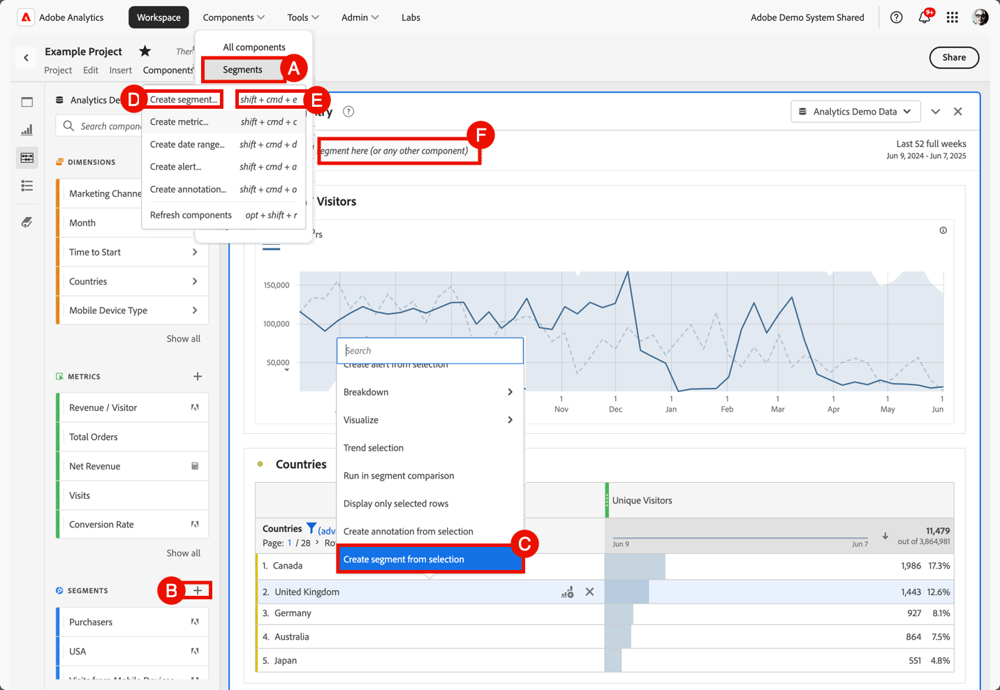

# Erstellen von Segmenten

Sie können in Adobe Analytics verschiedene Segmenttypen erstellen.  Der ausgewählte Typ hängt davon ab, wie komplex die Segmente sein müssen und ob die Segmente nur für das aktuelle Workspace-Projekt oder nur für alle Projekte gelten sollen. Sie können Segmente direkt in der Hauptbenutzeroberfläche von Adobe Analytics oder bei der Arbeit in einem Workspace-Projekt erstellen.

[Segmentrechte nach Rolle](/help/components/segmentation/seg-reference/seg-rights.md) erklären, wer Segmente erstellen kann.

Sie können ein Segment wie folgt erstellen:

* **A**. Wählen Sie in der Hauptbenutzeroberfläche **[!UICONTROL Komponenten]** und wählen Sie **[!UICONTROL Segmente]** aus. Wählen Sie  [!UICONTROL **[!UICONTROL Add]**] im [[!UICONTROL Segment]Manager](seg-manage.md).
* **B**. Wählen Sie in einem Workspace-Projekt im linken Bereich „Komponenten“ die Option  unter  **Segmente**.
* **C**. Wählen Sie in einem Workspace-Projekt im Kontextmenü in einer Visualisierung die Option **[!UICONTROL Segment aus Auswahl erstellen]** aus.
* **D**. Wählen Sie in einem Workspace-Projekt **[!UICONTROL Komponenten]** aus dem Menü und wählen Sie **[!UICONTROL Segment erstellen]**.
* **E**. Verwenden Sie in einem Workspace-Projekt die Tastenkombination **[!UICONTROL Umschalt+Befehlstaste+E]** (macOS) oder **[!UICONTROL Umschalt+Strg+E]** (Windows).
* **F**. Wählen Sie  in ***Legen Sie hier ein Segment (oder eine beliebige andere Komponente)*** Ablagebereich ab. Diese Aktion erstellt ein Segment, das nur auf das Projekt angewendet wird.

Um das neue Segment zu definieren, verwenden Sie den [Segment Builder](seg-build.md).

Wenn Sie sich in einem Workspace-Projekt befinden, können Sie mit „Schnellsegment[&#x200B; auch schnell ein Segment &#x200B;](seg-quick.md).
