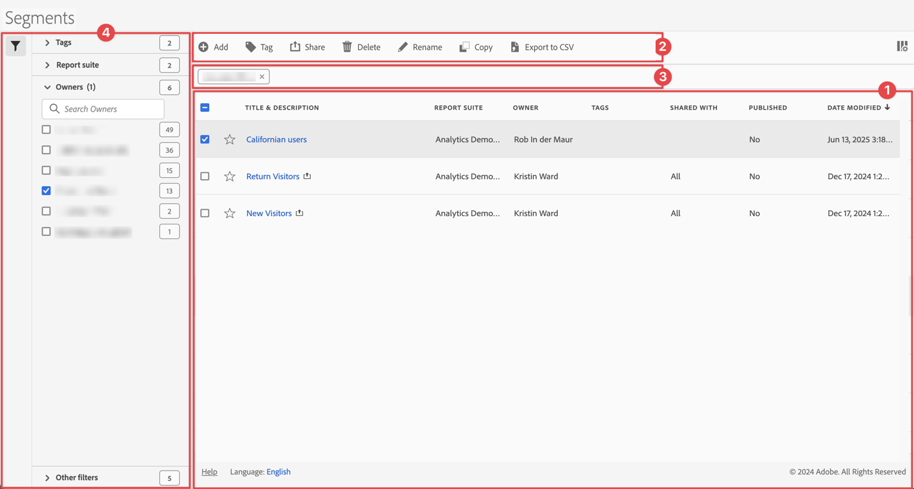

# Verwalten von Segmenten

Sie können [Freigeben](t-seg-share.md), [Segment](t-seg-filter.md), [Tag](seg-tag.md), [Genehmigen](seg-approve.md), umbenennen [Kopieren](seg-copy.md), Segmente löschen, exportieren und Segmente über eine zentrale [!UICONTROL Segment]Verwaltungsoberfläche als [Favorit](t-seg-favorite.md) markieren. So verwalten Sie Segmente:

* Wählen Sie **[!UICONTROL Hauptbenutzeroberfläche]** Komponenten“ aus und klicken Sie auf **[!UICONTROL Segmente]**.

>[!NOTE]
>
>Die Schnellsegmente, die Sie in einem bestimmten Workspace-Projekt erstellen, werden nicht im [!UICONTROL Segment]Manager angezeigt, es sei denn, Sie haben das Segment für alle Ihre Projekte verfügbar gemacht.
>

## Segment-Manager

Der Segment-Manager verfügt über die folgenden Elemente der Benutzeroberfläche:

### Segmentliste

In der ➊ „Segmentliste“ werden alle Segmente angezeigt, deren Inhaber Sie sind, die Segmente, die für alle Ihre Projekte gelten, und die Segmente, die für Sie freigegeben wurden. Die Liste umfasst die folgenden Spalten:

| Spalte | Beschreibung |
| --- | --- | 
|  | Wählen Sie aus, StarOutline. Siehe [Segment als Favorit markieren](t-seg-favorite.md) |
| **[!UICONTROL Titel und Beschreibung]** | Um das Segment zu bearbeiten, klicken Sie auf den Titel-Link, der den [Segment Builder“ ](seg-build.md). Ein freigegebenes Segment wird mit &quot;. |
| **[!UICONTROL Report Suites]** | Die Report Suite, für die dieses Segment gilt. |
| **[!UICONTROL Inhabende]** | Der Inhaber des Segments. Als Benutzer sehen Sie nur die Segmente, deren Inhaber Sie sind, oder die Anmerkungen, die für Sie freigegeben wurden. |
| **[!UICONTROL Tags]** | Die Tags für dieses Segment. |
| **[!UICONTROL Freigegeben für]** | Wie viele Einzelpersonen oder Gruppen Sie das Segment freigegeben haben. Wählen Sie diese Option aus, um das Dialogfeld **[!UICONTROL Komponente freigeben]** zu öffnen. Weitere Informationen finden [ unter ](t-seg-share.md) von Segmenten . |
| **[!UICONTROL Veröffentlicht]** | Ob das [Segment veröffentlicht](seg-publish.md) in Experience Cloud veröffentlicht wird. |
| **[!UICONTROL Änderungsdatum]** | Datum und Uhrzeit der letzten Änderung des Segments. |

Verwenden Sie , um die anzuzeigenden Spalten anzugeben.

### Aktionsleiste

Sie können Aktionen für Segmente mithilfe der Aktionsleiste ➋. Die Aktionsleiste ermöglicht die folgenden Aktionen:

| Aktion | Beschreibung |
|---|---|
|  **[!UICONTROL Hinzufügen]** | Fügen Sie mit dem [Segment Builder“ ein weiteres Segment ](seg-build.md). |
|  [!UICONTROL *Nach Titel suchen*] | Wenn kein Segment in der Liste ausgewählt ist, suchen Sie mithilfe dieses Suchfelds nach Segmenten. |
|  **[!UICONTROL Tag]** | Tagging der ausgewählten Segmente. Wählen Sie im **[!UICONTROL Segment]**-Dialogfeld die Tags für die ausgewählten Segmente aus bzw. heben Sie die Auswahl auf. Wählen Sie **[!UICONTROL Speichern]**, um die Tags für die ausgewählten Segmente zu speichern. Weitere Informationen finden [ unter ](seg-tag.md) von Segmenten . |
|  **[!UICONTROL Freigeben]** | Freigeben der ausgewählten Segmente. Im Dialogfeld **[!UICONTROL Segment freigeben]** können Sie  *(Einzelpersonen oder Gruppen* oder **[!UICONTROL Organisation]** oder **[!UICONTROL Gruppen]**. Wählen Sie **[!UICONTROL Speichern]**, um Freigabedetails für die ausgewählten Segmente zu speichern. Weitere Informationen finden [ unter ](t-seg-share.md) von Segmenten . |
|  **[!UICONTROL Löschen]** | Löscht die ausgewählten Segmente. Sie werden zur Bestätigung aufgefordert. |
|  **[!UICONTROL Umbenennen]** | Ein einzelnes ausgewähltes Segment umbenennen. Wenn diese Option aktiviert ist, können Sie das Segment inline umbenennen. |
|  **[!UICONTROL Genehmigen]** | Genehmigen Sie die ausgewählten Segmente. Weitere Informationen finden [ unter ](seg-approve.md) von Segmenten. |
|  **[!UICONTROL Kopieren]** | Kopiert das ausgewählte Segment. Neue Segmente werden mit demselben Namen und derselben `(Copy)` erstellt. |
|  **[!UICONTROL In CSV exportieren]** | Exportieren Sie die Segmente in eine `Segments List.csv`. |

### Aktive Filterleiste

Die Filterleiste zeigt ➌ die aktiven Segmente an, die vom Filterbedienfeld auf die Liste der Segmente angewendet wurden (falls vorhanden). Mit  können Sie schnell einen Filter entfernen. Wenn mehr als ein Filter angegeben ist, können Sie mit „Alle entfernen **[!UICONTROL alle Filter]**.

### Panel „Filter“

Sie können die Liste der Segmente mithilfe der ➍ des  **[!UICONTROL Filtern]** filtern. Das Bedienfeld „Filter“ zeigt den Filtertyp und die Anzahl der Segmente an, die den spezifischen Filter berücksichtigen. Wählen Sie  aus, um die Anzeige des Bedienfelds „Filter“ umzuschalten.

Weitere [ finden Sie unter ](t-seg-filter.md) der Segmentliste .

<!--

The Segment Manager offers many ways of curating segments, such as sharing, filtering, tagging, approving, copying, deleting, and marking as favorites.

The Analytics Segment Manager shows you all the segments you own and that have been shared with you. Admin-level users can see all segments in the organization. This overview presents the user interface and the capabilities of the Segment Manager. 

## Access the Segment Manager

1. In Adobe Analytics, select the **[!UICONTROL Components]** tab, then select **[!UICONTROL Segments]**.

   Or 

   In an existing report, select the Segments icon  in the left navigation, then select **[!UICONTROL Manage]**.

## Available actions in the Segment Manager

In the Segment Manager, you can:

* [Filter segments](/help/components/segmentation/segmentation-workflow/t-seg-filter.md)

* [Mark segments as favorites](/help/components/segmentation/segmentation-workflow/t-seg-favorite.md)

* [Approve segments](/help/components/segmentation/segmentation-workflow/seg-approve.md)

* [Tag segments](/help/components/segmentation/segmentation-workflow/seg-tag.md)

* [Share segments](/help/components/segmentation/segmentation-workflow/t-seg-share.md)

* Export a segment to a CSV file.

* [Copy segments](/help/components/segmentation/segmentation-workflow/seg-copy.md)

* [Delete segments](/help/components/segmentation/segmentation-workflow/seg-delete.md)

## Configure columns

You can configure the information displayed for each segment in the Segment Manager by configuring the columns that are displayed.

To configure the visible columns in the Segment Manager:

1. In Adobe Analytics, select the **[!UICONTROL Components]** tab, then select **[!UICONTROL Segments]**. 

1. In the Segment Manager, select the **Customize columns** icon , then select the columns that you want to be displayed in the Segment Manager.

   The following columns are available:

   | Column title | Description  |
   |---|---|
   | Title and description | These values are provided in the Segment builder. To edit the title and description, select the title link to open the Segment builder.  |
   | Favorites  | Displays star icons next to each segment, allowing you to mark segments as favorites. For more information, see [Mark segments as favorites](/help/components/segmentation/segmentation-workflow/t-seg-favorite.md). |
   | Report suites  | This column indicates in which report suite the segment was last saved.  |
   | Owner  | Indicates who owns the segment. As a non-Admin, you can see only segments you own or those that were shared with you.  |
   | Tags (not checked in column selector, hence column not appearing)  | Tags that were applied to the segment, either by you or by people who shared the segment with you.  |
   | Shared with  | Lists individuals or groups (Admin only) or All (Admin only) that you shared the segment with. 
When a segment is being shared by you or with you, a share icon displays next to the segment name.
|
   | Date modified  | Shows the date that the segment was last modified.  |
   | Used in | Shows where segments are currently being used, and how many times they are being used in each area. 
For example, if the segment is being used in 40 projects and 2 alerts, then the value of this column shows as [!UICONTROL **42 components**].
 
Select the value in this column to see the breakdown of where the segments are being used (for example, [!UICONTROL **Projects (40)**], [!UICONTROL **Alerts (2)**]). Furthermore, you can view the list of items where the segments are being used. For example, so see the list of projects where they are being used, select the [!UICONTROL **Projects (40)**] link.

Each of the following areas shows the number of instances of segments being used in that area:
  <ul><li>[!UICONTROL **Projects**]
Contains segments that were [created in the segment builder](/help/components/segmentation/segmentation-workflow/seg-build.md) and are available for all projects.
</li><li>[!UICONTROL **Ad hoc components**]
Contains segments that were [created as quick segments](/help/analyze/analysis-workspace/components/segments/quick-segments.md) and are available only within a single project.
</li><li>[!UICONTROL **Scheduled projects**]</li><li>[!UICONTROL **Mobile Scorecards**]</li><li>[!UICONTROL **Annotations**]</li><li>[!UICONTROL **Alerts**]</li><li>[!UICONTROL **Calculated metrics**]</li><li>[!UICONTROL **Report Builder**]
Selecting this option downloads a CSV file, with the following columns of data:
<ul><li>Report Builder Name</li><li>Last accessed</li><li>Last accessed IMS User ID</li><li>Last accessed user name</li></ul>
When viewing information for Report Builder, usage information is available starting in September 2024.
</li></ul>
This information can help you determine whether a component is valuable to users in your organization, where it is used, and if it needs to be deleted or modified.

Consider the following when viewing this column:
<ul><li>This information is available only to system administrators.</li><li>The [!UICONTROL **Used in**] column does not display by default. [Configure columns](#configure-columns) to display it.</li><li>If a segment includes another segment in its definition, any use of that segment is not shown in the [!UICONTROL **Used in**] column. If a segment is included in the definition of another type of component (such as a calculated metric), then usage is shown in the [!UICONTROL **Used in**] column.</li><li>This information does not include usage from the API or Data Warehouse.</li><li>If there is no data in this column for a given component but it has a [!UICONTROL **Last used**] date, the component might have been used in an analysis without being saved.</li><li>Usage information is available starting in September 2023.</li></ul>
You can use the [Data Dictionary](/help/analyze/analysis-workspace/components/data-dictionary/data-dictionary-overview.md) along with this information to help you keep track of and better understand how components are being used in your organization.
  |
   | Last used | Shows the date when the segment was last used in any of the following component types: <ul><li>Alerts</li><li>Calculated metrics</li><li>Projects</li><li>Scheduled projects</li><li>Segments</li></ul> 
This information can help you determine whether a component is valuable to users in your organization, where it is used, and if it needs to be deleted or modified.

Consider the following when viewing this column:
<ul><li>This information does not include usage from the API, Report Builder, or Data Warehouse.</li><li>For some components, this column might not contain data if the component was last used prior to September 2023.</li><li>This information is available only to system administrators.</li></ul>
You can use the [Data Dictionary](/help/analyze/analysis-workspace/components/data-dictionary/data-dictionary-overview.md) along with this information to help you keep track of and better understand how components are being used in your organization. |
   
   {style="table-layout:auto"}

## How-To Video {#section_B3C5DA22DC5248DBA17C56E03DA2D4F2}

This [Adobe Analytics video](https://experienceleague.adobe.com/docs/analytics-learn/tutorials/components/segmentation/segment-management-and-sharing.html?lang=de) gives a short overview of how to use the Segment Manager.

-->