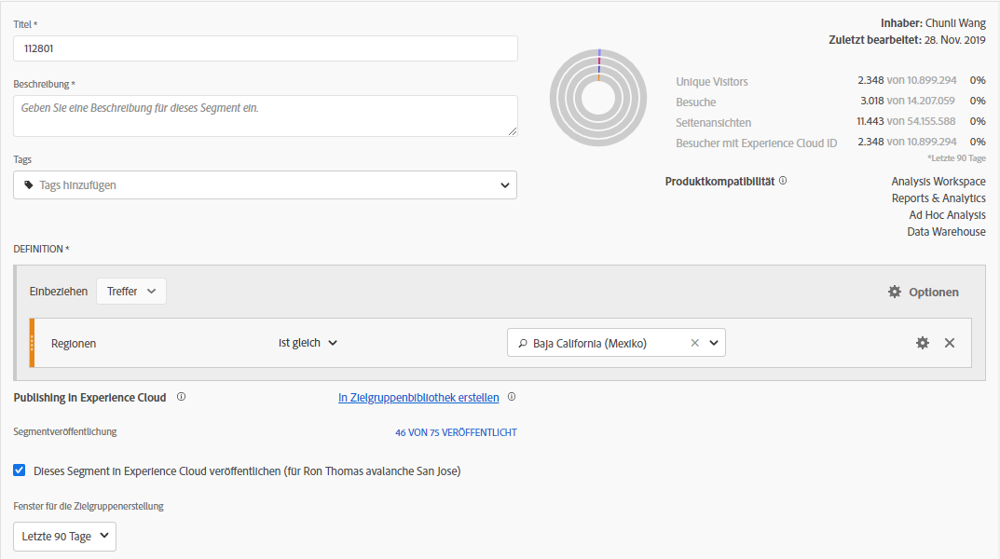

# Veröffentlichen von Segmenten {#publish-segments}

>[!CONTEXTUALHELP]
>id="components_segments_publishing"
>title="Veröffentlichen in Experience Cloud"
>abstract="Sie können die aus diesem Segment abgeleitete Zielgruppe in der Zielgruppenbibliothek veröffentlichen, wo sie für Marketing-Aktivitäten in Target und anderen Experience Cloud-Lösungen verwendet werden kann."

>[!CONTEXTUALHELP]
>id="components_segments_audiencelibrary"
>title="Zielgruppenbibliothek"
>abstract="In der Zielgruppenbibliothek erstellte Segmente sind sofort verfügbar und nicht von Analytics-Aktualisierungen abhängig."

Sie können ein Adobe Analytics-Segment in Experience Cloud veröffentlichen, damit Sie es für Marketing-Aktivitäten in [!DNL Audience Manager] und in anderen Aktivierungskanälen verwenden können, einschließlich [!DNL Advertising Cloud], [!DNL Target] und [!DNL Campaign] von Adobe.

Sie können Analytics-Segmente in weniger als acht Stunden in Experience Cloud veröffentlichen. Verwenden Sie diese Segmente, um Zielgruppen-Manager in Audience Manager für alle nachfolgenden Ziele zu aktivieren.

>[!BEGINSHADEBOX]

Siehe  [Segmente veröffentlichen](https://video.tv.adobe.com/v/32842?quality=12&learn=on){target="_blank"} für ein Demovideo.

>[!ENDSHADEBOX]

>[!NOTE]
>
>Adobe Campaign (Classic und Standard) verhält sich anders, da es zusätzlich zur 8-Stunden-Latenz eine 24-Stunden-Latenz gibt.

## Voraussetzungen

* Stellen Sie sicher, dass die Report Suite, in der Sie dieses Segment speichern, [für Experience Cloud aktiviert](https://experienceleague.adobe.com/docs/core-services/interface/audiences/t-publish-audience-segment.html?lang=de) ist. Andernfalls können Sie sie nicht in Experience Cloud veröffentlichen.
* Stellen Sie sicher, dass Ihre Organisation Experience Cloud IDs verwendet.
* Bevor Sie Segmente veröffentlichen können, muss Ihr Administrator einem Produktprofil die Berechtigung für die [!UICONTROL Segmentveröffentlichung] in der [Admin Console](https://experienceleague.adobe.com/docs/core-services/interface/manage-users-and-products/admin-getting-started.html?lang=de) zuweisen und Sie zum Produktprofil hinzufügen.

## Zu beachten

* **Report Suite-Beschränkungen**: Sie können bis zu 75 Segmente pro Report Suite veröffentlichen. Diese Beschränkung wird erzwungen. Wenn Sie bereits 75 Segmente veröffentlicht haben, können Sie keine weiteren Segmente veröffentlichen, bis Sie die Veröffentlichung für genügend Segmente aufheben, um unter den Schwellenwert von 75 Segmenten zu gelangen.
* **Mitgliedschaftsbeschränkungen**: Zielgruppen, die von [!DNL Experience Cloud] und Adobe Analytics gemeinsam verwendet werden, dürfen nicht mehr als 20 Millionen eindeutige Mitglieder umfassen.
* **Datenschutz**: Zielgruppen werden nicht nach dem Authentifizierungsstatus der Besucher gefiltert. Wenn Besucher Ihre Site sowohl authentifiziert als auch nicht authentifiziert anzeigen können, kann eine Aktion, die ein nicht authentifizierter Benutzer durchführt, dennoch dazu führen, dass der Besucher in die Zielgruppe aufgenommen wird. Lesen Sie sich die [Adobe Experience Cloud-Datenschutzbestimmungen](https://www.adobe.com/de/privacy/experience-cloud.html) durch, um die Auswirkungen der gemeinsamen Nutzung von Zielgruppen auf den Datenschutz zu verstehen.
* Eine Erläuterung der **Unterschiede zwischen Segmenten in [!DNL Adobe Analytics] und[!DNL Audience Manager]** finden Sie unter [Grundlegendes zu Segmenten in Analytics und Audience Manager](https://experienceleague.adobe.com/docs/analytics/integration/audience-analytics/audience-analytics-workflow/aam-analytics-segments.html?lang=de).

## Timeline für die Segmentveröffentlichung

| Was ist verfügbar? | Wann ist es verfügbar? | Wo ist es verfügbar? |
|---|---|---|
| Metadaten (Segmenttitel und Definition) | Sofort nach der Veröffentlichung | [!DNL Audience Manager], [!UICONTROL Experience Cloud-Zielgruppenbibliothek], [!DNL Target] |
| Verwendbares Segment mit Mitgliedschaft | ~ 8 Stunden nach der Veröffentlichung | Besucherprofil-Betrachter in [!DNL Audience Manager] |
| Eigenschaften- und Mitgliedspopulation | Nach 24–48 Stunden | [!DNL Audience Manager] |

>[!NOTE]
>Einmal pro Woche werden alle Daten vollständig synchronisiert, um alle Unterschiede (Deltas) und Diskrepanzen zu berücksichtigen, die in der Vorwoche nicht erfasst wurden.

## Veröffentlichen von Segmenten in [!UICONTROL Segment Builder]

1. Navigieren Sie in Adobe Analytics zu **[!UICONTROL Komponenten]** > **[!UICONTROL Segmente]**
1. Wählen Sie **[!UICONTROL Hinzufügen]** aus, um ein neues Segment zu erstellen.
   
1. Geben Sie einen Titel und eine Beschreibung für das Segment an. Diese Felder sind erforderlich, bevor Sie das Segment speichern können.
1. Wählen Sie im Abschnitt **[!UICONTROL Experience Cloud-]** die Option **[!UICONTROL Dieses Segment in Experience Cloud veröffentlichen (für *Report Suite*)]**.

   >[!IMPORTANT]
   >
   >Stellen Sie sicher, dass Sie **[!UICONTROL Besucher mit Experience Cloud-ID]** in der **[!UICONTROL Datenvorschau]** anstelle der **[!UICONTROL Unique Visitors]** überwachen, wenn Sie Adobe Analytics-Zahlen mit Audience Manager-Zahlen vergleichen.
   >

| Element | Beschreibung |
|---|---|
| **[!UICONTROL Dieses Segment in Experience Cloud veröffentlichen (für *Report Suite*)]** | Wenn diese Option aktiviert ist, werden der Segmenttitel und die Segmentdefinition (d. h. die Shell-Zielgruppe, wie sie häufig in Werbeplattformen verwendet wird) sofort für Experience Cloud freigegeben, während die Segmentzugehörigkeit ausgewertet und alle 4 Stunden freigegeben wird.   Wenn die Zielgruppe einer Aktivität beispielsweise in [!DNL Target] zugewiesen wird, beginnt [!DNL Analytics] damit, IDs für Besucher zu senden, die sich für diese Experience Cloud- und [!DNL Target]-Zielgruppe qualifizieren. Ab diesem Zeitpunkt werden der Zielgruppenname und die entsprechenden Daten auf der [!DNL Audience Library] in Experience Cloud angezeigt.   |
| **[!UICONTROL Fenster für die Zielgruppenerstellung]** | Der von Ihnen ausgewählte Zeitrahmen wird verwendet, um die Zielgruppe in einem fortlaufenden Kalender zu erstellen. Beispielsweise umfasst **[!UICONTROL Letzte 30 Tage]** (Standard) Besucher, die sich in den letzten 30 Tagen ab dem heutigen Datum für die Zielgruppe qualifiziert haben (NICHT ab dem ursprünglichen Datum, an dem das Segment erstellt wurde). |
| **[!UICONTROL In Zielgruppenbibliothek erstellen]** | Die Segmente, die Sie erstellen und veröffentlichen, können ohne Latenz auf der [!DNL Audience Library] in Experience Cloud verfügbar gemacht werden. Sie sind nicht von Analytics-Aktualisierungen abhängig. Diese Segmente werden nicht Ihrer Beschränkung auf 75 veröffentlichte Segmente angerechnet. |
| **[!UICONTROL x von 75 veröffentlicht]** | Zeigt die Anzahl der Segmente an, die Sie in Experience Cloud veröffentlicht haben. Klicken Sie auf den Link, um eine Liste der veröffentlichten Segmente mit zugehöriger Report Suite und Eigentümer anzuzeigen. |
| **[!UICONTROL Speichern]** | Speichert dieses Segment. |

## Rückgängigmachen der Veröffentlichung oder Löschen von Segmenten

>[!CAUTION]
>
>Um ein Segment zu löschen, das in Experience Cloud veröffentlicht wurde, müssen Sie die Veröffentlichung des Segments zunächst aufheben. Um die Veröffentlichung eines Segments aufzuheben, heben Sie einfach die Auswahl von **[!UICONTROL Segment in Experience Cloud veröffentlichen (für *Report Suite*)]**.

>[!NOTE]
>
>Sie können die Veröffentlichung eines Segments **nicht** rückgängig machen, das aktuell von einer der folgenden Adobe-Lösungen verwendet wird: [!DNL Analytics] (in [!DNL Audience Analytics]), [!DNL Campaign], [!DNL Advertising Cloud] (für Kunden von [!DNL Core Service] und [!DNL Audience Manager]) und alle anderen externen Partner (für Kunden von [!DNL Audience Manager]). Die Veröffentlichung eines Segments, das von [!DNL Target] verwendet wird, **kann** rückgängig gemacht werden.

## Anzeigen des Veröffentlichungsstatus von Segmenten

Die maximale Anzahl der veröffentlichbaren Adobe Analytics-Segmente beträgt 75.

Anzeigen veröffentlichter Segmente:

1. Navigieren Sie in Adobe Analytics zu **[!UICONTROL Komponenten]** > **[!UICONTROL Segmente]**.

1. Zeigen Sie die Spalte **[!UICONTROL Veröffentlicht]** an. **[!UICONTROL Ja]** in dieser Spalte gibt an, dass das Segment in Experience Cloud veröffentlicht wurde. **[!UICONTROL Nein]** bedeutet, dass das Segment nicht veröffentlicht ist.

## Abrufen der [!DNL Audience Manager]-UUID

Es gibt zwei Möglichkeiten, die Adobe Audience Manager-UUID zu erfassen, die derzeit mit dem Browser verknüpft ist:

* Adobe Experience Cloud-Debugger
* Natives Entwicklertool in Browsern (z. B. Chrome Developer Tools)

Die folgenden Screenshots zeigen Ihnen, wie Sie die Adobe Audience Manager-UUID in Ihrem Browser abrufen und im Audience Manager-Besucherprofil-Viewer verwenden können, um die Trait- und Segmentzugehörigkeit zu überprüfen.

### Methode 1: Verwenden von Adobe Experience Cloud Debugger

1. Laden Sie den [Adobe Experience Cloud-Debugger](/help/implement/validate/debugger.md) im Chrome-Webstore herunter und installieren Sie ihn.
1. Starten Sie den Debugger beim Laden einer Seite.
1. Scrollen Sie zum Abschnitt Audience Manager und suchen Sie die Adobe Audience Manager-UUID, die auf der aktuellen Browser-Seite festgelegt ist
(`35721780439475290181087231320657663953` im folgenden Beispiel)

   

### Methode 2: Verwenden von Chrome Developer Tools (oder anderen Browser-Entwickler-Tools)

1. Starten Sie Chrome Developer Tools vor dem Laden einer Seite.
1. Laden Sie die Seite und aktivieren Sie „Anwendungen“ > „Cookies“. Die Adobe Audience Manager-UUID sollte beim Drittanbieter festgelegt werden
Demdex-Cookie ([adobe.demdex.net](https://experienceleague.adobe.com/docs/audience-manager/user-guide/reference/demdex-calls.html?lang=de) im folgenden Beispiel). Das Feld demdex ist der Adobe Audience Manager UUID-Satz
im Browser (`35721780439475290181087231320657663953` im folgenden Beispiel).

   

## Verwenden des Audience Manager-[!UICONTROL Besucherprofil-Betrachters]

Die Adobe Audience Manager-UUID im Browser wird standardmäßig verwendet, wenn [!UICONTROL Besucherprofil-Viewer] geladen wird. Wenn Sie Eigenschaftsrealisierungen für andere Benutzer überprüfen, geben Sie eine UUID in das Feld „UUID“ ein und klicken Sie auf [!UICONTROL Aktualisieren]. Weitere Informationen finden Sie unter [Besucherprofil-Betrachter](https://experienceleague.adobe.com/docs/audience-manager/user-guide/features/visitor-profile-viewer.html?lang=de).

## Anzeigen von Segmenteigenschaften in [!DNL Audience Manager]

In Adobe Audience Manager wird die Besucherliste mit ECIDs für ein bestimmtes Segment im Streaming-Modus ausgewertet, da Analytics Segmente für Experience Cloud freigibt.

1. Gehen Sie [!DNL Audience Manager] zu **[!UICONTROL Zielgruppendaten]** > **[!UICONTROL Eigenschaften]** > **[!UICONTROL Analytics-Eigenschaften]**. Es wird ein Ordner für jede Analytics Report Suite angezeigt, die mit Ihrer Experience Cloud-Organisation verknüpft ist. Diese Ordner (für Eigenschaften, Segmente und Data Sources) werden erstellt, wenn der Hauptdienst Profile und Zielgruppen/Personen initiiert oder bereitstellt.
1. Wählen Sie den Ordner für die Report Suite aus, in der Sie zuvor das Segment erstellt haben, das Sie für [!DNL Audience Manager] freigeben möchten. Sie sehen das Segment/die Zielgruppe, das/die Sie erstellt haben. Wenn Sie ein Segment freigeben, geschehen in [!DNL Audience Manager] zwei Dinge:
   * Eine Eigenschaft wird erstellt, zunächst ohne Daten. Ca. 8 Stunden nach der Veröffentlichung des Segments in [!DNL Analytics] wird die Liste der ECIDs für [!DNL Audience Manager] und andere Experience Cloud-Lösungen integriert und freigegeben.

     

   * Es wird ein Segment mit einer Eigenschaft erstellt. Es verwendet die Datenquelle, die mit der Report Suite verknüpft ist, in der Sie das Segment veröffentlicht haben.
   * Die Eigenschaft läuft nun nach 16 Tagen ab (zuvor waren es 2 Tage).

## Anzeigen des Segments in [!DNL Adobe Target]

Wenn das Kontrollkästchen **[!UICONTROL Dieses Segment in Experience Cloud veröffentlichen]** während der Segmenterstellung in Adobe Analytics aktiviert wird, ist das Segment in der benutzerdefinierten Zielgruppenbibliothek von Adobe Target verfügbar. Ein in Analytics oder Audience Manager erstelltes Segment kann für Aktivitäten in Target verwendet werden. Sie können zum Beispiel Kampagnenaktivitäten basierend auf Analytics-Konversionsmetriken und in Analytics erstellten Zielgruppensegmenten erstellen.

In Adobe Target:

1. Wählen Sie **[!UICONTROL Zielgruppen]** aus.
1. Suchen Sie auf der Seite **[!UICONTROL Zielgruppen]** die aus der [!DNL Experience Cloud] stammende Zielgruppe. Diese Zielgruppen sind für [!DNL Target]-Aktivitäten verfügbar.

   
