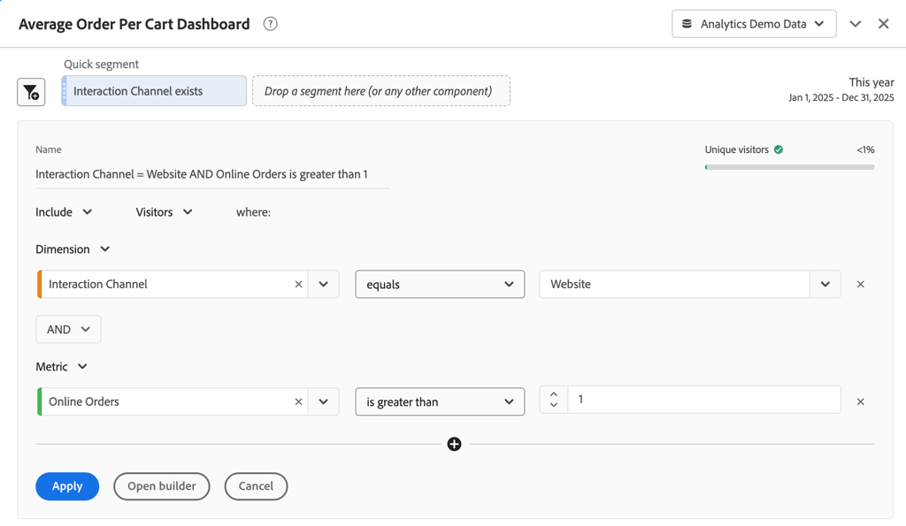

# Schnellsegmente

Schnellsegmente ermöglichen es Ihnen, Daten innerhalb eines Workspace-Projekts schnell zu untersuchen, ohne dass ein Segment in [Segment Builder) erstellt &#x200B;](seg-create.md) muss.

>[!BEGINSHADEBOX]

See  [Schnellsegmente in Analysis Workspace](https://video.tv.adobe.com/v/3410293/?captions=ger&quality=12&learn=on){target="_blank"} finden Sie ein Demovideo.

>[!ENDSHADEBOX]

Beachten Sie bei der Verwendung von Schnellsegmenten Folgendes:

* Schnellsegmente werden direkt in einem Workspace-Projekt erstellt. Daher gilt ein Schnellsegment nur für das Workspace-Projekt, in dem Sie das Schnellsegment erstellen. Die Schnellsegmente in Ihrem Workspace-Projekt sind nicht in anderen Projekten verfügbar und können nicht für andere Benutzer freigegeben werden.
* Sie können nur drei Bedingungen als Teil eines Schnellsegments angeben.
* Schnellsegmente unterstützen keine verschachtelten Container oder sequenziellen Bedingungen.
* Sie können Schnellsegmente in einem freigegebenen Workspace-Projekt bearbeiten. Andere Benutzer können die Schnellsegmente in einem Workspace-Projekt bearbeiten, das Sie für diese Benutzer freigegeben haben.

## Erstellen

Schnellsegmente werden auf Bedienfelder angewendet. Sie können für jedes Bedienfeld in Ihrem Workspace-Projekt ein oder mehrere Schnellsegmente erstellen. Jeder Benutzer in Analysis Workspace kann Schnellsegmente erstellen.

So erstellen Sie ein Schnellsegment:

* Wählen  Bedienfeld „SegmentHinzufügen“ aus.  Bearbeiten Sie dann das Segment direkt im [Quick Segment Builder](#quick-segment-builder).
* Ziehen Sie eine Komponente aus dem Bedienfeld „Komponente“ in den Ablegebereich für Segmente in der Kopfzeile des Bedienfelds. Bewegen Sie nach dem Ablegen den Mauszeiger über das Segment und wählen Sie  aus, um das Segment im [Quick Segment Builder“ &#x200B;](#quick-segment-builder) bearbeiten.

Beachten Sie beim Erstellen eines Schnellsegments per Drag-and-Drop Folgendes:

* Es werden nicht alle Komponententypen unterstützt. Berechnete Metriken werden nicht unterstützt, und nur Dimensionen und Metriken, aus denen Sie Segmente erstellen können, werden unterstützt.
* Für Dimensionen und Metrikkomponenten erstellt [Quick Segment Builder](#quick-segment-builder) automatisch eine **[!UICONTROL exists]**. Wenn Sie beispielsweise per Drag-and-Drop **[!UICONTROL Stadt]** ziehen, wird die Bedingung **[!UICONTROL Stadt]** **[!UICONTROL vorhanden]** erstellt.
* Für Dimensionswerte erstellt [Quick Segment Builder](#quick-segment-builder) automatisch eine **[!UICONTROL gleich]**-Bedingung. Wenn Sie z. B. **[!UICONTROL Amsterdam]** aus den Dimensionselementen **[!UICONTROL Stadt]** ziehen, wird die Bedingung **[!UICONTROL Stadt]** **[!UICONTROL gleich]** `Amsterdam` erstellt.
* Wenn Sie per Drag-and-Drop **[!UICONTROL unspecified]** oder **[!UICONTROL none]**, erstellt [Quick Segment Builder](#quick-segment-builder) automatisch eine Bedingung **[!UICONTROL exists]**.

Die von Ihnen erstellten Schnellsegmente werden oben im Bedienfeld angezeigt. Schnellsegmente haben einen hellblauen, dünnen linken Balken. Wenn sich ein Schnellsegment im Bearbeitungsmodus mit dem [Quick Segment Builder](#quick-segment-builder) befindet, wird der Hintergrund des Schnellsegments hellblau dargestellt.

Die Ergebnisse der Schnellsegmente, die Sie in einem Bedienfeld erstellen, werden (mithilfe der UND-Logik) auf alle Visualisierungen angewendet, die Teil des Bedienfelds sind.

## Verwalten

Um ein Schnellsegment zu verwalten, bewegen Sie den Mauszeiger über das spezifische **[!UICONTROL Schnellsegment]**.

* Wählen Sie  aus, um [Quick Segment Builder](#quick-segment-builder) zu öffnen und das Schnellsegment zu bearbeiten.
* Wählen Sie  aus, um ein Popup zu öffnen. Das Popup zeigt Informationen über das Segment an. Sie können auf **[!UICONTROL Für alle Projekte verfügbar machen und der Komponentenliste hinzufügen]** klicken, um das Segment der Komponentenliste  **[!UICONTROL Segmente]** im Komponentenbereich hinzuzufügen. Ein Dialogfeld **[!UICONTROL Schnellsegment speichern]** wird angezeigt, in dem Sie aufgefordert werden, einen Namen für das Segment anzugeben. Wählen Sie **[!UICONTROL Speichern]** aus, um fortzufahren. Ihr [!UICONTROL Schnellsegment] wird zu einem **[!UICONTROL Segment]**. Das Segment kann nicht mehr mit dem [Quick Segment Builder“ bearbeitet &#x200B;](#quick-segment-builder). Stattdessen müssen Sie das Segment als reguläres Segment bearbeiten, indem Sie den [Segment Builder“ &#x200B;](seg-build.md).

## Quick Segment Builder

Unten finden Sie ein Beispiel für den Quick Segment Builder. In diesem Beispiel wird der Builder für ein Schnellsegment namens &quot;`Interaction Channel = Website  AND Online Orders is greater than 1`&quot; geöffnet. Das Schnellsegment oben gilt nicht für das Bedienfeld **[!UICONTROL Dashboard „Durchschnittlicher Bestellwert]** und alle darin enthaltenen Visualisierungen.

Der Builder für Schnellsegmente besteht aus den folgenden Bereichen und Schaltflächen.

### Kopfzeilenbereich

Der Kopfzeilenbereich bestimmt den Namen, den Typ und den Umfang des Schnellsegments. Außerdem wird eine visuelle Darstellung der Ergebnisse des Schnellsegments angezeigt.

| Element | Beschreibung |
|---|---|
| **[!UICONTROL Name]** | Der Name wird automatisch aus der Schnellsegmentdefinition abgeleitet. |
| **[!UICONTROL Personen]**    | Vorschau der visuellen Daten, die aus dem Schnellsegment resultieren. Ein Balken und ein Prozentwert geben insight an, wie viel der Gesamtdaten Teil des Ergebnisses des Schnellsegments ist. Ein  signalisiert, dass das Schnellsegment keine Daten zurückgibt. |
| **[!UICONTROL Einbeziehen]** **[!UICONTROL Ausschließen]** | Wählen Sie aus der Dropdown aus, ob Sie die Ergebnisse des Schnellsegments aus den Daten im Bedienfeld ein- oder ausschließen möchten. |
| **[!UICONTROL Ereignis]** **[!UICONTROL Sitzung]** **[!UICONTROL Person]** | Wählen Sie aus dem Dropdown- den Umfang des Schnellsegments aus. |

### Bedingungsbereich

Der Bedingungsbereich gibt die Bedingungen an (maximal drei). Für jede Bedingung können Sie Folgendes angeben:

| Element | Beschreibung |
|---|---|
| **[!UICONTROL Dimension]** **[!UICONTROL Metric]** **[!UICONTROL Date Range]** | Wählen Sie aus dem Dropdown-Menü  aus, ob Sie eine Bedingung für eine Dimension, eine Metrik oder einen Datumsbereich angeben möchten. |
| **[!UICONTROL *Komponente *]** | Das Komponentenfeld für die Bedingung. Sie können über [!UICONTROL *Zum Hinzufügen eingeben*] eine Komponente eingeben, eine Komponente aus der Liste auswählen oder eine Komponente per Drag-and-Drop aus dem Panel „Komponente“ ziehen. Sie können ähnliche Komponenten nur im Komponentenfeld der Bedingung ablegen. Beispielsweise können Sie eine Dimensionskomponente nur aus dem Panel „Komponente“ in einer Dimensionsbedingung ablegen.  Sie können per Drag-and-Drop auch eine vorhandene Komponente ersetzen. Wählen Sie  aus, um die Komponente aus dem Komponentenfeld zu löschen. |
| **[!UICONTROL *Operator *]** | Der Operator für die Komponente. Weitere Informationen finden Sie unter [Operatoren](../seg-reference/seg-operators.md). Nur für Dimensionen und Metriken verfügbar. |
| **[!UICONTROL *value *]** | Der Wert für die Bedingung. Je nach ausgewähltem Operator kann der Wert aus einer Liste ausgewählt werden oder Sie geben einen Wert ein. |
|  | Wählen Sie diese Option aus, um eine Bedingung aus dem Schnellsegment zu löschen. |

### Schaltflächen

| Schaltfläche | Beschreibung |
|---|---|
| **[!UICONTROL UND]** **[!UICONTROL ODER]** | Nur verfügbar, wenn Sie mehrere Bedingungen definieren. Wählen Sie aus dem Dropdown-Menü  zwischen den Bedingungen aus. Die Auswahl bestimmt die boolesche Logik für das Schnellsegment. Logik kann nicht gemischt werden, wenn drei Bedingungen vorliegen. Die boolesche Logik lautet entweder **[!UICONTROL UND]** oder **[!UICONTROL ODER]**. |
|  | Fügt eine weitere Bedingung zu Ihrem Schnellsegment hinzu. Diese Schaltfläche ist nur verfügbar, wenn Sie eine oder zwei Bedingungen für das Schnellsegment definiert haben. |
| **[!UICONTROL Anwenden]** | Wenden Sie die Änderungen auf das Schnellsegment an. |
| **[!UICONTROL Builder öffnen]** | Sie werden im Dialogfeld **[!UICONTROL Sind Sie sicher?]** zur Bestätigung aufgefordert. Wenn Sie **[!UICONTROL OK]** auswählen, können Sie Ihr Segment nicht mehr in [Quick Segment Builder](#quick-segment-builder) ändern. Ihr Schnellsegment wird in **[!UICONTROL Segment]** umbenannt und hat jetzt einen dunkelblauen, dünnen linken Balken. Der reguläre [Segment Builder](seg-build.md) wird mit der Option geöffnet, **[!UICONTROL Dieses Segment für alle Projekte verfügbar zu machen und es zur Komponentenliste]**. <ul><li>Wenn Sie diese Option auswählen und **[!UICONTROL Anwenden]** wählen, wird das Segment zur Komponentenliste  **[!UICONTROL Segment]** im Komponentenbereich hinzugefügt.</li><li>Wenn Sie diese Option nicht auswählen und auf **[!UICONTROL Übernehmen]** klicken, bleibt das Segment ein reines Workspace-Projektsegment.</li></ul> |
| **[!UICONTROL Abbrechen]** | Wählen Sie diese Option aus, um die Erstellung oder Bearbeitung eines Schnellsegments abzubrechen. |

## Schnellsegmente im Vergleich zu Segmenten

Schnellsegmente werden genau so benannt wie sie. Sie können Schnellsegmente schnell inline erstellen und bearbeiten und die Auswirkungen sofort in Ihrem Bedienfeld sehen.

Segmente haben im Vergleich zu Schnellsegmenten die folgenden Vorteile.

* Segmente können für alle Workspace-Projekte verfügbar gemacht werden
* Segmente unterstützen eine höhere Komplexität bei der Verwendung verschachtelter und hierarchischer [Container](../seg-containers.md) und Sequenzen (unter Verwendung [sequenzieller Segmente](seg-sequential-build.md).
