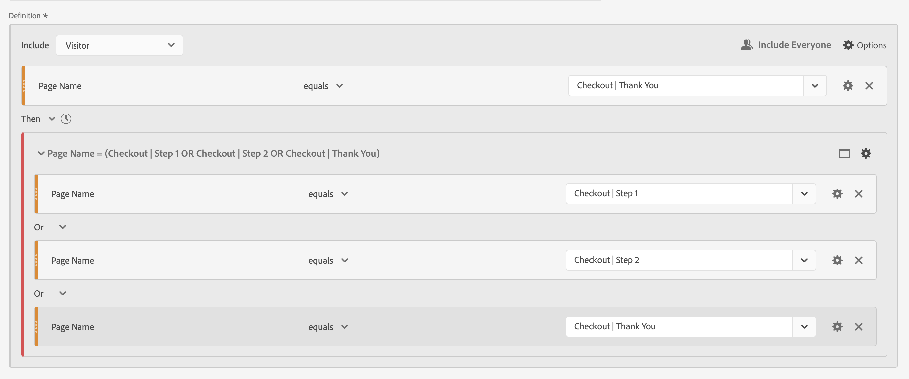
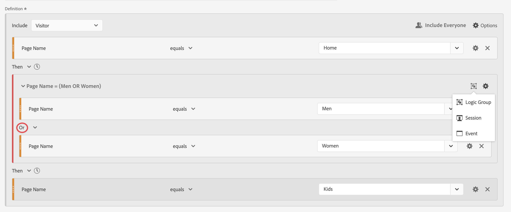

# Sequenzielle Segmente

Sequenzielle Segmente erstellen Sie mit dem [!UICONTROL Then] logischen Operator zwischen Komponenten, Containern und Komponenten oder Containern. Der [!UICONTROL Dann] logische Operator bedeutet, dass eine Segmentbedingung auftritt, gefolgt von einer anderen.

Darüber hinaus können Sie sequenzielle Segmente mithilfe der Operatoren &quot;**[!UICONTROL &quot; und „Innerhalb“ auf eine bestimmte Zeitdauer]** Granularität und Anzahl **[!UICONTROL Checkpoints]**.

>[!BEGINSHADEBOX]

Siehe  [Sequenzielle Segmentierung](https://video.tv.adobe.com/v/25405?quality=12&learn=on){target="_blank"} für ein Demovideo.

>[!ENDSHADEBOX]

Ein sequenzielles Segment verfügt über einige [grundlegende Funktionen](#basics) und zusätzliche Optionen, die Sie konfigurieren können, um das sequenzielle Segment komplexer zu gestalten:

## Grundlagen

Die Grundlagen zum Erstellen eines sequenziellen Segments unterscheiden sich nicht vom Erstellen eines regulären Segments mit dem [Segment Builder](seg-build.md). Ein reguläres Segment wird automatisch zu einem sequenziellen Segment, sobald Sie den **[!UICONTROL Dann]**-Operator in der Hauptdefinition oder in einem der Container auswählen, die Sie im [Segmentierungs-Builder](seg-build.md) verwenden.

### Beispiele

Die folgenden Beispiele veranschaulichen die Verwendung sequenzieller Segmente in verschiedenen Anwendungsfällen.

#### Einfache Sequenz

Identifizieren Sie Benutzer, die eine Seite und anschließend eine andere Seite angezeigt haben. Die Daten auf Trefferebene werden mithilfe dieser Sequenz segmentiert. Unabhängig von früheren, vergangenen oder zwischengeschalteten Besucherbesuchen oder der Zeit oder Anzahl der Seitenaufrufe, die zwischen den Besuchen stattfinden.

#### Reihenfolge der Besuche

Besucherinnen und Besucher identifizieren, die eine Seite bei einem Besuch und dann bei einem anderen Besuch eine andere Seite angesehen haben. Um zwischen Besuchen zu unterscheiden, verwenden Sie Container, um die Sequenz zu erstellen, und definieren Sie  **[!UICONTROL Besuch]**-Ebene für jeden Container.

#### Sequenz mit gemischten Ebenen

Identifizieren Sie Besucher, die zwei Seiten über eine unbestimmte Anzahl von Besuchen hinweg anzeigen, und zeigen Sie dann eine dritte Seite in einem separaten Besuch an. Auch hier verwenden Sie Container, um die Sequenz zu erstellen und Besuch **[!UICONTROL Besuch]** auf dem Container zu definieren, der den separaten Besuch definiert.

#### Aggregierte Sequenz

Identifizieren Sie Besucher, die beim ersten Besuch einer bestimmten Seite und später bei einigen anderen Seiten waren. Um zwischen der Sequenz von Treffern zu unterscheiden, verwenden Sie Container, um die Logik auf der Container-Ebene **[!UICONTROL Visit]** zu trennen.

#### Verschachteln einer Sequenz

Ermitteln Sie alle Besuche, bei denen ein Besucher eine Seite vor einer anderen besucht, und führen Sie dann Folgebesuche durch, die zwei andere Seiten betreffen. Identifizieren Sie beispielsweise alle Besuche, bei denen ein Besucher zuerst die Startseite und dann eine Kategorie-1-Seite besucht und dann andere Besuche hat, bei denen bei jedem Besuch die Kategorie-2- und Kategorie-3-Seite besucht werden.

## [!UICONTROL Nachher] und [!UICONTROL Innerhalb]

Sie können  **[!UICONTROL After]** und  **[!UICONTROL Within]** den **[!UICONTROL Then]**-Operator verwenden, um zusätzliche [Zeitbeschränkungen](#time-constraints) oder [Beschränkungen für Treffer, Besuche oder Dimensionen ](#event-session-and-dimension-constraints).

### Zeitliche Beschränkungen

So wenden Sie Zeitbeschränkungen auf den Operator **[!UICONTROL Then]** an:

1. Wählen Sie  aus.
1. Wählen **[!UICONTROL Innerhalb]** oder **[!UICONTROL Nachher]** aus dem Kontextmenü aus.
1. Geben Sie einen Zeitraum (**[!UICONTROL Minute]**, **[!UICONTROL Stunde]** bis **[!UICONTROL Jahre]**) an.
1. Wählen Sie  **[!UICONTROL *number *]**aus, um ein Popup zu öffnen, in dem Sie eine Zahl eingeben oder mit**[!UICONTROL -]**oder**[!UICONTROL +]**angeben können.

Um eine Zeitbeschränkung zu entfernen, verwenden Sie .

In der folgenden Tabelle werden die Zeitbeschränkungsoperatoren genauer erläutert.

| Operatoren | Beschreibung |
|--- |--- |
| **[!UICONTROL nachher]** | Der [!UICONTROL After]-Operator wird verwendet, um eine Mindestgrenze für den Zeitraum zwischen zwei Checkpoints anzugeben. Beim Festlegen der After-Werte beginnt das Zeitlimit mit der Anwendung des Segments. Wenn beispielsweise der Operator [!UICONTROL After] auf einem Container festgelegt ist, um Besucher zu identifizieren, die Seite A besuchen, aber erst nach einem Tag zu Seite B zurückkehren, beginnt dieser Tag, wenn der Besucher Seite A verlässt.  Damit der Besucher in das Segment aufgenommen werden kann, muss nach dem Verlassen von Seite A zur Ansicht von Seite B mindestens 1440 Minuten (ein Tag) erkennbar sein. |
| **[!UICONTROL Innerhalb]** | Der [!UICONTROL In]-Operator wird zum Angeben einer maximalen Zeitbegrenzung zwischen zwei Checkpoints verwendet. Wenn beispielsweise der Operator [!UICONTROL Innerhalb] auf einem Container festgelegt ist, um Besucher zu identifizieren, die Seite A besuchen, und dann innerhalb eines Tages zu Seite B zurückkehren, beginnt dieser Tag, wenn der Besucher Seite A verlässt. Um in das Segment aufgenommen zu werden, hat der Besucher maximal einen Tag Zeit, bevor er Seite B öffnet. Damit der Besucher in das Segment aufgenommen werden kann, muss das Öffnen von Seite B innerhalb von maximal 1440 Minuten (einen Tag) nach dem Verlassen von Seite A erfolgen, um Seite B anzuzeigen. |
| **[!UICONTROL nach, aber innerhalb von]** | Bei Verwendung der Operatoren [!UICONTROL After] und [!UICONTROL Within] beginnen und enden beide parallel, nicht sequenziell.  Sie erstellen beispielsweise ein Segment, für das der Container auf `After = 1 Week(s) and Within = 2 Week(s)` festgelegt ist. Die Bedingungen zur Identifizierung von Besuchern in diesem Segment sind nur zwischen einer und zwei Wochen erfüllt. Beide Bedingungen werden ab dem Zeitpunkt der ersten Seitenansicht erzwungen. |

#### Beispiele

Einige Beispiele für die Verwendung der Zeitbeschränkungen.

##### [!UICONTROL After]-Operator

Besucherinnen und Besucher identifizieren, die erst nach zwei Wochen eine Seite und dann eine weitere Seite besucht haben. Beispielsweise Besucher, die die Startseite besucht haben, aber die Frauen | Schuhe Seite erst nach zwei Wochen.

Wenn am 1. Juni 2024 um 00:01 eine Seitenansicht für die Startseite erfolgt, erfolgt eine Seitenansicht für die Seite „Frauen“ | Die Schuhe stimmen überein, solange diese Seitenansicht nach dem 15. Juni 2024 um 00:01 Uhr erfolgt.

##### [!UICONTROL Within]-Operator

Besucherinnen und Besucher identifizieren, die innerhalb von fünf Minuten eine Seite und dann eine andere Seite besucht haben. Dies könnten beispielsweise Besucher sein, die erst die Startseite und dann die Seite „Frauen“ besucht haben | Schuhe Seite innerhalb von 5 Minuten.

Wenn am 1. Juni 2024 um 12:01 Uhr eine Seitenansicht für die Startseite erfolgt, erfolgt eine Seitenansicht auf der Seite Frauen . | Die Schuhe stimmen überein, solange diese Seitenansicht vor dem 15. Juni 2024, 12:16 Uhr, erfolgt.

##### [!UICONTROL After] but [!UICONTROL Within]-Operator

Besucherinnen und Besucher identifizieren, die eine Seite besucht und dann nach zwei Wochen, aber innerhalb eines Monats, eine andere Seite besucht haben. Dies können beispielsweise Besucherinnen und Besucher sein, die die Startseite besucht haben, und dann nach zwei Wochen und innerhalb eines Monats die Frauen | Seite Schuhe.

Alle Besucherinnen und Besucher, die am 1. Juni 2024 auf die Startseite gelangen und wieder zu den Frauen zurückkehren | Schuhe Seite nach dem 15. Juni 2019 00:01, aber vor dem 1. Juli 2019 qualifiziert für das Segment.

### [!UICONTROL Treffer], [!UICONTROL Besuch] und [!UICONTROL Dimension ] Einschränkungen

Mit den Begrenzungen  **[!UICONTROL After]** und  **[!UICONTROL Within]** können Sie nicht nur eine Zeitbeschränkung, sondern auch eine Treffer-, Besuchs- oder Dimensionsbeschränkung angeben. Wählen Sie **[!UICONTROL Treffer(]**), **[!UICONTROL Besuch(e)]** oder **[!UICONTROL Andere Dimensionen]**  **[!UICONTROL *Dimension-Name *]**. Sie können das Feld [!UICONTROL *Suche*] verwenden, um nach einer Dimension zu suchen.

#### Beispiel

Nachfolgend finden Sie ein Beispiel für ein sequenzielles Segment, das nach Besuchern sucht, die eine Produktkategorieseite (Frauen) besucht haben | Schuhe), gefolgt von einer Checkout-Seite (Checkout | Vielen Dank) innerhalb einer Seite.

Die folgenden Beispielsequenzen stimmen überein oder nicht überein:

| Sequenz |  |
|--- | :---: |
| Seite `Women \| Shoes` gefolgt von Seite `Checkout \| Thank You` |  |
| Seite `Women \| Shoes` gefolgt von Seite `Women \| Tops` gefolgt von Seite `Checkout \| Thank You` |  |

## [!UICONTROL Einschließlich]

Sie können angeben, welche Daten in Ihr sequenzielles Segment oder in einen sequenziellen Container, der Teil Ihres sequenziellen Segments ist, aufgenommen werden sollen.

### [!UICONTROL Alle] {#include_everyone}

Um ein sequenzielles Segment zu erstellen, das alle umfasst, wählen Sie die Option  **[!UICONTROL Alle einschließen]**.

Das sequenzielle Segment identifiziert Daten, die dem angegebenen Muster als Ganzes entsprechen.  Nachfolgend finden Sie ein Beispiel für ein einfaches Sequenzsegment, das nach Besuchern sucht, die eine Produktkategorieseite (Frauen) besucht haben | Schuhe), gefolgt von einer Checkout-Seite (Checkout | Vielen Dank). Das Segment ist auf  (Include **[!UICONTROL everyone]** festgelegt.

Die folgenden Beispielsequenzen stimmen überein oder nicht überein:

| | Sequenz |  |
|---:|--- | --- |
| 1 | `Women \| Shoes` dann `Checkout \| Thank You` bei demselben Besuch |  |
| 2 | `Women \| Shoes` dann `Men \| Shoes` dann `Checkout \| Thank You` (über verschiedene Besuche hinweg) |  |
| 3 | `Checkout \| Thank You` dann `Women \| Shoes` |  |

### [!UICONTROL Nur vor Sequenz] und [!UICONTROL Nur nach Sequenz]

Die Optionen  **[!UICONTROL Only Before Sequence]** und  **[!UICONTROL Only After]** segmentieren die Daten in eine Teilmenge vor oder nach der angegebenen Sequenz.

*  **Nur vor Sequenz**: Umfasst alle Daten vor einer Sequenz und die ersten Daten der Sequenz selbst. Wenn eine Sequenz mehrmals als Teil der Daten angezeigt wird, enthält [!UICONTROL Nur vor Sequenz] den ersten Treffer des letzten Vorkommens der Sequenz und alle vorherigen Treffer.
*  **Only After**: Enthält alle Treffer nach einer Sequenz und die letzten Daten der Sequenz selbst. Wenn eine Sequenz mehrmals als Teil der Daten angezeigt wird, enthält [!UICONTROL Nur nach Sequenz] den letzten Treffer des ersten Vorkommens der Sequenz und alle nachfolgenden Treffer.

Nehmen wir eine Definition, die eine Sequenz einer Komponente mit Kriterien spezifiziert, die durch B identifiziert wurden, gefolgt von einer Komponente mit Kriterien, die durch D identifiziert wurden (Then). Die drei Optionen würden Daten wie folgt identifizieren:

| B dann D | A | B | C | D | E | F |
|---|:---:|:---:|:---:|:---:|:---:|:---:|
| Alle einschließen |  |  |  |  |  |  |
| Nur vor Sequenz |  |  |  |  |  |  |
| Nur nach Sequenz |  |  |  |  |  |  |

| B Dann D (tritt mehrmals auf) | A | B | C | D | B | C | D | E |
|---|:---:|:---:|:---:|:---:|:---:|:---:|:---:|:---:|
| Alle einschließen |  |  |  |  |  |  |  |  |
| Nur vor Sequenz |  |  |  |  |  |  |  |  |
| Nur nach Sequenz |  |  |  |  |  |  |  |  |

#### Beispiel

Sie haben drei Versionen eines sequenziellen Segments für Site-Abschnitte definiert. Eine mit der Option  **[!UICONTROL Include everyone]**, eine mit der Option  **[!UICONTROL Only Before Sequence]** und eine mit der Option **[!UICONTROL Only After]**. Sie haben die drei Segmente entsprechend benannt.

Beim Reporting für Site-Abschnitte mit diesen drei Segmenten sieht die Beispielausgabe in einer Freiformtabelle wie folgt aus:

## [!UICONTROL Ausschließen]

Segmentdefinitionen enthalten alle Daten, es sei denn, Sie schließen  [!UICONTROL Person],  [!UICONTROL Besuch] oder [!UICONTROL  Treffer] Daten mit **[!UICONTROL Exclude]** aus.

[!UICONTROL Ausschließen] ermöglicht es Ihnen, gängige Daten zu verwerfen und Segmente mit stärkerem Fokus zu erstellen. Mit „Ausschließen“ können Sie auch Segmente erstellen, die bestimmte Besuchergruppen ausschließen. Beispielsweise um ein Segment zu definieren, das Besucher angibt, die Bestellungen aufgegeben haben, und dann diese Besuchergruppe auszuschließen, um (Nicht *Käufer)* identifizieren. Es empfiehlt sich, Regeln zu erstellen, die eine breite Definition verwenden, anstatt zu versuchen, [!UICONTROL Ausschließen] für bestimmte Besucher auszuwählen, die bestimmten Einschlusswerten entsprechen.

Beispiele für Ausschlussdefinitionen:

* **Schließen Sie Seiten aus**. Verwenden Sie eine Segmentdefinition, um eine bestimmte Seite (z *B. &quot;*„) aus einem Bericht zu entfernen, eine Trefferregel zu erstellen, bei der die Seite gleich `Home Page`, und dann die Regel auszuschließen. Diese Definition umfasst automatisch alle Seiten außer der *Startseite*.
* **Schließen Sie die Referrerdomäne aus**. Verwenden Sie eine Definition, die nur verweisende Domains von Google.com umfasst und alle anderen ausschließt.
* **Identifizieren Sie Nicht-Käufer**. Ermitteln Sie, wenn die Bestellungen größer als null sind, und schließen Sie dann die [!UICONTROL Person] aus.

[!UICONTROL Ausschließen] kann verwendet werden, um eine Sequenz zu identifizieren, in der Besucher nicht Teil bestimmter Besuche sind oder bestimmte Treffer ausführen. [!UICONTROL Ausschließen] kann auch in eine [!UICONTROL logische Gruppe“ aufgenommen werden ]siehe unten).

Sie können Container ausschließen, keine Komponenten.

### Beispiele

Nachfolgend finden Sie Beispiele für die Verwendung von [!UICONTROL Ausschließen].

#### [!UICONTROL Ausschließen] innerhalb von

Besucherinnen und Besucher identifizieren, die eine Seite besucht, keine andere Seite besucht und dann noch eine andere Seite besucht haben. Sie schließen den Container mit &quot; &quot;[!UICONTROL &quot; ]. Ein ausgeschlossener Container wird durch einen dünnen roten Balken auf der linken Seite gekennzeichnet.

#### [!UICONTROL Ausschließen] am Anfang

Besucherinnen und Besucher identifizieren, die eine Seite besucht haben, ohne jemals eine andere Seite zu besuchen. Personen, die beispielsweise einen Kauf getätigt haben, ohne die Startseite besucht zu haben.

#### [!UICONTROL Ausschließen] am Ende

Besucher identifizieren, die eine Seite, aber nie andere Seiten besucht haben. Besucherinnen und Besucher, die beispielsweise Ihre Startseite, aber nie eine Ihrer Checkout-Seiten besucht haben.

## [!UICONTROL logische Gruppe]

>[!NOTE]
>
>Eine [!UICONTROL logische Gruppe] kann nur in einem sequenziellen Segment definiert werden, was bedeutet, dass der [!UICONTROL Then]Operator innerhalb des Containers verwendet wird.

Mit der logischen Gruppe können Sie Bedingungen in einem einzigen sequenziellen Segment-Checkpoint gruppieren. Als Teil der Sequenz wird die Logik, die in dem als logische Gruppe identifizierten Container definiert ist, nach einem vorherigen sequenziellen Checkpoint und vor einem nachfolgenden sequenziellen Checkpoint ausgewertet.

Die Bedingungen innerhalb der Logikgruppe selbst können in beliebiger Reihenfolge erfüllt werden. Nicht sequenzielle Container (Treffer, Besuch, Besucher) erfordern dagegen nicht, dass ihre Bedingungen innerhalb der Gesamtsequenz erfüllt sind, was bei Verwendung mit einem „Dann **[!UICONTROL -]** zu intuitiven Ergebnissen führen kann.

[!UICONTROL Logic Group] wurde entwickelt, um *mehrere Bedingungen als eine Gruppe, ohne Reihenfolge* zwischen den gruppierten Bedingungen zu behandeln. Andernfalls ist die Reihenfolge der Bedingungen innerhalb einer logischen Gruppe irrelevant.

Einige Best Practices für die Verwendung der Logikgruppe sind:

* So gruppieren Sie sequenzielle Checkpoints.
* Zur Vereinfachung der Erstellung sequenzieller Segmente.

### Beispiele

Im Folgenden finden Sie Beispiele zur Verwendung des logischen Gruppen-Containers.

#### Beliebige Bestellung

Identifizieren Sie Besucher, die eine Seite besucht und dann jede Seite aus einem anderen Seitensatz in beliebiger Reihenfolge angesehen haben. Beispielsweise haben Besucher, die die Startseite und anschließend die Seiten „Männer“, „Frauen“ und „Kinder“ unabhängig von der Reihenfolge besucht.

Sie können dieses Segment ohne eine [!UICONTROL logische Gruppe] erstellen, aber die Konstruktion wird komplex und mühsam sein. Geben Sie jede Folge von Seiten an, die der Besucher anzeigen konnte. Aus Gründen der Übersichtlichkeit wird nur der erste Container geöffnet  und die anderen Container werden geschlossen . Den Inhalt der anderen Container können Sie anhand der Titel ableiten.

Sie können die [!UICONTROL logische Gruppe] verwenden, um die Erstellung dieses Segments zu vereinfachen, wie unten dargestellt. Stellen Sie sicherGruppe **[!UICONTROL logische Gruppe]** für den Container auswählen.

#### Erstes Spiel

Besucherinnen und Besucher identifizieren, die eine Seite oder eine andere Seite und dann noch eine andere Seite besucht haben. Besucherinnen und Besucher, die beispielsweise die Seiten „Frauen“ oder „Männer“ und anschließend die Kasse besucht haben | Dankeseite.

#### [!UICONTROL exclude] [!UICONTROL and]

Besucherinnen und Besucher identifizieren, die eine Seite besucht und dann explizit keine anderen Seiten besucht haben, sondern eine weitere Seite. Besucherinnen und Besucher, die beispielsweise die Startseite besucht haben, haben nicht die Seite „Männer“ oder „Frauen“ besucht, sondern die Seite „Kinder“.

#### [!UICONTROL Ausschließen] [!UICONTROL ODER]

Besucherinnen und Besucher identifizieren, die eine Seite besucht haben, dann explizit keine Seite eines Satzes von Seiten besucht haben, sondern eine weitere Seite besucht haben. Besucherinnen und Besucher, die beispielsweise die Startseite besucht haben, haben nicht die Seite „Männer und Frauen“ besucht, sondern die Seite „Kinder“.

<!--
An example of a complex sequential segment if you want to find the visitors that 

| visit One | visit Two | visit Three |
| --- | --- | --- |
| The visitor went to the main landing page A, excluded the campaign page B, and then viewed the Product page C.| The visitor again went to the main landing page A, excluded the campaign page B, and went again to the Product page C, and then to a new page D. | The visitor entered and followed that same path as in the first and second visits, then excluded page F to go directly to a targeted product on page G. |
-->

## Ein letztes Beispiel

Als letztes Beispiel möchten Sie Besuchende identifizieren, die von einer bestimmten Produktseite erfahren haben, ohne dass diese Besucher jemals von Ihrer Kampagne „Empower Your Move“ berührt wurden. Und bei ihrem ersten Besuch in Ihrem Online-Shop die Startseite angesehen, aber nicht weiter auf Fitness (Ausrüstung) Produkte aus der Kategorie Männer. Bei ihrem nächsten Besuch direkt danach gingen sie jedoch auf eine Produktseite und gaben eine Online-Bestellung auf, ohne die Startseite zuerst zu durchlaufen.

