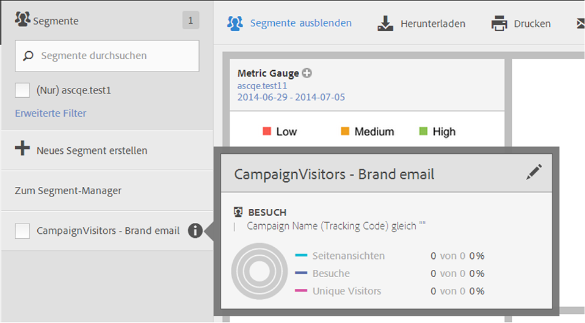
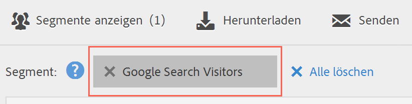

# Verwenden von Segmenten

Um Segmente in Analysis Workspace zu verwenden, ziehen Sie einfach ein oder mehrere Segmente aus **[!UICONTROL Segmente]** in die Komponentenleiste und legen Sie sie dort ab:

* Ein [Bedienfeld](/help/analyze/analysis-workspace/c-panels/panels.md) in Analysis Workspace zum Segmentieren aller Visualisierungen im Bedienfeld.
* Eine Kopfzeile in einer [Freiformtabelle](/help/analyze/analysis-workspace/visualizations/freeform-table/freeform-table.md) in Analysis Workspace, die die Dimension ersetzt.
* Eine Zeile in einer [Freiformtabelle](/help/analyze/analysis-workspace/visualizations/freeform-table/freeform-table.md) in Analysis Workspace, um eine Aufschlüsselung einzuleiten.
* Eine Spalte in einer [Freiformtabelle](/help/analyze/analysis-workspace/visualizations/freeform-table/freeform-table.md) in Analysis Workspace zum Hinzufügen oder Ersetzen einer Spalte oder zum Initiieren eines Filters.
* Konfigurations-Bedienfelder für Visualisierungen oder Bedienfelder, in denen Segmente abgelegt werden können. Beispielsweise in einem Bedienfeld [Segmentvergleich](/help/analyze/analysis-workspace/c-panels/c-segment-comparison/segment-comparison.md) oder einer [Schlüsselmetrik](/help/analyze/analysis-workspace/visualizations/key-metric.md)Zusammenfassungsvisualisierung
* Der [Definition-Builder für ein Segment](/help/components/segmentation/segmentation-workflow/seg-build.md#definition-builder), sodass Sie ein Segment in Ihre Segmentdefinition einschließen.
* Der [Definition-Builder für eine berechnete ](/help/components/calculated-metrics/workflow/c-build-metrics/cm-build-metrics.md#definition-builder)), sodass Sie ein Segment in Ihre berechnete Metrikdefinition einbeziehen.

<!--
How to apply one or more segments to a report from the segment rail.

1. Bring up the report to which you want to apply a segment, for example the [!UICONTROL Pages Report].
1. Click **[!UICONTROL Show Segments]** above the report. The segment rail opens.

   

1. Mark the checkbox next to one or more of the segments or **[!UICONTROL Search Segments]** to find the right segment.

   >[!NOTE]
   >
   >You can apply more than one segment to a report (this is called segment stacking). When multiple segments are applied, the criteria in each segment is combined using an 'and' operator and then applied. There is no limit to how many segments you can stack.

   >[!NOTE]
   >
   >Clicking the Information icon (i) next to the segment name lets you preview the key metrics to see whether you have a valid segment and how broad the segment is.

1. You can filter by report suite by selecting the **[!UICONTROL (Only) `<report suite name>`]** check box. This will show only those segments that were last saved in that report suite.
1. Click **[!UICONTROL Apply Segment]** and the report will refresh. The segment or segments that are applied now display at the top of the report:

   

-->
