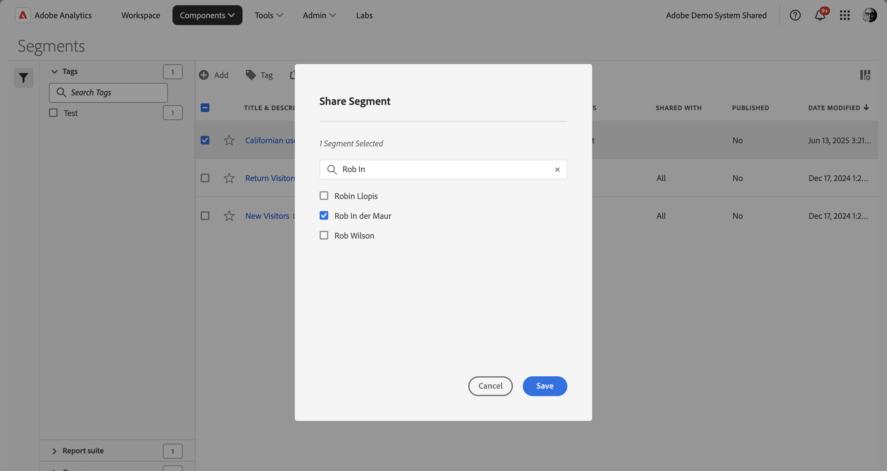

# Freigeben von Segmenten

Abhängig von Ihren Berechtigungen können Sie Segmente für Ihre gesamte Organisation, Gruppen oder einzelne Benutzer freigeben.

| Administrator | Können Segmente für alle, für Gruppen und für Benutzende freigeben. Gruppen werden in der Admin Console als Berechtigungsgruppen eingerichtet. |
|---|---|
| Nicht-Administrator | Segmente können nur für einzelne Benutzer freigegeben werden. |

Wann sollten Sie Segmente für das gesamte Unternehmen im Vergleich zu einer Gruppe von Benutzern oder Einzelpersonen freigeben? Im Folgenden finden Sie einige Best Practices, denen Sie folgen können:

* Geben Sie als Administrator ein Segment für **[!UICONTROL Alle]** frei, wenn es für das gesamte Unternehmen von Nutzen ist und von jedem bequem verwendet werden kann. In diesem Fall sollten Sie das Segment eventuell auch [genehmigen](/help/components/segmentation/segmentation-workflow/seg-approve.md).

* Geben Sie als Administrator ein Segment für eine bestimmte **[!UICONTROL Gruppe]** frei, wenn das Segment für das entsprechende Team einen Geschäftswert bietet. Diesen Segmenttyp nicht offiziell genehmigen.
* Geben Sie als Administrator oder einzelner Benutzer ein Segment für andere Personen frei, um es zu überprüfen und zu validieren. Wenn er sich als nicht nützlich erweist, kann er verworfen werden. Diesen Segmenttyp nicht offiziell genehmigen.

1. Wählen Sie im Segment-Manager  das Kontrollkästchen neben dem Segment aus, das Sie freigeben möchten.
1. Wählen Sie  Freigeben aus.
1. Im Dialogfeld **[!UICONTROL Segmente freigeben]**:

   

   Wenn Sie Administrator sind, können Sie **[!UICONTROL Alle]** oder **[!UICONTROL Gruppen]** und **[!UICONTROL Benutzer]** in Ihrer Organisation auswählen. Als Nicht-Administrator sehen Sie nur einzelne Benutzer. Benutzen Sie das Feld **[!UICONTROL Suchen]**, um nach Gruppen oder Benutzern zu suchen. 1.

   1. (Optional) Verwenden Sie , um *Einzelpersonen oder Gruppen suchen* die Liste der Gruppen oder Einzelpersonen, für die Sie das Segment freigeben möchten, zu suchen und einzuschränken.

   1. Wählen Sie **[!UICONTROL Speichern]** aus, um die Segmente freizugeben. Wählen Sie zum Abbrechen **[!UICONTROL Abbrechen]** aus.

   Neben dem Segment wird das Freigabesymbol angezeigt:  

1. Sie können nach für Sie freigegebenen Segmenten filtern, indem Sie zu **[!UICONTROL Filter]** > **[!UICONTROL Weitere Filter]** > **[!UICONTROL Für mich freigegeben]** wechseln.

## Best Practices

Im Folgenden finden Sie Best Practices für die Freigabe von Segmenten und für die Freigabe von Segmenten.

* Geben Sie als Administrator ein Segment nur dann für alle frei, wenn Sie überzeugt sind, dass es jemand in Ihrer Organisation mit der Verwendung der Segmente vertraut ist. Sie können auch erwägen, diese Segmente zu bevorzugen. Weitere Informationen [ Sie unter ](t-seg-favorite.md) als Favorit markieren.

* Geben Sie als Administrator ein Segment für eine bestimmte Gruppe frei, wenn dieses Segment einen Geschäftswert für die Benutzer dieser Gruppe bietet.

* Geben Sie als Administrator oder einzelner Benutzer ein Segment für eine oder mehrere Personen frei, um ein Segment zu validieren. Wenn sich die Segmente als nicht nützlich erweisen, können Sie das Segment löschen.
