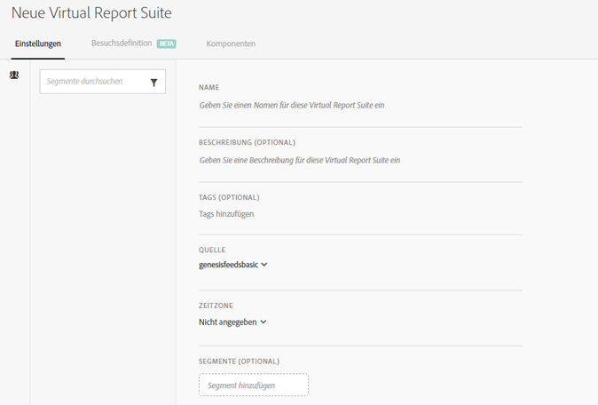
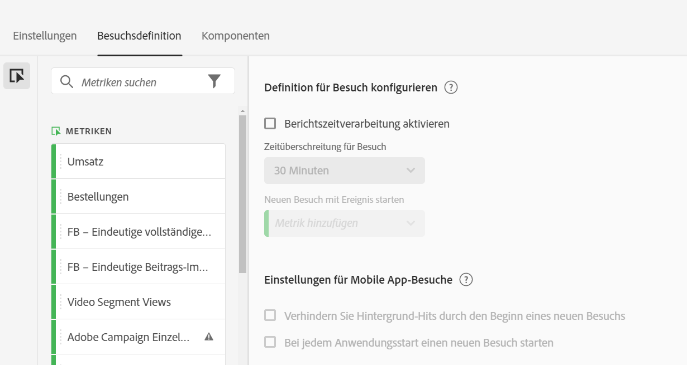
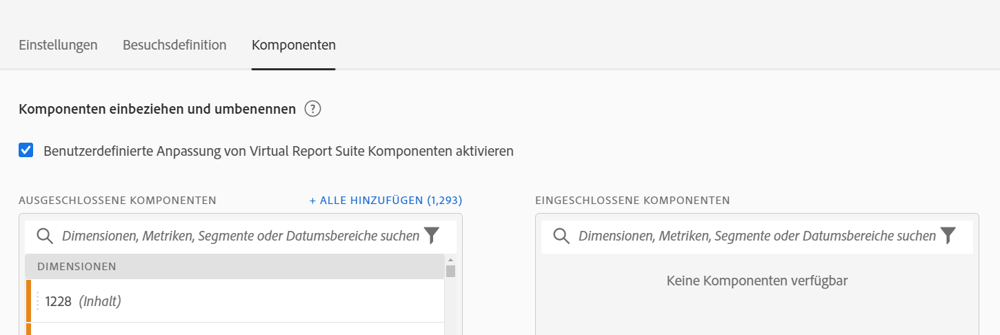

# Virtual Report Suites erstellen

Bevor Sie anfangen, Virtual Report Suites zu erstellen, sollten Sie folgende Aspekte berücksichtigen.

* Benutzende ohne Administratorrechte können den Virtual Report Suites-Manager nicht sehen.
* Virtual Report Suites können nicht freigegeben werden. „Freigabe“ erfolgt über Gruppen/Berechtigungen.
* Im Virtual Report Suites-Manager können Sie nur Ihre eigenen Virtual Report Suites sehen. Sie müssen auf „Alle anzeigen“ klicken, um die aller anderen anzuzeigen.

1. Navigieren Sie zu **[!UICONTROL Komponenten]** > **[!UICONTROL Virtual Report Suites]**.
1. Klicken Sie auf **[!UICONTROL Hinzufügen +]**.

   

## Definieren von Einstellungen

Definieren Sie auf der Registerkarte [!UICONTROL Einstellungen] diese Einstellungen und klicken Sie dann auf **[!UICONTROL Weiter]**.

| Element | Beschreibung |
| --- |--- |
| Name | Der Name der Virtual Report Suite wird nicht von der übergeordneten Report Suite übernommen und sollte sich von diesem unterscheiden. |
| Beschreibung | Fügen Sie eine gute Beschreibung hinzu, die den Benutzern Ihres Unternehmens zugutekommt. |
| Tags | Sie können Tags hinzufügen, um Ihre Report Suites zu organisieren. |
| Quelle | Die Report Suite, von der diese Virtual Report Suite die folgenden Einstellungen erbt. Die meisten Service-Levels und Funktionen (z. B. eVar-Einstellungen, Verarbeitungsregeln, Klassifizierungen usw.) werden vererbt. Um Änderungen an diesen geerbten Einstellungen in einer Virtual Report Suite vorzunehmen, müssen Sie die übergeordnete Report Suite bearbeiten (Admin > Report Suites). |
| Zeitzone | Die Auswahl einer Zeitzone ist optional. Wenn Sie eine Zeitzone auswählen, wird diese zusammen mit der Virtual Report Suite gespeichert. Wenn Sie keine Zeitzone auswählen, wird die Zeitzone der übergeordneten Report Suite verwendet.  Beim Bearbeiten einer Virtual Report Suite wird die mit der Virtual Report Suite gespeicherte Zeitzone in der Dropdown-Auswahl angezeigt. Wenn die Virtual Report Suite erstellt wurde, bevor die Zeitzonenunterstützung hinzugefügt wurde, wird die Zeitzone der übergeordneten Report Suite in der Dropdown-Auswahl angezeigt. |
| Segmente | Sie können nur ein Segment hinzufügen oder Sie können Segmente stapeln.   Hinweis: Beim Stapeln von zwei Segmenten werden diese durch eine AND-Anweisung verbunden. Dies kann nicht in eine OR-Anweisung geändert werden. Wenn Sie versuchen, ein Segment zu löschen oder zu ändern, das aktuell in einer Virtual Report Suite verwendet wird, wird eine Warnung angezeigt. |

## Festlegen der Definition von Besuchen

Definieren Sie auf der Registerkarte [!UICONTROL Besuchsdefinition] diese Einstellungen und klicken Sie dann auf **[!UICONTROL Weiter]**.

>[!BEGINSHADEBOX]

Siehe  [Anpassen einer Besuchsdefinition](https://experienceleague.adobe.com/de/docs/analytics-learn/tutorials/components/virtual-report-suites/context-aware-sessions-in-virtual-report-suites){target="_blank"} für ein Demovideo.

>[!ENDSHADEBOX]

| Element | Beschreibung |
| --- |--- |
| **Definition für Besuch konfigurieren** |  |
| Berichtszeitverarbeitung aktivieren | Verwenden Sie die Berichtszeitverarbeitung, um die standardmäßige Länge der maximalen Wartezeit für Besuche zu ändern. Diese Einstellungen sind zerstörungsfrei und gelten nur in Analysis Workspace. [Weitere Informationen](/help/components/vrs/vrs-report-time-processing.md) |
| Zeitüberschreitung für Besuch | Definiert den Inaktivitätswert, den ein Unique Visitor aufweisen muss, bevor automatisch ein neuer Besuch gestartet wird. Dies wirkt sich auf die Besuchsmetrik, den Besuchssegment-Container und eVars aus, die beim Besuch ablaufen. |
| Neuen Besuch mit Ereignis starten | Startet eine neue Sitzung, wenn eines der spezifizierten Ereignisse ausgelöst wird, unabhängig davon, ob eine Sitzung abgelaufen ist oder nicht. |
| **Einstellungen für Mobile App-Besuche** | Ändern Sie, wie Besuche für Mobile-App-Treffer definiert werden, die von Adobe Mobile SDKs erfasst werden. Diese Einstellungen sind zerstörungsfrei und gelten nur in Analysis Workspace. |
| Verhindern Sie Hintergrund-Hits durch den Beginn eines neuen Besuchs | Verhindert, dass Hintergrund-Hits einen neuen Besuch starten und die Besuchs- und Unique-Visitor-Metriken erhöht werden. |
| Bei jedem Anwendungsstart einen neuen Besuch starten | Startet eine neue Sitzung, wenn eine App gestartet wird. [Weitere Informationen](/help/components/vrs/vrs-mobile-visit-processing.md) |

## Einschließen und Umbenennen von Komponenten

1. Aktivieren Sie auf der Registerkarte [!UICONTROL Komponenten] das Kontrollkästchen, um die Kuratierung anzuwenden und Komponenten für diese Virtual Report Suite in Analysis Workspace einzuschließen, auszuschließen und umzubenennen.
Weitere Informationen zur Kuratierung von Virtual Report Suites finden Sie unter [Kuratierung von Virtual Report Suite-Komponenten](/help/components/vrs/vrs-components.md).

1. Ziehen Sie Komponenten (Dimensionen, Metriken, Segmente oder Datumsbereiche), die Sie in die Virtual Report Suite aufnehmen möchten, in den Abschnitt [!UICONTROL Enthaltene Komponenten] .

1. Wenn Sie fertig sind, klicken Sie auf **[!UICONTROL Speichern]**.

## Vorschau der Daten

Rechts auf jeder Registerkarte können Sie die Gesamtzahl der Treffer, Besuche und Besucher dieser Virtual Report Suite im Vergleich zur ursprünglichen Report Suite in der Vorschau anzeigen.

## Anzeigen der Produktkompatibilität

Einige Funktionen von Virtual Report Suites werden nicht von allen Adobe Analytics-Produkten unterstützt. In der Produktkompatibilitätsliste können Sie anhand Ihrer aktuellen Virtual Report Suite-Einstellungen sehen, welche Produkte in Adobe Analytics unterstützt werden.
