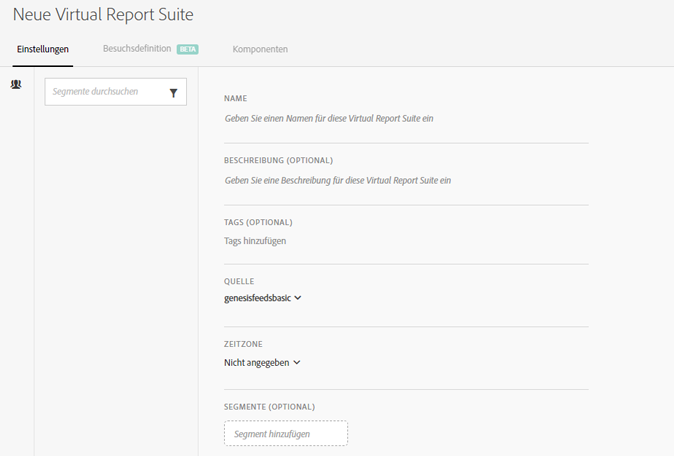

# Virtual Report Suites erstellen

Bevor Sie anfangen, Virtual Report Suites zu erstellen, sollten Sie folgende Aspekte berücksichtigen.

* Nicht-Admin-Benutzer können den Virtual Report Suite Manager nicht sehen.
* Virtual Report Suites können nicht freigegeben werden. Die Freigabe erfolgt über Gruppen/Berechtigungen.
* Im Virtual Report Suite Manager sehen Sie nur Ihre eigenen Virtual Report Suites. Sie müssen auf „Alle anzeigen“ klicken, um die aller anderen anzuzeigen.

1. Navigieren Sie zu **[!UICONTROL Komponenten]** > **[!UICONTROL Virtual Report Suites]**.
1. Klicken Sie auf **[!UICONTROL Hinzufügen +]**.

   

1. Füllen Sie die Felder aus:

<table id="table_0F85B56480BB46CBA5BE236BBD70156D"> 
 <thead> 
  <tr> 
   <th colname="col1" class="entry"> Element </th> 
   <th colname="col2" class="entry"> Beschreibung </th> 
  </tr> 
 </thead>
 <tbody> 
  <tr> 
   <td colname="col1"> Name </td> 
   <td colname="col2"> 
Der Name der Virtual Report Suite wird nicht von der übergeordneten Report Suite geerbt und sollte eindeutig vergeben werden. 
 </td> 
  </tr> 
  <tr> 
   <td colname="col1"> Beschreibung </td> 
   <td colname="col2"> 
Fügen Sie eine gute Beschreibung der Vorteile für Ihre geschäftlichen Benutzer hinzu. 
 </td> 
  </tr> 
  <tr> 
   <td colname="col1"> Tags </td> 
   <td colname="col2"> 
Sie können Tags hinzufügen, um Ihre Report Suites zu organisieren. 
 </td> 
  </tr> 
  <tr> 
   <td colname="col1"> Gruppen </td> 
   <td colname="col2"> 
Wählen Sie die Berechtigungsgruppen aus, die Zugriff auf diese VRS besitzen sollen. (Sie können Gruppenberechtigungen auch unter Admin &gt; Benutzerverwaltung &gt; Gruppen verwalten.) 
 </td> 
  </tr> 
  <tr> 
   <td colname="col1"> Übergeordnete Report Suite </td> 
   <td colname="col2"> 
Die Report Suite, von der diese Virtual Report Suite die folgenden Einstellungen erbt. Die meisten Service-Levels und Funktionen (z. B. eVar-Einstellungen, Verarbeitungsregeln, Classifications usw.) werden vererbt. Möchten Sie Änderungen diesen geerbten Einstellungen einer VRS vornehmen, müssen Sie die übergeordnete Report Suite anpassen (Admin &gt; Report Suites). 
 </td> 
  </tr> 
  <tr> 
   <td colname="col1"> Zeitzone </td> 
   <td colname="col2"> 
Die Auswahl einer Zeitzone ist optional. 
 
Wenn Sie eine Zeitzone auswählen, wird diese zusammen mit der VRS gespeichert. Wenn Sie keine Zeitzone auswählen, wird die Zeitzone der übergeordneten Report Suite verwendet. 
 
Bei der Bearbeitung einer VRS erscheint die mit ihr gespeicherte Zeitzone in einem Dropdown-Auswahlmenü. Wenn die VRS erstellt wurde, bevor Zeitzonen unterstützt wurden, wird die Zeitzone der übergeordneten Report Suite in der Dropdownauswahl angezeigt. 
 </td> 
  </tr> 
  <tr> 
   <td colname="col1"> Segmente </td> 
   <td colname="col2"> 
Sie können nur ein Segment hinzufügen oder Sie können <a href="https://docs.adobe.com/content/help/de-DE/analytics/components/segmentation/segmentation-workflow/seg-build.html"  >Segmente stapeln</a>. 
 
 
Hinweis: Beim Stapeln von zwei Segmenten werden diese durch eine AND-Anweisung verbunden. Dies kann nicht in eine OR-Anweisung geändert werden. 
 
 
Wenn Sie versuchen, ein Segment zu löschen oder zu ändern, das aktuell in einer Virtual Report Suite verwendet wird, wird eine Warnung angezeigt. 
 </td> 
  </tr> 
 </tbody> 
</table>
