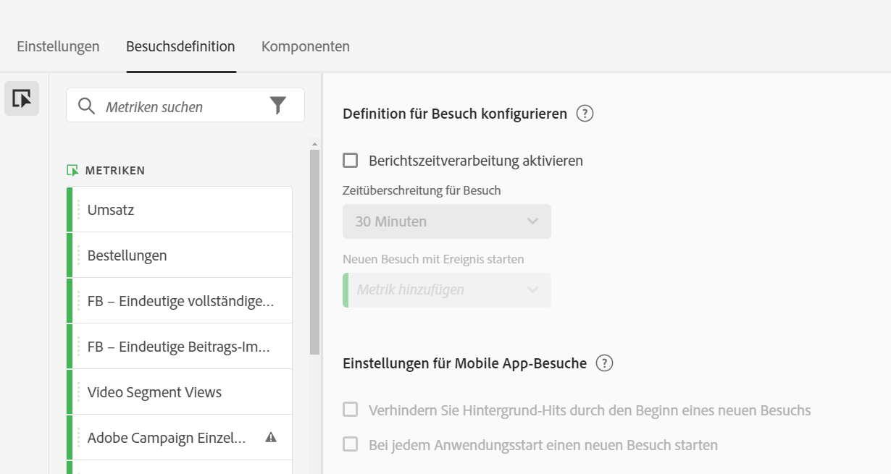
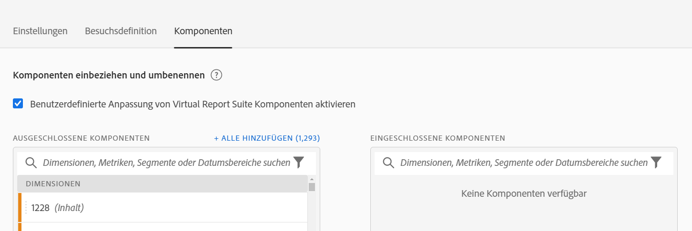

# Virtual Report Suites erstellen

Bevor Sie anfangen, Virtual Report Suites zu erstellen, sollten Sie folgende Aspekte berücksichtigen.

* Nicht-Admin-Benutzer können den Virtual Report Suite Manager nicht sehen.
* Virtual Report Suites können nicht freigegeben werden. Die Freigabe erfolgt über Gruppen/Berechtigungen.
* Im Virtual Report Suite Manager sehen Sie nur Ihre eigenen Virtual Report Suites. Sie müssen auf „Alle anzeigen“ klicken, um die aller anderen anzuzeigen.

1. Navigieren Sie zu **[!UICONTROL Komponenten]** > **[!UICONTROL Virtual Report Suites]**.
1. Klicken Sie auf **[!UICONTROL Hinzufügen +]**.

   

## Definieren von Einstellungen

Definieren Sie auf der Registerkarte [!UICONTROL Einstellungen] diese Einstellungen und klicken Sie dann auf **[!UICONTROL Weiter]**.

| Element | Beschreibung |
| --- |--- |
| Name | Der Name der Virtual Report Suite wird nicht von der übergeordneten Report Suite geerbt und sollte eindeutig vergeben werden. |
| Beschreibung | Fügen Sie eine gute Beschreibung der Vorteile für Ihre geschäftlichen Benutzer hinzu. |
| Tags | Sie können Tags hinzufügen, um Ihre Report Suites zu organisieren. |
| Quelle | Die Report Suite, von der diese Virtual Report Suite die folgenden Einstellungen erbt. Die meisten Service-Levels und Funktionen (z. B. eVar-Einstellungen, Verarbeitungsregeln, Classifications usw.) werden vererbt. Möchten Sie Änderungen diesen geerbten Einstellungen einer VRS vornehmen, müssen Sie die übergeordnete Report Suite anpassen (Admin > Report Suites). |
| Zeitzone | Die Auswahl einer Zeitzone ist optional. Wenn Sie eine Zeitzone auswählen, wird diese zusammen mit der VRS gespeichert. Wenn Sie keine Zeitzone auswählen, wird die Zeitzone der übergeordneten Report Suite verwendet.  Bei der Bearbeitung einer VRS erscheint die mit ihr gespeicherte Zeitzone in einem Dropdown-Auswahlmenü. Wenn die VRS erstellt wurde, bevor Zeitzonen unterstützt wurden, wird die Zeitzone der übergeordneten Report Suite in der Dropdownauswahl angezeigt. |
| Segmente | Sie können nur ein Segment hinzufügen oder Sie können Segmente stapeln.   Hinweis: Beim Stapeln von zwei Segmenten werden diese durch eine AND-Anweisung verbunden. Dies kann nicht in eine OR-Anweisung geändert werden. Wenn Sie versuchen, ein Segment zu löschen oder zu ändern, das aktuell in einer Virtual Report Suite verwendet wird, wird eine Warnung angezeigt. |

## Festlegen der Definition von Besuchen

Definieren Sie auf der Registerkarte [!UICONTROL Besuchsdefinition] diese Einstellungen und klicken Sie dann auf **[!UICONTROL Weiter]**.

Im Folgenden finden Sie ein Video zum Anpassen einer Besuchsdefinition in einer virtuellen Report Suite:

>[!VIDEO](https://video.tv.adobe.com/v/23545/?quality=12)

| Element | Beschreibung |
| --- |--- |
| **Definition für Besuch konfigurieren** |  |
| Berichtszeitverarbeitung aktivieren | Verwenden Sie die Berichtszeitverarbeitung, um die standardmäßige Länge der Zeitüberschreitung des Besuchs zu ändern. Diese Einstellungen sind nicht destruktiv und gelten nur in Analysis Workspace. [Weitere Infos](/help/components/vrs/vrs-report-time-processing.md) |
| Zeitüberschreitung für Besuch | Definiert den Inaktivitätswert, den ein Unique Visitor aufweisen muss, bevor automatisch ein neuer Besuch beginnt. Dies hat Auswirkungen auf die Besuchsmetriken, den Besuchssegment-Container und eVars, die beim Besuch erlöschen. |
| Neuen Besuch mit Ereignis starten | Startet eine neue Sitzung, wenn eines der spezifizierten Ereignisse ausgelöst wird, unabhängig davon, ob eine Sitzung abgelaufen ist oder nicht. |
| **Einstellungen für Mobile App-Besuche** | Ändern Sie, wie Besuche für App-Hits definiert werden, die über Adobe Mobile SDKs erfasst werden. Diese Einstellungen sind nicht destruktiv und gelten nur in Analysis Workspace. |
| Verhindern Sie Hintergrund-Hits durch den Beginn eines neuen Besuchs | Verhindert, dass Hintergrund-Hits einen neuen Besuch starten und die Besuchs- und Unique-Visitor-Metriken erhöht werden. |
| Bei jedem Anwendungsstart einen neuen Besuch starten | Startet eine neue Sitzung, wenn eine App gestartet wird. [Weitere Infos](/help/components/vrs/vrs-mobile-visit-processing.md) |

## Einschließen und Umbenennen von Komponenten

1. Aktivieren Sie auf der Registerkarte [!UICONTROL Komponenten] das Kontrollkästchen, um die Kuratierung anzuwenden und Komponenten für diese Virtual Report Suite in Analysis Workspace einzuschließen, auszuschließen und umzubenennen.
Weitere Informationen zur VRS-Kuratierung finden Sie unter [Kuratierung der Virtual Report Suite-Komponenten](https://experienceleague.adobe.com/docs/analytics/components/virtual-report-suites/vrs-components.html?lang=de#virtual-report-suites).

1. Ziehen Sie Komponenten (Dimensionen, Metriken, Segmente oder Datumsbereiche), die Sie in die VRS einbeziehen möchten, in den Abschnitt [!UICONTROL Einbezogene Komponenten].

1. Wenn Sie fertig sind, klicken Sie auf **[!UICONTROL Speichern]**.

## Vorschau der Daten

Rechts auf jeder Registerkarte können Sie die Gesamtzahl der Treffer, Besuche und Besucher dieser Virtual Report Suite im Vergleich zur ursprünglichen Report Suite in der Vorschau anzeigen.

## Anzeigen der Produktkompatibilität

Einige Funktionen von Virtual Report Suites werden nicht von allen Adobe Analytics-Produkten unterstützt. In der Produktkompatibilitätsliste können Sie anhand Ihrer aktuellen Virtual Report Suite-Einstellungen sehen, welche Produkte in Adobe Analytics unterstützt werden.
