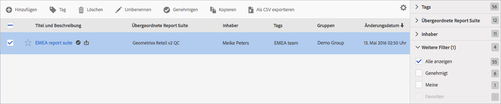

# Virtual Report Suites verwalten

Mit Virtual Report Suites Manager können Administratoren Virtual Report Suites bearbeiten, hinzufügen, taggen, löschen, umbenennen, genehmigen, kopieren, exportieren und filtern. Dies ist für Nicht-Admin-Benutzer nicht sichtbar.

**[!UICONTROL Analytics]** > **[!UICONTROL Komponenten]** > **[!UICONTROL Virtual Report Suites]**

>[!NOTE]
>
>Im Virtual Report Suite Manager können Sie nur Ihre eigenen Virtual Report Suites sehen. Sie müssen auf **[!UICONTROL Alle anzeigen]** klicken, um die aller anderen anzuzeigen.

| Aufgabe | Beschreibung |
| --- | --- |
| Hinzufügen | Sie gelangen zum Virtual Report Suite Builder, in dem Sie neue Virtual Report Suites erstellen können. |
| Tag | Alle Benutzer können Tags für virtuelle Report Suites erstellen und einen oder mehrere Tags auf eine virtuelle Report Suite anwenden. Sie sehen Tags jedoch nur für die virtuellen Report Suites, deren Inhaber Sie sind. Welche Arten von Tags sollten Sie erstellen? Im Folgenden finden Sie einige Vorschläge für nützliche Tags:<ul><li>Tags, die auf Team-Namen basieren, z. B. Social-Media-Marketing und Mobile-Marketing</li><li>Projekt-Tags (Analyse-Tags), z. B. Einstiegsseitenanalyse</li><li>Kategorie Tags: Herren; Geografie</li><li>Workflow-Tags: Kuratiert für (einen bestimmten Geschäftsbereich), Genehmigt</li></ul> |
| Löschen | Wenn Sie eine Virtual Report Suite löschen, funktionieren geplante Berichte und Dashboards, auf die diese Virtual Report Suite angewendet wurde, weiterhin normal. Der Bericht oder das Dashboard verwendet weiterhin die gelöschte Virtual Report Suite, bis Sie den geplanten Bericht erneut speichern.  Terminierte Berichte werden nicht aktualisiert, wenn Sie eine Virtual Report Suite mit demselben Namen bearbeiten. Beispiel: Angenommen, Sie haben zwei Virtual Report Suites mit demselben Namen und unterschiedlichen übergeordneten Report Suites: Sie haben ein Lesezeichen, das auf die Virtual Report Suite für die Report Suite „mainprod“verweist. Dann löschen Sie die Virtual Report Suite, weil es sich um ein Duplikat handelt. Das Lesezeichen wird weiterhin ausgeführt und verweist auf die Definition der gelöschten Virtual Report Suites. Wenn Sie die Definition für die verbleibenden Virtual Report Suites ändern, ändert sich die auf das Lesezeichen angewendete Virtual Report Suite nicht. Es verwendet die alte Definition. Um dies zu beheben, aktualisieren Sie das Lesezeichen, um auf die neue Definition zu verweisen. Wenn Sie sich nicht sicher sind, ob ein Lesezeichen, ein Dashboard oder ein terminierter Bericht eine gelöschte Virtual Report Suite verwendet, können Sie den Namen der verbleibenden Virtual Report Suites ändern, damit klarer wird, ob das Lesezeichen die verbleibenden Virtual Report Suites verwendet. |
| Umbenennen | Überall, wo die Virtual Report Suite angezeigt wird, z. B. in der Report Suite-Auswahl, wird der neue Name angezeigt. |
| Genehmigen/Genehmigung aufheben | Genehmigen Sie Virtual Report Suites, damit sie „offiziell“ oder „kanonisch“ werden. Sie können den Prozess rückgängig machen, indem Sie die Genehmigung aufheben. |
| Kopieren | Erstellt eine eigenständige Kopie mit einer eigenen neuen Report Suite-ID, jedoch mit demselben Namen und derselben Definition. |
| In CSV exportieren | Exportiert die Definition der Virtual Report Suite in eine CSV-Datei. |
| Filter | Filtern nach Tags, übergeordneter Report Suite, Eigentümern und anderen Filtern (Alle anzeigen, Meine, Favoriten und Genehmigt). |
