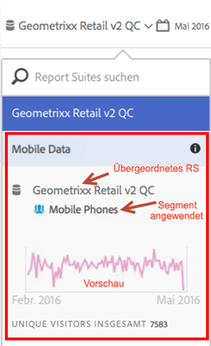

# Informationen zu Virtual Report Suites anzeigen

Klicken Sie auf das Symbol „i“ (Info) neben dem Namen der Report Suite, um die zugehörigen Informationen anzuzeigen.

## In der Report Suite-Auswahl {#section_74E43B60C1CA4180B5ACA57574C1FA0F}

Durch Klicken auf das Informationssymbol neben der Virtual Report Suite im Report Suite-Selektor werden die folgenden Informationen bereitgestellt:

* Der Name der übergeordneten Report Suite.
* Der Name aller Segmente, auf die sie angewendet werden.
* Eine einfache Vorschau der Report Suite mit dem angewendeten Segment.
* Gesamtzahl der Unique Visitors.

