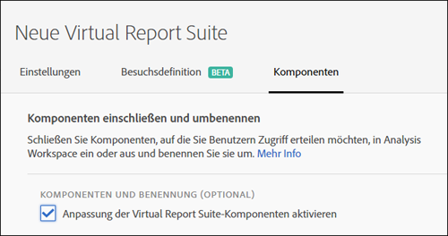
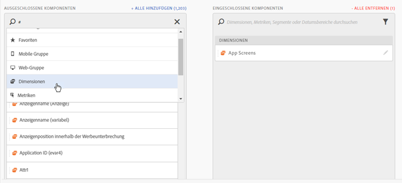
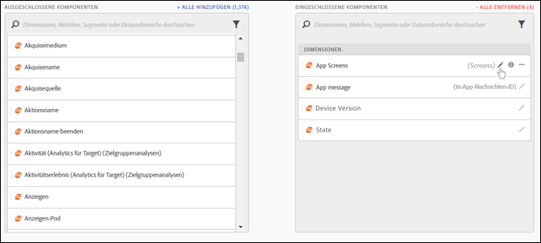
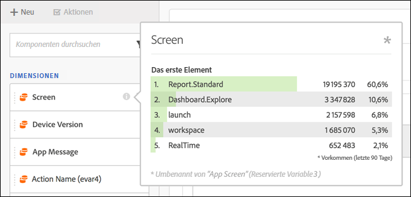
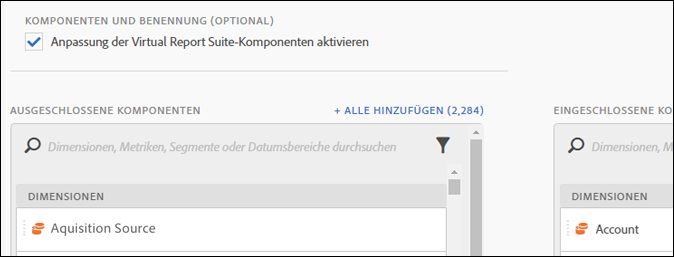

# Kuratierung von Komponenten der Virtual Report Suite

Virtual Report Suites können so kuratiert werden, dass Komponenten in Analysis Workspace ein- und ausgeschlossen werden.

>[!BEGINSHADEBOX]

Siehe  [Komponentenkuratierung](https://experienceleague.adobe.com/de/docs/analytics-learn/tutorials/components/virtual-report-suites/component-curation-in-virtual-report-suites){target="_blank"} für ein Demovideo.

>[!ENDSHADEBOX]

>[!NOTE]
>
>Die Änderungen betreffen die Komponenten, die Admins und Benutzende ohne diese Rolle in kuratierten Workspace-Projekten und kuratierten Virtual Report Suites anzeigen können. Vor dieser Änderung konnten alle Benutzer nichtkuratierte Komponenten anzeigen, und zwar durch Klicken auf **[!UICONTROL Alle Komponenten anzeigen]**. Das [aktualisierte Kuratierungserlebnis](/help/analyze/analysis-workspace/curate-share/curate.md) ermöglicht eine detailliertere Kontrolle darüber, welche Komponenten sichtbar sind.

So ermöglichen Sie die Kuratierung von Komponenten:

1. Navigieren Sie **[!UICONTROL Analytics]** > **[!UICONTROL Komponenten]** > **[!UICONTROL Virtual Report Suites]** > **[!UICONTROL Neue Virtual Report Suite erstellen]**.
1. Wenn Sie die **[!UICONTROL Einstellungen]** festgelegt haben, klicken Sie auf die Registerkarte **[!UICONTROL Komponenten]**.

1. Aktivieren Sie das Kontrollkästchen **[!UICONTROL Anpassung der Virtual Report Suite-Komponenten aktivieren]**:

   

   >[!NOTE]
   >
   >Bei Aktivierung der Komponentenanpassung ist die Virtual Report Suite **nur über Analysis Workspace** zugänglich, nicht aber über Folgendes:
   >
   >* [!UICONTROL Data Warehouse]
   >* [!UICONTROL Report Builder]
   >* [!UICONTROL Activity Map]
   >* Analytics-Reporting-API

   Wenn diese Option aktiviert ist, können Sie die Komponenten hinzufügen, die in die Virtual Report Suite aufgenommen werden sollen, indem Sie die entsprechenden Komponenten aus der Spalte „Ausgeschlossene Komponenten“ in die Spalte „Enthaltene Komponenten“ ziehen. Die Komponenten, die ein- und ausgeschlossen werden können, sind:

   * Dimensionen
   * Metriken
   * Segmente
   * Datumsbereiche

   >[!NOTE]
   >
   >Kuratierte Komponenten (Segmente, berechnete Metriken, Datumsbereiche) müssen nicht *freigegeben* werden. Für die Virtual Report Suite kuratierte Komponenten sind in Analysis Workspace stets sichtbar, auch wenn sie nicht freigegeben werden.

1. Zudem können Sie die Komponenten filtern oder suchen und die gesamte gefilterte Auswahl der Spalte der eingeschlossenen Elemente hinzufügen, indem Sie auf **[!UICONTROL Alle hinzufügen klicken]**.

   

## Umbenannte Komponenten {#section_0F7CD9F684FE4765BC00A2AFED56550E}

Sie können die Anzeigenamen der enthaltenen Komponenten ändern, die für die Virtual Report Suite spezifisch sind. Wenn Sie beispielsweise den Seitennamen in die Virtual Report Suite einbeziehen, ihn jedoch in einen mobileren Kontext umbenennen möchten, können Sie ihn in App Screens ändern. Der neue Name wird in Analysis Workspace angezeigt, wenn diese Virtual Report Suite verwendet wird.

Klicken Sie in Analysis Workspace für eine beliebige enthaltene Komponente auf das Informationssymbol, um den Originalnamen der umbenannten Komponente anzuzeigen:

## Komponentengruppen {#section_483BEC76F49E46ADAAA03F0A12E48426}

Verwenden Sie Komponentengruppen, um Ihrer Virtual Report Suite Massenkomponenten hinzuzufügen. Wenn Sie beispielsweise einen Standardsatz mit spezifischen Komponenten für die Mobile-App-Analyse importieren möchten, wählen Sie die Mobile-App-Gruppe aus. Ein entsprechender Satz von Dimensionen und Metriken (bereits umbenannt) wird automatisch zur Liste „Virtual Report Suite Included“ hinzugefügt.

## Workspace-Verhalten {#section_6C32F8B642804C0097FCB14E21028D4A}

Weitere Informationen zum Kuratieren in Analysis Workspace finden Sie unter [Kuratieren und Freigeben von Projekten](/help/analyze/analysis-workspace/curate-share/curate.md).
