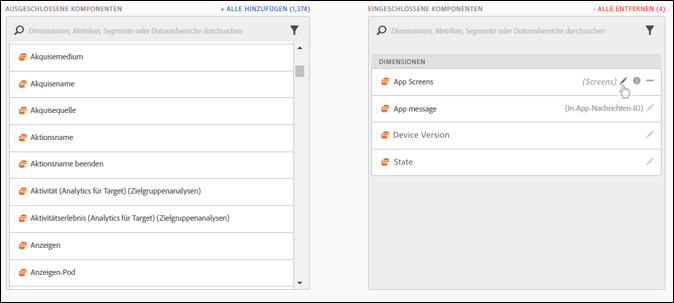

# Zusammenstellung der Virtual Report Suite-Komponenten

Virtual Report Suites können so zusammengestellt werden, dass Komponenten in Analysis Workspace aufgenommen oder aus Analysis Workspace entfernt werden.

> [!NOTE]Die Änderungen betreffen die Komponenten, die Administratoren und Benutzer ohne diese Rolle in kuratierten Workspace-Projekten und kuratierten Virtual Report Suites (VRSs) anzeigen können. Vor dieser Änderung konnten alle Benutzer nichtkuratierte Komponenten anzeigen, und zwar durch Klicken auf **[!UICONTROL Alle Komponenten anzeigen]**. Die [aktualisierte Kuratierungserfahrung](https://marketing.adobe.com/resources/help/de_DE/analytics/analysis-workspace/curate-projects-vrs.html) bietet umfassendere Möglichkeiten, festzulegen, welche Komponenten sichtbar sind.

So ermöglichen Sie die Kuratierung von Komponenten:

1. Gehen Sie zu **[!UICONTROL Analytics]** > **[!UICONTROL Komponenten]** > **[!UICONTROL Virtual Report Suites]** > **[!UICONTROL Neue Virtual Report Suite erstellen]**.
1. Wenn Sie die **[!UICONTROL Einstellungen]** festgelegt haben, klicken Sie auf die Registerkarte **[!UICONTROL Komponenten]**.

1. Aktivieren Sie das Kontrollkästchen **[!UICONTROL Benutzerdefinierte Anpassung von Komponenten virtueller Report Suites aktivieren]**:

   

   >[!NOTE]
   >
   >Bei Aktivierung der Komponentenanpassung ist die Virtual Report Suite **nur über Analysis Workspace** zugänglich, nicht aber über Folgendes:

   * [!UICONTROL Reports &amp; Analytics]
   * [!UICONTROL Ad Hoc Analysis ]
   * [!UICONTROL Data Warehouse]
   * [!UICONTROL Report Builder]
   * Analytics-Reporting-API
   Nach der Aktivierung können Sie die in die Virtual Report Suite einzubeziehenden Komponenten hinzufügen, indem Sie die betreffenden Komponenten aus der Spalte „ausgeschlossene Komponenten“ in die Spalte „eingeschlossene Komponenten“ ziehen. Die ein- und ausschließbaren Komponenten lauten wie folgt:

   * Dimensionen
   * Metriken
   * Segmente
   * Datumsbereiche
   >[!NOTE]
   >
   >Kuratierte Komponenten (Segmente, berechnete Metriken, Datumsbereiche) müssen nicht *freigegeben* werden. Für die Virtual Report Suite kuratierte Komponenten sind in Analysis Workspace stets sichtbar, auch wenn sie nicht freigegeben werden.

1. Zudem können Sie die Komponenten filtern oder suchen und die gesamte gefilterte Auswahl der Spalte der eingeschlossenen Elemente hinzufügen, indem Sie auf **[!UICONTROL Alle hinzufügen klicken]**.

   

## Umbenannte Komponenten {#section_0F7CD9F684FE4765BC00A2AFED56550E}

Sie können die Anzeigenamen eingeschlossener Komponenten je nach Virtual Report Suite ändern. Wenn Sie beispielsweise den Seitennamen in die Virtual Report Suite einschließen möchten, er jedoch in einen Mobilgeräte-tauglicheren Kontext umbenannt werden soll, können Sie ihn in App-Bildschirme ändern. Der neue Name wird immer dann in Analysis Workspace angezeigt, wenn diese Virtual Report Suite verwendet wird.

Klicken Sie in Analysis Workspace auf das Informationssymbol für eine beliebige eingeschlossene Komponente, um den ursprünglichen Namen der umbenannten Komponente anzuzeigen:

## Komponentengruppen  {#section_483BEC76F49E46ADAAA03F0A12E48426}

Mithilfe von Komponentengruppen können Sie Ihrer Virtual Report Suite stapelweise Komponenten hinzufügen. Wenn Sie beispielsweise einen Standardsatz mit spezifischen Komponenten für die mobile App-Analyse importieren möchten, wählen Sie die mobile App-Gruppe aus. Daraufhin wird der Liste „Eingeschlossen“ der Virtual Report Suite automatisch ein entsprechender Satz mit Dimensionen und Metriken (bereits umbenannt) hinzugefügt.

## Workspace-Verhalten {#section_6C32F8B642804C0097FCB14E21028D4A}

Weitere Informationen zum Kuratieren in Analysis Workspace finden Sie unter [Kuratieren und Freigeben von Projekten](https://marketing.adobe.com/resources/help/de_DE/analytics/analysis-workspace/curate.html).
