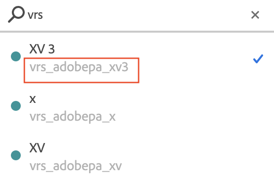

# Virtual Report Suite – Häufig gestellte Fragen (FAQs)

Tipps und Best Practices für neue Benutzer von Virtual Report Suites.

| Frage | Antwort |
| --- | --- |
| **Sollte ich meine Implementierung von mehreren Report Suites auf eine einzige globale Report Suite umstellen und dann Virtual Report Suites verwenden, um verschiedene Datensegmente für meine Benutzer verfügbar zu machen?** | Eventuell. Es gibt bestimmte Umstände, unter denen Sie weiterhin mit einzelnen Report Suites arbeiten sollten:<ul><li>Wenn Sie Variablen/Dimensionen mit einer großen Anzahl eindeutiger Werte haben, kann die Konsolidierung in einer einzigen Report Suite dazu führen, dass in dieser globalen Suite die monatlichen Grenzen für eindeutige Werte überschritten werden, was eine Kürzung zur Folge hat („Geringer Traffic“ als Zeileneintrag in Berichten).</li><li>Wenn Sie für einzelne Segmente (z. B. Marken, Geschäftsbereiche usw.) Berichte zu aktuellen Daten oder in Echtzeit benötigen, Ihrer Daten.</li><li>Ihre verschiedenen Report Suites verfügen möglicherweise über eindeutige Tracking-Anforderungen (d. h., wenn sie Adobe Analytics-Variablen und -Ereignisse sehr unterschiedlich verwenden). Beachten Sie in diesem Fall, dass Ihnen durch die Konsolidierung in einer globalen Report Suite keine zusätzlichen Variablen oder Ereignisse zum Tracking zur Verfügung stehen.</li></ul> |
| **Welche Einstellungen erben Virtual Report Suites von der übergeordneten Report Suite?** | Eine Virtual Report Suite (VRS) erbt die meisten Service-Levels der übergeordneten Report Suite, wie eVar-Einstellungen, Verarbeitungsregeln, Klassifizierungen usw.  Die folgenden Einstellungen werden NICHT vererbt:<ul><li>Report Suite-ID</li><li>Name der Report Suite </li><li>Berechtigungsgruppen (Virtual Report Suites können ihren eigenen Berechtigungsgruppen zugewiesen werden)</li></ul>**Hinweis**: Dies betrifft nicht die meisten von Benutzern erstellten Entitäten, z. B. Lesezeichen, Dashboards, terminierte Berichte usw.; diese Elemente werden nicht vom übergeordneten Element übernommen und können speziell für die Virtual Report Suite erstellt und verwendet werden (weitere Details finden Sie in der nächsten Frage). |
| **Wie unterscheidet sich das Arbeiten mit einer Virtual Report Suite in der Analytics-Benutzeroberfläche von dem mit einer Basis-Report Suite?** | Nach der Erstellung wird eine Virtual Report Suite in der gesamten Benutzeroberfläche wie eine zugrunde liegende Report Suite behandelt und im Allgemeinen für die meisten erweiterten Funktionen unterstützt. Zum Beispiel:<ul><li>Virtual Report Suites werden im Report Suite-Selektor angezeigt und können wie jede andere zugrunde liegende Report Suite einzeln ausgewählt werden.</li><li>Berichte, Lesezeichen, Dashboards, Ziele, Warnhinweise, Segmente, berechnete Metriken usw. können für eine Virtual Report Suite erstellt werden und verhalten sich unabhängig von der übergeordneten Report Suite.</li><li>Für Virtual Report Suites können, genau wie für jede andere Report Suite, einzeln Berechtigungen festgelegt werden.</li><li>Beim Ausführen von Berichten für eine Virtual Report Suite können weiterhin Segmente angewendet werden. Diese werden automatisch mit den Segmenten der Virtual Report Suite gestapelt, wenn die Berichtdaten abgerufen werden.</li></ul> |
| **Wie werden Virtual Report Suites in der Admin Console und der Admin-API behandelt? Kann ich Features wie für Basis-Report Suites speichern?** | Nein, Virtual Report Suites werden für die meisten Admin-Funktionen nicht unterstützt. Wie oben bereits erwähnt, erbt eine Virtual Report Suite die meisten Service-Levels und Funktionen von der übergeordneten Report Suite (z. B. eVar-Einstellungen, Verarbeitungsregeln, Klassifizierungen usw.). Daher können diese geerbten Einstellungen einer Virtual Report Suite nur geändert werden, indem die übergeordnete Report Suite geändert wird. Demzufolge werden Virtual Report Suites auf der Benutzeroberfläche nur hier angezeigt:<ul><li>im Virtual Report Suite-Manager, in dem Sie Virtual Report Suites erstellen und bearbeiten. („AnalyticsRedirect“ > „Komponenten“ > „Virtual Report Suites“)</li><li>in der Adobe [Admin Console](https://helpx.adobe.com/de/enterprise/using/admin-console.html). Bei der Verwendung einer Virtual Report Suite in Berichten oder in Adobe Analytics funktionieren Berechtigungen genauso wie bei einer Report Suite. Das bedeutet, dass die Virtual Report Suites im Auswahlwerkzeug für ein Produktprofil angezeigt werden und Produktprofilen wie Report Suites zugewiesen werden.</li></ul>**Hinweis**: Wenn Sie das Web-Services-API verwenden und versuchen, Funktionseinstellungen für eine Virtual Report Suite zu speichern, führt dies zu einem Ausnahmefehler. Funktionen können nur für die Basis-Report Suites festgelegt werden. |
| **Ich habe „Bei Start neuen Besuch beginnen“ ausgewählt. Warum sehe ich nach wie vor wesentlich mehr Besuche als Starts?** | Wenn „Bei Start neuen Besuch beginnen“ aktiviert wird, gilt der Timeout nach wie vor. Wenn ein Benutzer also die App zehn Minuten lang mit einminütigen Pausen zwischen den einzelnen Aktionen verwendet, beginnt bei jedem Besuch ein neuer Start und dann werden neun zusätzliche Besuche erstellt, wenn es beim aktuellen Besuch zu einem Timeout kommt. Damit Starts und Besuche bei der Verwendung der Option „Bei Start neuen Besuch beginnen“ so nahe beieinander sind wie möglich, sollten Sie einen längeren Timeout als den im SDK festgelegten Sitzungstimeout verwenden. |
| **Ich habe „Bei Start neuen Besuch beginnen“ festgelegt und einen längeren Timeout als in meinem SDK festgelegt. Warum habe ich immer noch wesentlich weniger Starts als Besuche?** | Wenn die maximale Wartezeit höher ist als der in der SDK festgelegte Wert, ist es sehr wahrscheinlich, dass Ihre App im Hintergrund Treffer sendet und diese Treffer als neue Besuche registriert werden. Überprüfen Sie dies, indem Sie die Dimension Treffertyp in der übergeordneten Report Suite verwenden, um festzustellen, ob Hintergrundtreffer vorhanden sind. **Hinweis**: Hintergrund- und Vordergrundtreffer werden nur in Version 4.13.6 und höher der SDK unterschieden. Wenn Sie eine frühere Version verwenden, werden alle Treffer als Vordergrundtreffer angezeigt. Wenn Sie die korrekte Version des SDK verwenden, sollten Sie die Einstellung „Starten neuer Besuche durch Hintergrundtreffer verhindern“ festlegen.    Hinweis: Wenn Sie die veraltete Verarbeitung von Hintergrundtreffern in der Admin Console deaktiviert haben, werden diese nicht in der übergeordneten Report Suite, sondern in der Virtual Report Suite angezeigt. |
| **Welche Version des SDK benötige ich, um Hintergrundtreffer zu verfolgen?** | Sie müssen Version 4.13.6 oder eine spätere Version des SDK verwenden. |
| **Wie finde ich die ID einer Virtual Report Suite heraus?** | <ul><li>Durch Öffnen eines Workspace-Projekts, Klicken auf die Report Suite-Auswahl und Suchen nach dem Namen einer Virtual Report Suite im Suchfeld. Die ID wird unter dem Namen in den Suchergebnissen angezeigt: </li><li> Oder programmgesteuert im [Virtual Report Suite-API](https://www.adobe.io/apis/experiencecloud/analytics/docs.html#!AdobeDocs/analytics-2.0-apis/master/vrs.md).</li></ul> |
