# Kontextbezogene Sitzungen

Kontextbezogene Sitzungen in Virtual Report Suites ändern, wie Adobe Analytics Besuche von jedem Gerät aus berechnet. In diesem Artikel werden auch die Verarbeitungsauswirkungen von Hintergrundtreffern und App-Startereignissen (beide vom Mobile SDK festgelegt) auf die Definition mobiler Besuche beschrieben.

Sie können einen Besuch auf beliebige Art und Weise definieren, ohne die zugrunde liegenden Daten zu ändern, um ihn auf die Interaktion Ihrer Besucher mit Ihren digitalen Erlebnissen abzustimmen.

>[!BEGINSHADEBOX]

Siehe  [Kontextsensitive Sitzungen](https://video.tv.adobe.com/v/23545?quality=12&learn=on){target="_blank"} für ein Demovideo.

>[!ENDSHADEBOX]

## URL-Parameter für Kundenperspektive

Im Datenerfassungsprozess von Adobe Analytics können Sie einen Abfragezeichenfolgenparameter festlegen, der die Kundenperspektive angibt (als Abfragezeichenfolgenparameter „cp“ bezeichnet). Dieses Feld gibt den Status der digitalen Anwendung des Endbenutzers an. Auf diese Weise lässt sich erkennen, ob ein Treffer erzeugt wurde, während sich eine Mobile App im Hintergrund befand.

## Verarbeitung von Treffern im Hintergrund

Ein Hintergrundtreffer ist ein Treffer, der von Adobe Mobile SDK Version 4.13.6 und höher an Analytics gesendet wird, wenn die App im Hintergrund eine Tracking-Anfrage sendet. Typische Beispiele hierfür sind:

* Daten, die während einer Geofencing-Überquerung gesendet werden
* Interaktion mit Push-Benachrichtigungen

Die folgenden Beispiele beschreiben die Logik, die verwendet wird, um zu bestimmen, wann ein Besuch für einen Besucher beginnt und endet, wenn die Einstellung „Starten neuer Besuche durch Hintergrundtreffer verhindern“ für eine Virtual Report Suite aktiviert oder nicht aktiviert ist.

**Wenn „Starten neuer Besuche durch Hintergrundtreffer verhindern“ nicht aktiviert ist:**

Wenn diese Funktion für eine Virtual Report Suite nicht aktiviert ist, werden Hintergrundtreffer wie alle anderen Treffer behandelt, d. h. sie starten neue Besuche und verhalten sich genauso wie Vordergrundtreffer. Wenn beispielsweise ein Hintergrund-Treffer weniger als 30 Minuten vor einem Satz von Vordergrundtreffern auftritt (das Standard-Sitzungs-Timeout für eine Report Suite), ist der Hintergrund-Treffer Teil der Sitzung.

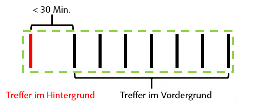

Wenn der Hintergrundtreffer mehr als 30 Minuten vor den Vordergrundtreffern auftritt, erstellt der Hintergrundtreffer einen eigenen Besuch mit einer Gesamtbesuchsanzahl von 2.

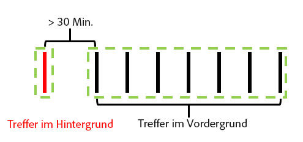

**Wenn „Starten neuer Besuche durch Hintergrundtreffer verhindern“ aktiviert ist:**

Die folgenden Beispiele veranschaulichen das Verhalten von Hintergrundtreffern, wenn diese Funktion aktiviert ist.

Beispiel 1: Ein Hintergrundtreffer tritt eine gewisse Zeitspanne (t) vor einer Reihe von Vordergrundtreffern auf.

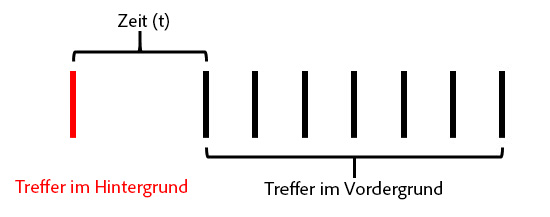

Wenn in diesem Beispiel *t* größer ist als die konfigurierte maximale Wartezeit für Besuche der Virtual Report Suite, wird der Hintergrund-Treffer vom Besuch ausgeschlossen, der durch die Vordergrundtreffer gebildet wird. Wenn beispielsweise das Besuchs-Timeout der Virtual Report Suite auf 15 Minuten festgelegt war und *t* 20 Minuten betrug, würde der Besuch, der aus dieser Trefferreihe gebildet wurde (durch die grüne Kontur angezeigt), den Hintergrundtreffer ausschließen. Das bedeutet, dass alle eVars, die im Hintergrundtreffer mit der Gültigkeit „Besuch“ festgelegt wurden, **nicht** im folgenden Besuch bestehen bleiben, und ein Besuchssegment-Container nur die Vordergrundtreffer innerhalb des grünen Umrisses enthält.

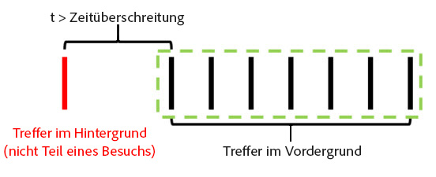

Wenn *t* jedoch kleiner ist als die konfigurierte maximale Wartezeit für Besuche bei der Virtual Report Suite, wird der Hintergrundtreffer als Teil des Besuchs einbezogen, als wäre er ein Vordergrundtreffer (durch die grüne Kontur angezeigt):

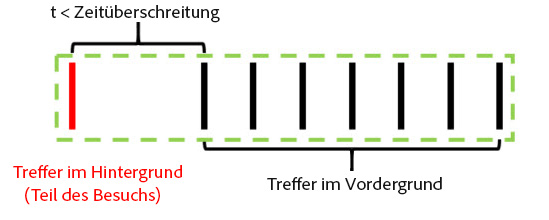

Das bedeutet:

* Alle eVars, die im Hintergrundtreffer mit dem Ablaufdatum „Besuch“ festgelegt wurden, behalten ihre Werte bei den anderen Treffern dieses Besuchs bei.
* Alle im Hintergrundtreffer festgelegten Werte werden in die Auswertung der Container-Logik für die Besuchsebene einbezogen.

In beiden Fällen wäre die Gesamtzahl der Besuche 1.

Beispiel 2: Wenn ein Hintergrundtreffer nach einer Reihe von Vordergrundtreffern auftritt, ist das Verhalten ähnlich:

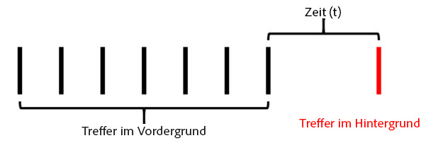

Wenn der Hintergrundtreffer nach der konfigurierten Zeitüberschreitung der Virtual Report Suite auftritt, ist der Hintergrundtreffer nicht Teil einer Sitzung (grün umrandet):

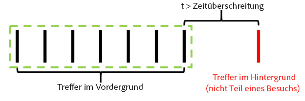

Wenn der Zeitraum *t* kleiner als die konfigurierte Zeitüberschreitung der Virtual Report Suite war, wird der Hintergrundtreffer in den Besuch einbezogen, der durch die vorherigen Vordergrundtreffer gebildet wurde:

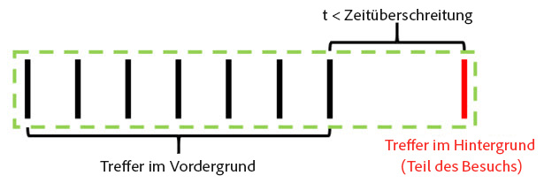

Das bedeutet:

* Alle eVars, die bei den vorherigen Vordergrundtreffern mit dem Ablaufdatum „Besuch“ festgelegt wurden, behalten ihre Werte im Hintergrundtreffer dieses Besuchs bei.
* Alle im Hintergrundtreffer festgelegten Werte werden in die Auswertung der Container-Logik für die Besuchsebene einbezogen.

Wie zuvor würde die Gesamtzahl der Besuche in beiden Fällen 1 betragen.

Beispiel 3: Unter bestimmten Umständen kann ein Hintergrundtreffer dazu führen, dass zwei separate Besuche in einem einzelnen Besuch kombiniert werden. Im folgenden Szenario wird einem Hintergrundtreffer eine Reihe von Vordergrundtreffern vorangestellt und von diesen gefolgt:

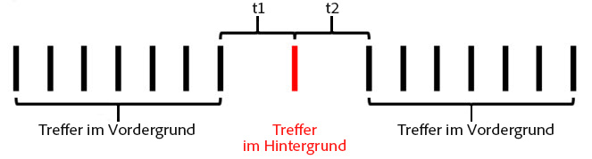

Wenn in diesem Beispiel *t1* und *t2* beide kleiner als die für Virtual Report Suite konfigurierte maximale Wartezeit für Besuche sind, werden alle diese Treffer zu einem einzigen Besuch zusammengefasst, selbst wenn *t1* und *t2* zusammen größer als die maximale Wartezeit für Besuche sind:

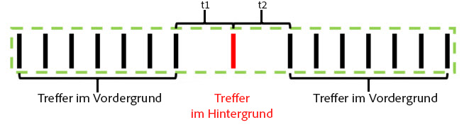

Wenn jedoch *t1* und *t2* größer sind als das konfigurierte Timeout der Virtual Report Suite, werden diese Treffer in zwei verschiedene Besuche aufgeteilt:

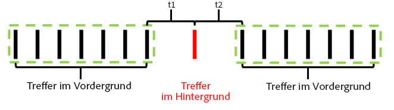

Wenn *t1* kleiner als die maximale Wartezeit und *t2* größer als die maximale Wartezeit ist, würde der Hintergrundtreffer ebenfalls (wie in den vorherigen Beispielen) in den ersten Besuch einbezogen:

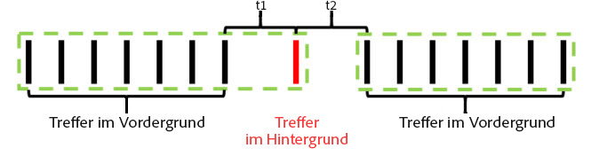

Wenn *t1* größer als die maximale Wartezeit und *t2* kleiner als die maximale Wartezeit ist, wird der Hintergrundtreffer in den zweiten Besuch einbezogen:

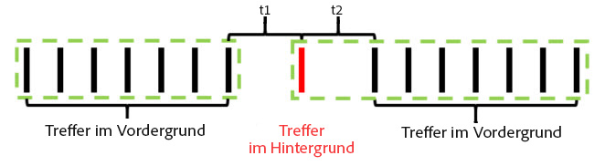

Beispiel 4: In Szenarien mit einer Reihe von Hintergrundtreffern im Zeitraum des Besuchstimeouts der Virtual Report Suite bilden die Treffer einen nicht sichtbaren „Hintergrundbesuch“, der nicht zu der Besuchsanzahl zählt und der nicht mithilfe eines Besuchssegmentierungscontainers zugänglich ist.

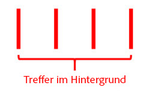

Obwohl dies nicht als Besuch gilt, behalten festgelegte eVars mit Besuchsablauf ihre Werte für die anderen Hintergrundtreffer in diesem „Hintergrundbesuch“.

Beispiel 5: In Szenarien, in denen mehrere Hintergrundtreffer nacheinander im Anschluss an eine Reihe von Vordergrundtreffern auftreten, ist es möglich (je nach Timeouteinstellung), dass die Hintergrundtreffer einen Besuch länger aufrecht erhalten als für die Zeitspanne des Besuchstimeouts. Wenn beispielsweise *t1* und *t2* zusammen größer sind als die maximale Wartezeit bei einem Besuch der Virtual Report Suite, aber einzeln kleiner als die maximale Wartezeit, würde der Besuch weiterhin auf beide Hintergrundtreffer erweitert:

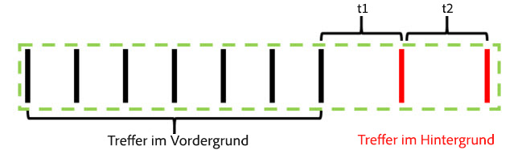

Wenn eine Reihe von Hintergrundtreffern vor einer Reihe von Vordergrundereignissen stattfindet, tritt entsprechend ein ähnliches Verhalten auf:

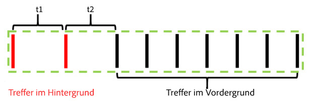

Hintergrundtreffer verhalten sich auf diese Weise, um Attributionseffekte aus eVars oder anderen Variablen, die während Hintergrundtreffer festgelegt wurden, beizubehalten. Dadurch können Konversionsereignisse im nachgelagerten Vordergrund Aktionen zugeordnet werden, die durchgeführt wurden, während sich eine App im Hintergrundzustand befand. Außerdem kann ein Besuchssegment-Container Hintergrundtreffer enthalten, die zu einer nachgelagerten Vordergrundsitzung geführt haben. Dies ist nützlich für die Messung der Effektivität von Push-Nachrichten.

## Besuchsmetrikverhalten

Die Anzahl der Besuche basiert ausschließlich auf der Anzahl der Besuche, die mindestens einen Vordergrundtreffer enthalten. Das bedeutet, dass verwaiste Hintergrundtreffer oder „Hintergrundbesuche“ nicht für die Besuchsmetrik gezählt werden.

## Zeit pro Besuch – Metrikverhalten

Die Besuchszeit wird dennoch analog zur Zeit ohne Hintergrundtreffer berechnet, indem die Zeit zwischen den Treffern verwendet wird. Wenn ein Besuch Hintergrundtreffer enthält (weil diese nahe genug an Vordergrundtreffern aufgetreten sind), werden diese Treffer in die Berechnung der pro Besuch verbrachten Zeit einbezogen, als ob sie ein Vordergrundtreffer wären.

## Einstellungen zur Verarbeitung von Treffern im Hintergrund

Weil die Hintergrundtrefferverarbeitung nur für Virtual Report Suites mit Berichtszeitverarbeitung verfügbar ist, unterstützt Adobe Analytics zwei Methoden zur Verarbeitung von Hintergrundtreffern, um die Anzahl der Besuche in der zugrunde liegenden Report Suite beizubehalten, wobei die Funktion „Berichtszeitverarbeitung“ nicht verwendet wird. Um auf diese Einstellung zuzugreifen, gehen Sie zu den Adobe Analytics Admin Tools, gehen Sie zu den Einstellungen der entsprechenden zugrunde liegenden Report Suite und navigieren Sie dann zum Menü „Mobile Management“ und dann zum Untermenü „Berichte über Mobile Apps“.

1. „Legacy-Verarbeitung eingeschaltet“: Dies ist die Standardeinstellung für alle Report Suites. Überlassen Sie die veraltete Verarbeitung bei Hintergrundprozessen als normale Treffer in unserer Verarbeitungs-Pipeline, soweit die Report Suite der Nicht-Berichtszeitzuordnung betroffen ist. Das bedeutet, dass alle Hintergrundtreffer, die in der zugrunde liegenden Report Suite angezeigt werden, die Besuche als normalen Treffer erhöhen. Wenn in Ihrer zugrunde liegenden Report Suite keine Hintergrundtreffer angezeigt werden sollen, ändern Sie diese Einstellung in „Aus“.
1. „Legacy-Verarbeitung Aus“: Wenn die Legacy-Verarbeitung für Hintergrundtreffer aus ist, werden an die zugrunde liegende Report Suite gesendete Hintergrundtreffer von der zugrunde liegenden Report Suite ignoriert, und sie sind nur zugänglich, wenn eine in dieser zugrunde liegenden Report Suite erstellte Virtual Report Suite für die Verwendung der Funktion „Berichtszeitverarbeitung“ konfiguriert ist. Demnach werden von den Hintergrundtreffern erfasste Daten, die an diese zugrunde liegende Report Suite gesendet werden, nur in einer Virtual Report Suite mit aktivierter Funktion „Berichtszeitverarbeitung“ angezeigt.

   Diese Einstellung richtet sich an Kunden, die die neue Hintergrundtrefferverarbeitung nutzen möchten, ohne die Besuchszahlen ihrer zugrunde liegenden Report Suite zu ändern.

In beiden Fällen werden Hintergrundtreffer zu denselben Kosten in Rechnung gestellt wie alle anderen an Analytics gesendeten Treffer.

## Starten neuer Besuche bei allen App-Starts

Zusätzlich zur Verarbeitung von Hintergrundtreffern können Virtual Report Suites den Start eines neuen Besuchs erzwingen, wenn der mobile SDK ein Startereignis einer App sendet. Wenn diese Einstellung aktiviert ist, wird jedes Mal, wenn ein Startereignis einer Mobile App von der SDK gesendet wird, der Start eines neuen Besuchs erzwungen, unabhängig davon, ob bei einem offenen Besuch die maximale Wartezeit erreicht wurde . Der Treffer, der das Startereignis der App enthält, wird als erster Treffer beim nächsten Besuch einbezogen, die Besuchsanzahl erhöht und einen separaten Besuchs-Container für die Segmentierung erstellt.
