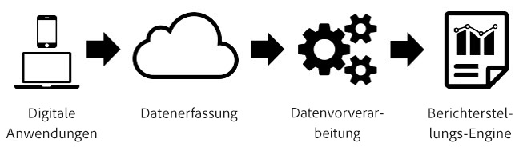
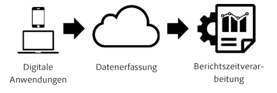

# Berichtszeitverarbeitung

[!UICONTROL Berichtszeitverarbeitung] ist eine Virtual Report Suite-Einstellung, die eine nicht destruktive, rückwirkende Verarbeitung von Daten in Analysis Workspace ermöglicht.

[!UICONTROL Berichtszeitverarbeitung] betrifft nur die Daten in der Virtual Report Suite und hat keinen Einfluss auf Daten oder die Datenerfassung in der zugrunde liegenden Report Suite. Der Unterschied zwischen [!UICONTROL Berichtszeitverarbeitung] und der herkömmlichen Analytics-Verarbeitung lässt sich am besten anhand des folgenden Diagramms veranschaulichen:

Während der Datenverarbeitung in Analytics fließen die Daten durch die Datenerfassungspipeline und einen Vorverarbeitungsschritt, indem die Daten für die Berichterstellung vorbereitet werden. In diesem Schritt der Vorverarbeitung werden die Besuchsablauflogik und eVar-Persistenzlogik (unter anderem) auf die Daten angewendet, während sie erfasst werden. Der primäre Nachteil dieses Vorverarbeitungsmodells besteht darin, dass jegliche Konfiguration vorab erfolgen muss, noch bevor die Daten erfasst werden. Das heißt, dass die an den Vorverarbeitungseinstellungen vorgenommen Änderungen nur ab diesem Zeitpunkt und für neue Daten gelten. Dies ist problematisch, wenn defekte Daten eingehen oder wenn Einstellungen falsch konfiguriert wurden.

[!UICONTROL Berichtszeitverarbeitung] ist eine völlig andere Methode zur Verarbeitung von Analytics-Daten für die Berichterstellung. Anstatt vor dem Erfassen von Daten die Verarbeitungslogik vorab zu bestimmen, ignoriert Analytics die während des Vorverarbeitungsschritts festgelegten Daten und wendet diese Logik bei jeder Berichtsausführung an:

Diese Verarbeitungsarchitektur ermöglicht weit flexiblere Berichterstellungsoptionen. Sie können beispielsweise die Zeitüberschreitungsdauer für Besuche zerstörungsfrei auf eine beliebige Zeitdauer ändern. Diese Änderungen werden in Ihren eVar-Persistenz- und Segment-Containern für den gesamten Berichtszeitraum übernommen. Zudem können Sie eine beliebige Anzahl von Virtual Report Suites mit jeweils unterschiedlichen Optionen zu Berichtszeitverarbeitung generieren, die auf derselben zugrunde liegenden Report Suite basieren, ohne Daten in der zugrunde liegenden Report Suite zu ändern.

Mit [!UICONTROL Berichtszeitverarbeitung] kann in Analytics verhindert werden, dass durch Hintergrundtreffer neue Besuche gestartet werden, und der [Adobe Experience Platform Mobile SDK](https://experienceleague.adobe.com/docs/mobile.html?lange=de) kann bei jedem Auslösen eines Startereignisses einer Mobile App einen neuen Besuch starten.

## Konfigurationsoptionen

Die folgenden Konfigurationsoptionen sind derzeit für Virtual Report Suites mit aktivierter Berichtszeitverarbeitung verfügbar:

* **[!UICONTROL Maximale Wartezeit für Besuch]:** Mit dieser Einstellung wird die Dauer der Inaktivität eines Unique Visitor definiert, bevor automatisch ein neuer Besuch gestartet wird. Die Standardeinstellung lautet 30 Minuten. Wenn Sie beispielsweise das Besuchstimeout auf 15 Minuten festlegen, wird für jede Sequenz mit erfassten Treffern eine neue Besuchsgruppierung erstellt, die nach 15 Minuten Inaktivität separiert ist. Diese Einstellung beeinflusst nicht nur Ihre Besuchszahlen, sondern auch die Art und Weise der Evaluierung von Besuchssegmentcontainern und die Besuchsablauflogik für eVars, die bei einem Besuch ablaufen. Durch eine Verringerung des Besuchstimeouts erhöht sich wahrscheinlich die Gesamtzahl der Besuche in der Berichterstellung, während eine Erhöhung des Besuchstimeouts wahrscheinlich zu einer Reduzierung der Gesamtbesuche in der Berichterstellung führt.
* **[!UICONTROL Besuchseinstellungen für Mobile Apps]:** Für Report Suites mit Daten, die von Mobile Apps über die [Adobe Mobile SDKs](https://experienceleague.adobe.com/docs/mobile.html?lange=de) generiert wurden, sind zusätzliche Besuchseinstellungen verfügbar. Diese Einstellungen sind nicht destruktiv und betreffen nur Treffer, die über die Mobile SDKs erfasst wurden. Sie haben keinen Einfluss auf Daten, die außerhalb der Mobile SDKs erfasst wurden.
* **[!UICONTROL Starten neuer Besuche durch Hintergrundtreffer verhindern]:** Hintergrundtreffer werden von den Mobile SDKs erfasst, wenn sich die Mobile App in einem Hintergrundzustand befindet.
* **[!UICONTROL Bei jedem Anwendungsstart einen neuen Besuch starten]:** Zusätzlich zur maximalen Wartezeit für Besuche können Sie immer dann den Beginn eines Besuchs erzwingen, wenn von den Mobile SDKs ein Startereignis einer Mobile App aufgezeichnet wurde. Die Inaktivitätsdauer ist dabei unerheblich. Diese Einstellung hat einen Einfluss auf die Besuchsmetrik und den Besuchssegment-Container sowie die Besuchsgültigkeitslogik für eVars.
* **[!UICONTROL Neuen Besuch mit Ereignis starten]:** Eine neue Sitzung beginnt dann, wenn ein Ereignis ausgelöst wird – unabhängig davon, ob bei einer Sitzung eine Zeitüberschreitung aufgetreten ist oder nicht. Zur neuen Sitzung gehört auch das Ereignis, das sie ausgelöst hat. Zudem können Sie mehrere Ereignisse nutzen, um eine Sitzung zu starten, und eine neue Sitzung wird dann begonnen, wenn beliebige dieser Ereignisse in den Daten auftreten. Diese Einstellung wirkt sich auf Ihre Besuchszählung, den Besuchssegmentierungs-Container sowie die Besuchsablauflogik von eVars aus.

Im Folgenden finden Sie ein Video zum Starten eines neuen Besuchs mit einem Ereignis:

>[!VIDEO](https://video.tv.adobe.com/v/23129/?quality=12)

## Einschränkungen bei der Berichtszeitverarbeitung

Die Berichtszeitverarbeitung unterstützt nicht alle Metriken und Dimensionen, die in der herkömmlichen Analytics-Berichterstellung verfügbar sind. Auf Virtual Report Suites mit Berichtszeitverarbeitung kann nur über Analysis Workspace zugegriffen werden, nicht aber über Data Warehouse, Report Builder, Daten-Feeds oder der Reporting-API.

Zudem werden bei „Berichtszeitverarbeitung“ nur Daten verarbeitet, die aus dem Datumsbereich der Berichterstellung stammen (nachfolgend als „Datumsfenster“ bezeichnet). Demnach bleiben auf „laufen nie ab“ festgelegte eVar-Werte für einen Besucher vor dem Datumsbereich der Berichterstellung in den Berichterstellungsfenstern nicht erhalten, und sie erscheinen nicht in Berichten. Das heißt auch, dass Kundenloyalitätsmessungen ausschließlich auf den im Berichterstellungsdatumsbereich vorhandenen Daten und nicht auf dem gesamten Verlauf vor dem Berichterstellungsdatumsbereich basieren.

Die folgenden Dimensionen und Metriken werden bei der Berichtszeitverarbeitung nicht unterstützt:

* **Analytics for Target**
* **Analytics für Advertising Cloud-Dimensionen/-Metriken**
* **Zähler-eVars**
* [**Tage vor dem ersten Kauf**](/help/components/dimensions/days-before-first-purchase.md)
* [**Tage seit letztem Kauf**](/help/components/dimensions/days-since-last-purchase.md)
* [**Tage seit letztem Besuch**](/help/components/dimensions/days-since-last-visit.md)
* **Einstiegsseite Original**
* **Lineare Zuordnungs-eVars**
* **Vars auflisten**
* [**Marketing-Kanal-Dimensionen**](/help/components/dimensions/marketing-channel.md)
* [**Ursprünglich verweisende Domain**](/help/components/dimensions/original-referring-domain.md)
* [**Häufigkeit der **](/help/components/dimensions/return-frequency.md)
* [**Einzelzugriff**](/help/components/metrics/single-access.md)
* **Transaktions-ID-Datenquellen**
* [**Besuchsnummer**](/help/components/dimensions/visit-number.md)

## Betroffene Dimensionen und Metriken

Nachstehend finden Sie eine Liste mit Dimensionen und Metriken, die je nach den ausgewählten Einstellungen für „Berichtszeitverarbeitung“ betroffen sind:

* Wenn „Starten neuer Besuche durch Hintergrundtreffer verhindern“ aktiviert ist, treten die folgenden Änderungen ein. Weitere Informationen finden Sie unter [kontextbezogene Sitzungserstellung](vrs-mobile-visit-processing.md).
   * [**Bounces**](/help/components/metrics/bounces.md)/[**Bounce-Rate:**](/help/components/metrics/bounce-rate.md) Hintergrundtreffer, auf die kein Vordergrundtreffer folgt, werden nicht als Bounce-Treffer betrachtet und tragen nicht zur Bounce-Rate bei.
   * [**Zeit pro Besuch in Sekunden:**](/help/components/metrics/time-spent-per-visit.md) Nur Besuche mit Treffern im Vordergrund tragen zu dieser Metrik bei.
   * **Zeit pro Besuch:** Nur Besuche, die Treffer im Vordergrund enthalten, tragen zu dieser Metrik bei.
   * [**Einstiegsmetrik**](/help/components/metrics/entries.md)/[**Ausstiegsmetrik:**](/help/components/metrics/exits.md) In dieser Dimension werden nur Ein- und Ausstiege aus Besuchen mit Vordergrundtreffern angezeigt.
   * [**Einstiegsdimension**](/help/components/dimensions/entry-dimensions.md) / [**Ausstiegsdimensionen:**](/help/components/dimensions/exit-dimensions.md) In dieser Dimension werden nur Ein- und Ausstiege aus Besuchen mit Vordergrundtreffern angezeigt.
   * [**Metrik „Unique Visitors“**](/help/components/metrics/unique-visitors.md) „Unique Visitors“ umfasst keine Besucher, die im Datumsbereich der Berichterstellung nur Hintergrundtreffer hatten.
* [**Besuche:**](/help/components/metrics/visits.md) Besuche spiegeln die konfigurierten Einstellungen der Virtual Report Suite wider, die sich von der zugrunde liegenden Report Suite unterscheiden können.
* **Serialisierte Ereignisse mit Ereignis-ID:** Ereignisse, die die Ereignisserialisierung mit einer Ereignis-ID verwenden, werden nur für Ereignisse dedupliziert, die innerhalb des Datumsbereichs der Berichterstellung für einen Besucher auftreten. Diese Ereignisse werden aufgrund des Datumsfensters für die Berichtszeitverarbeitung nicht global für alle Daten oder Besucher dedupliziert.
* **Bestellungen** / [**Umsatz**](/help/components/metrics/revenue.md) / [**Bestellungen**](/help/components/metrics/orders.md) / [**Einheiten:**](/help/components/metrics/units.md) Wenn die Kauf-ID verwendet wird, werden diese Metriken nur für doppelte Kauf-IDs dedupliziert, die innerhalb des Berichtsdatumsbereichs für einen Besucher auftreten, und nicht für alle Datumsangaben oder Besucher global aufgrund des Fensters Berichtszeitverarbeitung .
* [**Nicht-Merchandising-eVars**](/help/components/dimensions/evar.md)/**reservierte eVars:** Werte, die in einer eVar festgelegt wurden, bleiben nur erhalten, wenn der Wert aufgrund des Fensters für das Berichtszeitverarbeitungsdatum innerhalb des Berichtsdatumsbereichs festgelegt wurde. Zudem können zeitbasierte Abläufe eine Stunde zu früh oder zu spät ablaufen, wenn sich die Persistenz über eine Zeitumstellung erstreckt.
* [**Merchandising-eVars**](/help/components/dimensions/evar-merchandising.md)/**reservierte eVars:** Siehe oben. Zudem wird bezüglich der Konversionssyntax „Beliebige Treffer“ verwendet, wenn die Bindung auf „Beliebiges Ereignis“ festgelegt ist.
* [**Treffertyp:**](/help/components/dimensions/hit-type.md) Diese Dimension gibt an, ob es sich bei einem Treffer um einen Vorder- oder Hintergrundtreffer handelt.
* **Dimensionen mit (Low-Traffic) oder „Eindeutige Werte überschritten“:** Der Zeileneintrag (Low-Traffic) wird bei der Verwendung der Berichtszeitverarbeitung geringfügig anders bestimmt als bei Berichten zur zugrunde liegenden Report Suite. Dimension-Zeileneinträge, die nicht Teil von Low-Traffic sind, stellen nicht garantiert 100 % der Daten für diesen Zeileneintrag dar. Diese Unterschiede können umso ausgeprägter sein, je höher die Anzahl der eindeutigen Werte in einer Dimension ist.
