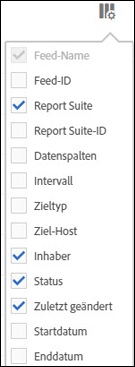

# Verwalten von Daten-Feeds

Mit dem Daten-Feed-Manager können Sie Daten-Feeds für Ihre Organisation erstellen, bearbeiten und löschen. Wenn Sie berechtigt sind, auf den Daten-Feed-Manager zuzugreifen, können Sie Daten-Feeds für alle Report Suites verwalten, die für Sie sichtbar sind.

>[!BEGINSHADEBOX]

Siehe  [Daten-Feed-](https://video.tv.adobe.com/v/25452?quality=12&learn=on){target="_blank"}) für ein Demovideo.

>[!ENDSHADEBOX]

## Anzeigen von Daten-Feeds

1. Melden Sie sich mit Ihren Adobe ID-Anmeldeinformationen bei [experiencecloud.adobe.com](https://experiencecloud.adobe.com) an.
1. Wählen Sie oben rechts das 9-Quadrat-Symbol und dann [!UICONTROL **Analytics**] aus.
1. Navigieren Sie in der oberen Navigationsleiste zu [!UICONTROL **Admin**] > [!UICONTROL **Daten-Feeds**].

   Es werden Daten-Feeds für alle Report Suites angezeigt, auf die Sie Zugriff haben. Wenn keine Feeds konfiguriert wurden, zeigt die Seite die Schaltfläche [!UICONTROL Neuen Daten-Feed erstellen] an.

   

## Erstellen eines Daten-Feeds

Mit **[!UICONTROL Schaltfläche „Daten-Feed]**&quot; können Sie einen neuen Feed erstellen. Weitere [&#x200B; finden Sie unter „Erstellen &#x200B;](create-feed.md) Daten-Feeds“.

## Bearbeiten eines Daten-Feeds

1. Wählen Sie in Adobe Analytics [!UICONTROL **Admin**] > [!UICONTROL **Daten-Feeds**].

1. Suchen Sie den Daten-Feed, den Sie bearbeiten möchten. Um einen Daten-Feed zu finden, können [die Liste der Daten-Feeds filtern und durchsuchen](#filter-and-search-the-list-of-data-feeds).

1. Wählen Sie den Daten-Feed in der Spalte [!UICONTROL **Feed-Name**] aus.

1. Nehmen Sie die gewünschten Änderungen am Daten-Feed vor.

   Weitere Informationen zu den Daten-Feed-Optionen finden Sie [Erstellen und Konfigurieren eines Daten-Feeds](/help/export/analytics-data-feed/create-feed.md#create-and-configure-a-data-feed) unter [Erstellen eines Daten-Feeds](/help/export/analytics-data-feed/create-feed.md).

   Beim Aktualisieren des [!UICONTROL **Ziel**]-Abschnitts für einen Daten-Feed, den Sie bearbeiten, können Sie in den Dropdown-Feldern [!UICONTROL **Konto**] und [!UICONTROL **Speicherort**] ein anderes Konto und einen anderen Speicherort für den neuen Daten-Feed auswählen.

   Konten und Speicherorte können wie in [Konfigurieren von Cloud-Import- und -Exportkonten](/help/components/locations/configure-import-accounts.md) und [Konfigurieren von Cloud-Import- und -Exportspeicherorten](/help/components/locations/configure-import-locations.md) beschrieben bearbeitet werden. Die Bearbeitung eines Kontos oder Standorts wirkt sich auf alle Elemente aus, die mit diesem Konto oder diesem Standort verknüpft sind.

   In früheren Versionen des Daten-Feed-Managers konnten Sie FTP-, SFTP-, S3- und Azure Blob-Ziele erstellen. Ziele, die in diesen früheren Versionen des Daten-Feed-Managers erstellt wurden, können nicht bearbeitet oder kopiert werden.

1. Wählen Sie [!UICONTROL **Speichern**] aus.

## Filtern und Durchsuchen der Liste von Daten-Feeds

1. Wählen Sie in Adobe Analytics [!UICONTROL **Admin**] > [!UICONTROL **Daten-Feeds**].

1. Verwenden Sie die Suche oder Filter, um einen bestimmten Feed zu finden.

   * Geben Sie im Suchfeld den Namen eines Feeds ein. In der Liste der verfügbaren Feeds werden nur die Feeds angezeigt, die dem entsprechen.

   * Wählen Sie ganz links das Filtersymbol aus, um Filteroptionen ein- oder auszublenden. Filter sind nach Kategorie organisiert, einschließlich **[!UICONTROL Report Suites]**, **[!UICONTROL Inhaber]**, **[!UICONTROL Status]** und **[!UICONTROL Tags]**. Sie können Filterkategorien ein- oder ausblenden. Aktivieren Sie das Kontrollkästchen neben jedem Filter, den Sie anwenden möchten.

     

## Anzeigen von Daten-Feed-Aufträgen

1. Wählen Sie in Adobe Analytics [!UICONTROL **Admin**] > [!UICONTROL **Daten-Feeds**].

1. Wählen Sie die [!UICONTROL **Vorgänge**], um einzelne Vorgänge anzuzeigen, die von den einzelnen Feeds erstellt werden.

   Oder

   Um den Vorgangsverlauf für bestimmte Daten-Feeds anzuzeigen, aktivieren Sie das Kontrollkästchen neben einem Daten-Feed und wählen Sie dann [!UICONTROL **Vorgangsverlauf**] aus.

   Weitere Informationen finden Sie unter [Verwalten von Daten-Feed-Aufträgen](df-manage-jobs.md).

## Kopieren eines Daten-Feeds

1. Wählen Sie in Adobe Analytics [!UICONTROL **Admin**] > [!UICONTROL **Daten-Feeds**].

1. Aktivieren Sie das Kontrollkästchen neben dem Daten-Feed, den Sie kopieren möchten, und klicken Sie dann auf [!UICONTROL **Kopieren**].

   Hiermit wird [neuer Feed erstellt](create-feed.md) mit allen Einstellungen des aktuellen Feeds erstellt. Diese Option ist nicht sichtbar, wenn mehr als ein Daten-Feed ausgewählt ist.

   Beim Aktualisieren des [!UICONTROL **Ziel**]-Abschnitts für einen Daten-Feed, den Sie kopieren, können Sie in den Dropdown-Feldern [!UICONTROL **Konto**] und [!UICONTROL **Speicherort**] ein anderes Konto und einen anderen Speicherort für den neuen Daten-Feed auswählen.

   Konten und Speicherorte können wie in [Konfigurieren von Cloud-Import- und -Exportkonten](/help/components/locations/configure-import-accounts.md) und [Konfigurieren von Cloud-Import- und -Exportspeicherorten](/help/components/locations/configure-import-locations.md) beschrieben bearbeitet werden. Die Bearbeitung eines Kontos oder Standorts wirkt sich auf alle Elemente aus, die mit diesem Konto oder diesem Standort verknüpft sind.

   In früheren Versionen des Daten-Feed-Managers konnten Sie FTP-, SFTP-, S3- und Azure Blob-Ziele erstellen. Ziele, die in diesen früheren Versionen des Daten-Feed-Managers erstellt wurden, können nicht bearbeitet oder kopiert werden.

## Anhalten eines Daten-Feeds

Wenn Sie einen Daten-Feed anhalten, verarbeitet er den Feed nicht mehr und setzt seinen Status auf [!UICONTROL Inaktiv].

Wenn Sie den Feed nach dem Anhalten erneut aktivieren, werden die Daten während der Pause des Feeds für Aufstockungs-Feeds verarbeitet, nicht aber für Live-Feeds. Weitere Informationen finden Sie unter [Aktivieren eines Daten-Feeds](#activate-a-data-feed).

So pausieren Sie einen Daten-Feed:

1. Wählen Sie in Adobe Analytics [!UICONTROL **Admin**] > [!UICONTROL **Daten-Feeds**].

1. Aktivieren Sie das Kontrollkästchen neben dem Daten-Feed, den Sie anhalten möchten, und klicken Sie dann auf [!UICONTROL **Pause**].

## Aktivieren eines Daten-Feeds

Sie können Feeds aktivieren, die inaktiv sind.

Wenn ein Feed erneut aktiviert wird, werden Daten möglicherweise nicht automatisch verarbeitet, solange der Feed inaktiv war. Ob die Daten verarbeitet werden, hängt davon ab, ob es sich um einen Aufstockungs-Feed oder einen Live-Feed handelt:

* **Aufstockungs-Feeds** (Feeds, die nur historische Daten verarbeiten) setzen die Verarbeitung von Daten von dort fort, wo sie gestoppt wurden, und füllen bei Bedarf alle Daten auf.

* **Live-Feeds** setzen die Verarbeitung von Daten ab dem Zeitpunkt ihrer Aktivierung fort. Das bedeutet, dass Daten während der Zeit, in der der Feed pausiert wurde, bis zur Aktivierung nicht verarbeitet werden. Wenn Sie die Daten für diesen Zeitraum benötigen, müssen Sie eine Aufstockung einrichten.

So aktivieren Sie einen Daten-Feed:

1. Wählen Sie in Adobe Analytics [!UICONTROL **Admin**] > [!UICONTROL **Daten-Feeds**].

1. Aktivieren Sie das Kontrollkästchen neben dem inaktiven Daten-Feed, den Sie aktivieren möchten, und wählen Sie dann [!UICONTROL **Aktivieren**] aus.

## Löschen eines Daten-Feeds

Wenn Sie einen Daten-Feed löschen, wird sein Status auf &quot;[!UICONTROL &quot; &#x200B;]. Daten-Feeds müssen den Status Aktiv haben, bevor sie gelöscht werden können.

Löschen eines Daten-Feeds:

1. Wählen Sie in Adobe Analytics [!UICONTROL **Admin**] > [!UICONTROL **Daten-Feeds**].

1. Aktivieren Sie das Kontrollkästchen neben dem Daten-Feed, den Sie löschen möchten, und klicken Sie dann auf [!UICONTROL **Löschen**].

## Konfigurieren von Spalten im Daten-Feed-Manager

Jeder erstellte Feed zeigt mehrere Spalten mit Informationen an. Spaltenüberschrift auswählen, um sie in aufsteigender Reihenfolge zu sortieren. Wählen Sie eine Spaltenüberschrift erneut aus, um sie in absteigender Reihenfolge zu sortieren. Wenn eine bestimmte Spalte nicht angezeigt wird, klicken Sie oben rechts auf das Spaltensymbol.

Die folgenden Spalten sind verfügbar:

* **Feed-**: Erforderliche Spalte. Zeigt den Feed-Namen an.
* **Feed-ID**: Zeigt die Feed-ID an, eine eindeutige Kennung.
* **Report Suite**: Die Report Suite, von der der Feed auf Daten verweist.
* **Report Suite-**: Die eindeutige Kennung der Report Suite.
* **Datenspalten**: Gibt an, welche Datenspalten für den Feed aktiv sind. In den meisten Fällen gibt es so viele Spalten, dass sie in diesem Format nicht alle angezeigt werden können.
* **Intervall**: Gibt an, ob der Feed stündlich oder täglich ist.
* **Zieltyp**: Der Zieltyp für den Feed. Beispiel: Amazon S3, GCP oder Azure.
* **Ziel-Host**: Der Speicherort, an dem die Datei platziert wird.
* **Inhaber**: Das Benutzerkonto, über das der Feed erstellt wurde.
* **Status:** Der Status des Feeds.
   * Aktiv: Der Feed ist betriebsfähig.
   * Genehmigung ausstehend: Unter bestimmten Umständen muss ein Feed von Adobe genehmigt werden, bevor er Aufträge generieren kann.
   * Gelöscht: Der Feed wurde gelöscht.
   * Abgeschlossen: Die Verarbeitung des Feeds wurde abgeschlossen. Ein abgeschlossener Feed kann bearbeitet, zurückgestellt oder abgebrochen werden.
   * Ausstehend: Der Feed wurde erstellt, ist aber noch nicht aktiv. Feeds bleiben für eine kurze Übergangszeit in diesem Zustand.
   * Inaktiv: Entspricht einem Status „angehalten“. Weitere Informationen dazu, was mit Aufstockungs-Feeds und Live-Feeds passiert, wenn ein inaktiver Feed erneut aktiviert wird, finden [&#x200B; unter „Aktivieren eines Daten-Feeds](#activate-a-data-feed).
* **Zuletzt geändert**: Das Datum, an dem der Feed zuletzt geändert wurde. Datum und Uhrzeit werden in der Zeitzone der Report Suite mit GMT-Offset angezeigt.
* **Startdatum**: Das Datum des ersten Auftrags für diesen Feed. Datum und Uhrzeit werden in der Zeitzone der Report Suite mit GMT-Offset angezeigt.
* **Enddatum**: Das Datum des letzten Auftrags für diesen Feed. Laufende Daten-Feeds haben kein Enddatum.

