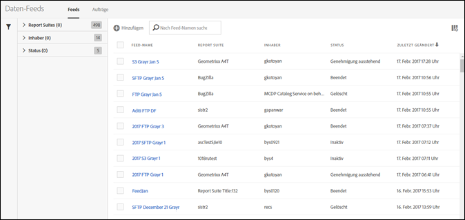

# Verwalten von Daten-Feeds

Mit dem Daten-Feed-Manager können Sie Daten-Feeds für Ihre Organisation erstellen, bearbeiten und löschen. Wenn Sie berechtigt sind, auf den Daten-Feed-Manager zuzugreifen, können Sie Daten-Feeds für alle Report Suites verwalten, die für Sie sichtbar sind.

+ + + + Anzeigen eines Videos zur Daten-Feed-Verwaltung.

>[!VIDEO](https://video.tv.adobe.com/v/25452/?quality=12)

+++

## Anzeigen von Daten-Feeds

1. Melden Sie sich mit Ihren Adobe ID-Anmeldeinformationen bei [experiencecloud.adobe.com](https://experiencecloud.adobe.com) an.
1. Wählen Sie das 9-Quadrat-Symbol oben rechts und dann [!UICONTROL **Analytics**] aus.
1. Navigieren Sie in der oberen Navigationsleiste zu [!UICONTROL **Admin**] > [!UICONTROL **Daten-Feeds**].

   Daten-Feeds für alle Report Suites, auf die Sie Zugriff haben, werden angezeigt. Wenn keine Feeds konfiguriert wurden, wird auf der Seite die Schaltfläche [!UICONTROL Neuen Daten-Feed erstellen] angezeigt.

   

## Erstellen eines Daten-Feeds

Mit der Schaltfläche [!UICONTROL Hinzufügen] können Sie einen neuen Feed erstellen. Weitere Informationen finden Sie unter [Erstellen eines Daten-Feeds](create-feed.md) .

## Daten-Feed bearbeiten

1. Wählen Sie in Adobe Analytics [!UICONTROL **Admin**] > [!UICONTROL **Daten-Feeds**] aus.

1. Suchen Sie den Daten-Feed, den Sie bearbeiten möchten. Um einen Daten-Feed zu finden, können Sie [die Liste der Daten-Feeds filtern und durchsuchen](#filter-and-search-the-list-of-data-feeds).

1. Wählen Sie den Datenfeed in der Spalte [!UICONTROL **Feed-Name**] aus.

1. Nehmen Sie die gewünschten Änderungen am Daten-Feed vor.

   Beim Aktualisieren des Abschnitts [!UICONTROL **Ziel**] für einen Daten-Feed, den Sie bearbeiten, können Sie in den Dropdown-Feldern [!UICONTROL **Konto**] und [!UICONTROL **Standort**] ein anderes Konto und einen anderen Speicherort für den neuen Daten-Feed auswählen.

   Konten und Standorte können wie in [Konfigurieren von Cloud-Import- und -Exportkonten](/help/components/locations/configure-import-accounts.md) und [Konfigurieren von Cloud-Import- und -Exportspeicherorten](/help/components/locations/configure-import-locations.md) beschrieben bearbeitet werden. Die Bearbeitung eines Kontos oder Standorts wirkt sich auf alle Elemente aus, die mit diesem Konto oder Standort verbunden sind.

   In früheren Versionen des Daten-Feed-Managers konnten Sie FTP-, SFTP-, S3- und Azure-Blob-Ziele erstellen. Ziele, die in diesen früheren Versionen des Daten-Feeds-Managers erstellt wurden, können nicht bearbeitet oder kopiert werden.

1. Wählen Sie [!UICONTROL **Speichern**] aus.

## Filtern und Durchsuchen der Liste von Daten-Feeds

1. Wählen Sie in Adobe Analytics [!UICONTROL **Admin**] > [!UICONTROL **Daten-Feeds**] aus.

1. Suchen Sie mithilfe von Suchvorgängen oder Filtern nach einem bestimmten Feed.

   * Geben Sie im Suchfeld den Namen eines Feeds ein. In der Liste der verfügbaren Feeds werden nur die Feeds angezeigt, die übereinstimmen.

   * Klicken Sie ganz links auf das Filtersymbol, um die Filteroptionen ein- oder auszublenden. Filter sind nach Kategorie geordnet. Sie können Filterkategorien reduzieren oder erweitern. Aktivieren Sie das Kontrollkästchen neben den Filtern, die Sie anwenden möchten.

## Anzeigen von Daten-Feed-Aufträgen

1. Wählen Sie in Adobe Analytics [!UICONTROL **Admin**] > [!UICONTROL **Daten-Feeds**] aus.

1. Wählen Sie die Registerkarte [!UICONTROL **Aufträge**] aus, um einzelne Aufträge anzuzeigen, die von jedem Ihrer Feeds erstellt werden.

   Oder

   Um Aufträge für bestimmte Daten-Feeds anzuzeigen, aktivieren Sie das Kontrollkästchen neben einem oder mehreren Daten-Feeds und wählen Sie dann [!UICONTROL **Auftragsverlauf**] aus.

   Weitere Informationen finden Sie unter [Verwalten von Daten-Feed-Aufträgen](df-manage-jobs.md).

## Daten-Feed kopieren

1. Wählen Sie in Adobe Analytics [!UICONTROL **Admin**] > [!UICONTROL **Daten-Feeds**] aus.

1. Aktivieren Sie das Kontrollkästchen neben dem Daten-Feed, den Sie kopieren möchten, und wählen Sie dann [!UICONTROL **Kopieren**] aus.

   Erstellt einen neuen Feed mit allen Einstellungen des aktuellen Feeds.  Diese Option ist nicht sichtbar, wenn mehr als ein Daten-Feed ausgewählt ist.

   Beim Aktualisieren des Abschnitts [!UICONTROL **Ziel**] für einen kopierten Daten-Feed können Sie in den Dropdown-Feldern [!UICONTROL **Konto**] und [!UICONTROL **Standort**] ein anderes Konto und einen anderen Speicherort für den neuen Daten-Feed auswählen.

   Konten und Standorte können wie in [Konfigurieren von Cloud-Import- und -Exportkonten](/help/components/locations/configure-import-accounts.md) und [Konfigurieren von Cloud-Import- und -Exportspeicherorten](/help/components/locations/configure-import-locations.md) beschrieben bearbeitet werden. Die Bearbeitung eines Kontos oder Standorts wirkt sich auf alle Elemente aus, die mit diesem Konto oder Standort verbunden sind.

   In früheren Versionen des Daten-Feed-Managers konnten Sie FTP-, SFTP-, S3- und Azure-Blob-Ziele erstellen. Ziele, die in diesen früheren Versionen des Daten-Feeds-Managers erstellt wurden, können nicht bearbeitet oder kopiert werden.

## Anhalten eines Daten-Feeds

Sie können die Verarbeitung für den Feed stoppen und seinen Status auf [!UICONTROL Inaktiv] festlegen.

1. Wählen Sie in Adobe Analytics [!UICONTROL **Admin**] > [!UICONTROL **Daten-Feeds**] aus.

1. Aktivieren Sie das Kontrollkästchen neben dem Daten-Feed, den Sie anhalten möchten, und wählen Sie dann [!UICONTROL **Pause**] aus.

## Daten-Feed aktivieren

Sie können inaktive Feeds aktivieren.

Aufstockungs-Feeds (Feeds, die nur historische Daten verarbeiten) nehmen die Verarbeitung der Daten an der Stelle wieder auf, an der sie angehalten wurden, und stocken bei Bedarf alle Daten auf. Live-Feeds setzen auch die Verarbeitung von Daten fort, von denen aus sie angehalten wurden.

>[!AVAILABILITY]
>
>Die folgende Änderung an der Wiederaufnahme der Verarbeitung von Daten durch Live-Feeds erfolgt in der Phase der eingeschränkten Testung der Veröffentlichung:
> 
>**Live-Feeds setzen die Verarbeitung von Daten aus der aktuellen Zeit fort.**
>
>Diese Änderung ist möglicherweise noch nicht in Ihrer Umgebung verfügbar.
>
>Diese Anmerkung wird entfernt, wenn diese Änderung allgemein verfügbar ist. Informationen zum Analytics-Veröffentlichungsprozess finden Sie unter [Adobe Analytics-Funktionsversionen](/help/release-notes/releases.md).

So aktivieren Sie einen Daten-Feed:

1. Wählen Sie in Adobe Analytics [!UICONTROL **Admin**] > [!UICONTROL **Daten-Feeds**] aus.

1. Aktivieren Sie das Kontrollkästchen neben dem inaktiven Daten-Feed, den Sie aktivieren möchten, und wählen Sie dann [!UICONTROL **Aktivieren**] aus.

## Daten-Feed löschen

Wenn Sie einen Daten-Feed löschen, wird dessen Status auf [!UICONTROL Gelöscht] gesetzt. Daten-Feeds müssen den Status Aktiv aufweisen, bevor sie gelöscht werden können.

So löschen Sie einen Daten-Feed:

1. Wählen Sie in Adobe Analytics [!UICONTROL **Admin**] > [!UICONTROL **Daten-Feeds**] aus.

1. Aktivieren Sie das Kontrollkästchen neben dem Daten-Feed, den Sie löschen möchten, und wählen Sie dann [!UICONTROL **Löschen**] aus.

## Spalten im Daten-Feed-Manager konfigurieren

Jeder erstellte Feed zeigt mehrere Spalten mit Informationen an. Wählen Sie eine Spaltenüberschrift aus, um sie in aufsteigender Reihenfolge zu sortieren. Wählen Sie eine Spaltenüberschrift erneut aus, um sie in absteigender Reihenfolge zu sortieren. Wenn eine bestimmte Spalte nicht angezeigt wird, klicken Sie oben rechts auf das Spaltensymbol.

Die folgenden Spalten sind verfügbar:

* **Feed-Name**: Erforderliche Spalte. Zeigt den Feed-Namen an.
* **Feed-ID**: Zeigt die Feed-ID an, eine eindeutige Kennung.
* **Report Suite**: Die Report Suite, aus der der Feed Daten referenziert.
* **Report Suite-ID**: Die eindeutige Kennung der Report Suite.
* **Datenspalten**: Gibt an, welche Datenspalten für den Feed aktiv sind. In den meisten Fällen gibt es so viele Spalten, dass sie in diesem Format nicht alle angezeigt werden können.
* **Intervall**: Gibt an, ob der Feed stündlich oder täglich ist.
* **Zieltyp**: Der Zieltyp für den Feed. Zum Beispiel Amazon S3, GCP oder Azure.
* **Ziel-Host**: Der Speicherort der Datei.
* **Inhaber**: Das Benutzerkonto, über das der Feed erstellt wurde.
* **Status:** Der Status des Feeds.
   * Aktiv: Der Feed ist betriebsfähig.
   * Genehmigung ausstehend: Unter bestimmten Umständen muss ein Feed von Adobe genehmigt werden, bevor er Aufträge generieren kann.
   * Gelöscht: Der Feed wurde gelöscht.
   * Abgeschlossen: Die Verarbeitung des Feeds wurde abgeschlossen. Ein abgeschlossener Feed kann bearbeitet, angehalten und abgebrochen werden.
   * Ausstehend: Der Feed wurde erstellt, ist aber noch nicht aktiv. Feeds bleiben für eine kurze Übergangszeit in diesem Zustand.
   * Inaktiv: Entspricht einem Status „angehalten“. Informationen dazu, was mit Aufstockungs-Feeds und Live-Feeds passiert, wenn ein inaktiver Feed reaktiviert wird, finden Sie unter [Aktivieren eines Daten-Feeds](#activate-a-data-feed).
* **Zuletzt geändert**: Das Datum, an dem der Feed zuletzt geändert wurde. Datum und Uhrzeit werden in der Zeitzone der Report Suite mit GMT-Verschiebung angezeigt.
* **Startdatum**: Das Datum des ersten Auftrags für diesen Feed. Datum und Uhrzeit werden in der Zeitzone der Report Suite mit GMT-Verschiebung angezeigt.
* **Enddatum**: Das Datum des letzten Auftrags für diesen Feed. Laufende Daten-Feeds haben kein Enddatum.

