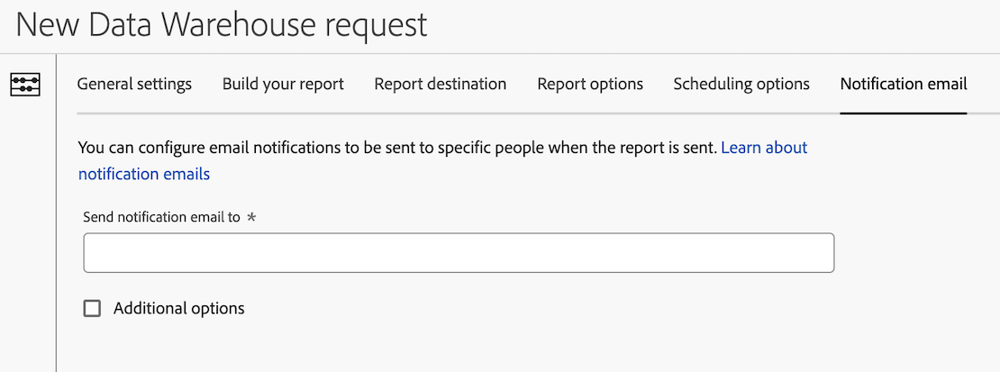

# Konfigurieren einer Benachrichtigungs-E-Mail für eine Data Warehouse-Anfrage

Beim Erstellen einer Data Warehouse-Anfrage stehen verschiedene Konfigurationsoptionen zur Verfügung. Die folgenden Informationen beschreiben, wie Sie eine Benachrichtigungs-E-Mail für die Anfrage konfigurieren.

Informationen zum Erstellen einer Anfrage sowie Links zu anderen wichtigen Konfigurationsoptionen finden Sie unter [Erstellen einer Data Warehouse-Anfrage](/help/export/data-warehouse/create-request/t-dw-create-request.md).

So konfigurieren Sie eine Benachrichtigungs-E-Mail für eine Data Warehouse-Anfrage:

1. Falls Sie noch keine Anfrage in Adobe Analytics erstellt haben, tun Sie dies nun durch Auswahl von **[!UICONTROL Tools]** > **[!UICONTROL Data Warehouse]** > [!UICONTROL **Hinzufügen**].

   Weitere Informationen finden Sie unter [Erstellen einer Data Warehouse-Anfrage](/help/export/data-warehouse/create-request/t-dw-create-request.md).

1. Wählen Sie auf der Seite Neue Data Warehouse-Anfrage die Registerkarte [!UICONTROL **Benachrichtigungs-E-**]) aus.

   

1. Füllen Sie die folgenden Felder aus:

   | Option | Funktion |
   |---------|----------|
   | [!UICONTROL **Benachrichtigungs-E-Mail senden an**] | Geben Sie die E-Mail-Adressen der Personen an, die E-Mail-Benachrichtigungen erhalten sollen, wenn der Bericht gesendet wird. 
Sie können eine einzelne E-Mail-Adresse oder eine durch Kommas getrennte Liste von E-Mail-Adressen angeben.
 |
   | [!UICONTROL **Erweiterte Optionen**] | Wählen Sie diese Option aus, um beim Senden der Benachrichtigung einen Betreff und Notizen für die E-Mail einzuschließen. |

   {style="table-layout:auto"}

1. Wählen [!UICONTROL **Anfrage speichern**], um die Data Warehouse-Berichtsanfrage zu speichern.

   Sie können jetzt Daten an das -Konto und den Speicherort exportieren, die Sie konfiguriert haben.
