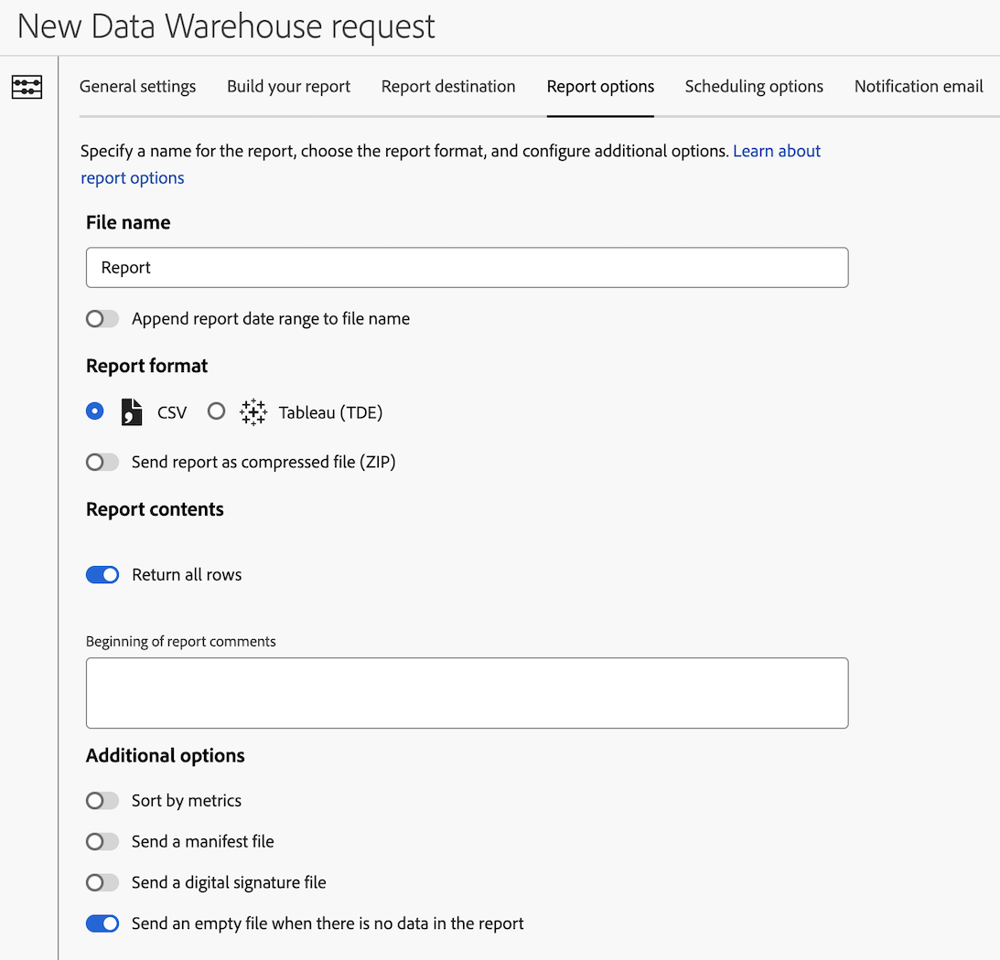

# Konfigurieren von Berichtsoptionen für eine Data Warehouse-Anfrage

Beim Erstellen einer Data Warehouse-Anfrage stehen verschiedene Konfigurationsoptionen zur Verfügung. Die folgenden Informationen beschreiben, wie Sie Berichtsoptionen für die Anfrage konfigurieren.

Informationen zum Erstellen einer Anfrage sowie Links zu anderen wichtigen Konfigurationsoptionen finden Sie unter [Erstellen einer Data Warehouse-Anfrage](/help/export/data-warehouse/create-request/t-dw-create-request.md).

So konfigurieren Sie Berichtsoptionen für eine Data Warehouse-Anfrage:

1. Falls Sie noch keine Anfrage in Adobe Analytics erstellt haben, tun Sie dies nun durch Auswahl von **[!UICONTROL Tools]** > **[!UICONTROL Data Warehouse]** > [!UICONTROL **Hinzufügen**].

   Weitere Informationen finden Sie unter [Erstellen einer Data Warehouse-Anfrage](/help/export/data-warehouse/create-request/t-dw-create-request.md).

1. Wählen Sie auf der Seite Neue Data Warehouse-Anfrage die Registerkarte [!UICONTROL **Berichtsoptionen**] aus.

    <!-- update screenshot to include Sort by metrics -->

1. Füllen Sie die folgenden Felder aus:

   | Option | Funktion |
   |---------|----------|
   | [!UICONTROL **Dateiname**] | Identifiziert den Bericht. 
Wenn eines der folgenden Sonderzeichen im Dateinamen verwendet wird, kann die Anfrage nicht gespeichert werden: <code>! &quot; # $ &amp; &#39; ( ) * + , / : ; > = &lt; ? @ [ ] \ ^ &grave; { } \| ~</code> 

Das Zeichen % kann nur verwendet werden, wenn auf es „R“, „rsid“ oder „id“ folgt: <code>%R</code>, <code>%rsid</code>und <code>%id</code>.
 |
   | [!UICONTROL **Berichtsdatumsbereich an Dateinamen anhängen**] | Fügt den Datumsbereich zum Namen der Berichtsdatei hinzu. 
Wenn Sie beispielsweise Daten vom 1. Mai 2024 bis zum 7. Mai 2024 anfordern, enthält der Dateiname den Datumsbereich 20240501 bis 20240507.
 |
   | [!UICONTROL **CSV**] | Stellt Berichte im CSV-Dateiformat bereit, um Daten in einer Tabelle anzuzeigen. |
   | [!UICONTROL **Tableau (TDE)**] | Stellt Berichte im Tableau-Datenextraktionsdateiformat (TDE) bereit, mit dem Daten visualisiert und in zusätzlichen Daten innerhalb von Tableau eingefügt werden können. |
   | [!UICONTROL **Bericht als komprimierte Datei (ZIP) senden**] | Berichte werden im komprimierten (ZIP-)Dateiformat bereitgestellt. Es wird empfohlen, diese Option zu aktivieren, wenn E-Mail als [Berichtsziel“ verwendet &#x200B;](/help/export/data-warehouse/create-request/dw-request-report-destinations.md). |
   | [!UICONTROL **Alle Zeilen zurückgeben**] | Wenn diese Option aktiviert ist, werden alle Zeilen in den Bericht aufgenommen. Deaktivieren Sie diese Option, um die Anzahl der einzuschließenden Zeilen anzugeben. |
   | [!UICONTROL **Beginn der Berichtskommentare**] | Fügen Sie alle Kommentare hinzu, die in den Bericht aufgenommen werden sollen. Kommentare erscheinen am Anfang des Berichts. |
   | [!UICONTROL **Nach Metriken sortieren**] | Bietet nach Rang geordnet Detailberichte in Data Warehouse, die nach absteigendem Metrikwert sortiert sind. Die Sortierung nach Metrik erleichtert die Interpretation von Data Warehouse-Berichten und die Vergleichbarkeit dieser Berichte mit anderen Analytics-Aufschlüsselungs-Reporting-Ansichten.
Weitere Informationen finden Sie unter [Nach Metrik sortieren](/help/export/data-warehouse/sorting-by-metric.md).
 |
   | [!UICONTROL **Manifestdatei senden**] | Enthält Metadaten zu den im Bericht enthaltenen Dateien.<!-- What kind of metadata is included in the manifest file? --> |
   | [!UICONTROL **Senden einer digitalen Signaturdatei**] | Ermöglicht es Berichtsempfängern, zu überprüfen, ob die Datei von Adobe stammt und nicht verändert wurde. |
   | [!UICONTROL **Senden Sie eine leere Datei, wenn der Bericht keine Daten enthält**] | Sendet einen Bericht, selbst wenn der Bericht keine Daten enthält. |

   {style="table-layout:auto"}

1. Fahren Sie mit der Konfiguration Ihrer Data Warehouse-Anfrage auf der Registerkarte [!UICONTROL **Planungsoptionen**] fort. Weitere Informationen finden Sie unter [Konfigurieren von Planungsoptionen für eine Data Warehouse-Anfrage](/help/export/data-warehouse/create-request/dw-request-scheduling.md).
