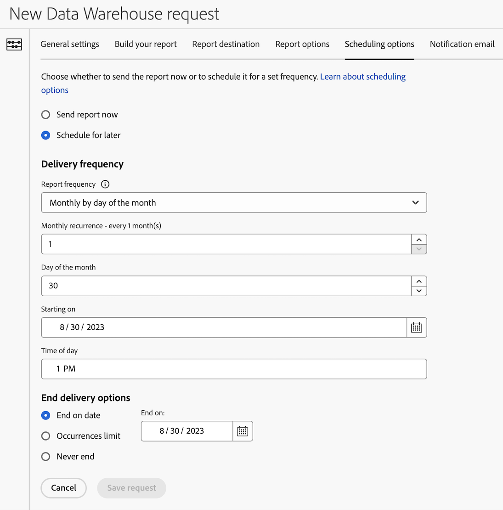

# Zeitplanoptionen für eine Data Warehouse-Anfrage konfigurieren

Beim Erstellen einer Data Warehouse-Anfrage stehen verschiedene Konfigurationsoptionen zur Verfügung. Die folgenden Informationen beschreiben, wie Sie Planungsoptionen für die Anfrage konfigurieren.

Informationen zum Erstellen einer Anfrage sowie Links zu anderen wichtigen Konfigurationsoptionen finden Sie unter [Erstellen einer Data Warehouse-Anfrage](/help/export/data-warehouse/create-request/t-dw-create-request.md).

So konfigurieren Sie Planungsoptionen für eine Data Warehouse-Anfrage:

1. Falls Sie noch keine Anfrage in Adobe Analytics erstellt haben, tun Sie dies nun durch Auswahl von **[!UICONTROL Tools]** > **[!UICONTROL Data Warehouse]** > [!UICONTROL **Hinzufügen**].

   Weitere Informationen finden Sie unter [Erstellen einer Data Warehouse-Anfrage](/help/export/data-warehouse/create-request/t-dw-create-request.md).

1. Wählen Sie auf der Seite Neue Data Warehouse-Anfrage die Registerkarte [!UICONTROL **Planungsoptionen**] aus.

    <!-- update screenshot -->

1. Füllen Sie die folgenden Felder aus:

   | Option | Funktion |
   |---------|----------|
   | [!UICONTROL **Bericht jetzt senden**] | Sendet den Bericht als einmaligen Bericht. Wenn diese Option ausgewählt ist, werden alle Planungsoptionen ausgeblendet. |
   | [!UICONTROL **Für später planen**] | Bietet Optionen für die Planung der Berichtlieferung. Alle Optionen werden nachfolgend beschrieben. |
   | [!UICONTROL **Berichtshäufigkeit**] | Die Häufigkeit, mit der Berichte zugestellt werden. 
Die folgenden Optionen sind verfügbar:
<ul><li>Stündlich</li>
[!UICONTROL **Stündlich**] ist nur verfügbar, wenn die Option [!UICONTROL **Datumsbereiche**] auf der Registerkarte [!UICONTROL **Allgemeine Einstellungen**] auf [!UICONTROL **Letzte Stunde**] gesetzt ist.
<li>Täglich</li><li>Wöchentlich</li><li>Monatlich</li><li>Jährlich</li></ul>
Je nach ausgewählter Häufigkeit werden zusätzliche Optionen angezeigt.
 |
   | [!UICONTROL **Start am**] | Das Datum, an dem der neue Zeitplan beginnen soll. |
   | [!UICONTROL **Tageszeit**] | Die Tageszeit, zu der der Bericht gesendet werden soll. |
   | [!UICONTROL **Lieferoptionen beenden**] | Endzeitpunkt der geplanten Sendungen auswählen. Sie können festlegen, dass der Vorgang nie, nach einer bestimmten Anzahl von Vorkommen oder an einem bestimmten Datum endet. |

   {style="table-layout:auto"}

1. Fahren Sie mit der Konfiguration Ihrer Data Warehouse-Anfrage auf der Registerkarte [!UICONTROL **Benachrichtigungs-E-Mail**] fort. Weitere Informationen finden Sie unter [Konfigurieren einer E-Mail-Benachrichtigung für eine Data Warehouse-Anfrage](/help/export/data-warehouse/create-request/dw-request-email.md).
