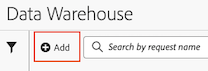
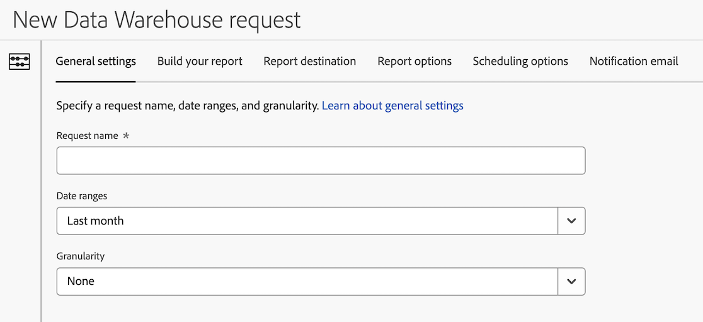

# Erstellen einer Data Warehouse-Anforderung

Beim Erstellen einer Data Warehouse-Anfrage stehen verschiedene Konfigurationsoptionen zur Verfügung. Im Folgenden wird beschrieben, wie Sie mit der Erstellung einer Anfrage beginnen und dann Links zu detaillierteren Informationen bereitstellen, um die Anfrage abzuschließen.

## Erstellung der Anfrage starten

1. Wählen Sie in Adobe Analytics **[!UICONTROL Tools]** > **[!UICONTROL Data Warehouse]** aus.

1. Wählen Sie auf der Seite [!UICONTROL **&#x200B;**] Data Warehouse [!UICONTROL **die Option „Hinzufügen**] aus.

   

   Die neue Data Warehouse-Anfrageseite wird angezeigt.

   

## Anfrage abschließen

Beim Erstellen einer Data Warehouse-Anfrage stehen verschiedene Registerkarten zur Verfügung. Informationen zu den verschiedenen Konfigurationsoptionen auf den einzelnen Registerkarten finden Sie in den folgenden Artikeln:

* [Allgemeine Einstellungen](/help/export/data-warehouse/create-request/dw-general-settings.md)

* [Erstellen Ihres Berichts](/help/export/data-warehouse/create-request/dw-request-build-report.md)

* [Berichtsziel](/help/export/data-warehouse/create-request/dw-request-report-destinations.md)

* [Berichtsoptionen](/help/export/data-warehouse/create-request/dw-request-report-options.md)

* [Planungsoptionen](/help/export/data-warehouse/create-request/dw-request-scheduling.md)

* [Benachrichtigungs-E-Mail](/help/export/data-warehouse/create-request/dw-request-email.md)
