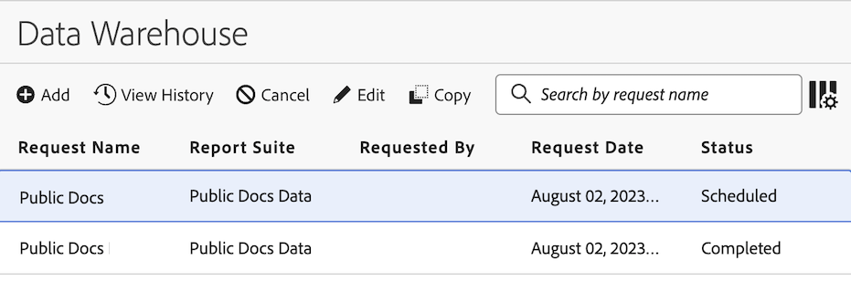

# Verwalten von Data Warehouse-Anforderungen

Sie können Data Warehouse-Anfragen, die Sie gestellt haben, anzeigen und verwalten. Nur Administratoren können Anforderungen anderer Benutzer in ihrer Organisation anzeigen und verwalten.

In den folgenden Abschnitten werden die Aktivitäten beschrieben, die Sie bei der Verwaltung von Anforderungen durchführen können.

## Anforderungen anzeigen

Standardmäßig können Sie nur die von Ihnen erstellten Anforderungen anzeigen, es sei denn, die Benutzer haben sich dafür entschieden, ihre Anforderungen für andere in der Organisation sichtbar zu machen (wie unter [Data Warehouse-allgemeine Einstellungen anfordern](/help/export/data-warehouse/create-request/dw-general-settings.md) beschrieben). Systemadministratoren können alle Anforderungen anzeigen.

So zeigen Sie Data Warehouse-Anfragen an:

1. Wählen Sie in Adobe Analytics [!UICONTROL **Tools**] > [!UICONTROL **Data Warehouse**] aus.

   Auf der Data Warehouse-Seite werden alle Anfragen angezeigt, die Sie gestellt haben. Daten werden in jeder Spalte angezeigt. Sie können [konfigurieren, welche Spalten](#configure-columns) sichtbar sind.

   <!-- add screenshot of main page -->

<!-- describe columns? -->

1. (Optional) Klicken Sie auf den Anforderungsnamen, um ein Dialogfeld anzuzeigen, das die folgenden Informationen anzeigt: <!-- Check this -->

   * Bei Beginn der Verarbeitung einer Anforderung

   * Rate Limited: Ihr Unternehmen führt zu viele Data Warehouse-Anfragen aus. Die Anfrage wird angehalten, bis andere Datenanforderungen abgeschlossen sind.

## Anforderungen bearbeiten

Beachten Sie beim Bearbeiten von Anforderungen Folgendes:

* Es können nur Anforderungen bearbeitet werden, die für die Ausführung nach einem Zeitplan konfiguriert sind.

* Es können nicht alle mit der Anfrage verknüpften Felder bearbeitet werden. Felder, die nicht bearbeitet werden können, sind abgeblendet.

* Administratoren, die die Anforderung eines anderen Benutzers bearbeiten, müssen ein neues Konto und einen neuen Speicherort auswählen, auf das sie zugreifen können.

So bearbeiten Sie eine geplante Anforderung:

1. Wählen Sie in Adobe Analytics [!UICONTROL **Tools**] > [!UICONTROL **Data Warehouse**] aus.

1. Wählen Sie auf der Data Warehouse-Seite die Anforderung aus, die Sie bearbeiten möchten.

   

1. Wählen Sie [!UICONTROL **Bearbeiten**] aus.

1. Bearbeiten Sie die Anforderung wie gewünscht. Eingestellte Konfigurationsoptionen können nicht bearbeitet werden.

   Weitere Informationen zu den einzelnen Konfigurationsoptionen finden Sie unter [Erstellen einer Data Warehouse-Anfrage](/help/export/data-warehouse/create-request/t-dw-create-request.md).

1. Wählen Sie [!UICONTROL **Änderungen speichern**] aus.

## Verlauf einer Anforderung anzeigen

Sie können den Verlauf aller von Ihnen durchgeführten Data Warehouse-Anfragen anzeigen.

1. Wählen Sie in Adobe Analytics [!UICONTROL **Tools**] > [!UICONTROL **Data Warehouse**] aus.

1. Wählen Sie auf der Data Warehouse-Seite die Anforderung aus, deren Verlauf Sie anzeigen möchten.

   

1. Wählen Sie [!UICONTROL **Verlauf anzeigen**] aus.

   Auf der Seite [!UICONTROL **Data Warehouse-Anfrage anzeigen**] wird eine Liste der einzelnen Berichtbereitstellungen angezeigt, die mit der Anfrage verknüpft sind.

   Wählen Sie das Symbol **Spalte konfigurieren**  aus, um Spalten auszublenden oder Spalten anzuzeigen, die nicht standardmäßig angezeigt werden.

   

   Die folgenden Spalten sind verfügbar:

   | Spalte | Beschreibung |
   |---------|----------|
   | [!UICONTROL **Erstellt am**] | Datum und Uhrzeit der Berichterstellung.
Dies wird in der Zeitzone des Benutzers angezeigt, der die Anfrage initiiert hat.
 |
   | [!UICONTROL **Startdatum**] | Datum und Uhrzeit des Berichtstarts.
Dies wird in der Zeitzone des Benutzers angezeigt, der die Anfrage initiiert hat.
 |
   | [!UICONTROL **Datum abgeschlossen**] | Datum und Uhrzeit des Abschlusses des Berichts.
Dies wird in der Zeitzone des Benutzers angezeigt, der die Anfrage initiiert hat.
 |
   | [!UICONTROL **Aktualisierungsdatum**] | Datum und Uhrzeit der letzten Aktualisierung des Berichts
Dies wird in der Zeitzone des Benutzers angezeigt, der die Anfrage initiiert hat.
 |
   | [!UICONTROL **Status**] | Der Status des Berichtversands. Mögliche Status sind:<ul><li>[!UICONTROL **Erstellt**]: Der Bericht wurde erstellt, aber noch nicht verarbeitet.</li><li>[!UICONTROL **Ausstehend**]: Der Bericht wartet auf die Verarbeitung.</li><li>[!UICONTROL **Verarbeitung**]: Der Bericht wird derzeit verarbeitet.</li><li>[!UICONTROL **Abgeschlossen**]: Der Bericht wurde abgeschlossen und ist jetzt verfügbar.</li><li>[!UICONTROL **Geplant**]: Der Bericht ist geplant, hat aber noch nicht begonnen.</li><li>[!UICONTROL **Abgebrochen**]: Der Bericht wurde vom Benutzer abgebrochen.</li><li>[!UICONTROL **Fehler - Verarbeitung**:] Der Bericht hat einen Fehler gefunden und konnte nicht verarbeitet werden.</li><li>[!UICONTROL **Fehler - Fehler beim Senden**]: Der Bericht wurde erfolgreich generiert, konnte jedoch nicht bereitgestellt werden. Überprüfen Sie die [Konfiguration Ihres Ziels](/help/export/data-warehouse/create-request/dw-request-report-destinations.md) und senden Sie den Bericht dann erneut.</li></ul>. |
   | [!UICONTROL **Von**] | Das Startdatum des im Bericht enthaltenen Gesamtzeitrahmens.
Dies wird in der Zeitzone der Report Suite angezeigt.
 |
   | [!UICONTROL **Bis**] | Das Enddatum des gesamten im Bericht enthaltenen Zeitrahmens. 
Dies wird in der Zeitzone der Report Suite angezeigt.
 |
   | [!UICONTROL **Legacy-Anfrage-ID**] | Die ID, mit der ein Bericht in der alten Data Warehouse-Oberfläche identifiziert wird. Diese ID kann bei der Kontaktaufnahme mit der Adobe-Kundenunterstützung erforderlich sein. |
   | [!UICONTROL **Berichts-ID**] | Die ID, mit der ein Bericht in der aktuellen Data Warehouse-Oberfläche identifiziert wird. Diese ID kann bei der Kontaktaufnahme mit der Adobe-Kundenunterstützung erforderlich sein. |

1. Wählen Sie einen Berichtversand und dann eine der folgenden Optionen aus:

   | Option | Funktion |
   |---------|----------|
   | [!UICONTROL **Zieldetails**] | Zeigt die mit der Anfrage verknüpften Konto- und Standortdetails an. Dies ist das Konto und der Speicherort, die zuvor konfiguriert wurden, wie unter [Berichtsziel für eine Data Warehouse-Anforderung konfigurieren](/help/export/data-warehouse/create-request/dw-request-report-destinations.md) beschrieben. |
   | [!UICONTROL **Bericht abbrechen**] | Bricht den Bericht ab. Berichte mit dem Status [!UICONTROL **Abgeschlossen**] oder [!UICONTROL **Abgebrochen**] können nicht abgebrochen werden. |
   | [!UICONTROL **Bericht erneut ausführen**] | Führt den Bericht erneut mit den Daten aus, die zum Zeitpunkt des ursprünglichen Versands vorlagen. Sie können einen Bericht mit einem der folgenden Status erneut ausführen: [!UICONTROL **Abgebrochen**], [!UICONTROL **Abgeschlossen**], [!UICONTROL **Fehler - Verarbeitung**] oder [!UICONTROL **Fehler - fehlgeschlagen Senden**]. |
   | [!UICONTROL **Bericht erneut senden**] | Sendet die zuvor generierte Berichtsdatei erneut. Sie können einen Bericht mit einem der folgenden Status erneut senden: [!UICONTROL **Abgeschlossen**] oder [!UICONTROL **Fehler - fehlgeschlagen Senden**]. |

## Anforderungen kopieren

Beim Kopieren einer Anforderung werden alle Konfigurationsoptionen aus der ursprünglichen Anforderung kopiert.

1. Wählen Sie in Adobe Analytics [!UICONTROL **Tools**] > [!UICONTROL **Data Warehouse**] aus.

1. Wählen Sie auf der Data Warehouse-Seite die Anforderung aus, die Sie kopieren möchten.

   

1. Wählen Sie [!UICONTROL **Kopieren**] aus.

   Die Seite Data Warehouse-Anfrage kopieren wird angezeigt. Alle Konfigurationsoptionen werden aus der ursprünglichen Anforderung kopiert.

1. Aktualisieren Sie alle Konfigurationsoptionen, die mit der Anfrage verknüpft sind.

   Weitere Informationen zu den einzelnen Konfigurationsoptionen finden Sie unter [Erstellen einer Data Warehouse-Anfrage](/help/export/data-warehouse/create-request/t-dw-create-request.md).

1. Wählen Sie [!UICONTROL **Änderungen speichern**] aus.

## Anfragen abbrechen

Es können nur Anforderungen abgebrochen werden, die für die Ausführung nach einem Zeitplan konfiguriert sind.

So brechen Sie eine geplante Anforderung ab:

1. Wählen Sie in Adobe Analytics [!UICONTROL **Tools**] > [!UICONTROL **Data Warehouse**] aus.

1. Wählen Sie auf der Data Warehouse-Seite die Anforderung aus, die Sie bearbeiten möchten.

   

1. Wählen Sie [!UICONTROL **Abbrechen**] aus.

   Die Anfrage wird nicht mehr zur geplanten Zeit ausgeführt.

## Spalten konfigurieren

Sie können konfigurieren, welche Informationen für jede Anforderung angezeigt werden, indem Sie Spalten hinzufügen oder entfernen.

1. Wählen Sie oben rechts auf der Data Warehouse-Seite das Symbol **Spalten konfigurieren** aus.

   

   Die folgenden Spalten sind verfügbar:

   | Spalte verfügbar | Beschreibung |
   |---------|----------|
   | Anfragename | Der Name der Person, die die Anfrage erstellt hat. |
   | Report Suite | Die mit der Anforderung verknüpfte Report Suite. |
   | Angefragt von | Der Benutzer, der die Anforderung erstellt hat. |
   | Datum der Anfrage | Das Datum, an dem die Anfrage gestellt wurde. |
   | Status | Die folgenden Status sind verfügbar:<ul><li>
**Abgeschlossen**: Die Anfrage wurde erfolgreich ausgeführt.
</li><li>
**Abgebrochen**: Die Anfrage wurde vom Benutzer abgebrochen.
</li><li>
**Geplant**: Die Anforderung ist so konfiguriert, dass sie nach einem Zeitplan ausgeführt wird.
</li><li>
**Fehlgeschlagen**: Die Anfrage konnte nicht abgeschlossen werden. Wenn die Anfrage weiterhin fehlschlägt, wenden Sie sich an den Support.
</li></ul> |

   {style="table-layout:auto"}

1. Stellen Sie sicher, dass alle Spalten ausgewählt sind, die angezeigt werden sollen. Ausgewählte Spalten werden auf der Data Warehouse-Seite angezeigt und zeigen die entsprechenden Informationen an.

## Anforderungen filtern und sortieren

1. Wählen Sie in der linken Leiste der Data Warehouse-Seite das Symbol **Filter** aus.

   

1. Erweitern Sie die Abschnitte [!UICONTROL **Report Suites**], [!UICONTROL **Inhaber**] oder [!UICONTROL **Status**] und wählen Sie dann aus, wie Sie die Anforderungen filtern möchten.

## Suchen nach Anforderungen

1. Geben Sie im Suchfeld oben auf der Data Warehouse-Seite den Anforderungsnamen an, den Sie anzeigen möchten.

   Anforderungen werden bei der Eingabe gefiltert.