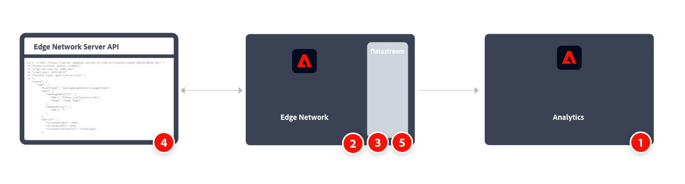

# Implementieren von Adobe Analytics mit der Adobe Experience Platform Edge Network-API

Normalerweise verwenden Sie die Experience Platform Edge Network-API , um Daten Server-seitig und nicht Client-seitig zu erfassen, und wenn Sie Daten von Geräten wie IoT-Geräten, Set-Top-Boxen und Desktop-Programmen erfassen. Dann senden Sie diese Daten an das Edge-Netzwerk und an Services wie Adobe Analytics.

Erwägen Sie auch die Edge Network-API, wenn vertrauliche Daten sicher erfasst und über das Netzwerk authentifiziert werden sollen. Weitere Informationen finden [ unter ](https://experienceleague.adobe.com/docs/experience-platform/edge-network-server-api/authentication.html)Authentifizierung“.

Ein allgemeiner Überblick über die Implementierungsaufgaben:

<table style="width:100%">

<tr>
<th style="width:5%"></th><th style="width:60%"><b>Aufgabe</b></th><th style="width:35%"><b>Weitere Informationen</b></th>
</tr>

<tr>
<td>1</td>
<td>Stellen Sie sicher, dass Sie <b>eine Report Suite definiert haben</b>.</td>
<td><a href="../../../admin/tools/manage-rs/report-suites-admin.md">Report Suite Manager</a></td>
</tr>

<tr>
<td>2</td>
<td><b>Schemata einrichten</b>. Um die Datenerfassung für die Verwendung in allen Anwendungen zu standardisieren, die Adobe Experience Platform nutzen, hat Adobe das offene und öffentlich dokumentierte Standard Experience-Datenmodell (XDM) erstellt.</td>
<td><a href="https://experienceleague.adobe.com/docs/experience-platform/xdm/ui/overview.html?lang=de">Übersicht über die Benutzeroberfläche von Schemata</a></td>
</tr>

<tr>
<td>3</td>
<td><b>Konfigurieren eines Datenstroms</b>. Ein Datenstrom stellt die Server-seitige Konfiguration bei Verwendung der APIs aus der Adobe Experience Platform Edge Network-API dar.</td>
<td><a href="https://experienceleague.adobe.com/docs/experience-platform/datastreams/configure.html?lang=de">Konfigurieren eines Datenstroms<a></td> 
</tr>

<tr>
<td>4</td>
<td><b>Implementieren und testen Sie </b> Datenerfassung mithilfe der APIs für die Erfassung von Einzelereignisdaten und die Batch-Ereignisdatenerfassung.</td>
<td><a href="https://experienceleague.adobe.com/docs/experience-platform/edge-network-server-api/data-collection/interactive-data-collection.html?lang=de">Datenerfassung für Einzelereignisse</a> <a href="https://experienceleague.adobe.com/docs/experience-platform/edge-network-server-api/data-collection/non-interactive-data-collection.html">Batch-Ereignisdatenerfassung</a>
</tr>

<td>5</td>
<td><b>Fügen Sie einen Adobe Analytics-Service</b> in Ihrem Datenstrom hinzu. Mit diesem Service wird gesteuert, ob und wie Daten an Adobe Analytics gesendet werden.</td>
<td><a href="https://experienceleague.adobe.com/docs/experience-platform/edge-network-server-api/interacting-other-adobe-solutions/interacting-adobe-analytics.html?lang=de">Interagieren mit Adobe Analytics</a></td>
</tr>

</table>

Weitere Informationen finden Sie in der Dokumentation ](https://experienceleague.adobe.com/docs/experience-platform/edge-network-server-api/overview.html?lang=de) Edge Network-APIs.[

