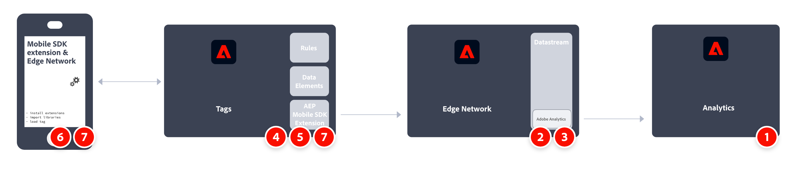
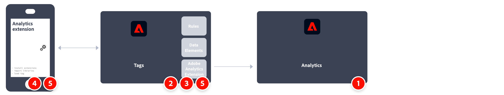

# Implementieren von Adobe Analytics mit dem Adobe Experience Platform Mobile SDK

Mit dem Adobe Experience Platform Mobile SDK können Sie die Experience Cloud-Lösungen und -Services von Adobe in Ihren Mobile Apps nutzen. Es ist für Android™, iOS und mehrere plattformübergreifende Entwicklungs-Frameworks verfügbar. Die Konfiguration erfolgt über die Datenerfassung von Adobe Experience Platform.

>[!IMPORTANT]
>
>Eine Adobe Analytics-Erweiterung ist ebenfalls in der Datenerfassung von Adobe Experience Platform verfügbar. Wenn Sie diese Erweiterung installieren, nutzen Sie weder XDM noch das Edge-Netzwerk.

## Adobe Experience Platform SDK

Ein allgemeiner Überblick über die Implementierungsaufgaben:

<table style="width:100%">

<tr>
<th style="width:5%"></th><th style="width:60%"><b>Aufgabe</b></th><th style="width:35%"><b>Weitere Informationen</b></th>
</tr>

<tr>
<td>1</td>
<td>Stellen Sie sicher, dass Sie <b>eine Report Suite definiert haben</b>.</td>
<td><a href="../../../admin/tools/manage-rs/report-suites-admin.md">Report Suite Manager</a></td>
</tr>

<tr>
<td>2</td>
<td><b>Konfigurieren eines Datenstroms</b>. Ein Datenstrom stellt die Server-seitige Konfiguration bei der Implementierung des Adobe Experience Platform Web SDK dar.</td>
<td><a href="https://experienceleague.adobe.com/docs/experience-platform/edge/datastreams/configure.html?lang=de">Konfigurieren eines Datenstroms<a></td> 
</tr>

<td>3</td>
<td><b>Fügen Sie einen Adobe Analytics-Service</b> in Ihrem Datenstrom hinzu. Mit diesem Service wird gesteuert, ob und wie Daten an Adobe Analytics gesendet werden.</td>
<td><a href="https://experienceleague.adobe.com/docs/experience-platform/edge/datastreams/configure.html?lang=de#analytics">Hinzufügen des Adobe Analytics-Service zu einem Datenstrom</a></td>
</tr>

<tr>
<td>4</td>
<td><b>Erstellen Sie eine mobile Eigenschaft</b>. Eine Eigenschaft ist ein Container, den Sie mit Erweiterungen, Regeln, Datenelementen und Bibliotheken füllen.</td>
<td><a href="https://developer.adobe.com/client-sdks/documentation/getting-started/create-a-mobile-property/">Einrichten einer mobilen Eigenschaft</a></tr>

<tr>
<td>5</td>
<td><b>Installieren Sie die Adobe Experience Platform Edge Network-Erweiterung</b> in der mobilen Tag-Eigenschaft und konfigurieren Sie den Datenstrom in der Erweiterung.</td>
<td><a href="https://developer.adobe.com/client-sdks/documentation/edge-network/">Adobe Experience Platform Edge Network</a>
</tr>

<tr>
<td>6</td>
<td><b>Nutzen Sie den Code in Ihrer App</b>, um die notwendigen Erweiterungen zu registrieren und Ihre Tag-Konfiguration zu laden.</td>
<td><a href="https://developer.adobe.com/client-sdks/documentation/user-guides/getting-started-with-platform/overview/#set-up-the-configuration">Einrichten der Konfiguration</a></td>
</tr>

<tr>
<td>7</td>
<td><b>Implementieren und testen Sie die Funktionalität</b> mit einer Kombination aus Datenelementen des Tags, Regeln, zusätzlichen Erweiterungen und SDK-API-Aufrufen in Ihrer Anwendung. Prüfen, validieren und debuggen Sie die Datenerfassung und die Erfahrungen für Ihre Mobile App.</td>
<td><a href="https://developer.adobe.com/client-sdks/documentation/user-guides/getting-started-with-platform/overview/#use-the-sample-application">Beispielanwendung verwenden</a>
</tr>

<tr>
<td>8</td>
<td><b>Erweitern und validieren Sie Ihre Mobile-App-Implementierung</b>, bevor sie in die Produktion verschoben wird.</td>
<td></td> 
</tr>

</table>

## Adobe Analytics-Erweiterung.

Ein allgemeiner Überblick über die Implementierungsaufgaben:

<table style="width:100%">

<tr>
<th style="width:5%"></th><th style="width:60%"><b>Aufgabe</b></th><th style="width:35%"><b>Weitere Informationen</b></th>
</tr>

<tr>
<td>1</td>
<td>Stellen Sie sicher, dass Sie <b>eine Report Suite definiert haben</b>.</td>
<td><a href="../../../admin/tools/manage-rs/report-suites-admin.md">Report Suite Manager</a></td>
</tr>

<tr>
<td>2</td>
<td><b>Installieren Sie die Adobe Analytics-Erweiterung</b> in der Eigenschaft des mobilen Tags und konfigurieren Sie die Erweiterung so, dass sie auf Ihre Report Suite verweist.</td>
<td><a href="https://developer.adobe.com/client-sdks/documentation/adobe-analytics/">Adobe Analytics-Erweiterung für mobile Eigenschaft</a>
</tr>

<tr>
<td>3</td>
<td><b>Nutzen Sie den Code in Ihrer App</b>, um die notwendigen Erweiterungen zu registrieren und Ihre Tag-Konfiguration zu laden.</td>
<td><a href="https://developer.adobe.com/client-sdks/documentation/user-guides/getting-started-with-platform/overview/#set-up-the-configuration">Einrichten der Konfiguration</a></td>
</tr>

<tr>
<td>4</td>
<td><b>Implementieren und testen Sie die Funktionalität</b> mit einer Kombination aus Datenelementen des Tags, Regeln, zusätzlichen Erweiterungen und SDK-API-Aufrufen in Ihrer Anwendung. Prüfen, validieren und debuggen Sie die Datenerfassung und die Erfahrungen für Ihre Mobile App.</td>
<td><a href="https://developer.adobe.com/client-sdks/documentation/user-guides/getting-started-with-platform/overview/#use-the-sample-application">Beispielanwendung verwenden</a>
</tr>

<tr>
<td>5</td>
<td><b>Erweitern und validieren Sie Ihre Mobile-App-Implementierung</b>, bevor sie in die Produktion verschoben wird.</td>
<td></td> 
</tr>

</table>

## Zusätzliche Ressourcen

- [Dokumentation zu Tags](https://experienceleague.adobe.com/docs/experience-platform/tags/home.html?lang=de#)

- [Dokumentation zu Mobile SDK](https://developer.adobe.com/client-sdks/documentation/)
