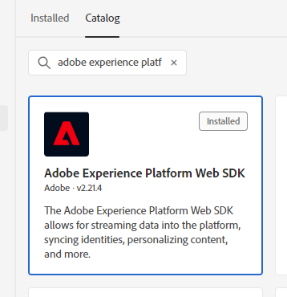

# Migrieren von der Adobe Analytics-Tag-Erweiterung zur Web-Tag-Erweiterung für SDK

Dieser Implementierungspfad beinhaltet einen methodischen Migrationsansatz, um von der Adobe Analytics-Tag-Erweiterung zur Web SDK-Tag-Erweiterung zu wechseln. Andere Implementierungspfade werden auf separaten Seiten behandelt:

* [AppMeasurement zur Web SDK JavaScript Library](appmeasurement-to-web-sdk.md): Ein reibungsloser und methodischer Ansatz für die Migration zur Web SDK, außer es werden keine Tags verwendet. Stattdessen entfernen Sie die Adobe Analytics-Datenerfassungsbibliothek (`AppMeasurement.js`) manuell und ersetzen sie durch die Web SDK JavaScript-Bibliothek (`alloy.js`).
* [Web SDK-Tag-Erweiterung](web-sdk-tag-extension.md): Eine neue Web SDK-Installation, bei der Sie die Implementierung mithilfe von Tags in der Adobe Experience Platform-Datenerfassung verwalten. Dazu muss die Adobe Analytics ExperienceEvent-Feldergruppe, die typische Analytics-Variablen enthält, in Ihr XDM-Schema aufgenommen werden.
* [Web SDK JavaScript Library](web-sdk-javascript-library.md): Eine neue Web SDK-Installation unter Verwendung der Web SDK JavaScript Library (`alloy.js`). Verwalten Sie die Implementierung selbst, anstatt die Tags-Benutzeroberfläche zu verwenden. Dazu muss die Adobe Analytics ExperienceEvent-Feldergruppe, die typische Analytics-Variablen enthält, in Ihr XDM-Schema aufgenommen werden.

## Vor- und Nachteile dieses Implementierungspfads

Die Verwendung dieses Migrationsansatzes hat sowohl Vor- als auch Nachteile. Wägen Sie jede Option sorgfältig ab, um zu entscheiden, welcher Ansatz für Ihr Unternehmen am besten geeignet ist.

| Vorteile | Nachteile |
| --- | --- |
| <ul><li>**Keine Code-Änderungen auf Ihrer Site**: Da in Ihrer Implementierung bereits Tags installiert sind, können alle Migrationsaktualisierungen in der Tags-Oberfläche vorgenommen werden.</li><li>**Verwendet Ihre vorhandene Implementierung**: Für diesen Ansatz ist keine neue Implementierung erforderlich. Neue Regelaktionen sind zwar erforderlich, aber Sie können Ihre vorhandenen Datenelemente und Regelbedingungen mit minimalen Änderungen wiederverwenden.</li><li>**Erfordert kein Schema**: Für diesen Schritt der Migration zur Web-SDK benötigen Sie kein XDM-Schema. Stattdessen können Sie das `data`-Objekt füllen, das Daten direkt an Adobe Analytics sendet. Sobald die Migration auf die Web-SDK abgeschlossen ist, können Sie ein Schema für Ihr Unternehmen erstellen und die Datenstromzuordnung verwenden, um die entsprechenden XDM-Felder auszufüllen. Wenn in dieser Phase des Migrationsprozesses ein Schema erforderlich wäre, würde Ihr Unternehmen gezwungen sein, ein Adobe Analytics-XDM-Schema zu verwenden. Die Verwendung dieses Schemas erschwert es Ihrem Unternehmen, in Zukunft Ihr eigenes Schema zu verwenden.</li></ul> | <ul><li>**Technischer Aufwand bei der Implementierung**: Da dieser Ansatz eine geänderte Form Ihrer vorhandenen Implementierung verwendet, kann es schwieriger sein, die Implementierungslogik zu verfolgen und bei Bedarf Änderungen durchzuführen. Benutzerdefinierter Code kann besonders schwer zu debuggen sein.</li><li>**Erfordert eine Zuordnung zum Senden von Daten an Platform**: Wenn Ihre Organisation für die Verwendung von Customer Journey Analytics bereit ist, müssen Sie Daten an einen Datensatz in Adobe Experience Platform senden. Für diese Aktion muss jedes Feld im `data`-Objekt ein Eintrag im Datenstrom-Zuordnungs-Tool sein, der es einem XDM-Schemafeld zuweist. Die Zuordnung muss nur einmal für diesen Workflow durchgeführt werden. Implementierungsänderungen sind nicht erforderlich. Es handelt sich jedoch um einen zusätzlichen Schritt, der beim Senden von Daten in ein XDM-Objekt nicht erforderlich ist.</li></ul> |

Adobe empfiehlt, diesen Implementierungspfad in den folgenden Szenarien zu befolgen:

* Sie haben eine bestehende Implementierung, die die Tag-Erweiterung von Adobe Analytics verwendet. Wenn Sie eine Implementierung mithilfe von AppMeasurement haben, folgen Sie stattdessen [Migrieren von AppMeasurement zur Web-SDK](appmeasurement-to-web-sdk.md).
* Sie beabsichtigen, in Zukunft Customer Journey Analytics zu verwenden, möchten aber Ihre Analytics-Implementierung nicht von Grund auf durch eine Web SDK-Implementierung ersetzen. Wenn Sie Ihre Implementierung im Web-SDK von Grund auf ersetzen möchten, ist der größte Aufwand erforderlich, bietet aber auch die praktikabelste langfristige Implementierungsarchitektur. Wenn Ihr Unternehmen bereit ist, eine saubere Web-SDK-Implementierung durchzuführen, finden Sie weitere Informationen unter [Aufnehmen von Daten über die Adobe Experience Platform Web SDK](https://experienceleague.adobe.com/de/docs/analytics-platform/using/cja-data-ingestion/ingest-use-guides/edge-network/aepwebsdk) im Customer Journey Analytics-Benutzerhandbuch.

## Zur Migration auf die Web-SDK erforderliche Schritte

Die folgenden Schritte enthalten konkrete Ziele, auf die Sie hinarbeiten müssen. Klicken Sie auf jeden Schritt, um detaillierte Anweisungen zur Durchführung zu erhalten.

+++**1. Erstellen und Konfigurieren eines Datenstroms**

Erstellen eines Datenstroms in der Adobe Experience Platform-Datenerfassung. Wenn Sie Daten an diesen Datenstrom senden, leitet er Daten an Adobe Analytics weiter. In Zukunft leitet derselbe Datenstrom Daten an Customer Journey Analytics weiter.

1. Navigieren Sie zu [experience.adobe.com](https://experience.adobe.com) und melden Sie sich mit Ihren Anmeldedaten an.
1. Navigieren Sie über die Startseite oder den Produktselektor oben rechts zu **[!UICONTROL Datenerfassung]**.
1. Wählen Sie in der linken Navigation **[!UICONTROL Datenströme]** aus.
1. Wählen Sie **[!UICONTROL Neuer Datenstrom]** aus.
1. Geben Sie den gewünschten Namen ein und klicken Sie dann auf **[!UICONTROL Speichern]**.
1. Nachdem der Datenstrom erstellt wurde, wählen Sie **[!UICONTROL Service hinzufügen]** aus.
1. Wählen Sie im Dropdown-Menü Service die Option **[!UICONTROL Adobe Analytics]**.
1. Geben Sie dieselbe Report Suite-ID ein wie die Site, an die Sie derzeit Analysedaten senden. Klicken Sie auf **[!UICONTROL Speichern]**.

 {style="border:1px solid lightslategray"}

Ihr Datenstrom ist jetzt bereit, Daten zu empfangen und an Adobe Analytics weiterzugeben.

+++

+++**2. Fügen Sie die Web SDK-Erweiterung zu Ihrer Tag-Eigenschaft hinzu**

In diesem Abschnitt wird Ihr Tag auf den Großteil des Migrationsaufwands vorbereitet, der im nächsten Schritt stattfindet.

1. Klicken Sie oben links in der Adobe Experience Platform-Benutzeroberfläche auf das Hamburger-Symbol und wählen Sie dann **[!UICONTROL Tags]** aus.
1. Wählen Sie die gewünschte Tag-Eigenschaft aus.
1. Wählen Sie im linken Navigationsbereich der Tag-Eigenschaft die Option **[!UICONTROL Erweiterungen]** aus.
1. Wählen Sie **[!UICONTROL Katalog]** oben aus, um eine Liste aller verfügbaren Erweiterungen anzuzeigen.
1. Suchen Sie nach der Erweiterung **[!UICONTROL Adobe Experience Platform Web SDK]** und wählen Sie sie aus. Klicken Sie dann ]**rechts auf**[!UICONTROL  Installieren“.

    {style="border:1px solid lightslategray"}

1. Die Konfigurationseinstellungen der Erweiterung werden angezeigt. Suchen Sie den Abschnitt Datenströme und wählen Sie den im vorherigen Schritt erstellten Datenstrom aus.

    {style="border:1px solid lightslategray"}

1. Wählen Sie **[!UICONTROL Speichern]** aus.

In Ihrer Tag-Eigenschaft ist jetzt Web SDK installiert.

+++

+++**3. Erstellen Sie ein Datenelement für ein Datenobjekt**

Das Datenelement „Datenobjekt“ bietet ein intuitives Framework zum Konfigurieren einer Payload, die von Web SDK zum Senden an einen Datenstrom verwendet wird. Die meisten Regeln, die Sie im folgenden Schritt aktualisieren, interagieren mit diesem Datenelement.

1. Wählen Sie in der linken Navigation der Tags-Benutzeroberfläche die Option **[!UICONTROL Datenelemente]**.
1. Wählen Sie **[!UICONTROL Datenelement hinzufügen]**
1. Legen Sie für das Datenelement die folgenden Einstellungen fest:
   * [!UICONTROL Name]: Alles, was Sie möchten, z. B. „Datenschicht“ oder „Datenobjekt“
   * [!UICONTROL Erweiterung]: [!UICONTROL Adobe Experience Platform Web SDK]
   * [!UICONTROL Datenelementtyp]: [!UICONTROL variable]
   * Kontrollkästchen können unverändert bleiben
1. Wählen Sie rechts die folgenden Einstellungen aus:
   * Optionsfeld „Eigenschaft“: [!UICONTROL Data]
   * Lösung: [!UICONTROL Adobe Analytics]
1. Wählen Sie **[!UICONTROL Speichern]** aus.

 {style="border:1px solid lightslategray"}

Ihre Tag-Eigenschaft verfügt jetzt über alles, was zum Aktualisieren jeder Regel erforderlich ist.

+++

+++**4. Aktualisieren Sie Regeln, um die Web SDK-Erweiterung anstelle der Analytics-Erweiterung zu verwenden**

Dieser Schritt enthält den Großteil des für die Migration auf die Web-SDK erforderlichen Arbeitsaufwands und setzt Kenntnisse der Funktionsweise Ihrer Implementierung voraus. Nachfolgend finden Sie ein Beispiel für die Bearbeitung einer typischen Tag-Regel. Aktualisieren Sie alle Tag-Regeln in Ihrer Implementierung, um alle Verweise auf die Adobe Analytics-Erweiterung durch die Web SDK-Erweiterung zu ersetzen.

1. Wählen Sie in der linken Navigation der Tags-Benutzeroberfläche die Option **[!UICONTROL Regeln]** aus.
1. Regel zum Bearbeiten auswählen.
1. Wählen Sie die Aktion **[!UICONTROL Adobe Analytics - Variablen festlegen]**
1. Notieren Sie alle Analytics-Variablen, die in dieser Regel festgelegt sind. Schließen Sie sowohl in den Dropdown-Menüs festgelegte Variablen als auch Variablen ein, die in benutzerdefiniertem Code festgelegt sind.
1. Ändern Sie [!UICONTROL Aktionskonfiguration] in die folgenden Einstellungen:
   * [!UICONTROL Erweiterung]: [!UICONTROL Adobe Experience Platform Web SDK]
   * [!UICONTROL Aktionstyp]: Variable aktualisieren
1. Stellen Sie sicher, dass Ihr Datenobjekt in der Dropdown-Liste auf der rechten Seite ausgewählt ist.
1. Legen Sie die Analytics-Variablen auf die gleichen entsprechenden Werte fest, wie sie in der Analytics-Erweiterung konfiguriert wurden.
   * Variablen, die in der Tags-Oberfläche festgelegt werden, können direkt in dieselben Werte übersetzt werden.
   * Zeichenfolgenvariablen, die in benutzerdefiniertem Code festgelegt werden, erfordern minimale Anpassungen. Anstatt das `s`-Objekt zu verwenden, verwenden Sie stattdessen `data.__adobe.analytics` . `s.eVar1` würde beispielsweise in `data.__adobe.analytics.eVar1` übersetzt werden.
   * Konfigurationsvariablen und Methodenaufrufe von Analytics in benutzerdefiniertem Code können eine geänderte Implementierungslogik erfordern. Unter den entsprechenden [Variablen](/help/implement/vars/overview.md) finden Sie Informationen darüber, wie Sie das Äquivalent mithilfe der Web-SDK erreichen.
1. Nachdem die gesamte Regellogik mithilfe der Web-SDK-Erweiterung repliziert wurde, wählen Sie **[!UICONTROL Änderungen beibehalten]**.
1. Wiederholen Sie diese Schritte für jede Aktionskonfiguration, die die Adobe Analytics-Erweiterung zum Festlegen von Werten verwendet. Dieser Schritt umfasst sowohl Variablen, die mithilfe der Tags-Schnittstelle festgelegt werden, als auch Variablen, die mithilfe von benutzerdefiniertem Code festgelegt werden. Benutzerdefinierte Code-Blöcke können an keiner Stelle auf das `s`-Objekt verweisen.

Die obigen Schritte gelten nur für Regeln, die Werte festlegen. Die folgenden Schritte ersetzen alle Aktionen, die die [!UICONTROL Aktionskonfiguration“ ]Beacon senden.

1. Wählen Sie eine Regel aus, die einen Beacon sendet.
1. Wählen Sie die Aktion **[!UICONTROL Adobe Analytics - Beacon senden]** aus.
1. Beachten Sie den aktuellen Wert des Optionsfelds [!UICONTROL Tracking] auf der rechten Seite ([`s.t()`](../../vars/functions/t-method.md) oder [`s.tl()`](../../vars/functions/tl-method.md)).
1. Ändern Sie [!UICONTROL Aktionskonfiguration] in die folgenden Einstellungen:
   * [!UICONTROL Erweiterung]: [!UICONTROL Adobe Experience Platform Web SDK]
   * [!UICONTROL Aktionstyp]: [!UICONTROL Ereignis senden]
1. Ändern Sie auf der rechten Seite die Aktionseinstellungen wie folgt:
   * [!UICONTROL type]: Verwenden Sie `s.t()` &quot;**[!UICONTROL -Seitenansichten“]**. Verwenden Sie `s.tl()` „WebInteraction **[!UICONTROL Link-Klicks]**. Wenn Sie [`s.tl()`](../../vars/functions/tl-method.md) verwenden, müssen Sie auch die folgenden Felder in Ihr Datenobjekt einbeziehen. Diese Felder werden bei [!UICONTROL  Konfiguration der Aktion [!UICONTROL Variable aktualisieren] unter „Zusätzliche Eigenschaften] aufgeführt:
      * [Link-Name](../../vars/functions/tl-method.md)
      * [Link-Typ ](../../vars/functions/tl-method.md)
      * [Link-URL](../../vars/config-vars/linkurl.md)
1. Wählen Sie **[!UICONTROL Änderungen beibehalten]** aus.
1. Wiederholen Sie diese Schritte für jede Aktionskonfiguration, die Adobe Analytics zum Senden eines Beacons verwendet.

+++

+++**5. Aktualisierte Publish-Regeln**

Das Veröffentlichen aktualisierter Regeln folgt demselben Workflow wie alle anderen Änderungen an Ihrer Tags-Konfiguration.

1. Wählen Sie in der linken Navigation der Tags-Benutzeroberfläche die Option **[!UICONTROL Veröffentlichungsfluss]** aus.
1. Wählen Sie **[!UICONTROL Bibliothek hinzufügen]** aus.
1. Geben Sie diesem Tag-Commit einen Namen, z. B. „Upgrade auf Web SDK&quot;.
1. Wählen Sie **[!UICONTROL Alle geänderten Ressourcen hinzufügen]** aus.
1. Wählen Sie **[!UICONTROL Speichern]** aus.
1. Der Veröffentlichungs-Workflow zeigt einen orangefarbenen Punkt an, der angibt, dass er gerade erstellt wird. Sobald der Punkt grün wird, sind Ihre Änderungen in Ihrer Entwicklungsumgebung verfügbar.
1. Testen Sie die Änderungen in Ihrer Entwicklungsumgebung, um sicherzustellen, dass alle Regeln ordnungsgemäß ausgelöst werden und das Datenobjekt mit erwarteten Werten gefüllt wird.
1. Wenn Sie bereit sind, senden Sie die Bibliothek zur Genehmigung, erstellen Sie sie für das Staging, genehmigen Sie sie dann letztendlich und veröffentlichen Sie sie in der Produktion.

 {style="border:1px solid lightslategray"}

+++

+++**6. Analytics-Erweiterung deaktivieren**

Sobald Ihre Tag-Implementierung vollständig in der Web-SDK vorhanden ist, können Sie die Adobe Analytics-Erweiterung deaktivieren.

1. Wählen Sie in der linken Navigation der Tags-Benutzeroberfläche die Option **[!UICONTROL Erweiterungen]** aus.
1. Suchen Sie die Erweiterung [!UICONTROL Adobe Analytics] und wählen Sie sie aus. Klicken Sie auf der rechten Seite auf **[!UICONTROL Deaktivieren]**.
1. Befolgen Sie denselben Veröffentlichungs-Workflow wie oben, um die Entfernung der Erweiterung [!UICONTROL Adobe Analytics] zu veröffentlichen.
1. Sobald die Erweiterung in der Produktion deaktiviert ist, können Sie sie vollständig deinstallieren. Wählen Sie die Erweiterung aus, klicken Sie auf das Dreipunkt-Menü auf der rechten Seite und wählen Sie dann **[!UICONTROL Deinstallieren]**.
1. Folgen Sie demselben Veröffentlichungs-Workflow wie oben, um diese Änderungen in der Produktion zu veröffentlichen.

+++

Zu diesem Zeitpunkt befindet sich Ihre Analytics-Implementierung vollständig auf der Web-SDK und ist angemessen darauf vorbereitet, in Zukunft zum Customer Journey Analytics zu wechseln.
