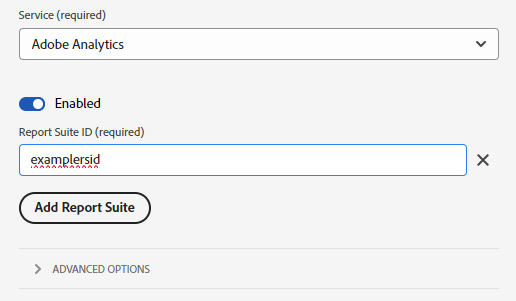

# Migrieren von AppMeasurement zur Web-SDK

Dieser Implementierungspfad beinhaltet einen methodischen Migrationsansatz, um von einer AppMeasurement-Implementierung zu einer Web SDK JavaScript-Bibliotheksimplementierung zu wechseln. Andere Implementierungspfade werden auf separaten Seiten behandelt:

* [Analytics-Erweiterung zur Web SDK-Erweiterung](analytics-extension-to-web-sdk.md): Verwenden Sie einen reibungslosen und methodischen Ansatz, um von der Adobe Analytics-Tag-Erweiterung zur Web SDK-Tag-Erweiterung zu wechseln. Durch diesen Ansatz entfällt die Notwendigkeit, XDM zu verwenden, bis Ihr Unternehmen bereit ist, Adobe Experience Platform-Services wie Customer Journey Analytics zu verwenden. Verwenden Sie das `data`-Objekt anstelle des `xdm`-Objekts, um Daten an Adobe zu senden.
* [Web SDK JavaScript Library](web-sdk-javascript-library.md): Eine neue Web SDK-Installation unter Verwendung der Web SDK JavaScript Library (`alloy.js`). Verwalten Sie die Implementierung selbst, anstatt die Tags-Benutzeroberfläche zu verwenden. Dazu muss die Adobe Analytics ExperienceEvent-Feldergruppe, die typische Analytics-Variablen enthält, in Ihr XDM-Schema aufgenommen werden.
* [Web SDK-Tag-Erweiterung](web-sdk-tag-extension.md): Eine neue Web SDK-Installation, bei der Sie die Implementierung mithilfe von Tags in der Adobe Experience Platform-Datenerfassung verwalten. Dazu muss die Adobe Analytics ExperienceEvent-Feldergruppe, die typische Analytics-Variablen enthält, in Ihr XDM-Schema aufgenommen werden.

## Vor- und Nachteile dieses Implementierungspfads

Die Verwendung dieses Migrationsansatzes hat sowohl Vor- als auch Nachteile. Wägen Sie jede Option sorgfältig ab, um zu entscheiden, welcher Ansatz für Ihr Unternehmen am besten geeignet ist.

| Vorteile | Nachteile |
| --- | --- |
| <ul><li>**Nutzt Ihre vorhandene Implementierung**: Dieser Ansatz erfordert zwar einige Implementierungsänderungen, aber keine völlig neue Implementierung. Sie können Ihre vorhandene Datenschicht und Ihren Code mit minimalen Änderungen an der Implementierungslogik verwenden.</li><li>**Erfordert kein Schema**: Für diesen Schritt der Migration zur Web-SDK benötigen Sie kein XDM-Schema. Stattdessen können Sie das `data`-Objekt füllen, das Daten direkt an Adobe Analytics sendet. Sobald die Migration auf die Web-SDK abgeschlossen ist, können Sie ein Schema für Ihr Unternehmen erstellen und die Datenstromzuordnung verwenden, um die entsprechenden XDM-Felder auszufüllen. Wenn in dieser Phase des Migrationsprozesses ein Schema erforderlich wäre, würde Ihr Unternehmen gezwungen sein, ein Adobe Analytics-XDM-Schema zu verwenden. Die Verwendung dieses Schemas erschwert es Ihrem Unternehmen, in Zukunft Ihr eigenes Schema zu verwenden.</li></ul> | <ul><li>**Implementierungsänderungen erfordern**: Wenn Sie Änderungen an Ihrer Web SDK-Implementierung vornehmen möchten, müssen Sie mit Ihrem Entwicklungs-Team zusammenarbeiten, um den Code auf Ihrer Site zu bearbeiten. Der Ansatz, der [zur Web SDK-Tag-Erweiterung migriert](analytics-extension-to-web-sdk.md) vermeidet diesen Nachteil.</li><li>**Technischer Aufwand bei der Implementierung**: Da dieser Ansatz eine geänderte Form Ihrer vorhandenen Implementierung verwendet, kann es schwieriger sein, die Implementierungslogik zu verfolgen und bei Bedarf Änderungen in der Zukunft durchzuführen.</li><li>**Erfordert eine Zuordnung zum Senden von Daten an Platform**: Wenn Ihre Organisation für die Verwendung von Customer Journey Analytics bereit ist, müssen Sie Daten an einen Datensatz in Adobe Experience Platform senden. Für diese Aktion muss jedes Feld im `data`-Objekt ein Eintrag im Datenstrom-Zuordnungs-Tool sein, der es einem XDM-Schemafeld zuweist. Die Zuordnung muss nur einmal für diesen Workflow durchgeführt werden. Implementierungsänderungen sind nicht erforderlich. Es handelt sich jedoch um einen zusätzlichen Schritt, der beim Senden von Daten in ein XDM-Objekt nicht erforderlich ist.</li></ul> |

Adobe empfiehlt, diesen Implementierungspfad in den folgenden Szenarien zu befolgen:

* Sie verfügen über eine vorhandene Implementierung mit der Adobe Analytics AppMeasurement JavaScript-Bibliothek. Wenn Sie über eine Implementierung mit der Adobe Analytics-Tag-Erweiterung verfügen, folgen Sie stattdessen [Migrieren von der Adobe Analytics-Tag-Erweiterung zur Web SDK-Tag-Erweiterung](analytics-extension-to-web-sdk.md) .
* Sie beabsichtigen, Customer Journey Analytics in Zukunft zu verwenden, möchten jedoch Ihre Analytics-Implementierung nicht von Grund auf durch eine Web SDK-Implementierung ersetzen. Wenn Sie Ihre Implementierung im Web-SDK von Grund auf ersetzen möchten, ist der größte Aufwand erforderlich, bietet aber auch die praktikabelste langfristige Implementierungsarchitektur. Wenn Ihr Unternehmen bereit ist, eine saubere Web-SDK-Implementierung durchzuführen, finden Sie weitere Informationen unter [Aufnehmen von Daten über die Adobe Experience Platform Web SDK](https://experienceleague.adobe.com/de/docs/analytics-platform/using/cja-data-ingestion/ingest-use-guides/edge-network/aepwebsdk) im Customer Journey Analytics-Benutzerhandbuch.

## Zur Migration auf die Web-SDK erforderliche Schritte

Die folgenden Schritte enthalten konkrete Ziele, auf die Sie hinarbeiten müssen. Klicken Sie auf jeden Schritt, um detaillierte Anweisungen zur Durchführung zu erhalten.

+++**1. Erstellen und Konfigurieren eines Datenstroms**

Erstellen eines Datenstroms in der Adobe Experience Platform-Datenerfassung. Wenn Sie Daten an diesen Datenstrom senden, leitet er Daten an Adobe Analytics weiter. In Zukunft leitet derselbe Datenstrom Daten an Customer Journey Analytics weiter.

1. Navigieren Sie zu [experience.adobe.com](https://experience.adobe.com) und melden Sie sich mit Ihren Anmeldedaten an.
1. Navigieren Sie über die Startseite oder den Produktselektor oben rechts zu **[!UICONTROL Datenerfassung]**.
1. Wählen Sie in der linken Navigation **[!UICONTROL Datenströme]** aus.
1. Wählen Sie **[!UICONTROL Neuer Datenstrom]** aus.
1. Geben Sie den gewünschten Namen ein und klicken Sie dann auf **[!UICONTROL Speichern]**.
1. Nachdem der Datenstrom erstellt wurde, wählen Sie **[!UICONTROL Service hinzufügen]** aus.
1. Wählen Sie im Dropdown-Menü Service die Option **[!UICONTROL Adobe Analytics]**.
1. Geben Sie dieselbe Report Suite-ID ein wie die Site, an die Sie derzeit Analysedaten senden. Klicken Sie auf **[!UICONTROL Speichern]**.

 {style="border:1px solid lightslategray"}

Ihr Datenstrom ist jetzt bereit, Daten zu empfangen und an Adobe Analytics weiterzugeben. Beachten Sie die Datenstrom-ID, da diese ID beim Konfigurieren der Web-SDK im Code erforderlich ist.

+++

+++**2. Installieren Sie die Web SDK JavaScript-Bibliothek**

Verweisen Sie auf die neueste Version von `alloy.js`, damit die zugehörigen Methodenaufrufe verwendet werden können. Weitere [&#x200B; und zu verwendende Codeblöcke finden Sie unter „Installieren des Web](https://experienceleague.adobe.com/de/docs/experience-platform/web-sdk/install/library)SDKs mit der JavaScript-Bibliothek“.

+++

+++**3. Konfigurieren Sie die Web-SDK**

Richten Sie Ihre Implementierung so ein, dass sie auf den im vorherigen Schritt erstellten Datenstrom verweist, indem Sie den Befehl Web SDK [`configure`](https://experienceleague.adobe.com/en/docs/experience-platform/web-sdk/commands/configure/overview) verwenden. Der `configure`-Befehl muss auf jeder Seite festgelegt werden, damit Sie ihn zusammen mit dem Bibliotheksinstallationscode einfügen können.

Verwenden Sie die [`datastreamId`](https://experienceleague.adobe.com/en/docs/experience-platform/web-sdk/commands/configure/datastreamid)- und [`orgId`](https://experienceleague.adobe.com/en/docs/experience-platform/web-sdk/commands/configure/orgid)-Eigenschaften im `configure`-Befehl von Web SDK:

* Legen Sie die `datastreamId` auf die Datenstrom-ID fest, die aus dem vorherigen Schritt abgerufen wurde.
* Legen Sie die `orgId` auf die IMS-Organisation Ihrer Organisation fest.

```js
alloy("configure", {
    datastreamId: "ebebf826-a01f-4458-8cec-ef61de241c93",
    orgId: "ADB3LETTERSANDNUMBERS@AdobeOrg"
});
```

Je nach den Implementierungsanforderungen Ihres Unternehmens können Sie im [`configure`](https://experienceleague.adobe.com/en/docs/experience-platform/web-sdk/commands/configure/overview)-Befehl optional andere Eigenschaften festlegen.

+++

+++**4. Aktualisieren der Code-Logik zur Verwendung einer JSON-Payload**

Ändern Sie Ihre Analytics-Implementierung so, dass sie sich nicht auf `AppMeasurement.js` oder das `s`-Objekt verlässt. Legen Sie stattdessen Variablen in ein korrekt formatiertes JavaScript-Objekt fest, das in ein JSON-Objekt konvertiert wird, wenn es an Adobe gesendet wird. Eine [Datenschicht](../../prepare/data-layer.md) auf Ihrer Site hilft enorm beim Festlegen von Werten, da Sie weiterhin auf dieselben Werte verweisen können.

Um Daten an Adobe Analytics zu senden, muss die Web-SDK-Payload `data.__adobe.analytics` mit allen in diesem Objekt festgelegten Analytics-Variablen verwenden. Variablen in diesem Objekt verwenden dieselben Namen und Formate wie ihre AppMeasurement-Variablenentsprechungen. Wenn Sie beispielsweise die Variable `products` festlegen, teilen Sie sie nicht in einzelne Objekte auf, wie Sie es bei XDM tun würden. Schließen Sie sie stattdessen als Zeichenfolge ein. Dies ist genau dann der Fall, wenn Sie die `s.products` Variable festlegen:

```json
{
  "data": {
    "__adobe": {
      "analytics": {
        "products": "Shoes,Men's sneakers,1,49.99"
      }
    }
  }
}
```

Letztendlich enthält diese Payload alle gewünschten Werte, und alle Verweise auf das `s`-Objekt in Ihrer Implementierung werden entfernt. Sie können jede der von JavaScript bereitgestellten Ressourcen verwenden, um dieses Payload-Objekt festzulegen, einschließlich der Punktnotation, um einzelne Werte festzulegen.

```js
// Define the payload and set objects within it
var dataObj = {data: {__adobe: {analytics: {}}}};
dataObj.data.__adobe.analytics.pageName = window.document.title;
dataObj.data.__adobe.analytics.eVar1 = "Example value";

// Alternatively, set values in an object and use a spread operator to achieve identical results
var a = new Object;
a.pageName = window.document.title;
a.eVar1 = "Example value";
var dataObj = {data:{__adobe:{analytics:{...a}}}};
```

+++

+++**5. Aktualisieren Sie Methodenaufrufe zur Verwendung der Web-SDK**

Aktualisieren Sie alle Instanzen, in denen Sie [`s.t()`](../../vars/functions/t-method.md) und [`s.tl()`](../../vars/functions/tl-method.md) aufrufen, und ersetzen Sie sie durch den [`sendEvent`](https://experienceleague.adobe.com/en/docs/experience-platform/web-sdk/commands/sendevent/overview). Es gibt drei Szenarien, die zu berücksichtigen sind:

* **Seitenansichts-Tracking**: Ersetzen Sie den Seitenansichts-Tracking-Aufruf durch den `sendEvent`-Befehl von Web SDK:

  ```js
  // If your current implementation has this line of code:
  s.t();
  
  // Replace it with this line of code. The dataObj object contains the variables to send.
  alloy("sendEvent", dataObj);
  ```

* **Automatisches Linktracking**: Die [`clickCollectionEnabled`](https://experienceleague.adobe.com/en/docs/experience-platform/web-sdk/commands/configure/clickcollectionenabled) Konfigurationseigenschaft ist standardmäßig aktiviert. Es werden automatisch die richtigen Linktracking-Variablen zum Senden von Daten an Adobe Analytics festgelegt. Wenn Sie die automatische Linkverfolgung deaktivieren möchten, legen Sie diese Eigenschaft im `false`[`configure`-Befehl auf &#x200B;](https://experienceleague.adobe.com/en/docs/experience-platform/web-sdk/commands/configure/overview) fest.

* **Manuelles Linktracking**: Die Web-SDK verfügt nicht über separate Befehle zwischen PageView- und Nicht-PageView-Aufrufen. Geben Sie diese Unterscheidung innerhalb des Payload-Objekts an.

  ```js
  // If your current implementation has this line of code:
  s.tl(true,"o","Example custom link");
  
  // Replace it with these lines of code. Add the required fields to the dataObj object.
  dataObj.data.__adobe.analytics.linkName = "Example custom link";
  dataObj.data.__adobe.analytics.linkType = "o";
  dataObj.data.__adobe.analytics.linkURL = "https://example.com";
  alloy("sendEvent", dataObj);
  ```

+++

+++**6. Änderungen validieren und veröffentlichen**

Nachdem Sie alle Verweise auf AppMeasurement und das `s` entfernt haben, veröffentlichen Sie Ihre Änderungen in Ihrer Entwicklungsumgebung, um zu überprüfen, ob die neue Implementierung funktioniert. Nachdem Sie überprüft haben, ob alles ordnungsgemäß funktioniert, können Sie Ihre Aktualisierungen in der Produktionsumgebung veröffentlichen.

Bei korrekter Migration ist `AppMeasurement.js` auf Ihrer Site nicht mehr erforderlich, und alle Verweise auf dieses Skript können entfernt werden.

+++

Zu diesem Zeitpunkt befindet sich Ihre Analytics-Implementierung vollständig auf der Web-SDK und ist angemessen darauf vorbereitet, in Zukunft zu Customer Journey Analytics zu wechseln.
