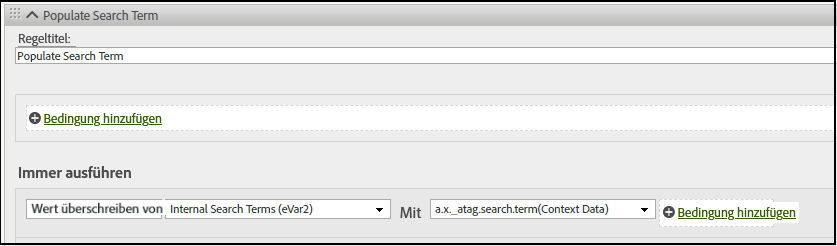

# XDM-Objektfeldzuordnung zu Adobe Analytics

In der folgenden Tabelle finden Sie die Variablen, die Adobe Experience Platform Edge Network automatisch Adobe Analytics zuordnet. Wenn Sie diese XDM-Feldpfade verwenden, ist keine zusätzliche Konfiguration erforderlich, um Daten an Adobe Analytics zu senden. Diese Felder sind in der Feldergruppe **[!UICONTROL Adobe Analytics ExperienceEvent Template]** enthalten. Die Verwendung dieser Felder wird empfohlen, wenn Sie Daten sowohl an Adobe Analytics als auch an Adobe Experience Platform senden möchten.

Wenn Ihre Organisation plant, zu Customer Journey Analytics zu wechseln, empfiehlt Adobe stattdessen die Verwendung des Objekts `data`, um Daten direkt an Adobe Analytics zu senden, ohne einem Schema zu entsprechen. Diese Strategie ermöglicht es Ihrer Organisation, ein eigenes Schema zu verwenden, anstatt die [!UICONTROL Adobe Analytics ExperienceEvent-Vorlage] zu verwenden (welche für Customer Journey Analytics weniger zutreffend ist). Siehe [Zuordnen von Datenobjektvariablen zu Adobe Analytics](data-var-mapping.md) für eine ähnliche Zuordnungstabelle.

## Wertprioritäten

Die meisten XDM-Objektfelder in dieser Tabelle entsprechen einem [zugeordneten Datenobjektfeld](data-var-mapping.md). Während der Adobe Analytics-Aufnahme werden Werte zunächst von XDM Analytics-Variablen zugeordnet. Erkannte Datenobjektfelder werden dann zugeordnet und überschreiben alle zuvor festgelegten Werte, wenn sie derselben Analytics-Variablen zugeordnet werden. Wenn beispielsweise `data.__adobe.analytics.events` vorhanden ist, ersetzt sie den gesamten Satz von Ereignissen, die andernfalls von XDM abgeleitet würden. Ereignisse werden nicht über beide Quellen hinweg kombiniert.

## Zuordnen von XDM-Objektfeldern

Vorherige Aktualisierungen dieser Tabelle finden Sie auf der Seite [Commit-Verlauf auf GitHub](https://github.com/AdobeDocs/analytics.de-DE/commits/main/help/implement/aep-edge/xdm-var-mapping.md).

| XDM-Feldpfad | Analytics-Variable und Beschreibung |
| --- | --- |
| `xdm.application.isClose` | Ermöglicht die Definition der Mobile-Lebenszyklusmetrik [Crashes](https://developer.adobe.com/client-sdks/home/base/mobile-core/lifecycle/metrics/). |
| `xdm.application.isInstall` | Hilft bei der Bestimmung, wann die Mobile-Lebenszyklusmetrik [Erste Starts](https://developer.adobe.com/client-sdks/home/base/mobile-core/lifecycle/metrics/) erhöht werden soll. |
| `xdm.application.closeType` | Bestimmt, ob ein Schließen-Ereignis ein Absturz ist oder nicht. Gültige Werte sind `close` (eine Lebenszyklussitzung endet und ein Pausenereignis wurde für die vorherige Sitzung empfangen) und `unknown` (eine Lebenszyklussitzung endet ohne Pausenereignis). Ermöglicht die Definition der Mobile-Lebenszyklusmetrik [Crashes](https://developer.adobe.com/client-sdks/home/base/mobile-core/lifecycle/metrics/). |
| `xdm.application.isInstall` | Die Mobile-Lebenszyklusmetrik [Installationen](https://developer.adobe.com/client-sdks/home/base/mobile-core/lifecycle/metrics/). |
| `xdm.application.isLaunch` | Die Mobile-Lebenszyklusmetrik [Starts](https://developer.adobe.com/client-sdks/home/base/mobile-core/lifecycle/metrics/). |
| `xdm.application.name` | Ermöglicht die Definition der Mobile-Lebenszyklusdimension [App-ID](https://developer.adobe.com/client-sdks/home/base/mobile-core/lifecycle/metrics/). |
| `xdm.application.isUpgrade` | Die Mobile-Lebenszyklusmetrik [Upgrades](https://developer.adobe.com/client-sdks/home/base/mobile-core/lifecycle/metrics/). |
| `xdm.application.version` | Ermöglicht die Definition der Mobile-Lebenszyklusdimension [App-ID](https://developer.adobe.com/client-sdks/home/base/mobile-core/lifecycle/metrics/). |
| `xdm.application.sessionLength` | Die Mobile-Lebenszyklusmetrik [Länge der vorherigen Sitzung](https://developer.adobe.com/client-sdks/home/base/mobile-core/lifecycle/metrics/). |
| `xdm.commerce.checkouts.id` | Wendet die [Ereignis-Serialisierung](../vars/page-vars/events/event-serialization.md) auf die Metrik [Checkouts](/help/components/metrics/checkouts.md) an. |
| `xdm.commerce.checkouts.value` | Inkrementiert die Metrik [Checkouts](/help/components/metrics/checkouts.md) um den gewünschten Wert. |
| `xdm.commerce.order.currencyCode` | Definiert die Konfigurationsvariable [currencyCode](../vars/config-vars/currencycode.md). |
| `xdm.commerce.order.purchaseID` | Definiert die Seitenvariable [purchaseID](../vars/page-vars/purchaseid.md). |
| `xdm.commerce.order.payments[0].transactionID` | Legt die Seitenvariable [transactionID](../vars/page-vars/transactionid.md) fest. |
| `xdm.commerce.productListAdds.id` | Wendet die [Ereignis-Serialisierung](../vars/page-vars/events/event-serialization.md) auf die Metrik [Warenkorbhinzufügungen](/help/components/metrics/cart-additions.md) an. |
| `xdm.commerce.productListAdds.value` | Erhöht die Metrik [Warenkorbhinzufügungen](/help/components/metrics/cart-additions.md). |
| `xdm.commerce.productListOpens.id` | Wendet die [Ereignis-Serialisierung](../vars/page-vars/events/event-serialization.md) auf die Metrik [Warenkörbe](/help/components/metrics/carts.md) an. |
| `xdm.commerce.productListOpens.value` | Erhöht die Metrik [Warenkörbe](/help/components/metrics/carts.md). |
| `xdm.commerce.productListRemovals.id` | Wendet die [Ereignis-Serialisierung](../vars/page-vars/events/event-serialization.md) auf die Metrik [Warenkorbentnahmen](/help/components/metrics/cart-removals.md) an. |
| `xdm.commerce.productListRemovals.value` | Erhöht die Metrik [Warenkorbentnahmen](/help/components/metrics/cart-removals.md). |
| `xdm.commerce.productListViews.id` | Wendet die [Ereignis-Serialisierung](../vars/page-vars/events/event-serialization.md) auf die Metrik [Warenkorbansichten](/help/components/metrics/cart-views.md) an. |
| `xdm.commerce.productListViews.value` | Erhöht die Metrik [Warenkorbansichten](/help/components/metrics/cart-views.md). |
| `xdm.commerce.productViews.id` | Wendet die [Ereignis-Serialisierung](../vars/page-vars/events/event-serialization.md) auf die Metrik [Produktansichten](/help/components/metrics/product-views.md) an. |
| `xdm.commerce.productViews.value` | Erhöht die Metrik [Produktansichten](/help/components/metrics/product-views.md). |
| `xdm.commerce.purchases.value` | Erhöht die Metrik [Bestellungen](/help/components/metrics/orders.md). |
| `xdm.device.model` | Die Mobile-Lebenszyklusdimension [Gerätename](https://developer.adobe.com/client-sdks/home/base/mobile-core/lifecycle/metrics/). |
| `xdm.device.colorDepth` | Ermöglicht die Definition der Dimension [Farbtiefe](/help/components/dimensions/color-depth.md). |
| `xdm.device.screenHeight` | Ermöglicht die Definition der Dimension [Bildschirmauflösung.](/help/components/dimensions/monitor-resolution.md) |
| `xdm.device.screenWidth` | Ermöglicht die Definition der Dimension [Bildschirmauflösung.](/help/components/dimensions/monitor-resolution.md) |
| `xdm.device.type` | Der Mobilgerätetyp. |
| `xdm.environment.browserDetails.acceptLanguage` | Ermöglicht die Definition der Dimension [Sprache](/help/components/dimensions/language.md). |
| `xdm.environment.browserDetails.cookiesEnabled` | Definiert die Dimension [Cookie-Unterstützung](/help/components/dimensions/cookie-support.md). Gültige Werte sind `Y` (der Browser akzeptiert Cookies) und `N` (der Browser lehnt Cookies ab). |
| `xdm.environment.browserDetails.javaEnabled` | Definiert die Dimension [Java aktiviert](/help/components/dimensions/java-enabled.md). Gültige Werte sind `Y` (Java ist aktiviert) und `N` (Java ist deaktiviert). |
| `xdm.environment.browserDetails.userAgent` | Wird als Fallback-Identifizierungsmethode für [Unique Visitor](/help/components/metrics/unique-visitors.md) verwendet. Wird normalerweise unter Verwendung der HTTP-Anfrage-Kopfzeile `User-Agent` befüllt. Sie können dieses Feld einer eVar zuordnen, wenn Sie es in Berichten verwenden möchten. |
| `xdm.environment.browserDetails.viewportHeight` | Definiert die Dimension [Browser-Höhe](/help/components/dimensions/browser-height.md). |
| `xdm.environment.browserDetails.viewportWidth` | Definiert die Dimension [Browser-Breite](/help/components/dimensions/browser-width.md). |
| `xdm.environment.carrier` | Die Mobile-Lebenszyklusdimension [Anbietername](https://developer.adobe.com/client-sdks/home/base/mobile-core/lifecycle/metrics/). |
| `xdm.environment.connectionType` | Ermöglicht die Definition der Dimension [Verbindungstyp](/help/components/dimensions/connection-type.md). |
| `xdm.environment._dc.language` | Legt die Kontextdatenvariable `a.locale` fest. Wird nur verwendet, wenn `xdm.environment.language` nicht festgelegt ist. Adobe empfiehlt, dieses Feld anstelle von `xdm.environment.language` zu verwenden. |
| `xdm.environment.ipV4` | Wird als Fallback-Identifizierungsmethode für [Unique Visitor](/help/components/metrics/unique-visitors.md) verwendet. Wird normalerweise unter Verwendung der HTTP-Kopfzeile `X-Forwarded-For` befüllt. |
| `xdm.environment.language` | Legt die Kontextdatenvariable `a.locale` fest. Adobe empfiehlt, stattdessen `xdm.environment._dc.language` zu verwenden. |
| `xdm.environment.operatingSystem` | Die Mobile-Lebenszyklusdimension [Betriebssystem](https://developer.adobe.com/client-sdks/home/base/mobile-core/lifecycle/metrics/). |
| `xdm.environment.operatingSystemVersion` | Ermöglicht die Definition der Mobile-Lebenszyklusdimension [Betriebssystemversion](https://developer.adobe.com/client-sdks/home/base/mobile-core/lifecycle/metrics/). |
| `xdm._experience.analytics.customDimensions.`<br/>`eVars.eVar1`<br/>`[...]`<br/>`xdm._experience.analytics.customDimensions.`<br/>`eVars.eVar250` | Legt die entsprechende Dimension [eVar](/help/components/dimensions/evar.md) fest. |
| `xdm._experience.analytics.customDimensions.`<br/>`hierarchies.hier1`<br/>`[...]`<br/>`xdm._experience.analytics.customDimensions.`<br/>`hierarchies.hier5` | Legt die entsprechende Dimension [Hierarchie](/help/components/dimensions/hierarchy.md) fest. |
| `xdm._experience.analytics.customDimensions.`<br/>`listProps.prop1.delimiter`<br/>`[...]`<br/>`xdm._experience.analytics.customDimensions.`<br/>`listProps.prop75.delimiter` | Außerkraftsetzen des Trennzeichens für Listen-Props. Die Verwendung dieses Felds wird nicht empfohlen, da das Trennzeichen automatisch von der [Traffic-Variablen-Verwaltung](/help/admin/tools/manage-rs/edit-settings/c-traffic-variables/traffic-var.md) in den Report Suite-Einstellungen abgerufen wird. Die Verwendung dieses Felds kann zu einer Diskrepanz zwischen dem verwendeten Trennzeichen und dem von Analytics erwarteten Trennzeichen führen. |
| `xdm._experience.analytics.customDimensions.`<br/>`listProps.prop1.values`<br/>`[...]`<br/>`xdm._experience.analytics.customDimensions.`<br/>`listProps.prop75.values` | Ein Zeichenfolgen-Array, das die entsprechenden [Listen-Prop](../vars/page-vars/prop.md#list-props)-Werte enthält. |
| `xdm._experience.analytics.customDimensions.`<br/>`lists.list1.list[].value`<br/>`[...]`<br/>`xdm._experience.analytics.customDimensions.`<br/>`lists.list3.list[].value` | Verknüpft alle `value`-Zeichenfolgen im jeweiligen `list[]`-Array mit der jeweiligen [Listenvariablen](../vars/page-vars/list.md). Das Trennzeichen wird automatisch basierend auf dem Wert gewählt, der in den [Report Suite-Einstellungen](/help/admin/tools/manage-rs/edit-settings/conversion-var-admin/list-var-admin.md) festgelegt ist. |
| `xdm._experience.analytics.customDimensions.`<br/>`props.prop1`<br/>`[...]`<br/>`xdm._experience.analytics.customDimensions.`<br/>`props.prop75` | Legt die entsprechende [Prop](/help/components/dimensions/prop.md)-Dimension fest. |
| `xdm._experience.analytics.event1to100.`<br/>`event1.id`<br/>`[...]`<br/>`xdm._experience.analytics.event901to1000.`<br/>`event1000.id` | Wendet die [Ereignis-Serialisierung](../vars/page-vars/events/event-serialization.md) auf die jeweilige Metrik [Benutzerspezifische Ereignisse](/help/components/metrics/custom-events.md) an. Jede Ereignis-ID befindet sich ihrem übergeordneten 100-Gruppen-Element. Verwenden Sie beispielsweise `xdm._experience.analytics.event601to700.event678.id`, um die Serialisierung auf `event678` anzuwenden. |
| `xdm._experience.analytics.event1to100.`<br/>`event1.value`<br/>`[...]`<br/>`xdm._experience.analytics.event901to1000.`<br/>`event1000.value` | Erhöht die jeweilige Metrik [Benutzerspezifische Ereignisse](/help/components/metrics/custom-events.md) um den gewünschten Betrag. Jedes Ereignis befindet sich in seinem übergeordneten 100-Gruppen-Element. Das Feld für `event567` ist zum Beispiel `xdm._experience.analytics.event501to600.event567.value`. |
| `xdm.identityMap.ECID[0].id` | Die [Adobe Experience Cloud Identity Service-ID](https://experienceleague.adobe.com/de/docs/id-service/using/home). |
| `xdm.marketing.trackingCode` | Definiert die Dimension [Trackingcode](/help/components/dimensions/tracking-code.md). |
| `xdm.media.mediaTimed.completes.value` | Die Metrik [Inhaltsabschluss](https://experienceleague.adobe.com/de/docs/media-analytics/using/implementation/variables/audio-video-parameters#content-complete) für Streaming-Mediendienste. |
| `xdm.media.mediaTimed.dropBeforeStart.value` | `a.media.view`, `a.media.timePlayed`, `a.media.play` |
| `xdm.media.mediaTimed.federated.value` | Die Metrik [Föderierte Daten](https://experienceleague.adobe.com/de/docs/media-analytics/using/implementation/variables/audio-video-parameters#federated-data) für Streaming-Mediendienste. |
| `xdm.media.mediaTimed.firstQuartiles.value` | Die Metrik [25 % Fortschrittsmarkierung](https://experienceleague.adobe.com/de/docs/media-analytics/using/implementation/variables/audio-video-parameters#twenty-five--progress-marker) für Streaming-Mediendienste. |
| `xdm.media.mediaTimed.mediaSegmentView.value` | Die Metrik [Ansichten des Inhaltssegments](https://experienceleague.adobe.com/de/docs/media-analytics/using/implementation/variables/audio-video-parameters#content-segment-views) für Streaming-Mediendienste. |
| `xdm.media.mediaTimed.midpoints.value` | Die Metrik [50 % Fortschrittsmarkierung](https://experienceleague.adobe.com/de/docs/media-analytics/using/implementation/variables/audio-video-parameters#progress-marker) für Streaming-Mediendienste. |
| `xdm.media.mediaTimed.pauseTime.value` | Die Metrik [Pausierung – Gesamtdauer](https://experienceleague.adobe.com/de/docs/media-analytics/using/implementation/variables/audio-video-parameters#total-pause-duration) für Streaming-Mediendienste. |
| `xdm.media.mediaTimed.pauses.value` | Die Metrik [Pausierung – Ereignisse](https://experienceleague.adobe.com/de/docs/media-analytics/using/implementation/variables/audio-video-parameters#pause-events) für Streaming-Mediendienste. |
| `xdm.mediaCollection.sessionDetails.assetID` | Die Dimension [Asset-ID](https://experienceleague.adobe.com/de/docs/media-analytics/using/implementation/variables/audio-video-parameters#asset-id) für Streaming-Mediendienste. |
| `xdm.mediaCollection.sessionDetails.friendlyName` | Die Dimension [Videoname](https://experienceleague.adobe.com/de/docs/media-analytics/using/implementation/variables/audio-video-parameters#video-name) für Streaming-Mediendienste. |
| `xdm.mediaCollection.sessionDetails.originator` | Die Dimension [Urheber](https://experienceleague.adobe.com/de/docs/media-analytics/using/implementation/variables/audio-video-parameters#originator) für Streaming-Mediendienste. |
| `xdm.mediaCollection.sessionDetails.episode` | Die Dimension [Folge](https://experienceleague.adobe.com/de/docs/media-analytics/using/implementation/variables/audio-video-parameters#episode) für Streaming-Mediendienste. |
| `xdm.mediaCollection.sessionDetails.genre` | Die Dimension [Genre](https://experienceleague.adobe.com/de/docs/media-analytics/using/implementation/variables/audio-video-parameters#genre) für Streaming-Mediendienste. |
| `xdm.mediaCollection.sessionDetails.rating` | Die Dimension [Inhaltsbewertung](https://experienceleague.adobe.com/de/docs/media-analytics/using/implementation/variables/audio-video-parameters#content-rating) für Streaming-Mediendienste. |
| `xdm.mediaCollection.sessionDetails.season` | Die Dimension [Staffel](https://experienceleague.adobe.com/de/docs/media-analytics/using/implementation/variables/audio-video-parameters#season) für Streaming-Mediendienste. |
| `xdm.mediaCollection.sessionDetails.name` | Die Dimension [Inhalts-ID](https://experienceleague.adobe.com/de/docs/media-analytics/using/implementation/variables/audio-video-parameters#content-id) für Streaming-Mediendienste. |
| `xdm.mediaCollection.sessionDetails.show` | Die Dimension [Serie](https://experienceleague.adobe.com/de/docs/media-analytics/using/implementation/variables/audio-video-parameters#show) für Streaming-Mediendienste. |
| `xdm.mediaCollection.sessionDetails.showType` | Die Dimension [Serientyp](https://experienceleague.adobe.com/de/docs/media-analytics/using/implementation/variables/audio-video-parameters#show-type) für Streaming-Mediendienste. |
| `xdm.mediaCollection.sessionDetails.length` | Die Dimension [Videolänge](https://experienceleague.adobe.com/de/docs/media-analytics/using/implementation/variables/audio-video-parameters#video-length) für Streaming-Mediendienste. |
| `xdm.media.mediaTimed.primaryAssetViewDetails.@id` | Die Dimension [Mediensitzungs-ID](https://experienceleague.adobe.com/de/docs/media-analytics/using/implementation/variables/audio-video-parameters#media-session-id) für Streaming-Mediendienste. |
| `xdm.mediaCollection.sessionDetails.channel` | Die Dimension [Inhaltskanal](https://experienceleague.adobe.com/de/docs/media-analytics/using/implementation/variables/audio-video-parameters#content-channel) für Streaming-Mediendienste. |
| `xdm.mediaCollection.sessionDetails.contentType` | Die Dimension [Content-Typ](https://experienceleague.adobe.com/de/docs/media-analytics/using/implementation/variables/audio-video-parameters#content-type) für Streaming-Mediendienste. |
| `xdm.mediaCollection.sessionDetails.network` | Die Dimension [Sender](https://experienceleague.adobe.com/de/docs/media-analytics/using/implementation/variables/audio-video-parameters#network) für Streaming-Mediendienste. |
| `xdm.media.mediaTimed.primaryAssetViewDetails.`<br/>`mediaSegmentView.value` | Die Dimension [Inhaltssegment](https://experienceleague.adobe.com/de/docs/media-analytics/using/implementation/variables/audio-video-parameters#content-segment) für Streaming-Mediendienste. |
| `xdm.mediaCollection.sessionDetails.playerName` | Die Dimension [Inhalts-Player-Name](https://experienceleague.adobe.com/de/docs/media-analytics/using/implementation/variables/audio-video-parameters#content-player-name) für Streaming-Mediendienste. |
| `xdm.mediaCollection.sessionDetails.appVersion` | Die Dimension [SDK-Version](https://experienceleague.adobe.com/de/docs/media-analytics/using/implementation/variables/audio-video-parameters#sdk-version) für Streaming-Mediendienste. |
| `xdm.mediaCollection.sessionDetails.feed` | Die Dimension [Medien-Feedtyp](https://experienceleague.adobe.com/de/docs/media-analytics/using/implementation/variables/audio-video-parameters#media-feed-type) für Streaming-Mediendienste. |
| `xdm.mediaCollection.sessionDetails.streamFormat` | Die Dimension [Stream-Format](https://experienceleague.adobe.com/de/docs/media-analytics/using/implementation/variables/audio-video-parameters#stream-format) für Streaming-Mediendienste. |
| `xdm.media.mediaTimed.progress10.value` | Die Metrik [10 % Fortschrittsmarkierung](https://experienceleague.adobe.com/de/docs/media-analytics/using/implementation/variables/audio-video-parameters#ten--progress-marker) für Streaming-Mediendienste. |
| `xdm.media.mediaTimed.progress95.value` | Die Metrik [95 % Fortschrittsmarkierung](https://experienceleague.adobe.com/de/docs/media-analytics/using/implementation/variables/audio-video-parameters#ninety-five--progress-marker) für Streaming-Mediendienste. |
| `xdm.mediaCollection.sessionDetails.hasResume` | Die Metrik [Inhaltswiederaufnahmen](https://experienceleague.adobe.com/de/docs/media-analytics/using/implementation/variables/audio-video-parameters#content-resumes) für Streaming-Mediendienste. |
| `xdm.media.mediaTimed.starts.value` | Die Metrik [Medienstarts](https://experienceleague.adobe.com/de/docs/media-analytics/using/implementation/variables/audio-video-parameters#media-starts) für Streaming-Mediendienste. |
| `xdm.media.mediaTimed.thirdQuartiles.value` | Die Metrik [75 % Fortschrittsmarkierung](https://experienceleague.adobe.com/de/docs/media-analytics/using/implementation/variables/audio-video-parameters#seventy-five--progress-marker) für Streaming-Mediendienste. |
| `xdm.media.mediaTimed.timePlayed.value` | Die Metrik [Für Inhalt verwendete Besuchszeit](https://experienceleague.adobe.com/de/docs/media-analytics/using/implementation/variables/audio-video-parameters#content-time-spent) für Streaming-Mediendienste. |
| `xdm.media.mediaTimed.totalTimePlayed.value` | Die Metrik [Mit Medien verbrachte Zeit](https://experienceleague.adobe.com/de/docs/media-analytics/using/implementation/variables/audio-video-parameters#media-time-spent) für Streaming-Mediendienste. |
| `xdm.placeContext.geo._schema.latitude` | Der Breitengrad der Besucherin oder des Besuchers. Ermöglicht die Definition der Dimensionen [Mobile-Lebenszyklus-Standort](/help/components/dimensions/lifecycle-dimensions.md). |
| `xdm.placeContext.geo._schema.longitude` | Der Längengrad der Besucherin oder des Besuchers. Ermöglicht die Definition der Dimensionen [Mobile-Lebenszyklus-Standort](/help/components/dimensions/lifecycle-dimensions.md). |
| `xdm.placeContext.geo.postalCode` | Die Dimension [Postleitzahl](/help/components/dimensions/zip-code.md). |
| `xdm.placeContext.geo.stateProvince` | Die Dimension [US-Bundesstaaten](/help/components/dimensions/us-states.md). |
| `xdm.placeContext.localTime` | Erscheint in [Daten-Feeds](/help/export/analytics-data-feed/c-df-contents/datafeeds-reference.md) als `t_time_info`. |
| `xdm.productListItems[]._experience.analytics.`<br/>`customDimensions.eVars.eVar1`<br/>`[...]`<br/>`xdm.productListItems[]._experience.analytics.`<br/>`customDimensions.eVars.eVar250` | Wendet die [Produktsyntax](../vars/page-vars/products.md) für das Merchandising auf eVars an. |
| `xdm.productListItems[]._experience.analytics.`<br/>`event1to100.event1.value`<br/>`[...]`<br/>`xdm.productListItems[]._experience.analytics.`<br/>`event901-1000.event1000.value` | Wendet die [Produktsyntax](../vars/page-vars/products.md) für das Merchandising auf Ereignisse an. |
| `xdm.productListItems[].productCategories[].categoryID` | Die Dimension [Kategorie](/help/components/dimensions/category.md). Siehe auch die Seitenvariable [products](../vars/page-vars/products.md). |
| `xdm.productListItems[].name` | Die Dimension [Produkt](/help/components/dimensions/product.md). Siehe auch die Seitenvariable [products](../vars/page-vars/products.md). Wenn `xdm.productListItems[].SKU` und `xdm.productListItems[].name` beide Daten enthalten, wird der Wert in `xdm.productListItems[].SKU` verwendet. |
| `xdm.productListItems[].priceTotal` | Hilft bei der Bestimmung der Metrik [Umsatz](/help/components/metrics/revenue.md). Siehe auch die Seitenvariable [products](../vars/page-vars/products.md). |
| `xdm.productListItems[].quantity` | Hilft bei der Bestimmung der Metrik [Einheiten](/help/components/metrics/units.md). Siehe auch die Seitenvariable [products](../vars/page-vars/products.md). |
| `xdm.productListItems[].SKU` | Die Dimension [Produkt](/help/components/dimensions/product.md). Siehe auch die Seitenvariable [products](../vars/page-vars/products.md). Wenn `xdm.productListItems[].SKU` und `xdm.productListItems[].name` beide Daten enthalten, wird der Wert in `xdm.productListItems[].SKU` verwendet. |
| `xdm.web.webInteraction.URL` | Die Implementierungsvariable [linkURL](../vars/config-vars/linkurl.md). |
| `xdm.web.webInteraction.name` | Die Dimension [Benutzerspezifischer Link](/help/components/dimensions/custom-link.md), [Downloadlink](/help/components/dimensions/download-link.md) oder [Exitlink](/help/components/dimensions/exit-link.md), je nach dem Wert in `xdm.web.webInteraction.type` |
| `xdm.web.webInteraction.type` | Bestimmt den Typ des angeklickten Links. Gültige Werte sind `other` (benutzerspezifische Links), `download` (Downloadlinks) und `exit` (Exitlinks). |
| `xdm.web.webPageDetails.URL` | Die Dimension [Seiten-URL](/help/components/dimensions/page-url.md). |
| `xdm.web.webPageDetails.isErrorPage` | Flag, das bei der Bestimmung der [Dimension](/help/components/dimensions/pages-not-found.md) und [Metrik](/help/components/metrics/pages-not-found.md) „Pages Not Found“ hilft. |
| `xdm.web.webPageDetails.name` | Die Dimension [Seite](/help/components/dimensions/page.md). |
| `xdm.web.webPageDetails.server` | Die Dimension [Server](/help/components/dimensions/server.md). |
| `xdm.web.webPageDetails.siteSection` | Die Dimension [Site-Bereich](/help/components/dimensions/site-section.md). |
| `xdm.web.webReferrer.URL` | Die Dimension [Referrer](/help/components/dimensions/referrer.md). |

{style="table-layout:auto"}

<!-- `environment.browserDetails.javaScriptVersion` and `web.webPageDetails.homePage` were included in the original table, but they no longer exist in Analytics. | -->

## Zuordnen anderer XDM-Felder zu Analytics-Variablen

Wenn Sie Dimensionen oder Metriken zu Adobe Analytics hinzufügen möchten, können Sie dies über [Kontextdatenvariablen](../vars/page-vars/contextdata.md) tun.

### Implizite Zuordnung

Alle XDM-Feldelemente, die nicht automatisch zugeordnet werden, werden als Kontextdaten mit dem Präfix `a.x.` an Adobe Analytics gesendet. Sie können diese Kontextdatenvariable dann unter Verwendung von [Verarbeitungsregeln](/help/admin/tools/manage-rs/edit-settings/general/processing-rules/pr-overview.md) der gewünschten Analytics-Variablen zuordnen. Angenommen, Sie senden das folgende Ereignis:

```js
alloy("event",{
    "xdm":{
        "_atag":{
            "search":{
                "term":"Example search term"
            }
        }
    }
})
```

Das Web SDK sendet diese Daten als die Kontextdatenvariable `a.x._atag.search.term` an Adobe Analytics. Anschließend können Sie eine Verarbeitungsregel verwenden, um den Wert dieser Kontextdatenvariablen der gewünschten Analytics-Variablen zuzuweisen, z. B. `eVar`:



## Explizite Zuordnung

Sie können XDM-Feldelemente auch explizit als Kontextdaten zuordnen. Alle XDM-Feldelemente, die unter Verwendung des Elements `contextData` explizit zugeordnet werden, werden ohne Präfix als Kontextdaten an Adobe Analytics gesendet. Sie können diese Kontextdatenvariable dann unter Verwendung von [Verarbeitungsregeln](/help/admin/tools/manage-rs/edit-settings/general/processing-rules/pr-overview.md) der gewünschten Analytics-Variablen zuordnen. Angenommen, Sie senden das folgende Ereignis:

```js
alloy("event",{
    "xdm":{
        "_atag":{
            "analytics": {
                "contextData" : {
                    "someValue" : "1"
                }
            }
        }
    }
})
```

Das Web SDK sendet diese Daten als die Kontextdatenvariable `somevalue` mit dem Wert `1` an Adobe Analytics.  Anschließend können Sie eine Verarbeitungsregel verwenden, um den Wert dieser Kontextdatenvariablen der gewünschten Analytics-Variablen zuzuweisen, z. B. `eVar`:


