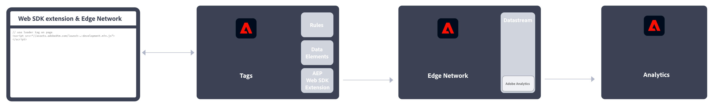
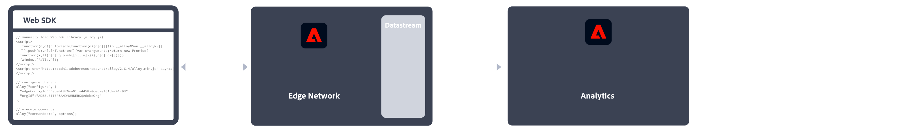
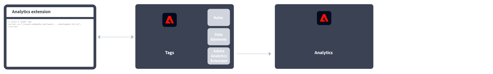
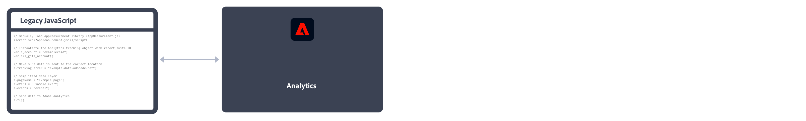
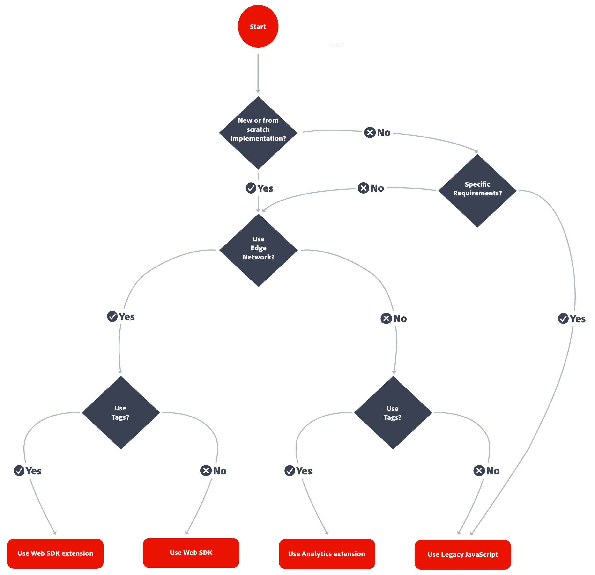
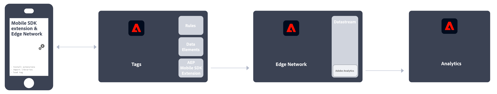
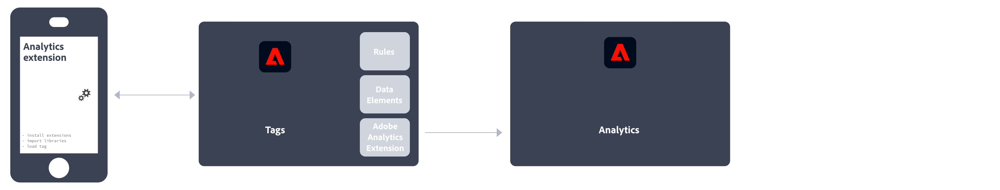

# Implementieren von Adobe Analytics

Adobe Analytics benötigt Code in Ihrer Website, App oder anderen Anwendung, um Daten an die Datenerfassungs-Server zu senden. Abhängig von der Plattform und den Anforderungen Ihres Unternehmens gibt es verschiedene Methoden, um diesen Code zu implementieren.

## Website-Implementierungsmethoden

Für Ihre **Website** sind die folgenden Implementierungsmethoden verfügbar:

### Client-seitig

* **Web SDK-Erweiterung**: Die standardisierte und empfohlene Methode zur Implementierung von Adobe Analytics für neue Kundinnen und Kunden. Fügen Sie die **Adobe Experience Platform Web SDK-Erweiterung** in den **Datenerfassungs-Tags** der Adobe Experience Platform hinzu und platzieren Sie dann ein Loader-Tag auf jeder Seite. Das Tag sendet Daten an das Adobe Experience Platform **Edge Network**, das diese Daten an Adobe Analytics weiterleitet.
  
Siehe [Implementieren von Adobe Analytics mit der Adobe Experience Platform Web SDK-Erweiterung.](./aep-edge/overview.md) in der Dokumentation.

* **Web SDK**: Wenn Sie nicht die Datenerfassung von Adobe Experience Platform verwenden möchten, können Sie die Web SDK-Bibliotheken auch manuell auf Ihre Site laden. Verweisen Sie auf jeder Seite auf die Web SDK-Bibliothek (`alloy.js`) und senden Sie die gewünschten Tracking-Aufrufe an das Adobe Experience Platform **Edge Network** in einem für Ihre Organisation geeigneten Format. Das Edge Network leitet die Daten an Adobe Analytics weiter.
  
Weitere Informationen finden [&#x200B; unter „Implementieren von Adobe Analytics mit der Adobe Experience Platform Web](./aep-edge/overview.md)SDK&quot;.

* **Analytics-Erweiterung**: Fügen Sie die **Adobe Analytics-Erweiterung** in den **Datenerfassungs-Tags** von Adobe Experience Platform hinzu und platzieren Sie dann ein Loader-Tag auf jeder Seite. Das Tag sendet Daten direkt an Adobe Analytics. Nutzen Sie diese Implementierungsmethode, wenn Sie Tags, aber nicht die Edge Network-Infrastruktur verwenden möchten.
  
Weitere Informationen finden [&#x200B; unter „Implementieren von Adobe Analytics mit &#x200B;](launch/overview.md) Analytics-Erweiterung“.

* **Legacy-JavaScript**: Die frühere manuelle Methode zur Implementierung von Adobe Analytics. Verweisen Sie auf jeder Seite auf die AppMeasurement-Bibliothek (`AppMeasurement.js`) und stellen Sie dann die Variablen und Einstellungen in JavaScript ein.
  
Diese Implementierungsmethode kann für Implementierungen mit benutzerdefiniertem Code nützlich sein und eignet sich ideal für Implementierungstypen, die an anderer Stelle nicht angeboten werden, z. B. für [AMP-Seiten](other/amp.md).

Das folgende Entscheidungsschema kann Ihnen bei der Auswahl einer Client-seitigen Implementierungsmethode helfen:

>[!TIP]
>
>Wenden Sie sich an das Adobe-Accountteam, um Hinweise und Best Practices zu erhalten, die Ihnen bei der Entscheidung helfen können, welche Implementierung Sie in Ihrer aktuellen Situation wählen sollten.

### Server-seitig

Zur Server-seitigen Implementierung von Adobe Analytics stehen Ihnen die folgenden Optionen zur Verfügung:

* **Edge Network-API**: Sie implementieren Code auf dem Server, der das Adobe Experience Platform Edge Network-API verwendet, um über einen Datenstrom mit Adobe Analytics zu kommunizieren.
  
Weitere Informationen finden [&#x200B; unter „Implementieren von Adobe Analytics mit der Adobe Experience Platform](/help/implement/aep-edge/api/overview.md)Edge Network-API“.

* **(Bulk) Data Insertion-API**: Sie verwenden die (Bulk) Data Insertion-API von Adobe Analytics, um Daten Server-seitig direkt in Adobe Analytics zu erfassen.
  
Weitere Informationen finden [&#x200B; unter &#x200B;](../import/c-data-insertion-api/c-data-insertion-api.md)Dateneinfüge-API“.

## Implementierungsmethoden für Mobile Apps

Für Ihre **Mobile App** sind die folgenden Implementierungsmethoden verfügbar:

* **Mobile SDK-Erweiterung**: Die standardisierte und empfohlene Methode zur Implementierung von Adobe Analytics in Ihrer App. Verwenden Sie spezifische Bibliotheken, um Daten aus Ihrer App ganz einfach an Adobe zu senden. Fügen Sie die **Adobe Experience Platform Mobile SDK-Erweiterung** in den **Datenerfassungs-Tags** von Adobe Experience Platform hinzu und implementieren Sie dann die Mobile SDK-Bibliothek in Ihre App. Sie können das SDK verwenden, um Bibliotheken zu importieren, Erweiterungen zu registrieren und die Tag-Konfiguration zu laden. Senden Sie Daten an das Adobe Experience Platform **Edge Network**. Edge leitet diese Daten dann an Adobe Analytics weiter.
  

  Weitere Informationen finden Sie im Artikel [Implementieren von Adobe Analytics mit dem Adobe Experience Platform Mobile SDK](../implement/aep-edge/mobile-sdk/overview.md).

* **Analytics-Erweiterung**: Fügen Sie die **Adobe Analytics-Erweiterung** in den **Datenerfassungs-Tags** von Adobe Experience Platform hinzu und implementieren Sie die Mobile SDK-Bibliothek in Ihre App. Sie können das SDK verwenden, um Bibliotheken zu importieren, Erweiterungen zu registrieren und die Tag-Konfiguration zu laden. Diese Implementierungsmethode sendet Daten direkt an Adobe Analytics. Verwenden Sie diese Implementierungsmethode, wenn Sie den Komfort der Adobe Experience Platform-Datenerfassung wünschen, aber nicht die Netzwerkinfrastruktur von Adobe Experience Platform Edge nutzen möchten.
  

  Weitere Informationen finden Sie unter [Implementieren von Adobe Analytics mit der Analytics-Erweiterung](../implement/aep-edge/mobile-sdk/overview.md).

>[!CAUTION]
>
>Informationen zur Unterstützung älterer Versionen von Adobe Mobile SDKs finden Sie unter [Mitteilungen zum Ende der Unterstützung für SDKs](https://developer.adobe.com/client-sdks/resources/sdks-end-of-support/).

## Wichtige Artikel zur Analytics-Implementierung

* [Übernahme einer bestehenden Adobe Analytics-Implementierung](/help/implement/prepare/existing-implementation.md)
* [Adobe Debugger](validate/debugger.md)
* [Erstellen einer Tag-Eigenschaft in Experience Platform](launch/create-analytics-property.md)
* [AppMeasurement-Aktualisierungen](appmeasurement-updates.md)
* [Tutorial zum Einrichten von Adobe Analytics mit Platform Web SDK](https://experienceleague.adobe.com/docs/platform-learn/implement-web-sdk/applications-setup/setup-analytics.html?lang=de)
* [Tutorial zur Implementierung von Adobe Experience Cloud in Mobile Apps](https://experienceleague.adobe.com/docs/platform-learn/implement-mobile-sdk/overview.html?lang=de)

## Wichtige Analytics-Ressourcen

* [Kundenunterstützung kontaktieren](https://experienceleague.adobe.com/de?support-solution=Analytics&lang=de#support)
* [Adobe Analytics-Community in Experience League](https://experienceleaguecommunities.adobe.com/t5/adobe-analytics/ct-p/adobe-analytics-community?profile.language=de)
* [Adobe Analytics-Ressourcen](https://experienceleaguecommunities.adobe.com/t5/adobe-analytics-discussions/adobe-analytics-resources/m-p/276666?profile.language=de)
* [Neueste Versionshinweise](../release-notes/latest.md)
