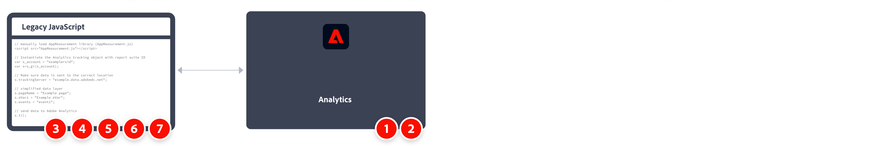

# Implementieren von Adobe Analytics mit AppMeasurement für JavaScript

AppMeasurement für JavaScript ist seit jeher eine gängige Methode zur Implementierung von Adobe Analytics. Da Tag-Management-Systeme jedoch immer beliebter werden, wird empfohlen, [Tags in Adobe Experience Platform](../launch/overview.md) zu verwenden.

Ein allgemeiner Überblick über die Implementierungsaufgaben:



<table>

<tr>
<th style="width:5%"></th><th style="width:75%"><b>Aufgabe</b></th><th style="width:20%"><b>Weitere Informationen</b></th>
</tr>

<tr>
<td>1</td><td>Stellen Sie sicher, dass Sie <b>eine Report Suite definiert</b> haben</td><td><a href="../../admin/tools/manage-rs/report-suites-admin.md">Report Suite Manager</a></td>
</tr>

<tr>
<td>2</td><td><b>Laden Sie den erforderlichen JavaScript-Code für AppMeasurement</b> aus dem Code-Manager herunter. Dekomprimieren Sie die Datei.</td><td><a href="../../admin/tools/code-manager-admin.md">Code-Manager</a></td>
</tr>

<tr>
<td>3</td><td><b>Fügen Sie <code>AppMeasurement.js</code> zur Vorlagendatei Ihrer Website hinzu</b>. Dieser Code enthält die Bibliotheken, die zum Senden von Daten an Adobe erforderlich sind.

```html
<head>
  <script src="AppMeasurement.js"></script>
  …
</head>
```

</td><td></td>
</tr>

<tr>
<td>4</td><td><b>Definieren Sie Konfigurationsvariablen in <code>AppMeasurement.js</code></b>. Wenn das Analytics-Objekt instanziiert wird, stellen diese Variablen sicher, dass die Datenerfassungseinstellungen korrekt sind.

```JavaScript
// Instantiate the Analytics tracking object with report suite ID
var s_account = "examplersid";
var s=s_gi(s_account);
 
// Make sure data is sent to the correct tracking server
s.trackingServer = "example.data.adobedc.net";
```

</td><td><a href="../vars/config-vars/configuration-variables.md">Konfigurationsvariablen</a></td>
</tr>

<tr>
<td>5</td><td><b>Definieren Sie Variablen auf Seitenebene im Seiten-Code Ihrer Website</b>. Diese Variablen bestimmen die spezifischen Dimensionen und Metriken, die an Adobe gesendet werden.

```js
s.pageName = "Example page";
s.eVar1 = "Example eVar";
s.events = "event1";
```

</td><td><a href="../vars/page-vars/page-variables.md">Seitenvariablen</a></td>
</tr>

<tr>
<td>6</td><td><b>Senden Sie die Daten mithilfe der <code>t()</code>-Methode</b> an Adobe, sobald alle Seitenvariablen definiert sind.

```js
s.t();
```

</td><td><a href="../vars/functions/t-method.md">t()-Methode</a></td>
</tr>

<tr>
<td>7</td><td><b>Erweitern und validieren Sie die Implementierung</b>, bevor Sie sie in die Produktion verschieben.</b></td><td></td>
</tr>

</table>

## Zusätzliche Ressourcen

- [Überblick über Variablen, Funktionen, Methoden und Plug-ins](../vars/overview.md)
