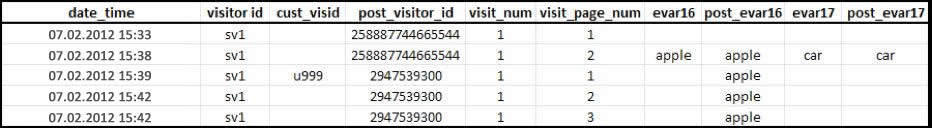
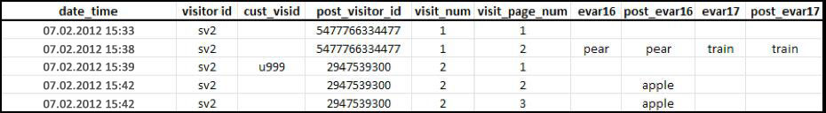

# Attribution und Persistenz

>[!IMPORTANT]
>
>Diese Methode zur geräteübergreifenden Identifizierung von Besuchern wird nicht mehr empfohlen. Weitere Informationen finden Sie unter [Cross-Device Analytics](/help/components/cda/overview.md) im Benutzerhandbuch zu den Komponenten.

Wenn Besucherprofile zusammengeführt werden, nachdem sie zur gleichen Besucher-ID-Variablen zugehörig erkannt wurden, wird die Attribution im Verlaufsdatensatz nicht geändert.

* Wenn die `visitorID`-Variable festgelegt und bei einem Treffer gesendet wird, sucht Adobe nach allen anderen Besucherprofilen, die über eine entsprechende Besucher-ID verfügen.
* Wenn ein Profil vorhanden ist, wird das bereits im System vorhandene Besucherprofil ab diesem Zeitpunkt verwendet und das vorherige Besucherprofil wird nicht mehr verwendet.
* Wenn keine übereinstimmende Besucher-ID gefunden wird, wird ein neues Profil erstellt.

Wenn ein nicht authentifizierter Kunde zum ersten Mal auf Ihrer Site eintrifft, wird diesem Kunden von Adobe Analytics ein Besucherprofil zugewiesen. Bei der Erstellung des neuen Profils endet ein Besuch und ein neuer Besuch beginnt.

## Beispiel 1

Im folgenden Beispiel wird gezeigt, wie Daten an Adobe Analytics gesendet werden, wenn ein Kunde sich zum ersten Mal mit dem ersten Gerät authentifiziert:

* `eVar16` hat eine Gültigkeit von 1 Tag und `evar17` läuft beim Besuch ab.
* Die Spalte `post_visitor_id` stellt das von Adobe Analytics verwaltete Profil dar. Post-Spalten werden in der Regel in Daten-Feeds angezeigt. Siehe [Daten-Feeds](/help/export/analytics-data-feed/data-feed-overview.md) im Exportbenutzerhandbuch.
* Die Spalten `post_evar16` und `post_evar17` zeigen die Persistenz von eVars an.
* `cust_visid` steht für einen in `visitorID` festgelegten Wert.
* Jede Zeile ist ein „Treffer“, also eine einzelne Anforderung, die an den Adobe Analytics-Datenerfassungsserver gesendet wird.

Bei der ersten Datenverbindung mit einem zuvor unbekannten `visitorID`-Wert (`u999` oben) wird ein neues Profil erstellt. Persistente Werte aus dem vorherigen Profil werden in das neue Profil übertragen.

* eVars, die beim Besuch ablaufen, werden nicht in das authentifizierte Profil kopiert. Beachten Sie, dass der Wert `car` oben nicht beibehalten wird.
* eVars, die nach anderen Kennzahlen ablaufen sollen, werden in das authentifizierte Profil kopiert. Beachten Sie, dass der Wert `apple` beibehalten wird.
* Für die persistierten eVars wird keine Instanzmetrik aufgezeichnet. Das bedeutet, dass bei Verwendung der geräteübergreifenden Besucheridentifizierung Berichte angezeigt werden können, in denen die Metrik Eindeutige Besuche für einen eVar-Wert größer als die Metrik Instanz ist.

>[!NOTE]
>
>Wenn ein Benutzer neu auf Ihrer Website ist (Sie noch nie über dieses Gerät besucht hat) und sich innerhalb von ca. drei Minuten nach seiner Ankunft authentifiziert, werden keine Werte in das authentifizierte Profil übernommen.

## Beispiel 2

Im folgenden Beispiel wird gezeigt, wie Daten an Adobe Analytics gesendet werden, wenn ein Kunde sich auf einem neuen Gerät authentifiziert, nachdem er sich zuvor auf einem anderen Gerät authentifiziert hat.

Wenn sich der Kunde authentifiziert, wird er dem vorherigen „authentifizierten“ Profil zugeordnet – `2947539300`. Das zu Beginn dieses Besuchs verwendete Profil (`5477766334477`) wird nicht mehr verwendet, und es werden keine Daten aus der Datei beibehalten.

* Die Geo-Segmentierungsdaten werden basierend auf dem ersten Treffer des Besuchs aufgezeichnet und ändern sich für einen einzelnen Besuch unabhängig vom verwendeten Gerät nicht. Das bedeutet, dass bei einer nachfolgenden Datenverbindung auf einem neuen Gerät Geo-Segmentierungsdaten im Allgemeinen nicht enthalten sind.
* Technologiespalten wie Browser, Betriebssystem und Farbtiefe werden beim ersten Treffer eines Besuchs aufgezeichnet. Wie Geo-Segmentdatenwerte werden auch diese Werte nicht in das authentifizierte Profil kopiert.
* Marketing-Kanäle überschreiben andere Kanäle bei einer nachfolgenden Datenverbindung, die eine erste Authentifizierung für dieses Gerät enthält.
