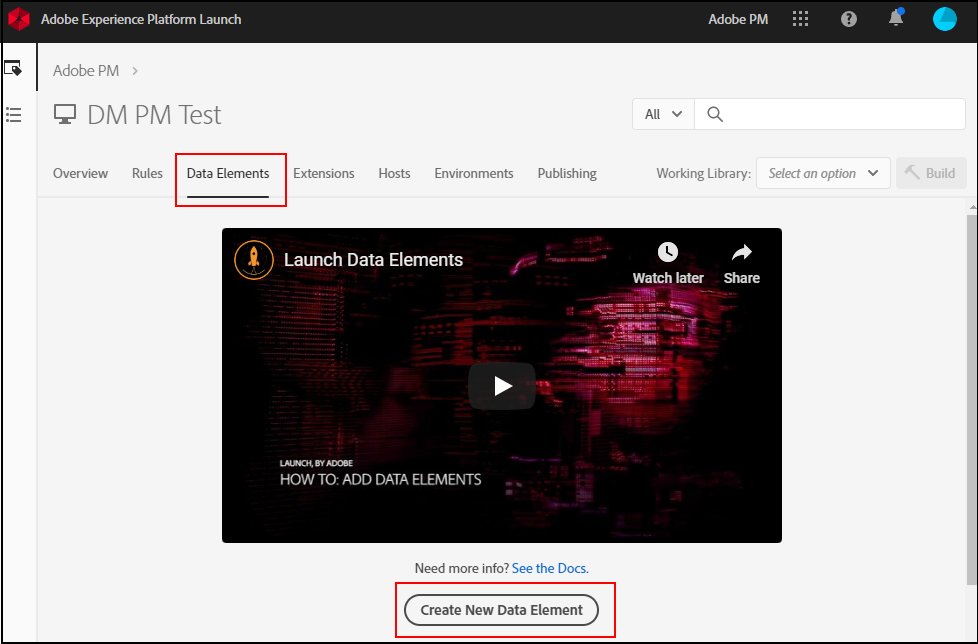

# Zuordnen von Datenschichtobjekten zu Datenelementen

Nachdem Ihr Unternehmen eine Datenschicht auf Ihrer Site eingerichtet und implementiert hat, können Sie innerhalb von Tags Datenschichtobjekte Datenelementen zuordnen.

## Voraussetzungen

[Erstellen Sie eine Datenschicht](../prepare/data-layer.md): Stellen Sie sicher, dass auf Ihrer Site eine Datenschicht vorhanden ist. Obwohl Sie technisch alle JavaScript-Objekte oder CSS-Elemente direkt auf der Seite zuordnen bzw. von dort scrapen können, empfiehlt Adobe diese Vorgehensweise nur als letztes Mittel. Wenn sich das Layout Ihrer Site ändert, funktionieren die in Tags verwendeten CSS-Selektoren nicht mehr, was zu Datenverlust führt.

## Verwenden von Tags zum Erstellen von Datenelementen

[Datenelemente](https://experienceleague.adobe.com/docs/experience-platform/tags/ui/data-elements.html?lang=de) sind Komponenten in der Adobe Experience Platform-Datenerfassung, die Sie im gesamten Tool verwenden können. Mithilfe von Datenelementen können Sie Variablenwerte in der Adobe Analytics-Erweiterung zuweisen.

1. Melden Sie sich bei der [Adobe Experience Platform-Datenerfassung](https://experience.adobe.com/data-collection) mit Ihren Adobe ID-Anmeldeinformationen an.
1. Klicken Sie auf die gewünschte Tag-Eigenschaft.
1. Klicken Sie auf die Registerkarte **[!UICONTROL Datenelemente]** und dann auf **[!UICONTROL Datenelement hinzufügen]**.

   

1. Geben Sie einen Namen für Ihr Datenelement ein. Dies kann eine einfache Bezeichnung sein, die einer JavaScript-Variablen in Ihrer Datenschicht entspricht, die Sie tracken möchten.
1. Wählen **[!UICONTROL in der Dropdown]** Liste „Erweiterung“ die Option **[!UICONTROL Core]**.
1. Wählen Sie in **[!UICONTROL Dropdown-Liste]** Datenelementtyp) die Option **[!UICONTROL JavaScript-Variable]**. Rechts wird ein Textfeld angezeigt, in dem Sie die JavaScript-Variable eingeben können, die diesem Datenelement zugeordnet werden soll.
1. Geben Sie die gewünschte JavaScript-Variable ein, normalerweise innerhalb Ihrer Datenschicht. Wenn beispielsweise die Datenschicht Ihres Unternehmens der empfohlenen Vorgehensweise von Adobe sehr ähnlich ist, könnte als Wert `digitalData.page.pageInfo.pageName` verwendet werden. Sie können die Syntax und Werte Ihrer JavaScript-Variablen in der Browser-Konsole überprüfen.
1. Klicken Sie auf **[!UICONTROL Speichern]**.

## Nächste Schritte

[Zuordnen von Datenelementen zu Analytics-Variablen](elements-to-variable.md): Weisen Sie den Analytics-Variablen Datenelemente zu, damit Sie sie als Dimensionen in Analysis Workspace verwenden können.
