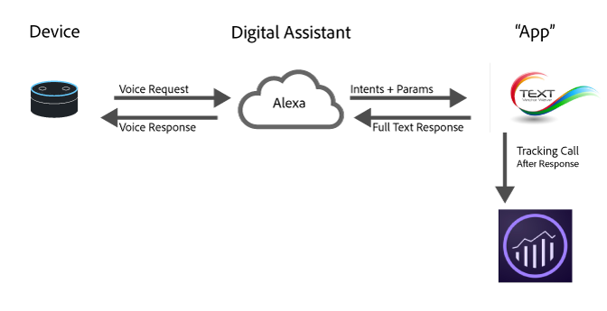

# Implementieren von Analytics für digitale Assistenten

Aufgrund der jüngsten Fortschritte in den Bereichen Cloud Computing, maschinelles Lernen und natürliche Sprachverarbeitung werden digitale Assistenten immer mehr zu einem Teil des täglichen Lebens. Verbraucher beginnen damit, mit ihren Geräten zu sprechen, und erwarten, dass sie Menschen verstehen und auf sie reagieren. Mit zunehmender Etablierung dieser Plattformen können Marken ihre Dienstleistungen den Verbrauchern auf die gleiche realistische und realistische Weise präsentieren. So können Verbraucher beispielsweise folgende Fragen stellen:

* „Alexa, frag mein Auto, wann es einen Ölwechsel braucht.“
* „Cortana, wie hoch ist mein Girokonto?“
* „Siri, sende John 20 $ für das Abendessen gestern Abend aus meiner Bank-App.“

Diese Seite bietet einen Überblick darüber, wie Sie Adobe Analytics am besten nutzen können, um diese Art von Erfahrungen zu messen und zu optimieren.

## Übersicht über die digitale Erfahrungsarchitektur



Derzeit basieren die meisten digitalen Assistenten auf einer ähnlichen allgemeinen Architektur:

1. **Gerät**: Ein Gerät (wie Amazon Echo oder ein Telefon) mit einem Mikrofon, über das der Benutzer eine Frage stellen kann.
1. **Digitaler Assistent**: Das Gerät interagiert mit dem Service, der den digitalen Assistenten steuert. Dort wird die Sprache in maschinenverständliche Absichten umgewandelt und die Details der Anfrage werden analysiert. Sobald die Absicht des Benutzers verstanden wurde, übergibt der digitale Assistent den Zweck und die Details der Anfrage an die App, die die Anfrage verarbeitet.
1. **„App“**: Bei der App kann es sich entweder um eine Telefon- oder um eine Sprach-App handeln. Die App ist für die Beantwortung der Anfrage verantwortlich. Er antwortet auf den digitalen Assistenten und der digitale Assistent antwortet dann auf den Benutzer.

## Wo kann Analytics implementiert werden?

Einer der besten Orte für die Implementierung von Analytics ist die -App. Die App empfängt den Intent und die Details vom digitalen Assistenten. Anschließend bestimmt die App, wie sie reagiert.

Während einer Anfrage kann es an zwei Stellen hilfreich sein, Daten an Adobe Analytics zu senden.

1. Wenn die Anfrage an Ihre App gesendet wird.
1. Nachdem die Antwort von der App zurückgegeben wurde.

Wenn Sie, zum Zwecke zukünftiger Optimierungen, nur festhalten möchten, was mit dem Kunden geschehen ist, senden Sie eine Anfrage an Adobe Analytics, nachdem die Antwort zurückgegeben wurde. Sie verfügen über den vollständigen Kontext, d. h, Sie wissen, wie die Anfrage lautete und wie das System reagiert hat.

## Neuinstallationen

Bei einigen digitalen Assistenten erhalten Sie eine Benachrichtigung, wenn jemand Funktionen installiert, insbesondere wenn eine Authentifizierung notwendig ist. Adobe empfiehlt, ein Installationsereignis durch Festlegen der Kontextdatenvariable `a.InstallEvent=1` zu senden. Diese Funktion ist nicht bei allen digitalen Assistenten verfügbar. Sie ist jedoch hilfreich, wenn es um die Beibehaltung geht. Im folgenden Codebeispiel werden die Werte Installationsereignis, Installationsdatum und App-ID in Kontextdatenvariablen gesendet.

```text
GET
/b/ss/examplersid1,examplersid2/1?vid=[UserID]&c.a.InstallEvent=1&c.a.InstallDate=2017-04-24&c.a.AppID=Spoofify1.0&c.OSType=Alexa&pageName=install
HTTP/1.1
Host:
<xref href="https://example.data.adobedc.net">
  example.data.adobedc.net
 Cache-Control: no-cache
</xref href="https:>
```

## Mehrere Assistenten oder mehrere Apps

Ihre Organisation benötigt wahrscheinlich Apps für mehrere Plattformen. Dabei hat es sich als Best Practice bewährt, bei jeder Anfrage auch eine App-ID zu senden. Diese Variable kann in der `a.AppID`-Kontextdatenvariable eingestellt werden. Verwenden Sie das Format `[AppName] [BundleVersion]`, beispielsweise BigMac für Alexa 1.2:

```text
GET /b/ss/examplersid1,examplersid2/1?vid=[UserID]&c.a.AppID=Spoofify1.0&c.a.Launches=1&c.Product=AmazonEcho&c.OSType=Alexa&pageName=install  HTTP/1.1
Host: example.data.adobedc.net
Cache-Control: no-cache
```

```text
GET /b/ss/examplersid1,examplersid2/1?vid=[UserID]&c.a.AppID=Spoofify2.0&c.a.Launches=1&c.Product=GoogleHome&c.OSType=Android&pageName=install  HTTP/1.1
Host: example.data.adobedc.net
Cache-Control: no-cache
```

## Benutzer-/Besucheridentifizierung

Adobe Analytics verwendet den [Adobe Experience Cloud-Identitätsdienst](https://experienceleague.adobe.com/docs/id-service/using/home.html?lang=de), um Interaktionen über einen bestimmten Zeitraum hinweg mit derselben Person zu verknüpfen. Die meisten digitalen Assistenten geben eine `userID` zurück, mit der Sie die Aktivität für verschiedene Benutzer speichern können. In den meisten Fällen können Sie diesen Wert als eindeutige Kennung weitergeben. Einige Plattformen geben eine Kennung zurück, der länger als die zulässigen 100 Zeichen ist. In diesen Fällen empfiehlt Adobe, dass Sie die eindeutige Kennung mithilfe eines standardmäßigen Hashing-Algorithmus wie MD5 oder Sha1 auf einen Wert mit fester Länge hashen.

Die Verwendung des ID-Service bietet den größten Nutzen, wenn Sie ECIDs über verschiedene Geräte (z. B. Web-to-Digital-Assistant) hinweg zuordnen. Wenn es sich bei Ihrer App um eine mobile App handelt, verwenden Sie die Experience Platform-SDKs unverändert und senden Sie die Benutzer-ID mit der `setCustomerID`-Methode. Wenn Ihre App jedoch ein Service ist, verwenden Sie die vom Service als ECID bereitgestellte Benutzer-ID und legen Sie sie in der `setCustomerID` fest.

```text
GET /b/ss/examplersid1,examplersid2/1?vid=[UserID]&pageName=[intent]  HTTP/1.1
Host: example.data.adobedc.net
Cache-Control: no-cache
```

## Sitzungen

Da digitale Assistenten sich in Gesprächen befinden, haben sie oft das Konzept einer Sitzung. Beispiel:

**Verbraucher:** „Ok Google, ruf ein Taxi für mich“

**Google:**: „Sicher, um wie viel Uhr möchten Sie?“

**Verbraucher:** „8:30pm&quot;

**Google:** „Hört sich gut an, der Fahrer ist um 8 Uhr :30pm&quot;

Sitzungen sind wichtig, um den Kontext zu wahren und mehr Details zu sammeln, um den digitalen Assistenten natürlicher zu machen. Wenn Sie Analytics für eine Konversation implementieren, sollten Sie zweierlei tun, sobald eine neue Sitzung gestartet wird:

1. **Verwenden Sie Audience Manager**: Rufen Sie die relevanten Segmente ab, zu denen ein Benutzer gehört, damit Sie die Antwort anpassen können. (Zum Beispiel: Diese Person ist zurzeit berechtigt, einen Mehrkanal-Rabatt zu erhalten.)
2. **Senden Sie eine neue Sitzung oder ein Launch-Ereignis**: Wenn Sie die erste Antwort an Analytics senden, fügen Sie ein Launch-Ereignis hinzu. Normalerweise kann dies gesendet werden, indem als Kontextdaten eingestellt werden `a.LaunchEvent=1`.

```text
GET /b/ss/examplersid1,examplersid2/1?vid=[UserID]&c.a.LaunchEvent=1&c.Intent=[intent]&pageName=[intent]  HTTP/1.1
Host: example.data.adobedc.net
Cache-Control: no-cache
```

## Intents

Jeder der digitalen Assistenten verfügt über Algorithmen, die Absichten erkennen und dann die Absicht an die „App“ weitergeben, damit die App weiß, was zu tun ist. Diese Absichten sind eine kurze Darstellung der Anfrage.

Wenn ein Benutzer beispielsweise sagt: „Siri, sende John 20 $ für das Abendessen gestern über meine Bank-App“, dann könnte der Intent etwa *sendMoney* sein.

Indem Sie jede dieser Anfragen als eVar einsenden, können Sie Pfadsetzungsberichte für jeden Intent für Konversations-Apps erstellen. Stellen Sie sicher, dass Ihre App auch Anfragen ohne Absicht bearbeiten kann. Adobe empfiehlt, „Kein Intent angegeben“ an die Intent-Kontextdatenvariable zu übergeben, anstatt die Variable zu überspringen.

```text
GET /b/ss/examplersid1,examplersid2/1?vid=[UserID]&c.a.AppID=Penmo1.0&c.a.LaunchEvent=1&c.Intent=SendPayment&pageName=[intent]  HTTP/1.1
Host: example.sc.adobedc.net
Cache-Control: no-cache
```

oder

```text
GET /b/ss/examplersid1,examplersid2/1?vid=[UserID]&c.a.AppID=Penmo1.0&c.a.LaunchEvent=1&c.Intent=No_Intent_Specified&pageName=[intent]  HTTP/1.1
Host: example.data.adobedc.net
Cache-Control: no-cache
```

## Parameter/Slots/Entitäten

Zusätzlich zu einem Intent haben digitale Assistenten oft mehrere Schlüsselwertpaare, mit denen die Details des Intents angegeben werden. Diese können als Slots, Entitäten oder Parameter bezeichnet werden. Beispiel: „Siri, sende John über meine Bank-App 20 $ für das Abendessen gestern“ hat die folgenden Parameter:

* Wer = John
* Betrag = 20
* Warum = Abendessen

Normalerweise verfügt Ihre App über eine begrenzte Anzahl dieser Werte. Um diese Werte in Analytics zu verfolgen, senden Sie sie in Kontextdatenvariablen und ordnen Sie jeden Parameter einer eVar zu.

```text
GET /b/ss/examplersid1,examplersid2/1?vid=[UserID]&c.a.AppID=Penmo1.0=1&c.a.LaunchEvent=1&c.Intent=SendPayment&c.Amount=20.00&c.Reason=Dinner&c.ReceivingPerson=John&c.Intent=SendPayment&pageName=[intent]  HTTP/1.1
Host: example.data.adobedc.net
Cache-Control: no-cache
```

## Fehlerstatus

In einigen Fällen sendet der digitale Assistent Informationen an die App, die sie nicht verarbeiten kann. Beispiel: „Siri, sende John über meine Bank-App 20 Mäuse für das Abendessen gestern.“

Wenn diese Situation eintritt, sollte Ihre App um Aufklärung bitten. Senden Sie außerdem Daten an Adobe, die darauf hindeuten, dass die App einen Fehlerstatus sowie eine eVar aufweist, die angibt, welcher Fehlertyp aufgetreten ist. Stellen Sie sicher, dass Fehler für fehlerhafte Angaben und App-Probleme vorhanden sind.

```text
GET /b/ss/examplersid1,examplersid2/1?vid=[UserID]&c.a.AppID=Penmo1.0&c.Error=1&c.ErrorName=InvalidCurrency&pageName=[intent]  HTTP/1.1
Host: example.data.adobedc.net
Cache-Control: no-cache
```

## Gerätefunktionen

Die meisten Plattformen legen zwar das Gerät, mit dem der Benutzer gesprochen hat, nicht offen, aber dennoch die Funktionen des Geräts. Zum Beispiel Audio, Bildschirm, Video usw. Diese Informationen sind nützlich, da sie die Inhaltstypen definieren, die bei der Interaktion mit Ihren Benutzenden verwendet werden können. Beim Messen der Gerätefunktionen ist es am besten, sie zu verketten (in alphabetischer Reihenfolge).

Beispiel: `":Audio:Camera:Screen:Video:"`

Vorangestellte und nachgestellte Doppelpunkte helfen bei der Erstellung von Segmenten. Zeigen Sie beispielsweise alle Treffer mit `:Audio:`-Funktionen an.

* [Amazon-Funktionen](https://developer.amazon.com/public/solutions/alexa/alexa-skills-kit/docs/alexa-skills-kit-interface-reference) bei Verwendung von Amazon Alexa
* [Google-Funktionen](https://developers.google.com/actions/assistant/surface-capabilities) bei Verwendung von Aktionen auf Google

## Beispiele

| Benutzer | Antwort des Geräts | Aktion/Intent | GET-Anfrage |
|---|---|---|---|
| Installiere Spoofify | Keine Antwort | Installieren | `GET /b/ss/examplersid1,examplersid2/1?vid=[UserID]&c.a.InstallEvent=1&c.a.InstallDate=[currentDate]&c.a.AppID=Spoofify1.0&c.OSType=Alexa&c.Intent=Install&pageName=Install  HTTP/1.1`<br>`Host: example.data.adobedc.net`<br>`Cache-Control: no-cache` |
| Spiele Spoofify | „Okay, ich spiele Spoofify“ | Play | `GET /b/ss/examplersid1,examplersid2/1?vid=[UserID]&c.a.AppID=Spoofify1.0&c.a.LaunchEvent=1&c.Intent=Play&pageName=PlayApp  HTTP/1.1`<br>`Host: example.data.adobedc.net`<br>`Cache-Control: no-cache` |
| Spiele etwas anderes | „Okay, welchen Song?“ | ChangeSong | `GET /b/ss/examplersid1,examplersid2/1?vid=[UserID]&c.a.AppID=Spoofify1.0&c.Intent=ChangeSong&pageName= Ask%20For%20Song  HTTP/1.1`<br>`Host: example.data.adobedc.net`<br>`Cache-Control: no-cache` |
| Spiel „Baby Shark“ | „Okay, ich spiele ‚Baby Shark‘ von PinkFong“ | ChangeSong | `GET /b/ss/examplersid1,examplersid2/1?vid=[UserID]&c.a.AppID=Spoofify1.0&c.Intent=ChangeSong&pageName=Action%20Play%20Song&c.SongID=[012345]  HTTP/1.1`<br>`Host: example.data.adobedc.net`<br>`Cache-Control: no-cache` |
| Ändere die Playliste | „Okay, welche Playliste?“ | ChangePlaylist | `GET /b/ss/examplersid1,examplersid2/1?vid=[UserID]&c.a.AppID=Spoofify1.0&c.Intent=ChangePlaylist&pageName=Ask%20For%20Playlist  HTTP/1.1`<br>`Host: example.data.adobedc.net`<br>`Cache-Control: no-cache` |
| Spiel meine Playlist mit Lieblingsliedern | „Okay, ich spiele deine Playlist mit Lieblingsliedern“ | ChangePlaylist | `GET /b/ss/examplersid1,examplersid2/1?vid=[UserID]&c.a.AppID=Spoofify1.0&c.Intent=ChangePlaylist&pageName=Action%20Play%20Playlist&c.Playlist=My%20Favorite%20Songs  HTTP/1.1`<br>`Host: example.data.adobedc.net`<br>`Cache-Control: no-cache` |
| Schalte die Musik aus | Keine Antwort, Musik wird ausgeschaltet | Aus | `GET /b/ss/examplersid1,examplersid2/1?vid=[UserID]&c.a.AppID=Spoofify1.0&c.Intent=Off&pageName=Music%20Off  HTTP/1.1`<br>`Host: example.data.adobedc.net`<br>`Cache-Control: no-cache` |
