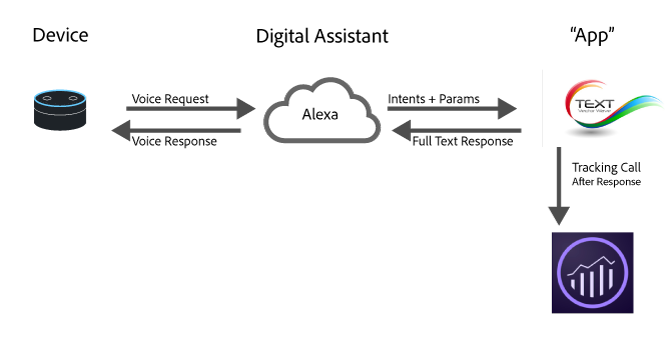

# Implementieren von Analytics für digitale Assistenten

Mit Fortschritten in Cloud Computing, maschinellem Lernen und natürlicher Sprachverarbeitung sind digitale Assistenten Teil des täglichen Lebens. Die Verbraucher sprechen mit ihren Geräten und erwarten Reaktionen, die denen von Menschen ähneln, und Marken können ihre Dienstleistungen durch diese Erfahrungen präsentieren. Verbraucher können beispielsweise fragen:

* „Alexa, frag mein Auto, wann es einen Ölwechsel braucht.“
* „Hey Google, wie hoch ist der Kontostand meines Girokontos?“
* „Siri, sende John 20 $ für das Abendessen gestern Abend aus meiner Bank-App.“

Diese Seite bietet einen Überblick darüber, wie Sie mit Adobe Analytics diese Erlebnistypen messen und optimieren können.

## Übersicht über die digitale Erfahrungsarchitektur



Die meisten digitalen Assistenten folgen einer ähnlichen Architektur auf hoher Ebene:

1. **Gerät**: Ein Gerät (z. B. ein intelligenter Lautsprecher oder ein Telefon) mit einem Mikrofon, mit dem der Benutzer eine Frage stellen kann.
1. **Digitaler Assistent**: Der Dienst, der den Assistenten steuert. Es wandelt Sprache in maschinenverständliche Absichten um und analysiert die Details der Anfrage. Sobald der Intent verstanden wurde, übergibt der Assistent den Intent und die Details an die App, die die Anfrage verarbeitet.
1. **„App“**: Eine App auf dem Telefon oder eine Sprach-App, die auf die Anfrage reagiert. Er reagiert auf den digitalen Assistenten, der dann auf den Benutzer antwortet.

## So werden Daten an Adobe Analytics gesendet

Eine Digital Assistant-App wird normalerweise auf einem Server oder auf einer Plattform ausgeführt, auf dem/der keine Client-seitige Adobe-Bibliothek vorhanden ist (AppMeasurement oder Web SDK). Senden von Treffern **Server-seitig mithilfe der [Data Insertion API](https://developer.adobe.com/analytics-collection-apis/methods/data-insertion/)**. Jede Interaktion, die Sie messen möchten, wird zu einer Dateneinfüge-API-Anfrage, deren Abfragezeichenfolge (oder XML-Hauptteil) die auf dieser Seite beschriebenen Variablen enthält - am häufigsten [Kontextdatenvariablen](/help/implement/vars/page-vars/contextdata.md) die Sie eVars, Props und Ereignissen mit [Verarbeitungsregeln](/help/admin/tools/manage-rs/edit-settings/general/processing-rules/pr-overview.md) zuordnen.

Auf dieser Seite wird beschrieben *was* messen und wie es in Analytics modelliert wird. Informationen zum Endpunkt, zur Abfragezeichenfolge und zu XML-Codierungen, zu den erforderlichen Komponenten und Antworttypen finden Sie in der [Dokumentation zur Dateneinfüge-API](https://developer.adobe.com/analytics-collection-apis/methods/data-insertion/). Jede unten benannte Variable wird einem Abfragezeichenfolgenparameter und einem XML-Tag in der [Variablenreferenz](https://developer.adobe.com/analytics-collection-apis/methods/data-insertion/variable-reference) zugeordnet.

## Wo kann Analytics implementiert werden?

Einer der besten Orte zur Implementierung von Analytics ist die App, die die Absicht und die Details vom digitalen Assistenten erhält und bestimmt, wie reagiert werden soll. Es gibt zwei Momente während einer Anfrage, die hilfreich sind, um Daten an Adobe Analytics zu senden:

1. Wenn die Anfrage an Ihre App gesendet wird.
1. Nachdem die Antwort von der App zurückgegeben wurde.

Wenn Sie aufzeichnen möchten, was bei der zukünftigen Optimierung passiert ist, senden Sie den Treffer, nachdem die Antwort zurückgegeben wurde - Sie haben dann den vollständigen Kontext der Anfrage und der Antwort des Systems.

## Was gemessen werden soll

### Neuinstallationen

Bei Assistenten, die Sie benachrichtigen, wenn jemand die Kenntnisse installiert (insbesondere wenn Authentifizierung erforderlich ist), senden Sie ein Installationsereignis, indem Sie die Kontextdatenvariable `a.InstallEvent=1` zusammen mit `a.InstallDate` und der App-ID (`a.AppID`) festlegen. Dies ist nicht auf jeder Plattform verfügbar, ist aber für die Aufbewahrungsanalyse nützlich, falls vorhanden.

### Mehrere Assistenten oder Apps

Unternehmen erstellen häufig Apps für mehrere Plattformen. Fügen Sie bei jeder Anfrage unter Verwendung der `[AppName] [BundleVersion]` (z. B. `Spoofify 1.0`) eine App-ID in die `a.AppID` Kontextdatenvariable ein. Fügen Sie eine Plattform- oder Betriebssystemkontextdatenvariable hinzu (z. B. `OSType`), damit Sie Alexa, den Google-Assistenten und andere Plattformen beim Reporting unterscheiden können.

### Besucheridentifizierung

Adobe Analytics verwendet den [Besucher-ID-](https://experienceleague.adobe.com/de/docs/id-service/using/home) von Adobe, um Interaktionen im Zeitverlauf mit derselben Person zu verknüpfen. Die meisten digitalen Assistenten geben ein `userID` zurück, das Sie als eindeutige Kennung verwenden können - übergeben Sie es als die Besucher-ID-Überschreibung (`vid`). Einige Plattformen geben eine Kennung zurück, die länger als die zulässigen 100 Zeichen ist. In diesen Fällen hashen Sie sie mit einem Standardalgorithmus wie MD5 oder SHA-1 auf einen Wert mit fester Länge.

Die Verwendung des Besucher-ID-Service bietet den meisten Nutzen, wenn Sie ECIDs geräteübergreifend zuordnen (z. B. Web zu digitalem Assistenten). Wenn Ihre App eine Mobile App ist, verwenden Sie die Experience Platform Mobile SDK und senden Sie die Benutzer-ID mit der `setCustomerID`. Wenn Ihre App ein Service ist, verwenden Sie die vom Service als Besucher-ID bereitgestellte Benutzer-ID und legen Sie sie auch mit `setCustomerID` fest. Informationen zum Festlegen von Kennungen für eine Server-seitige Anfrage finden Sie unter [Besucheridentifizierung mit der Dateneinfüge-API](../id/data-insertion.md).

### Sitzungen

Da sich digitale Assistenten in Gesprächen befinden, haben sie oft das Konzept einer Sitzung (ein Austausch mit mehreren Zügen). Beim Starten einer neuen Sitzung empfiehlt Adobe zwei Dinge:

1. **Wenden Sie sich an Audience Manager** um die Segmente abzurufen, zu denen die Benutzerin oder der Benutzer gehört, damit Sie die Antwort anpassen können.
1. **Senden Sie ein Startereignis** mit der ersten Antwort, indem Sie die `a.LaunchEvent=1` für die Kontextdatenvariable festlegen.

### Intents

Jeder Assistent erkennt Absichten und übergibt sie an die App. Ein Intent ist eine knappe Darstellung der Anfrage. Zum Beispiel könnte „Siri, sende John 20 $ für das Abendessen gestern Abend aus meiner Bank-App“ zum Intent *sendMoney“*. Senden Sie jeden Intent an eine Kontextdatenvariable, die Sie einem eVar zuordnen, damit Sie Pfadberichte für Intents ausführen können. Stellen Sie sicher, dass Ihre App auch ohne Absicht Anfragen verarbeitet. Adobe empfiehlt, `No Intent Specified` zu senden, anstatt die Variable wegzulassen.

### Parameter, Slots und Entitäten

Zusätzlich zur Absicht geben Assistenten oft Schlüssel/Wert-Details der Anfrage an (Slots, Entitäten oder Parameter genannt). Für „Siri, sende John 20 $ für das Abendessen letzte Nacht“ könnten die Parameter sein:

* Wer = John
* Betrag = 20
* Warum = Abendessen

Pro App gibt es in der Regel einen endlichen Satz davon. Senden Sie sie in Kontextdatenvariablen und ordnen Sie sie jeweils einer eVar zu.

### Fehlerstatus

Manchmal übergibt der Assistent Eingaben, die Ihre App nicht verarbeiten kann (z. B. „Siri, sende John 20 Kohletüten aus meiner Bank-App„). Bitten Sie in diesem Fall Ihre App um Klarstellung und senden Sie Daten, die einen Fehlerstatus angeben - `a.Error=1` Sie dies zusammen mit einer eVar, die den Fehlertyp angibt. Schließen Sie sowohl Fehler ein, bei denen die Eingaben ungültig sind, als auch Fehler, bei denen die App selbst ein Problem hatte.

### Gerätefunktionen

Die meisten Plattformen stellen das Gerät zwar nicht exakt dar, stellen aber seine Funktionen (z. B. Audio, Bildschirm oder Video) bereit, mit denen die Inhaltstypen definiert werden, die Sie verwenden können. Verketten Sie die Gerätefunktionen bei der Messung in alphabetischer Reihenfolge mit führenden und nachfolgenden Doppelpunkten (z. B. `":Audio:Camera:Screen:Video:"`), sodass Sie Segmente wie „Alle Treffer mit `:Audio:` Funktionen“ erstellen können.

* [Amazon Alexa-Schnittstellenreferenz](https://developer.amazon.com/public/solutions/alexa/alexa-skills-kit/docs/alexa-skills-kit-interface-reference)
* [Google Assistant-Oberflächenfunktionen](https://developers.google.com/actions/assistant/surface-capabilities)

## Beispielanfrage

Die folgende GET-Anfrage der Dateneinfüge-API erfasst einen *SendPayment*-Intent für eine Banking-App, wobei die App-ID, ein Startereignis, der Intent und Slot-Werte als Kontextdaten festgelegt werden:

```text
GET /b/ss/examplersid1,examplersid2/1?vid=[UserID]&c.a.AppID=Penmo%201.0&c.a.LaunchEvent=1&c.Intent=SendPayment&c.Amount=20.00&c.Reason=Dinner&c.ReceivingPerson=John&pageName=SendPayment HTTP/1.1
Host: example.data.adobedc.net
```

Das vollständige Anfrageformat, die Endpunkte und Antworttypen finden Sie in der Dokumentation [Data Insertion API](https://developer.adobe.com/analytics-collection-apis/methods/data-insertion/request).

## Beispiel für ein Messmodell

Die folgende Tabelle zeigt, wie allgemeine Aktionen in einer Musik-App Analytics-Variablen zugeordnet werden. Legen Sie diese als Kontextdatenvariablen für jede Dateneinfüge-API-Anfrage fest und ordnen Sie sie dann eVars und Ereignissen mit Verarbeitungsregeln zu.

| Aktion der Person | Absicht/Ereignis | Kontextdaten zum Festlegen |
| --- | --- | --- |
| Installieren der App | Installieren | `a.InstallEvent=1`, `a.InstallDate`, `a.AppID`, `OSType` |
| Starten der App | Launch | `a.LaunchEvent=1`, `a.AppID`, `Intent=Play` |
| Bitte, den Song zu ändern | ChangeSong | `a.AppID`, `Intent=ChangeSong` |
| Ein bestimmtes Lied abspielen | ChangeSong | `a.AppID`, `Intent=ChangeSong`, `SongID` |
| Wiedergabeliste ändern | ChangePlaylist | `a.AppID`, `Intent=ChangePlaylist`, `Playlist` |
| Eine ungültige Eingabe feststellen | (Fehler) | `a.Error=1`, `ErrorName` |
